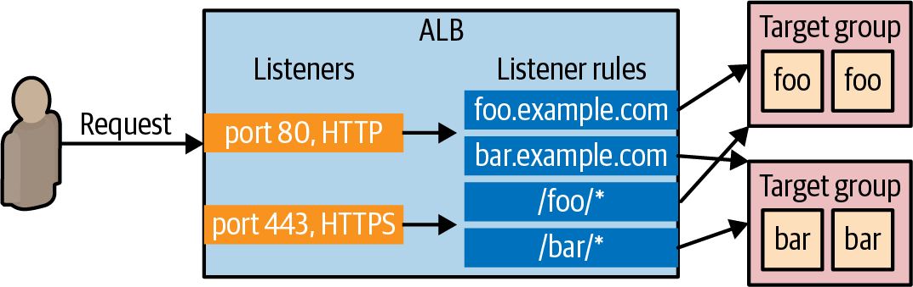

# Chapter 3: How to Deploy Many Apps: Orchestration, VMs, Containers, and Serverless

<!--toc:start-->

- [Chapter 3: How to Deploy Many Apps: Orchestration, VMs, Containers, and Serverless](#chapter-3-how-to-deploy-many-apps-orchestration-vms-containers-and-serverless)
  - [An Introduction to Orchestration](#an-introduction-to-orchestration)
    - [Why use an orchestration?](#why-use-an-orchestration)
    - [What is an orchestration?](#what-is-an-orchestration)
    - [Four types of orchestration tools](#four-types-of-orchestration-tools)
  - [Server Orchestration](#server-orchestration)
    - [What is Server Orchestration](#what-is-server-orchestration)
    - [Example: Deploy Multiple Servers in AWS Using Ansible](#example-deploy-multiple-servers-in-aws-using-ansible)
    - [Example: Deploy an App Securely and Reliably Using Ansible](#example-deploy-an-app-securely-and-reliably-using-ansible)
    - [Example: Deploy a Load Balancer Using Ansible and Nginx](#example-deploy-a-load-balancer-using-ansible-and-nginx)
      - [Introduction to Load Balancer](#introduction-to-load-balancer)
        - [What is load balancer?](#what-is-load-balancer)
        - [How load balancer works?](#how-load-balancer-works)
      - [The example](#the-example)
    - [Example: Roll Out Updates to Servers with Ansible](#example-roll-out-updates-to-servers-with-ansible)
    - [Get your hands dirty with Ansible and server orchestration](#get-your-hands-dirty-with-ansible-and-server-orchestration)
  - [VM Orchestration](#vm-orchestration)
    - [What is VM Orchestration](#what-is-vm-orchestration)
    - [Example: Build a More Secure, Reliable VM Image Using Packer](#example-build-a-more-secure-reliable-vm-image-using-packer)
    - [Example: Deploy a VM Image in an Auto Scaling Group Using OpenTofu](#example-deploy-a-vm-image-in-an-auto-scaling-group-using-opentofu)
    - [Example: Deploy an Application Load Balancer Using OpenTofu](#example-deploy-an-application-load-balancer-using-opentofu)
      - [The problem with deployed your own load balancer using Nginx](#the-problem-with-deployed-your-own-load-balancer-using-nginx)
      - [Using cloud providers managed services for load balancing](#using-cloud-providers-managed-services-for-load-balancing)
      - [The example code](#the-example-code)
    - [Example: Roll Out Updates with OpenTofu and Auto Scaling Groups](#example-roll-out-updates-with-opentofu-and-auto-scaling-groups)
    - [Get your hands dirty with OpenTofu and VM orchestration](#get-your-hands-dirty-with-opentofu-and-vm-orchestration)
  - [Container Orchestration](#container-orchestration)
    - [What is Container Orchestration](#what-is-container-orchestration)
    - [The advantages of container orchestration](#the-advantages-of-container-orchestration)
    - [Containers and container orchestration tools](#containers-and-container-orchestration-tools)
    - [A Crash Course on Docker](#a-crash-course-on-docker)
      - [Install Docker](#install-docker)
      - [Basic Docker commands](#basic-docker-commands)
        - [docker run](#docker-run)
        - [docker ps](#docker-ps)
        - [docker start](#docker-start)
    - [Example: Create a Docker Image for a Node.js app](#example-create-a-docker-image-for-a-nodejs-app)
    - [Example: Deploy a Dockerized App with Kubernetes](#example-deploy-a-dockerized-app-with-kubernetes)
    - [Example: Deploy a Load Balancer with Kubernetes](#example-deploy-a-load-balancer-with-kubernetes)
    - [Example: Roll Out Updates with Kubernetes](#example-roll-out-updates-with-kubernetes)
    - [Get your hands dirty with Kubernetes and YAML template tools](#get-your-hands-dirty-with-kubernetes-and-yaml-template-tools)
    - [Example: Deploy a Kubernetes Cluster in AWS Using EKS](#example-deploy-a-kubernetes-cluster-in-aws-using-eks)
    - [Example: Push a Docker Image to ECR](#example-push-a-docker-image-to-ecr)
    - [Example: Deploy a Dockerized App into an EKS Cluster](#example-deploy-a-dockerized-app-into-an-eks-cluster)
    - [Get your hands dirty with Kubernetes and container orchestration](#get-your-hands-dirty-with-kubernetes-and-container-orchestration)
  - [Serverless Orchestration](#serverless-orchestration)
    - [What is Serverless Orchestration](#what-is-serverless-orchestration)
    - [Example: Deploy a Serverless Function with AWS Lambda](#example-deploy-a-serverless-function-with-aws-lambda)
    - [Example: Deploy an API Gateway in Front of AWS Lambda](#example-deploy-an-api-gateway-in-front-of-aws-lambda)
    - [Example: Roll Out Updates with AWS Lambda](#example-roll-out-updates-with-aws-lambda)
    - [Get your hands dirty with serverless web-apps and Serverless Orchestration](#get-your-hands-dirty-with-serverless-web-apps-and-serverless-orchestration)
  - [Comparing Orchestration Options](#comparing-orchestration-options)
  - [Conclusion](#conclusion)
  <!--toc:end-->

## An Introduction to Orchestration

### Why use an orchestration?

- The problem with a **single server** 🎵 - _single point of failure_:

  - Your single server cannot run ~~all the time~~:
    - There will be a lot of outages 🛑 due to:
      - hardware issues
      - software issues
      - load: 🪨
      - deployments

- To remove this ~~single point of failure~~, typically you needs

  - **multiple copies**, called _replicas_, of your app.
  - a way to
    - manages those replicas 👈 Who gonna be the manager 🧠🎼?
    - solve all the problems (of each server) 👈 Multiple failures ← Multiple servers 🎵🎵🎶
    - ...

- The tools that done all of the previous things is called _orchestration tools_:

  - Capistrano, Ansible (👈 Server orchestration)
  - AWS Auto Scaling Group, EC2 (👈 VM orchestration)
  - Kubernetes, Nomad... & managed services: EKS, GKE, AKS, OpenShift, ECS (👈 Container orchestration)
  - AWS Lambda, Google Cloud Functions, Azure Serverless (👈 Serverless orchestration)

### What is an orchestration?

orchestration tool
: tool responsible for _orchestration_:
: - manage the **cluster** (where the applications runs)
: - coordinate individual apps to **start/stop** (how each application runs)
: - increase/decrease **hardware resources** available to each app (which is available to each applications)
: - increase/decrease the **number of replicas** (how many copies of each application)
: - ...

---

- An orchestration tool solves the following problems:

  | The problem                    | What exactly is the problem?                                                                 | Notes                                                                                                                         |
  | ------------------------------ | -------------------------------------------------------------------------------------------- | ----------------------------------------------------------------------------------------------------------------------------- |
  | 🚀 **Deployment**              | How to _initially deploy_ one/more replicas of your app onto your servers?                   |                                                                                                                               |
  | 🎢 **Deployments strategies**  | How to _roll out updates_ to all replicas? Without downtime[^1]?                             |                                                                                                                               |
  | 🔙 **Rollback**                | How to _roll back a broken updates_? Without downtime?                                       |                                                                                                                               |
  | 🆔 **Scheduling**              | How to decide which apps should run on _which servers_? With enough computing resources[^2]? | Scheduling can be done: <br> - **manually**<br> - **automatically** by a _scheduler_[^3].                                     |
  | ⬆️⬇️ **Auto scaling**          | How to auto-scale your app up/down in response to the load?                                  | There are 2 types of scaling:<br> - _vertical scaling_ (a "bigger" machine)<br> - _horizontal scaling_ (more small machines). |
  | 🩹 **Auto healing**            | How to know if an app/a server is not healthy? Auto restart/replace the app/server?          |                                                                                                                               |
  | ⚙️ **Configuration**           | How to configure the app for multiple environments?                                          | e.g. Each environment has a different domain name; computing resources settings.                                              |
  | 🔒🤫 **Secrets management**    | How to pass secrets to your apps?                                                            | aka credentials - e.g. passwords, API keys                                                                                    |
  | ☦️ **Load balancing**          | How to distribute traffic across all replicas?                                               |                                                                                                                               |
  | 🌐🕸️ **Service communication** | How each app communicate/connect with each other?                                            | aka _service discovery_                                                                                                       |
  |                                | How to control/monitor the these communication/connections?                                  | aka _service mesh_: authentication, authorization, encryption, error handling, observability...                               |
  | 💾 **Disk management**         | How to connect the right hard drive to the right servers?                                    |                                                                                                                               |

### Four types of orchestration tools

- In the pre-cloud ere, most companies has their own solutions: gluing together various scripts & tools to solve each problem.

- Nowadays, the industry standardize around four broad types of solutions:

  | Type of orchestration                             | How do you do?                                                                                                   |                                                     |
  | ------------------------------------------------- | ---------------------------------------------------------------------------------------------------------------- | --------------------------------------------------- |
  | "Server orchestration" (aka "deployment tooling") | You have a **pool of servers** that you manage.                                                                  | The old way from pre-cloud era, still common today. |
  | VM orchestration                                  | Instead of managing servers directly, you manage **VM images**.                                                  |                                                     |
  | Container orchestration                           | Instead of managing servers directly, you manage **containers**.                                                 |                                                     |
  | Serverless orchestration                          | You no longer think about servers at all, and just focus on managing **apps**, or even individual **functions**. |                                                     |

## Server Orchestration

### What is Server Orchestration

server orchestration
: the original approach from pre-cloud era, but still common today
: setup a bunch of servers → deploy apps across these servers → changes are update in-place to these servers
: there is no standardized toolings in this approach
: - configuration management tools, e.g. Ansible, Chef, Puppet
: - specialized deployment scripts, e.g. Capistrano, Deployer, Mina
: - thousands of ad-hoc scripts

> [!IMPORTANT]
> Key takeaway #1
> Server orchestration is an older, _mutable infrastructure_ approach where
>
> - you have a fixed **set of servers** that you
>   - maintain
>   - update in-place.

### Example: Deploy Multiple Servers in AWS Using Ansible

> [!WARNING]
> Deploy & manage servers is not really what configuration management tools were designed to do.
>
> - But for learning & testing, Ansible is good enough.

First, to use Ansible as a server orchestration, you need

- a bunch of servers (that will be managed, e.g. physical servers on-prem, virtual servers in the could)
- SSH access to those servers.

If you don't have servers you can use, you can also use Ansible to deploy several EC2 instances.

---

The Ansible playbook to create multiples EC2 instance can be found at the [example repo] at [ch3/ansible/create_ec2_instances_playbook.yml], which will:

- Prompt you for:
  - `number_instances`: The number of instances to create
  - `basename`: The basename for all resources created
  - `http_port`: The port on which the instances listen for HTTP requests
- Create a security group that opens port 22 (for SSH traffic) and `http_port` (for HTTP traffic)
- Create a EC2 key-pair that used to connect to the instances (that will be created) via SSH.
- Create multiple instances, each with the Ansible tag set to `base_name`

To run the playbook:

- Copy `create_ec2_instances_playbook.yml` from example repo to `ch3/ansible`

  ```bash
  mkdir -p ch3/ansible
  cd ch3/ansible

  cp -r <PATH_TO_EXAMPLE_REPO>/ch3/ansible/create_ec2_instances_playbook.yml .
  ```

- Use `ansible-playbook` command to run the playbook

  ```bash
  ansible-playbook -v create_ec2_instances_playbook.yml
  ```

  - Enter the values interactively & hit `Enter`
  - Or define the values as variables in a yaml file and pass to `ansible-playbook` command via `-extra-vars` flag.

    ```yaml
    # examples/ch3/ansible/sample-app-vars.yml
    num_instances: 3
    base_name: sample_app_instances
    http_port: 8080
    ```

    ```bash
    ansible-playbook -v create_ec2_instances_playbook.yml \
      --extra-vars "@sample-app-vars.yml"
    ```

---

### Example: Deploy an App Securely and Reliably Using Ansible

Previous chapters has basic example of deploying an app:

- [Chapter 1: Example: Deploying an app using AWS](chap-01.md#example-deploying-an-app-using-aws): Deploy an app to AWS with "ClickOps"
- [Chapter 2: Example: Configure a Server Using Ansible](chap-02.md#example-configure-a-server-using-ansible): Deploy an app to AWS with Ansible

There're still several problems with both examples (e.g. root user, port 80, no automatic app restart...)

In this example, you will fix these problems and deploy the app in a more secure, reliable way.

- (As previous example) Use an Ansible Inventory plugin to discover your EC2 instances

  ```yml
  # examples/ch3/ansible/inventory.aws_ec2.yml
  plugin: amazon.aws.aws_ec2
  regions:
    - us-east-2
  keyed_groups:
    - key: tags.Ansible
  leading_separator: ""
  ```

- (As previous example) Use group variables to store the configuration for your group of servers

  ```yaml
  # examples/ch3/ansible/group_vars/sample_app_instances.yml
  ansible_user: ec2-user
  ansible_ssh_private_key_file: ansible-ch3.key
  ansible_host_key_checking: false
  ```

- Use a playbook to configure your group of servers to run the Node.js sample app

  ```yaml
  # examples/ch3/ansible/configure_sample_app_playbook.yml
  - name: Configure servers to run the sample-app
    hosts: sample_app_instances # 1️⃣
    gather_facts: true
    become: true
    roles:
      - role: nodejs-app #        2️⃣
      - role: sample-app #        3️⃣
        become_user: app-user #   4️⃣
  ```

  - 1️⃣: Target the group discovered by the inventory plugin (which are created in the previous example).
  - 2️⃣: Split the role into 2 smaller roles: the `nodejs-app` role is only responsible for configuring the server to be able to run any Node.js app.
  - 3️⃣: The `sample-app` role is now responsible for running the `sample-app`.
  - 4️⃣: The `sample-app` role will be executed as the OS user `app-user` - which is created by the `nodejs-app` role - instead of the root user.

- The Ansible roles

  ```bash
  roles
    └── nodejs-app
        └── tasks
            └── main.yml
  ```

- The `nodejs-app` role: a generic role for any Node.js app

  ```bash
  roles
    └── nodejs-app
        └── tasks
            └── main.yml # The Ansible role's task
  ```

  ```yaml
  # examples/ch3/ansible/roles/nodejs-app/tasks/main.yml
  - name: Add Node packages to yum #                                 1️⃣
    shell: curl -fsSL https://rpm.nodesource.com/setup_21.x | bash -
  - name: Install Node.js
    yum:
      name: nodejs

  - name: Create app user #                                          2️⃣
    user:
      name: app-user

  - name: Install pm2 #                                              3️⃣
    npm:
      name: pm2
      version: latest
      global: true
  - name: Configure pm2 to run at startup as the app user
    shell: eval "$(sudo su app-user bash -c 'pm2 startup' | tail -n1)"
  ```

  - 1️⃣: Install Node.js
  - 2️⃣: Create a new OS user called `app-user`, which allows you to run yours app with an OS user with limited permissions.
  - 3️⃣: Install PM2 (a _process supervisor[^4]_) and configure it to run on boot.

- The `sample-app` role: a specifically role to run the `sample-app`.

  ```bash
  roles
    ├── nodejs-app
    └── sample-app
        ├── files
        │   ├── app.config.js # The configuration file for the process supervisor - PM2
        │   └── app.js        # Your example-app code
        └── tasks
            └── main.yml      # The Ansible role's task
  ```

  - Clone the `example-app` code (from chapter 1):

    ```bash
    cd examples
    mkdir -p ch3/ansible/roles/sample-app/files
    cp ch1/sample-app/app.js ch3/ansible/roles/sample-app/files/
    ```

  - The PM2 configuration file

    ```js
    # examples/ch3/ansible/roles/sample-app/files/app.config.js
    module.exports = {
      apps : [{
        name   : "sample-app",
        script : "./app.js", #       1️⃣
        exec_mode: "cluster", #      2️⃣
        instances: "max", #          3️⃣
        env: {
          "NODE_ENV": "production" # 4️⃣
        }
      }]
    }
    ```

    - 1️⃣: PM2 will run the script at `/app.js`.
    - 2️⃣: The script will be run in _cluster mode_[^5] (to take advantages of all the CPUs)
    - 3️⃣: Use all CPUs available
    - 4️⃣: Run Node.js script in "production" mode.

  - The `sample-app` role's task

    ```yaml
    # examples/ch3/ansible/roles/sample-app/tasks/main.yml
    - name: Copy sample app #                         1️⃣
      copy:
        src: ./
        dest: /home/app-user/

    - name: Start sample app using pm2 #              2️⃣
      shell: pm2 start app.config.js
      args:
        chdir: /home/app-user/

    - name: Save pm2 app list so it survives reboot # 3️⃣
      shell: pm2 save
    ```

    - 1️⃣: Copy `app.js` and `app.config.js` to home directory of `app-user`.
    - 2️⃣: Use PM2 (using the `app.config.js` configuration) to start the app.
    - 3️⃣: Save Node.js processes to restart them later.

- Run Ansible playbook

  ```bash
  ansible-playbook -v -i inventory.aws_ec2.yml configure_sample_app_playbook.yml
  ```

  <details><summary>
  Output
  </summary>

  ```bash
  PLAY RECAP ************************************
  13.58.56.201               : ok=9    changed=8
  3.135.188.118              : ok=9    changed=8
  3.21.44.253                : ok=9    changed=8
  localhost                  : ok=6    changed=4
  ```

  </details>

  - Now you have three secured, reliable instances of your application (with 3 separated endpoint).

  > [!NOTE]
  > Your application now can be accessed via any of the those endpoints. But should your users need to decide which instance they will access?
  >
  > - No.
  > - You should have a _load balancer_ to distribute load across multiple servers of your app.

### Example: Deploy a Load Balancer Using Ansible and Nginx

#### Introduction to Load Balancer

##### What is load balancer?

load balancer
: a piece of software that can distribute load across multiple servers or apps
: e.g.
: - Apache `httpd`[^6], Nginx[^7], HAProxy[^8].
: - Cloud services: AWS Elastic Load Balancer, GCP Cloud Load Balancer, Azure Load Balancer.

##### How load balancer works?

- You give your users a single endpoint to hit, which is the load balancer.

- The load balancer

  - forwards the requests it receives to a number of different endpoints.
  - uses various algorithms to process requests as efficiently as possible.

    e.g. round-robin, hash-based, least-response-time...

#### The example

In this example, you will run your own load balancer in a separate server (using `nginx`).

- (Optional) Deploy an EC2 instance for the load balancer:

  You will use the same `create_ec2_instances_playbook.yml` playbook deploy that EC2 instance:

  - Configure the `create_ec2_instances_playbook.yml` playbook

    ```yaml
    # examples/ch3/ansible/nginx-vars.yml
    num_instances: 1
    base_name: nginx_instances
    http_port: 80
    ```

  - Run the `create_ec2_instances_playbook.yml` playbook

    ```bash
    ansible-playbook \
      -v create_ec2_instances_playbook.yml \
      --extra-vars "@nginx-vars.yml"
    ```

- Use group variables to configure your `nginx_instances` group

  ```yaml
  # examples/ch3/ansible/group_vars/nginx_instances.yml
  ansible_user: ec2-user
  ansible_ssh_private_key_file: ansible-ch3.key
  ansible_host_key_checking: false
  ```

- Create a playbook to configure your group of servers to run Nginx

  - The playbook

    ```yaml
    # examples/ch3/ansible/configure_nginx_playbook.yml
    - name: Configure servers to run nginx
      hosts: nginx_instances
      gather_facts: true
      become: true
      roles:
        - role: nginx
    ```

  - The playbook's roles (`nginx`)

    ```bash
    roles
      ├── nginx
      │   ├── tasks
      │   │   └── main.yml
      │   └── templates
      │       └── nginx.conf.j2
      ├── nodejs-app
      └── sample-app
    ```

    - The Ansible role's template for Nginx configuration

      ```nginx
      # examples/ch3/ansible/roles/nginx/templates/nginx.conf.j2
      user nginx;
      worker_processes auto;
      error_log /var/log/nginx/error.log notice;
      pid /run/nginx.pid;

      events {
          worker_connections 1024;
      }

      http {
          log_format  main  '$remote_addr - $remote_user [$time_local] "$request" '
                            '$status $body_bytes_sent "$http_referer" '
                            '"$http_user_agent" "$http_x_forwarded_for"';

          access_log  /var/log/nginx/access.log  main;

          include             /etc/nginx/mime.types;
          default_type        application/octet-stream;

          upstream backend { #                                       1️⃣
               #     2️⃣
              server {{ hostvars[host]['public_dns_name'] }}:8080; # 3️⃣
              
          }

          server {
              listen       80; #                                     4️⃣
              listen       [::]:80;

              location / { #                                         5️⃣
                      proxy_pass http://backend;
              }
          }
      }
      ```

      This Nginx configuration file[^9] will configure the load balancer to load balance the traffic across the servers you deployed to run the `sample-app`:

      - 1️⃣ Use the `upstream` keyword to define a group of servers that can be referenced elsewhere in this file by the name `backend`.
      - 2️⃣ (Ansible - Jinja templating syntax[^10]) Loop over the servers in the `sample_app_instances` group.
      - 3️⃣ (Ansible - Jinja templating syntax) Configure the `backend` upstream to route traffic to the public address and port `8080` of each server in the `sample_app_instances` group.
      - 4️⃣ Configure Nginx to listen on port 80.
      - 5️⃣ Configure Nginx as a load balancer, forwarding requests to the `/` URL to the `backend` upstream.

    - The Ansible role's task to configure Nginx

      ```yaml
      # examples/ch3/ansible/roles/nginx/tasks/main.yml
      - name: Install Nginx #           1️⃣
        yum:
          name: nginx

      - name: Copy Nginx config #       2️⃣
        template:
          src: nginx.conf.j2
          dest: /etc/nginx/nginx.conf

      - name: Start Nginx #             3️⃣
        systemd_service:
          state: started
          enabled: true
          name: nginx
      ```

      - 1️⃣: Install `Nginx` (using `yum`)
      - 2️⃣: Render the Jinja template to Nginx configuration file and copy to the server.
      - 3️⃣: Start `Nginx` (using `systemd` as the process supervisor).

- Run the playbook to configure your group of servers to run Nginx

  ```bash
  ansible-playbook -v -i inventory.aws_ec2.yml configure_nginx_playbook.yml
  ```

  <details><summary>Output</summary>

  ```bash
  PLAY RECAP
  xxx.us-east-2.compute.amazonaws.com : ok=4    changed=2    failed=0
  ```

  </details>

### Example: Roll Out Updates to Servers with Ansible

> [!NOTE]
> Some configuration management tools support various _deployment strategies_.
>
> e.g.
>
> - _Rolling deployment_: you update your severs **in batches**:
>   - Some servers are being updated (with new configuration).
>   - While others servers keep running (with old configuration) and serving traffic.

- With Ansible, the easiest way to have a rolling update is to add
  the `serial` parameter to the playbook.

  ```yaml
  # examples/ch3/ansible/configure_sample_app_playbook.yml
  - name: Configure servers to run the sample-app
    hosts: sample_app_instances
    gather_facts: true
    become: true
    roles:
      - role: nodejs-app
      - role: sample-app
        become_user: app-user
    serial: 1 #               1️⃣
    max_fail_percentage: 30 # 2️⃣
  ```

  - 1️⃣: Apply changes to the servers in batch-of-1 (1 server at a time)
  - 2️⃣: Abort a deployment more than 30% of the servers hit an error during update.
    - For this example, it means the deployment will stop if there is any of the server fails.

- Make a change to the application

  ```bash
  sed -i s/Hello, World!/Fundamentals of DevOps!/g examples/ch3/ansible/roles/sample-app/files/app.js
  ```

- Re-run the playbook

  ```bash
  ansible-playbook -v -i inventory.aws_ec2.yml configure_sample_app_playbook.yml
  ```

### Get your hands dirty with Ansible and server orchestration

1. How to scale the number of instances running the sample app from three to four.
2. Try restarting one of the instances using the AWS Console.
   - How does nginx handle it while the instance is rebooting?
   - Does the sample app still work after the reboot?
   - How does this compare to the behavior you saw in Chapter 1?
3. Try terminating one of the instances using the AWS Console.
   - How does nginx handle it?
   - How can you restore the instance?

## VM Orchestration

### What is VM Orchestration

VM orchestration
: Create VM images that have your apps & dependencies fully installed & configured
: Deploy the VM images across a cluster of servers
: - 1 server → 1 VM image
: - Scale the number of servers up/down depending on your needs
: When there is an app change:
: - Create new VM image 👈 _Immutable_ infrastructure approach.
: - Deploy that new VM image onto new servers; then undeploy the old servers.

VM orchestration is a more modern approach:

- works best with cloud providers (AWS, Azure, GCP...) - where you can spin up new servers & tear down old ones in minutes.
- or you an use virtualization on-prem with tools from VMWare, Citrix, Microsoft Hyper-V...

> [!IMPORTANT]
> Key takeaway #2
> VM orchestration is an immutable infrastructure approach where you deploy and manage VM images across virtualized servers.

> [!NOTE]
> With VM orchestration, you will deploy multiple VM servers, aka a _cluster_ (of VM servers)
>
> Most cloud providers has a native way to run VMs across a cluster:
>
> - AWS `Auto Scaling Groups` (`ASG`)
> - Azure `Scale Sets`
> - GCP `Managed Instance Groups`

---

The following tools are used in the examples for VM orchestration:

1. A tool for building VM images: `Packer`
2. A tool for orchestrating VMs: AWS `Auto Scaling Group` (`ASG`)
3. A tool for managing IaC: `OpenTofu`

### Example: Build a More Secure, Reliable VM Image Using Packer

An introduction about building an VM image using Packer has already been available at [Chapter 2 - Building a VM image using Packer](/chap-02.md#example-create-a-vm-image-using-packer).

This example will make the VM image more secure, reliable:

- Use PM2 as the process supervisor
- Create a OS user to run the app

---

- Copy Packer template from chapter 2

  ```bash
  cd examples
  mkdir -p ch3/packer
  cp ch2/packer/sample-app.pkr.hcl ch3/packer/
  ```

- Copy the app & PM2 configuration file from chapter 3

  ```bash
  cp ch3/ansible/roles/sample-app/files/app*.js ch3/packer/
  ```

- Update the Packer template's build steps to make the VM image more secure, reliable

  ```hcl
  # examples/ch3/packer/sample-app.pkr.hcl
  build {
    sources = [
      "source.amazon-ebs.amazon_linux"
    ]

    provisioner "file" { #                                                1️⃣
      sources     = ["app.js", "app.config.js"]
      destination = "/tmp/"
    }

    provisioner "shell" {
      inline = [
        "curl -fsSL https://rpm.nodesource.com/setup_21.x | sudo bash -",
        "sudo yum install -y nodejs",
        "sudo adduser app-user", #                                        2️⃣
        "sudo mv /tmp/app.js /tmp/app.config.js /home/app-user/", #       3️⃣
        "sudo npm install pm2@latest -g", #                               4️⃣
        "eval \"$(sudo su app-user bash -c 'pm2 startup' | tail -n1)\"" # 5️⃣
      ]
      pause_before = "30s"
    }
  }
  ```

  - 1️⃣: Copy `app.js` & `app.config.js` onto the server `/tmp` folder (The home folder of `app-user` hasn't existed yet).
  - 2️⃣: Create `app-user` (and its home folder).
  - 3️⃣: Move `app.js` & `app.config.js` to `app-user`'s home folder.
  - 4️⃣: Install `PM2`.
  - 5️⃣: Run `PM2` on boot (as `app-user`) so if your server ever restarts, pm2 will restart your app.

- Install Packer plugins (used in the Packer template)

  ```bash
  packer init sample-app.pkr.hcl
  ```

- Build image from Packer template

  ```bash
  packer build sample-app.pkr.hcl
  ```

### Example: Deploy a VM Image in an Auto Scaling Group Using OpenTofu

In chapter 2, you've already used OpenTofu to deploy an AMI on a single EC2 instance [using a root module](chap-02.md#example-deploy-an-ec2-instance-using-opentofu), or [using a reusable module](chap-02.md#example-deploy-an-ec2-instance-using-an-opentofu-reusable-module).

In this chapter, you will use an OpenTofu reusable module `asg` to deploy multiples EC2 instances to a cluster

---

> [!TIP]
> ASG offers a number of nice features:
>
> - **Cluster management**: You can easily launch multiple instances & manually resize the cluster.
> - **Auto scaling**: Or let ASG resize the cluster automatically (in response to load).
> - **Auto healing**: ASG monitors all instances (in the cluster) and automatically replace any failure instances.

> [!NOTE]
> The `asg` module is available in this book code repo at [github.com/brikis98/devops-book](https://github.com/brikis98/devops-book) (in [`ch3/tofu/modules/asg`](https://github.com/brikis98/devops-book/tree/main/ch3/tofu/modules/asg) folder).
>
> The `asg` module will creates 3 main resources:
>
> - A **launch template**: ~ the blueprint for the configuration of each EC2 instance.
> - An **ASG**: use the launch template to spin up EC2 instances (in the _Default VPC_)
> - A **security group**: control the traffic in/out of each EC2 instance.

> [!NOTE]
> A `VPC` - _virtual private cloud_, is an **isolated area** of your AWS account that has its own **virtual network** & **IP address space**.
>
> - Just about every AWS resource deploys into a VPC.
> - If you don’t explicitly specify a VPC, the resource will be deployed into the **Default VPC**, which is part of every AWS account created after 2013.

> [!WARNING]
> It’s not a good idea to use the Default VPC for production apps, but it’s OK to use it for learning and testing.

---

- To use the `asg` module, first you need a root module `live/asg-sample`:

  - The root module folder

    ```bash
    mkdir -p examples/ch3/tofu/live/asg-sample
    cd examples/ch3/tofu/live/asg-sample
    ```

- The root module's `main.tf`

  ```t
  # examples/ch3/tofu/live/asg-sample/main.tf
  provider "aws" {
    region = "us-east-2"
  }

  module "asg" {
    source = "github.com/brikis98/devops-book//ch3/tofu/modules/asg"

    name = "sample-app-asg" #                                         1️⃣

    ami_id        = "ami-XXXXXXXXXXXXXXXXX" #                         2️⃣
    user_data     = filebase64("${path.module}/user-data.sh") #       3️⃣
    app_http_port = 8080 #                                            4️⃣

    instance_type    = "t2.micro" #                                   5️⃣
    min_size         = 1 #                                            6️⃣
    max_size         = 10 #                                           7️⃣
    desired_capacity = 3 #                                            8️⃣
  }
  ```

  - 1️⃣ `name`: Base name of all resources in `asg` module.
  - 2️⃣ `ami_id`: AMI to use for each EC2 instance.
  - 3️⃣ `user_data`: User data script to run on each EC2 instance.
  - 4️⃣ `app_http_port`: Port to open in the security group (to allow the app to receive HTTP requests).
  - 5️⃣ `instance_type`: Type of EC2 instance.
  - 6️⃣ `min_size`: Minimum number of EC2 instances (to run in the ASG).
  - 7️⃣ `max_size`: Maximum number of EC2 instances (to run in the ASG).
  - 8️⃣ `desired_capacity`: The desired (initial) number of instances (to run in the ASG).

  For more information, see:

  - The `asg` [module code](https://github.com/brikis98/devops-book/blob/main/ch3/tofu/modules/asg/main.tf)
  - The Terraform docs for AWS provider's [ASG resource](https://registry.terraform.io/providers/hashicorp/aws/latest/docs/resources/autoscaling_group#argument-reference).

- The user data script used for EC2 instance:

  ```bash
  #!/usr/bin/env bash
  # examples/ch3/tofu/live/asg-sample/user-data.sh
  set -e

  sudo su app-user #        1️⃣
  cd /home/app-user #       2️⃣
  pm2 start app.config.js # 3️⃣
  pm2 save #                4️⃣
  ```

  - 1️⃣: Switch to `app-user`.
  - 2️⃣: Go to `app-user` home directory (where the Packer template copied the sample app code).
  - 3️⃣: Use `PM2` to start the `sample-app`.
  - 4️⃣: Tell `PM2` to save all processes for resurrecting them later.

- Apply the OpenTofu code

  ```bash
  tofu apply
  ```

### Example: Deploy an Application Load Balancer Using OpenTofu

#### The problem with deployed your own load balancer using Nginx

| Aspect          | The problem with maintain your own load balancer                                   | Outcome/Example                                                                                    |
| --------------- | ---------------------------------------------------------------------------------- | -------------------------------------------------------------------------------------------------- |
| 🧬 Availability | You are running only a **single instance** for your load balancer.                 | If your load balancer crashes, your users experience an outage.                                    |
| ♾️ Scalability  | A single instance of load balancer has **limited** scaling capability.             | If load exceeds what a single server can handle, users will see degraded performance or an outage. |
| 🚧 Maintenance  | Keeping the load balancer up to date is entirely **up to you**                     | e.g. Update to a new version of Nginx without downtime is tricky                                   |
| 🛡️ Security     | The load balancer server is not especially ~~hardened~~ against attacks.           | Easily be attacked.                                                                                |
| 🔒 Encryption   | If you want to encrypt data in transit, you’ll have to set it all up **manually**. | e.g. Use HTTPS and TLS — which you should for just about all production use cases                  |

> [!WARNING]
> You can address all these issues of Nginx yourself, but:
>
> - it's a considerable amount of work.

#### Using cloud providers managed services for load balancing

Most cloud providers offer _managed services_ for solving common problems, including services for load balancing.

e.g. AWS `Elastic Load Balancer` (`ELB`), Azure `Load Balancer`, GCP `Cloud Load Balancer`

These services provide lots of powerful features out-of-the-box.

For example, AWS Elastic Load Balancer (`ELB`):

- ELB out-of-the-box features:

  | Aspect          | The out-of-the-box solution from load balancing managed service                                                                                         | Example                                                           |
  | --------------- | ------------------------------------------------------------------------------------------------------------------------------------------------------- | ----------------------------------------------------------------- |
  | 🧬 Availability | Under the hood, AWS automatically deploys **multiple servers** for an ELB so you don’t get an outage if one server crashes.                             |                                                                   |
  | ♾️ Scalability  | AWS **monitors** load on the ELB, and if it is starting to exceed capacity, AWS automatically **deploys more** servers.                                 |                                                                   |
  | 🚧 Maintenance  | AWS automatically keeps the load balancer **up to date**, with **zero downtime**.                                                                       |                                                                   |
  | 🛡️ Security     | AWS load balancers are **hardened** against a variety of attacks, including meeting the requirements of a variety of security standards out-of-the-box. | e.g. SOC 2, ISO 27001, HIPAA, PCI, FedRAMP...                     |
  | 🔒 Encryption   | AWS has out-of-the-box support for encryption data                                                                                                      | e.g. HTTPS, Mutual TLS, TLS Offloading, auto-rotated TLS certs... |

- ELB even has multiple types of load balancers, you can choose the one best fit for your needs:

  - Application Load Balancer (`ALB`)
  - Network Load Balancer (`NLB`)
  - Gateway Load Balancer (`GWLB`)
  - Classic Load Balancer (`Classic LB`)

---

> [!NOTE]
> An AWS ALB consists of:
>
> - **Listeners**:
>   A _listener_ listens for requests on
>   - a specific port, e.g. `80`
>   - protocol, e.g. `HTTP`
> - **Listener rules**:
>   A _listener rule_ specifies
>   - which requests (that come into a listener)
>     - to route to which target group, based on rules that match on request parameters:
>       - path, e.g. `/foo`
>       - hostname, e.g. `bar.example.com`
> - **Target groups**:
>   A _target group_ is a group of servers that
>   - _receive_ requests from the load balancer.
>   - perform _health checks_ on these servers by
>     - sending to each server a request on a configuration interval - e.g. `every 30s`
>     - only considering the server as healthy if it
>       - returns an expected response (e.g. `200 OK`)
>         - within a time period (e.g. `within 2s`)
>   - only _send_ requests to servers that pass its health checks.
>
> 

#### The example code

For this example, you'll use `ALB`, which is simple, best fit for a small app:

- The sample code repo includes a OpenTofu module called `alb` (in `ch3/tofu/modules/alb` folder) that deploys a simple `ALB`.

- Configure a root module `asg-sample` to uses `alb` module:

  ```t
  # examples/ch3/tofu/live/asg-sample/main.tf
  module "asg" {
    source = "github.com/brikis98/devops-book//ch3/tofu/modules/asg"

    # ... (other params omitted) ...

  }

  module "alb" {
    source = "github.com/brikis98/devops-book//ch3/tofu/modules/alb"

    name                  = "sample-app-alb" # 1️⃣
    alb_http_port         = 80 #               2️⃣
    app_http_port         = 8080 #             3️⃣
    app_health_check_path = "/" #              4️⃣
  }
  ```

  - 1️⃣ `name`: Base name for `alb` module's resources.
  - 2️⃣ `alb_http_port`: The port the ALB (listener) listens on for HTTP requests.
  - 3️⃣ `app_http_port`: The port the app listens on for HTTP requests 👈 The ALB target group will send traffic & health checks to this port.
  - 4️⃣ `app_health_check_path`: The path to use when sending health check requests to the app.

- Connect the `ALB` to the `ASG`:

  ```t
  # examples/ch3/tofu/live/asg-sample/main.tf
  module "asg" {
    source = "github.com/brikis98/devops-book//ch3/tofu/modules/asg"

    # ... (other params omitted) ...

    target_group_arns = [module.alb.target_group_arn] # 1️⃣
  }
  ```

  - 1️⃣ `target_group_arns`: Attach the ASG to the ALB target group:

    - Register all of ASG's instances in the ALB's target group, which including:

      - The initial instances (when you first launch the ASG).
      - Any new instances that launch later: either as a result of a deployment/auto-healing/auto-scaling.

    - Configure the ASG to use the ALB for health checks & auto-healing.

      - By default, the auto-healing feature is simple:
        - It replaces any instances that crashed 👈 Detect hardware issues.
        - If the instance is still running, but the app is not responding, the ASG won't know to replace it. 👈 Not detect software issues.
      - By using ALB's health checks, the ASG will also any instance that fails the ALB - target group - health check 👈 Detect both hardware & software issues.

- Output the ALB domain name from the root module `asg-sample`:

  ```t
  # examples/ch3/tofu/live/asg-sample/outputs.tf
  output "alb_dns_name" {
    value = module.alb.alb_dns_name
  }
  ```

- Apply `asg-sample` module:

  ```bash
  tofu init
  tofu apply
  ```

  <details><summary>Output</summary>

  ```bash
  Apply complete! Resources: 10 added, 0 changed, 0 destroyed.

  Outputs:

  alb_dns_name = "sample-app-tofu-656918683.us-east-2.elb.amazonaws.com"
  ```

  </details>

### Example: Roll Out Updates with OpenTofu and Auto Scaling Groups

> [!NOTE]
> Most of the VM orchestration tools have support for zero-downtime deployments & various deployment strategies.
>
> e.g. AWS ASG has a native feature called _instance refresh_[^11], which can update your instances automatically by doing a rolling deployment.

In this example, you will enable instance refresh for the ASG:

- Update the `asg-sample` module

  ```t
  module "asg" {
    source = "github.com/brikis98/devops-book//ch3/tofu/modules/asg"

    # ... (other params omitted) ...

    instance_refresh = {
      min_healthy_percentage = 100 #  1️⃣
      max_healthy_percentage = 200 #  2️⃣
      auto_rollback          = true # 3️⃣
    }

  }
  ```

  - 1️⃣ `min_healthy_percentage`: The cluster will never have fewer than the desired number of instances.
  - 2️⃣ `max_healthy_percentage`: The cluster will keep all the old instances running, deploy new instances, waiting for all new instances to pass health checks, then undeploy old instances. 👈 ~ Blue/green deployments.
  - 3️⃣ `auto_rollback`: If new instances fail to pass health checks, the ASG will auto rollback, putting the cluster back to its previous working condition.

- Make a change to the app

  ```bash
  sed -i s/Hello, World!/Fundamentals of DevOps!/g examples/ch3/packer/app.js
  ```

- Build the new VM image

  ```bash
  cd examples/ch3/packer
  packer build sample-app.pkr.hcl
  ```

- Update the `asg-sample` module's launch template with the new VM image

- Apply the updated `asg-sample` module

  ```bash
  cd examples/ch3/packer
  tofu apply
  ```

  <details><summary>Output</summary>

  ```bash
  OpenTofu will perform the following actions:

    # aws_autoscaling_group.sample_app will be updated in-place
    ~ resource "aws_autoscaling_group" "sample_app" {
          # (27 unchanged attributes hidden)

        ~ launch_template {
              id      = "lt-0bc25ef067814e3c0"
              name    = "sample-app-tofu20240414163932598800000001"
            ~ version = "1" -> (known after apply)
          }

          # (3 unchanged blocks hidden)
      }

    # aws_launch_template.sample_app will be updated in-place
    ~ resource "aws_launch_template" "sample_app" {
        ~ image_id       = "ami-0f5b3d9c244e6026d" -> "ami-0d68b7b6546331281"
        ~ latest_version = 1 -> (known after apply)
          # (10 unchanged attributes hidden)
      }
  ```

  </details>

- Go to EC2 console to verify that the instance refreshing is progressing.

> [!NOTE]
> During the instance refreshing, the load balancer URL should always return a successful response (because it's zero-downtime deployment).

> [!TIP]
> You can check with `curl`
>
> ```bash
> while true; do curl http://<load_balancer_url>; sleep 1; done
> ```
>
> <details><summary>Output</summary>
>
> ```bash
> Hello, World!
> Hello, World!
> Hello, World!
> Hello, World!
> Hello, World!
> Hello, World!           # 👈 Only responses from the old instances
> Fundamentals of DevOps! # 👈 As new instances start to pass health checks, ALB sends requests to these instances
> Hello, World!
> Fundamentals of DevOps!
> Hello, World!
> Fundamentals of DevOps!
> Hello, World!
> Fundamentals of DevOps!
> Hello, World!
> Fundamentals of DevOps!
> Hello, World!
> Fundamentals of DevOps! # 👈 Only responses from the new instances
> Fundamentals of DevOps!
> Fundamentals of DevOps!
> Fundamentals of DevOps!
> Fundamentals of DevOps!
> Fundamentals of DevOps!
> ```
>
> </details>

### Get your hands dirty with OpenTofu and VM orchestration

1. How to scale the number of instances in the ASG running the sample app from three to four.
   - How does this compare to adding a fourth instance to the Ansible code?
2. Try restarting one of the instances using the AWS Console.
   - How does the ALB handle it while the instance is rebooting?
   - Does the sample app still work after the reboot?
   - How does this compare to the behavior you saw when restarting an instance with Ansible?
3. Try terminating one of the instances using the AWS Console.
   - How does the ALB handle it?
   - Do you need to do anything to restore the instance?

> [!WARNING]
> Don't forget to run `tofu destroy` to undeploy all your infrastructure created by the OpenTofu module.

## Container Orchestration

### What is Container Orchestration

container orchestration
: Create container images that have your apps & dependencies fully installed & configured
: Deploy the container images across a cluster of servers
: - 1 server → **Multiple containers** 👈 Pack the containers as efficiently as possible to each server (bin packing).
: - Scale the number of **servers** and/or **containers** up/down depending on **load**.
: When there is an app change:
: - Create new container image 👈 _Immutable_ infrastructure approach.
: - Deploy that new container image onto new containers in the cluster; then undeploy the old containers.

> [!NOTE]
> Although containers has been around for decades (from the 1970s[^12]),
>
> - container orchestration only started to explode in popularity around 2013,
>   - with the emerge of Docker[^13] (2013) and Kubernetes[^14] (2014).

> [!IMPORTANT]
> Key takeaway #3
> Container orchestration is an _immutable infrastructure_ approach where you deploy & manage container images across a cluster of servers.

### The advantages of container orchestration

| Aspect                | Advantage                                                                                              | Example                                                                                                                                                                              |
| --------------------- | ------------------------------------------------------------------------------------------------------ | ------------------------------------------------------------------------------------------------------------------------------------------------------------------------------------ |
| **Speed**             | - **Built** fast (especially with caching).                                                            | The build & deploy cycle (of a unit):                                                                                                                                                |
|                       | - **Deploy** fast. .                                                                                   | - For VMs: 10-20 minutes                                                                                                                                                             |
|                       |                                                                                                        | - For containers: 1-5 minutes                                                                                                                                                        |
| **Efficiency**        | - Builtin **scheduler**.                                                                               | 👉 Automatically decide which server to run which containers                                                                                                                         |
|                       | - Use the available **computing resources** as efficiently as possible.                                | 👈 Using **bin-packing** algorithms                                                                                                                                                  |
| **Portability**       | - Containers & container orchestration tools can be **run everywhere**.                                | e.g. on-prem, cloud-providers                                                                                                                                                        |
|                       | - No ~~vendor lock-in~~.                                                                               | 👈 Most container tools are open-source, e.g. Docker/Podman, Kubernetes                                                                                                              |
| **Local development** | - You can run containers[^15] & containers orchestration tools[^16] in your own local dev environment. | ~ Your entire tech stack, e.g. Kubernetes + Docker + Multiple services                                                                                                               |
|                       |                                                                                                        |                                                                                                                                                                                      |
| **Functionality**     | - Container orchestration tools solves more orchestration problems out-of-the-box.                     | In additional to deployment, updates, auto-scaling/auto-healing, Kubernetes also has built-in solutions for configuration/secrets managements, service discovery, disk management... |
|                       |                                                                                                        |                                                                                                                                                                                      |

### Containers and container orchestration tools

There are many tools for container and container orchestration:

- For container: **Docker**, Moby, CRI-O, Podman, runc, buildkit
- For container orchestration: **Kubernetes**, Docker Swarm, Amazon ECS, Nomad (by HashiCorp), Marathon/Mesos (by Apache), OpenShift (by RedHat).

> [!NOTE]
> Docker & Kubernetes are the most popular.
>
> Their name are nearly synonymous with container & container orchestration.

> [!TIP]
> The examples in this chapter will use
>
> - the most popular container & container orchestration tools - Docker, Kubernetes
> - with the most popular cloud provider - AWS.

### A Crash Course on Docker

As from [Chapter 2 - Server Templating Tools](chap-02.md#server-templating-tools) - [Container](chap-02.md#container),

- A **container image** is like a self-contained “snapshots” of the operating
  system (OS), the software, the files, and all other relevant details.
- (A **container** emulates the "user space" of an OS).

#### Install Docker

If you don’t have Docker installed already, follow the [instructions](https://docs.docker.com/get-docker/) on the
Docker website to install Docker Desktop for your operating system.

> [!TIP]
> If you're using Linux, you can [install Docker Engine](https://docs.docker.com/engine/install/), which doesn't run a VM as Docker Desktop[^17].

#### Basic Docker commands

| Docker command | Synopsis                       | Purpose                                      | Example                                 |
| -------------- | ------------------------------ | -------------------------------------------- | --------------------------------------- |
| `run`          | `docker run <IMAGE> [COMMAND]` | Create & run a new container from an image   | `docker run -it ubuntu:24.04 bash`[^18] |
| `ps`           | `docker ps`                    | List containers                              | `docker ps -a`                          |
| `start`        | `docker start <CONTAINER>`     | Start stopped containers                     | `docker start -ia `                     |
| `build`        | `docker build <PATH>`          | Build an image from a Dockerfile (at `PATH`) |                                         |
|                |                                |                                              |                                         |

##### docker run

For example, let's run a container from `ubuntu:24.04` image:

- Run the container

  ```bash
  docker run -it ubuntu:24.04 bash
  ```

  ```bash
  Unable to find image 'ubuntu:24.04' locally
  24.04: Pulling from library/ubuntu
  Digest: sha256:3f85b7caad41a95462cf5b787d8a04604c
  Status: Downloaded newer image for ubuntu:24.04

  root@d96ad3779966:/#
  ```

- Now you're in Ubuntu: let's try your new Ubuntu

  - Check the version of Ubuntu

    ```bash
    root@d96ad3779966:/# cat /etc/os-release
    PRETTY_NAME="Ubuntu 24.04 LTS"
    NAME="Ubuntu"
    VERSION_ID="24.04"
    (...)
    ```

    > [!NOTE]
    > Isn't it magic? What just happened?
    >
    > - First, Docker searches your local filesystem for the `ubuntu:24.04` image.
    > - If you don’t have that image downloaded already, Docker downloads it automatically from Docker Hub, which is a Docker Registry that contains shared Docker images.
    >   - The `ubuntu:24.04` image happens to be a public Docker image — an official one maintained by the Docker team — so you’re able to download it without any authentication.
    > - Once the image is downloaded, Docker runs the image, executing the `bash` command, which starts an interactive Bash prompt, where you can type.

  - List the files

    ```bash
    root@d96ad3779966:/# ls -al
    total 56
    drwxr-xr-x   1 root root 4096 Feb 22 14:22 .
    drwxr-xr-x   1 root root 4096 Feb 22 14:22 ..
    lrwxrwxrwx   1 root root    7 Jan 13 16:59 bin -> usr/bin
    drwxr-xr-x   2 root root 4096 Apr 15  2020 boot
    drwxr-xr-x   5 root root  360 Feb 22 14:22 dev
    drwxr-xr-x   1 root root 4096 Feb 22 14:22 etc
    drwxr-xr-x   2 root root 4096 Apr 15  2020 home
    lrwxrwxrwx   1 root root    7 Jan 13 16:59 lib -> usr/lib
    drwxr-xr-x   2 root root 4096 Jan 13 16:59 media
    (...)
    ```

    - That's not your filesystem.

    > [!NOTE]
    > Docker images run in containers that are **isolated** at the **user-space** level:
    >
    > - When you’re in a container, you can only see the filesystem, memory, networking, etc., in that container.
    >   - Any data in other containers, or on the underlying host operating system, is not accessible to you,
    >   - Any data in your container is not visible to those other containers or the underlying host operating system.

    > [!NOTE]
    > In other words, the image format is _self-contained_, which means Docker images run the same way anywhere. 👈 This is one of the things that makes Docker useful for running applications.

  - Write some text to a file

    ```bash
    root@d96ad3779966:/# echo "Hello, World!" > test.txt
    ```

- Exit the container by hitting `Ctrl+D`[^19]

  > [!TIP]
  > You will be back in your original command prompt on your underlying host OS

  If you look for the `test.txt` file you've just wrote, you'll see it doesn't exist.

- Try running the same Docker image again:

  ```bash
  docker run -it ubuntu:24.04 bash
  ```

  ```bash
  root@3e0081565a5d:/#
  ```

  This time,

  - Since the `ubuntu:24.04` image is already downloaded, the container starts almost instantly.

  > [!NOTE]
  > Unlike virtual machines, containers are lightweight, boot up quickly, and incur little CPU or memory overhead.
  >
  > 👉 This is another reason Docker is useful for running applications.

  - The command prompt looks different. 👈 You're now in a totally new container
  - Any data you wrote in the previous container is no longer accessible to you (👈 Containers are isolated from each other)

- Exit the second container by hitting `Ctrl+D`.

##### docker ps

You've just run 2 containers, let's see them:

```bash
$ docker ps -a
CONTAINER ID   IMAGE            COMMAND    CREATED          STATUS
3e0081565a5d   ubuntu:24.04     "bash"     5 min ago    Exited (0) 16 sec ago
d96ad3779966   ubuntu:24.04     "bash"     14 min ago   Exited (0) 5 min ago
```

> [!NOTE]
> Use `docker ps -a` to show all the containers on your system, including the stopped ones.

##### docker start

You can start a stopped container again using `docker start <CONTAINER_ID>`.

- Start the first container that you wrote to the text file

  ```bash
  $ docker start -ia d96ad3779966
  root@d96ad3779966:/#
  ```

  > [!NOTE]
  > Using `-ia` flags with `docker start` to have an interactive shell and allow you type in.
  > (It has same effect as `-it` of `docker run`)

- Confirm that it's the first container:

  ```bash
  root@d96ad3779966:/# cat test.txt
  Hello, World!
  ```

### Example: Create a Docker Image for a Node.js app

In this example, you will use a container to run the Node.js `sample-app`:

- The source code of this example is in `examples/ch3/docker`

  ```bash
  mkdir -p examples/ch3/docker
  ```

- Copy the `sample-app` source code:

  ```bash
  cp example/ch3/ansible/roles/sample-app/files/app.js example/ch3/docker
  ```

- Create a file named` Dockerfile`

  > [!NOTE]
  > The `Dockerfile` is a template that defines how to build a Docker image.

  ```Dockerfile
  # examples/ch3/docker/Dockerfile
  FROM node:21.7         # 1️⃣
  WORKDIR /home/node/app # 2️⃣
  COPY app.js .          # 3️⃣
  EXPOSE 8080            # 4️⃣
  USER node              # 5️⃣
  CMD ["node", "app.js"] # 6️⃣
  ```

  > [!WARNING]
  > Dockerfile doesn't support a comment that is in the middle of a line.

  - 1️⃣ `FROM`: **Create a new build stage from a base image**: Use the [official Node.js Docker image](https://hub.docker.com/_/node) from Docker Hub as the base.

    > [!NOTE]
    > With Docker, it's easy to share container image.
    >
    > - You don't need to install Node.js yourself.
    > - There are lots of official images, which are maintained by the official teams, community, e.g. [The Node.js Docker Team⁠](https://github.com/nodejs/docker-node)

  - 2️⃣ `WORKDIR`: **Change working directory**: Set the working directory for the rest of the image build.
  - 3️⃣ `COPY`: **Copy files and directories**: Copy `app.js` into the Docker image.
  - 4️⃣ `EXPOSE`: **Describe which ports your application is listening on**: When someone uses this Docker image, they know which ports they wish to expose.
  - 5️⃣ `USER`: **Set user and group ID**: (Instead of the `root` user), use the `node` user - created by the Node.js Docker image - to run the app.
  - 6️⃣ `CMD`: **Specify default commands**: The default command to be executed by container orchestration tool (Docker, Kubernetes).

    > [!IMPORTANT]
    > With containers, you typically do _not_ need to use a process supervisor.
    >
    > - The container orchestration tools take care of
    >   - process supervisor
    >   - resource usage (CPU, memory...)
    >   - ...

    > [!NOTE]
    > Most of container orchestration tools expect your containers to
    >
    > - run apps in the "foreground" - blocking until they exit
    > - log directly to `stdout`, `stderr`

- Build a Docker image for your sample app from a `Dockerfile`

  ```bash
  docker build -t sample-app:v1 .
  ```

  - Use `-t` (`--tag`) flag to specify the Docker image name & tag in the format `name:tag`

    For this example:

    - name `sample-app`[^20]
    - tag `v1`

    Later on, if you make change to the sample app, you'll build a new Docker image with:

    - the same name `sample-app`[^21]
    - a different tag e.g. `v2`, `v3`

  - The dot (`.`) at the end tells `docker build` to run the build in the current directory (which should be the folder that contains your `Dockerfile`).

- When the build finishes, you can use `docker run` command to run your new image

  ```bash
  docker run --init sample-app:v1
  ```

  ```bash
  Listening on port 8080
  ```

  - Use `--init` flag to ensure Node.js app will exit correctly if you hit `Ctrl+C`.

  > [!NOTE]
  > Node.js doesn't handle kernel signals properly, by using `--init` flag, you wrap your Node.js process with a lightweight init system that properly handles kernel signals, e.g. `SIGINT` (`CTRL-C`)
  >
  > For more information, see [Docker and Node.js best practices](https://github.com/nodejs/docker-node/blob/main/docs/BestPractices.md#handling-kernel-signals)

- Your app is "listening on port 8080", let's try your app

  ```bash
  $ curl localhost:8080
  ```

  ```bash
  curl: (7) Failed to connect to localhost port 8080: Connection refused
  ```

  - You still can't connect to your app. Why?

    - Your app is up and running, but it's running inside the container, which is isolated from your host OS - not only for the filesystem but also for networking...
      - Your app is listening on port 8080 _inside_ the container., which isn't accessible from the host OS.

  - If you want to access your app, which is running _inside_ the container, from the host OS:

    - You need to expose the port, which is listening on (by your app) _inside_ the container, to the _outside_ of the container (to your host OS).

- _Publish_ the port inside the container to the port on your host OS

  ```bash
  docker run -p 8081:8080 --init sample-app:v1
  ```

  

### Example: Deploy a Dockerized App with Kubernetes

### Example: Deploy a Load Balancer with Kubernetes

### Example: Roll Out Updates with Kubernetes

### Get your hands dirty with Kubernetes and YAML template tools

> [!NOTE]
> Using YAML (and `kubectl)` is a great way to learn Kubernetes, and it is used in the examples in this chapter to avoid introducing extra tools,
>
> - but raw YAML is not a great choice for production usage.
>   - In particular, YAML doesn’t have support for variables, templating, for-loops, conditionals, and other programming language features that allow for code reuse.

When using Kubernetes in production, instead of raw YAML, try out one of the following tools that can solve these gaps for you:

- Helm
- OpenTofu with the Kubernetes provider
- Pulumi with the Kubernetes provider
- Kustomize
- kapp

### Example: Deploy a Kubernetes Cluster in AWS Using EKS

> [!CAUTION]
> Watch out for snakes: EKS is not part of the AWS free tier!
>
> - While most of the examples in this book are part of the AWS free tier, Amazon EKS is not: as of June 2024, the pricing is $0.10 per hour for the control plane.
> - So please be aware that running the examples in this section will cost you a little bit of money.

### Example: Push a Docker Image to ECR

### Example: Deploy a Dockerized App into an EKS Cluster

### Get your hands dirty with Kubernetes and container orchestration

1. By default, if you deploy a Kubernetes Service of type LoadBalancer into EKS, EKS will create a Classic Load Balancer, which is an older type of load balancer that is not generally recommended anymore.

   - In most cases, you actually want an Application Load Balancer (ALB), as you saw in the VM orchestration section.
   - To deploy an ALB, you need to make a few changes, as explained in the AWS documentation.

2. Try terminating one of the worker node instances using the AWS Console.

   - How does the ELB handle it?
   - How does EKS respond?
   - Do you need to do anything to restore the instance or your containers?

3. Try using `kubectl exec` to get a shell (like an SSH session) into a running container.

## Serverless Orchestration

### What is Serverless Orchestration

> [!IMPORTANT]
> Key takeaway #4
> Serverless orchestration is an immutable infrastructure approach where you deploy and manage functions without having to think about servers at all.

### Example: Deploy a Serverless Function with AWS Lambda

### Example: Deploy an API Gateway in Front of AWS Lambda

### Example: Roll Out Updates with AWS Lambda

### Get your hands dirty with serverless web-apps and Serverless Orchestration

> [!NOTE]
> To avoid introducing too many new tools, this chapter uses OpenTofu to deploy Lambda functions
>
> - which works great for functions used for background jobs and event processing,
> - but for serverless web apps where you use a mix of Lambda functions and API Gateway, the OpenTofu code can get very verbose (especially the API Gateway parts).
>   - Moreover, if you’re using OpenTofu to manage a serverless webapp, you have no easy way to run or test that webapp (especially the API Gateway endpoints) locally.

If you’re going to be building serverless web apps for production use cases, try out one of the following tools instead, as they are purpose-built for serverless web apps, keep the code more concise, and give you ways to test locally:

- Serverless Framework
- SAM

## Comparing Orchestration Options

## Conclusion

- You learn how to run your apps in a way that more closely handles the demand of production ("in a _scalable way_"):

  - ⛓️‍💥 avoid a single point of failure

    - by using multiple replicas

  - ☦️ distribute traffic across the replicas

    - by deploying load balancers

  - 🎢 roll out updates to your replicas without downtime 🔛

    - by using deployment strategies

- You've seen a number of _orchestration approaches_ to handle all of the above problems:

  | Orchestration approach   | ...infrastructure approach | How it works?                                                         | Example                                               |
  | ------------------------ | -------------------------- | --------------------------------------------------------------------- | ----------------------------------------------------- |
  | **Server** orchestration | **Mutable** ... (Old way)  | A fixed set of servers are maintained, updated in place.              | Deploy code onto a cluster of servers (using Ansible) |
  | **VM** ...               | **Immutable** ...          | VM images are deployed & managed across virtualized servers.          | Deploy VMs into an Auto Scaling Group.                |
  | **Container** ...        | **Immutable** ...          | Containers images are deployed & managed across a cluster of servers. | Deploy containers into a Kubernetes cluster.          |
  | **Serverless** ...       | **Immutable** ...          | Functions are deploy & managed without thinking about servers at all. | Deploy functions using AWS Lambda.                    |

[^1]: The no downtime is from users perspective.
[^2]: The computing resources are CPU, memory, disk space.
[^3]: The scheduler usually implements some sort of _bin packing algorithm_ to try to use resources available as efficiently as possible.

[example repo]: https://github.com/brikis98/devops-book
[ch3/ansible/create_ec2_instances_playbook.yml]: https://github.com/brikis98/devops-book/blob/main/ch3/ansible/create_ec2_instances_playbook.yml

[^4]: A _process supervisor_ is a tool to run your apps and do extra things:

    - Monitor apps
    - Restart apps after a reboot/crash
    - Manage apps' logging
    - ...

[^5]: https://nodejs.org/api/cluster.html
[^6]:
    [Apache `httpd`](https://httpd.apache.org/)
    In addition to being a "basic" web server, and providing static and dynamic content to end-users, Apache `httpd` (as well as most other web servers) can also act as a reverse proxy server, also-known-as a "gateway" server.

[^7]:
    [`nginx`](https://nginx.org/en/) [engine x] is an HTTP and reverse proxy server and a generic TCP/UDP proxy server.

    - For a long time, it has been running on many heavily loaded Russian sites including Yandex, Mail.Ru, VK, and Rambler
    - [Nginx is now part of F5](https://blog.nginx.org/blog/nginx-is-now-officially-part-of-f5)

[^8]: [HAProxy](https://www.haproxy.org/) - Reliable, High Performance TCP/HTTP Load Balancer
[^9]: See Nginx documentation for [Managing Configuration Files](https://docs.nginx.com/nginx/admin-guide/basic-functionality/managing-configuration-files/)
[^10]: https://docs.ansible.com/ansible/latest/playbook_guide/playbooks_templating.html
[^11]: https://docs.aws.amazon.com/autoscaling/ec2/userguide/asg-instance-refresh.html
[^12]: https://www.aquasec.com/blog/a-brief-history-of-containers-from-1970s-chroot-to-docker-2016/
[^13]: Docker is a tool for building, running, and sharing containers.
[^14]: Kubernetes is a container orchestration tool
[^15]: Compare to VMs, containers:

    - have reasonable file sizes
    - boot quickly
    - have little CPU/memory overhead

[^16]:
    There is no practical, easy way to run most VM orchestration tools locally.

    - For AWS, there is [LocalStack](https://www.localstack.cloud/), which emulates some of AWS cloud services locally.

[^17]: https://docs.docker.com/desktop/faqs/linuxfaqs/#why-does-docker-desktop-for-linux-run-a-vm
[^18]: Use `docker run` with `-it` flag to get an interactive shell & a pseudo-TTY (so you can type)
[^19]: By hitting `Ctrl+D`, you send an [End-of-Transmission (EOT) character](https://en.wikipedia.org/wiki/End-of-Transmission_character) (to `docker` process)
[^19]: By hitting `Ctrl+C`, you send an interrupt signal ([SIGINT](<https://en.wikipedia.org/wiki/Signal_(IPC)#SIGINT>)) (to `docker` process)
[^20]: The name of the Docker image is also know as its repository name.
[^21]: In other words, when you name multiple images with the same name, Docker will use that name as the repository name to group all images of that name.
