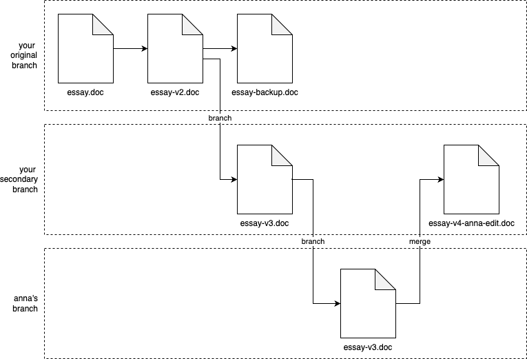

# Chapter 4: How to Version, Build, and Test Your Code

With most real-world code, software development is a **team sport**, not a solo effort.

You need to figure out how to support many developers **collaborating** safety and efficiently on the same codebase.

In particular, you need to solve the following problems:

| The problem | How to ...                                                                                                                           | Notes                                                      |
| ----------- | ------------------------------------------------------------------------------------------------------------------------------------ | ---------------------------------------------------------- |
| Code access | - Allow all developers (in the team) to access the codebase ?                                                                        | 👈 So they can collaborate                                 |
| Integration | - Integrate changes from all developers<br /> - Handle any conflicts<br />- Ensure no one's work is accidentally lost or overwritten |                                                            |
| Correctness | - Prevent bugs & breakages slipping in?                                                                                              |                                                            |
| Release     | - Release the changes (in your codebase) to production on a regular basis?                                                           | 👉 So the code can generate value for users & your company |

These problems are all key part of your _software development life cycle_ (SDLC).

- In the pasts, many companies came up with their own ad-hoc, manual SDLC processes:
  - Email code changes back & forth
  - Spend weeks integrating changes together manually
  - Test everything manually (if they did any testing at all)
  - Release everything manually, e.g. Using FTP to upload code to a server
- Now a day, we have far better tools & techniques for solving these problems:
  - Version control
  - Build system
  - Automated testing

## Version Control

### What is Version Control

version control system (VCS)
: a tool that allows you to
: - store **source code**
: - share it with your team
: - integrate your work together
: - track changes over time

### Version Control Primer

| Your normal workflow with an essay in Microsoft Word                                                                                                                                                              | Your workflow in version control terms                                                                                                                                                                                      |
| ----------------------------------------------------------------------------------------------------------------------------------------------------------------------------------------------------------------- | --------------------------------------------------------------------------------------------------------------------------------------------------------------------------------------------------------------------------- |
| You start with a file called `essay.doc`,                                                                                                                                                                         | You start with `essay.doc`.                                                                                                                                                                                                 |
| You realize you need to do some pretty major changes, so you create `essay-v2.doc`                                                                                                                                | After some major edits, you _commit_ your changes to a new revision called `essay-v2.doc`.                                                                                                                                  |
| You decide to remove some big pieces, but you don’t want to lose them, so you put those in `essay-backup.doc`, and move the remaining work to `essay-v3.doc`;                                                     | Then, you realize that you need to break off in a new direction, so you could say that you’ve created a new _branch_ from you original work, and in that new branch, you commit another new revision called `essay-v3.doc`. |
| Maybe you work on the essay with your friend Anna, so you email her a copy of `essay-v3.doc`                                                                                                                      | When you email Anna essay-v3.doc, and she starts her work, you could say that she’s working in yet another branch.                                                                                                          |
| Anna starts making edits; at some point, she emails you back the doc with her updates, which you then manually combine with the work you’ve been doing, and save that under the new name `essay-v4-anna-edit.doc` | When she emails you back, you manually _merge_ the work in your branch and her branch together to create `essay-v4-anna-edit.doc`.                                                                                          |
| You keep emailing back and forth, and you keep renaming the file, until minutes before the deadline, you finally submit a file called something like `essay-final-no-really-definitely-final-revision3-v58.doc`.  |                                                                                                                                                                                                                             |


Visualizing your process with Word documents as version control

Your normal workflow with the an essay - copying, renaming, emailing... - is a type of version control, but not a manual version control system.

There are better version control tools, in which you commit, branch, merge... your works.

#### Version Control Concepts

Repositories
: You store **files** (code, documents, images, etc.) in a _repository_ (_repo_ for short).

Branches
: (You start with everything in a single _branch_, often called something like `main`.)
: At any time, you can create a **new branch** from any existing branch, and work in your own branch **independently**.

Commits
: Within any branch,
: - you can edit files,
: - when you’re ready to store your progress in a new revision, you create a commit with your updates (you _commit your changes_)
: The commit typically records
: - not only the changes to the files,
: - but also who made the changes, and a _commit message_ that describes the changes.

Merges
: At any time, you can _merge_ branches together.
: e.g.
: - It’s common to create a branch from `main`, work in that branch for a while, and then merge your changes back into `main`.

Conflicts
: (VCS tools can merge some types of changes completely automatically),
: But if there is a _conflict_ (e.g., two people changed the same line of code in different ways),
: - the VCS will ask you to _resolve_ the conflict manually.

History
: The VCS tracks every commit in every branch in a _commit log_, which lets you see
: the **full history** of how the code changed:
: - all previous revisions of every file,
: - what changed between each revision
: - who made each change.

> [!NOTE]
> There are many version control systems:
>
> - CVS, Subversion, Perforce...
> - Mercurial, Git...
>
> These days, the most popular is Git.

### Example: A Crash Course on Git

#### Git basics

- Install Git: Follow the [office guide](https://git-scm.com/book/en/v2/Getting-Started-Installing-Git)

- Let Git know your name & email

  ```bash
  git config --global user.name "<YOUR NAME>"
  git config --global user.email "<YOUR EMAIL>"
  ```

---

---

- Initialize a Git repo

  > [!NOTE]
  > Before initial a Git repo, you need to create a empty folder:
  >
  > ```bash
  > mkdir /tmp/git-practice
  > cd /tmp/git-practice
  > ```
  >
  > (or you can use an existing repo)

  ```bash
  git init
  ```

  > [!NOTE]
  > Now, create a text file that will be including in your first commit:
  >
  > ```bash
  > echo 'Hello, World!' > example.txt
  > ```

  > [!TIP]
  > The contexts of the `git-practice` folder looks like this
  >
  > ```bash
  > $ tree -aL 1
  > .
  > ├── .git
  > └── example.txt
  > ```

  > [!NOTE]
  > The `.git` folder is where Git record all information about your branches, commits, revisions...

- Show the working tree status

  ```bash
  git status
  ```

  > [!NOTE]
  > The `git status` show the _working tree_ status:
  >
  > - What branch you're on.
  > - Any commits you've made.
  > - Any changes that haven't been committed yet.

- Before commit your changes, you first need to add the file(s) you want to commit to the _staging area_ using `git add`

  ```bash
  git add example.txt
  ```

- Re-run `git status`

  ```bash
  git status
  ```

  ```bash
  On branch main

  No commits yet

  Changes to be committed:
    (use "git rm --cached <file>..." to unstage)
  	new file:   example.txt
  ```

  - The `example.txt` is now in the `staging area`, ready to be committed.

- To commit the staged changes, use the `git commit`

  ```bash
  git commit -m "Initial commit"
  ```

  - Use the `-m` flag to pass in the commit message.

- Check the commit log using `git log`

  ```bash
  git log
  ```

  For each commit in the log, you’ll see

  - commit ID
  - author
  - date
  - commit message.

  > [!NOTE]
  > Each commit has a different ID that you can use to uniquely identify that commit, and many Git commands take a commit ID as an argument.

  > [!TIP]
  > Under the hood, a _commit ID_ is calculated by taking the **SHA-1 hash** of:
  >
  > - the contents of the commit,
  > - all the commit metadata (author, date, and so on), and
  > - the ID of the previous commit

  > [!TIP]
  > Commit IDs are **40 characters** long,
  >
  > - but in most commands, you can use just
  >   - the **first 7 characters**, as that will be unique enough to identify commits in all but the largest repos.

---

Let's make another change and another commit:

- Make a change to the `example.txt`

  ```bash
  echo 'New line of text' >> example.txt
  ```

- Show your working tree status

  ```bash
  git status
  ```

  ```bash
  On branch main
  Changes not staged for commit:
    (use "git add <file>..." to update what will be committed)
    (use "git restore <file>..." to discard changes in working directory)
  	modified:   example.txt
  ```

  - Git is telling you that the changes is current "in working directory" (working tree), and is "not staged for commit"
  - Git also tell you the changed files: `modified: example.txt`

- To see what exactly these changes are, run `git diff`

  ```bash
  git diff
  ```

  ```bash
  $ git diff
  diff --git a/example.txt b/example.txt
  index 8ab686e..3cee8ec 100644
  --- a/example.txt
  +++ b/example.txt
  @@ -1 +1,2 @@
   Hello, World!
  +New line of text
  ```

  > [!NOTE]
  > Use `git diff` frequently to check what changes you've made before committing them:
  >
  > - If the changes look good:
  >   - Use `git add <file>...` to stage the changes.
  >   - Then use `git commit` to commit them.
  > - If the changes don't look good:
  >   - Continue to modify the changes
  >   - Or use `"git restore <file>..."` to discard changes in working directory.

- Re-stage the changes and commit:

  ```bash
  git add example.txt
  git commit -m "Add another line to example.txt"
  ```

- Use `git log` once more with `--oneline`:

  ```bash
  git log --oneline
  ```

  ```bash
  02897ae (HEAD -> main) Add another line to example.txt
  0da69c2 Initial commit
  ```

> [!IMPORTANT]
> The commit log is very powerful 👈 It's has the commit IDs and commit messages:
>
> - **Debugging**:
>
>   Something breaks -> "What changed?" -> Check commit log's messages
>
> - **Reverting**:
>
>   - You can use `git revert <COMMIT_ID>` to create a new commit that reverts all the changes in the commit `<COMMIT_ID>`.
>
>     (in other words, undoing the changes in that commit while still preserving your Git history)
>
>   - You yan use `git reset --hard <COMMIT_ID>` to get rid of:
>     - all commits after `COMMIT_ID`.
>     - including the history about them.
>
> - **Comparison**:
>
>   You can use `git diff` to compare not only local changes, but also to compare any two commits.
>
> - **Author**:
>
>   You can use `git blame` to annotate each line of a file with information about the **last commit** that _modified_ that file, (including the date, the commit message, and the author).
>
>   - Don't use this to blame someone for causing a bug, as the name implies. It may be war!
>   - The more common use case is to help you understand where any give piece of code came from, and why that change was made.

#### Git branching and merging

- To create a new branch and switch to it, use `git checkout -b`

  ```bash
  git checkout -b testing
  ```

  > [!NOTE]
  > If you want to make sure you never lost your code, you can use `git switch -c` to create a new branch and switch to it.

- Check the you're on new branch with `git status`

  ```bash
  git status
  ```

- You can also list all the branches (and see which one you're on) with `git branch`

  ```bash
  git branch
  ```

  > [!TIP]
  > The branch which you're on is mark with asterisk (`*`)

- Any changes you commit now will go into the `testing` branch:

  - Try it with the example.txt

    ```bash
    echo 'Third line of text' >> example.txt
    ```

  - Stage and commit the changes

    ```bash
    git add example.txt
    git commit -m "Added a 3tr line to example.txt"
    ```

  - You git log to check that you have three commits on `testing` branch:

    ```bash
    git log --oneline
    ```

- Switch back to `main` branch to see that `main` branch still has only 2 commits

  ```bash
  git switch main
  git log --oneline
  ```

---

- Merge the work in your `testing` branch back to the `main` branch

  ```bash
  git merge testing # Merge testing branch (to current branch - main)
  ```

  ```bash
  Updating c4ff96d..c85c2bf
  Fast-forward
   example.txt | 1 +
   1 file changed, 1 insertion(+)
  ```

  - It's a `Fast-forward`, Git was able to merge all the changes automatically, as there were no conflicts between `main` & `testing` branches.

### Get your hands dirty with Git

- Learn how to use the `git tag` command to create tags.

- Learn to use `git rebase`.
  - When does it make sense to use it instead of `git merge`?

### Example: Store your Code in GitHub

- Git is a _distributed VSC_:

  Every team member can

  - have a **full copy** of the repository.
  - do commits, merges, branches completely _locally_.

- But the most common way to use Git is using one of the repositories as a _central repository_, which acts as your _source of truth_.

  - Everyone will initially get their code from this central repo
  - As someone make changes, he/she always pushes them back to this central repo.

- There are many way to run such a central repo:

  - Hosting yourself
  - Use a hosting service, which is the most common approach:

    - Not only host Git repos
    - But also provide:
      - Web UIs
      - User management
      - Development workflows, issue tracking, security tools...

    The most popular hosting service for Git are GitHub, GitLab, BitBucket.

  > [!NOTE]
  > GitHub is the most popular, and what made Git popular.
  >
  > - GitHub provides a great experience for hosting repos & collaboration with team members.
  > - GitHub has become de facto home for most open source projects.

---

### Example: Open a Pull Request in GitHub

### Version Control Best Practices

## Build System

### Example: Configure your Build Using NPM

### Dependency Management

### Example: Add Dependencies in NPM

## Automated Testing

### Example: Add Automated Tests for the Node.js App

### Example: Add Automated Tests for the OpenTofu Code

### Testing Best Practices

## Conclusion
