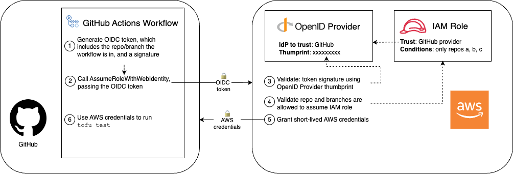

# Chapter 5: How to Set Up Continuous Integration (CI) and Continuous Delivery (CD)

## Continuous Integration (CI)

### Late Integration vs Continuous Integration

late integration
: Come up with a _final_ design for all the components of the system
: - Have each team works on the components in _isolated_ until it's _finished_
: When all components are done, assemble at the _same time_.

continuous integration (CI)
: Come up with an _initial design_ fo all the components of the system
: - Have each team works on the components
: - As teams make progress, they regularly test each component will all the other components & _update_ the design (if there are any problems)
: As components are completed, assemble _incrementally_

#### The problem with late integration

With late integration, there will a lot of conflicts and design problems:

- What if there are problems when integration between components of 2 teams, which teams should solve that problem?
- If the design has problems, how to go back and fix things?

---

In software development, late integration is

- developers work in totally isolated _feature branches_ for weeks or months at a time.
- when a release rolls around, these features branches are all merged to the release branch.

When you don't merge your code together for a long time, you end up with a lot of _merge conflicts_, e.g.

- 2 teams modified the same file in _incompatible_ ways:
  - 1 team made changes in a file, another team deleted it
  - 1 team - after a giant refactor - remove all usages of a deprecated service; another teams introduce new usages for that services...

All these conflicts after resolved may still leads to bugs, problems that take days/weeks to stabilized. And the release process turned into a nightmare.

#### Continuous integration and its benefits

In software development, _continuous integration_ is:

- developers merge their work together on a very regular basic: daily (or multiple times per day)

which will

- exposes problems with these works early in the process
- allows developers to make improvements incrementally (before any problems gone too far)

> [!IMPORTANT]
> Key takeaway #1
> Ensure all developers merge all their work together on a regular basis: typically daily or multiple times per day.

#### Continuous integration and trunk-based development

trunk-based development
: developers collaboration on a single long-live branches - e.g. `main`, `master`, `trunk`
: developers works on short-live branches; and open pull requests to merge them back into the shared branch on a regular basis

Trunk-based development is the most common way to implement continuous integration (CI)

> [!NOTE]
> You might think having all developers work on a single branch (`main`) have a problem with scaling,
>
> - but in fact, it might be the only way to scale.
>
> e.g. By using trunk-based development
>
> - LinkedIn scale from 100 developers to 1000.
> - Google scale to tens of thousands of developers, with 2+ billion lines of code, 86TB of source data, 40000 commits per day.

### Three questions about continuous integration and trunk-based development

1. Wouldn’t you have **merge conflicts** _all the time_?
2. Wouldn’t the **build** always be _broken_?
3. How do you make **large changes** that take weeks or months?

#### Dealing with Merge Conflicts

> [!NOTE]
> With late integration (and long-live feature branches), resolving merge conflicts
>
> - occurs right before a release
> - is a painful work that you only need to deal with once every few weeks/months.
>
> But with continuous integration (and trunk-based development), you merge your code every day, so you need to resolve conflicts every day? So you need to do the painful work every day?

- If your branches are short-live, the odds of merge conflicts are much lower.
- Even if there are a merge conflicts, it's much easier to resolve them (if you merge regularly).

> [!TIP]
> Merge conflicts are unavoidable:
>
> - (Don't try to avoid merge conflicts).
> - Make them easy to be done by do them more often.

#### Preventing Breakages with Self-Testing Builds

- CI (and trunk-based development) is always used with a _self-testing build_, which runs automated tests after every commit.

  For any commit on any branch,

  - every time a developer opens a pull request (PR) to merge a branch to `main`
    - **automated tests** are run (against their branch)
      - test results are shown directly in the PR UI.

> [!TIP]
> By having a self-testing build after every commit:
>
> - Code doesn't pass your test suite doesn't get merged to `main`.
> - For code does pass you test suite, but cause a breakage:
>   - as soon as you detect it, you can revert that commit automatically.

##### How to set up a self-testing build

The most common way to set up a self-testing build is to run a _CI server_.

---

CI server
: e.g. Jenkins, TeamCity Argo; GitHub Actions, GitLab, CircleCI.
: a software that integrates with your VCS to _run_ various **automations**, e.g. automated tests
: - in response to an event (in your VSC), e.g. new commits/branches/PRs...

> [!TIP]
> CI server are such an integral part of CI,
>
> - for many developers, CI server and CI are nearly synonymous.

##### The benefits of CI (and Automated Tests)

- Without continuous integration, your software is _broken until somebody proves it works_, usually during a testing or integration stage.

- With continuous integration, your software is _proven to work_ (assuming a sufficiently comprehensive set of automated tests) with every new change — and you know the moment it breaks and can fix it immediately.

> [!NOTE]
> With continuous integration, your code is _always_ in a working & deployable state 👉 You can deploy at any time you want.

> [!TIP]
> The CI server act as a gatekeeper 👮🆔:
>
> - protecting your code from any changes that threaten your ability to deploy at any time.

> [!IMPORTANT]
> Key takeaway #2
> Use a self-testing build after every commit to ensure your code is always in a **working & deployable** state.

#### Making Large Changes

For large changes that take weeks/months, e.g. major new feature, big refactor - how can you merge your in-compete work on a daily basis

- without breaking the build
- without releasing unfinished features to users?

> [!IMPORTANT]
> Key takeaway #3
> Use branch by abstraction and feature toggles to make large-scale changes while still merging your work on a regular basis.

##### Branch by abstraction

branch by abstraction
: a technique for making a large-scale change to a software system's codebase in _gradual_ way, that allows you
: - to release the system regularly while the change is still in-progress

Branch by abstraction works at **code-level**, allow you to

- switch the implementation of the abstract easily (at code-level)
- or even have 2 implementation (versions) of the feature in parallel (at code-level)

For more information, see:

- [Branch By Abstraction | Martin Fowler](https://martinfowler.com/bliki/BranchByAbstraction.html)
- [Branch by abstraction pattern |AWS Prescriptive Guidance - Decomposing monoliths into microservices](https://docs.aws.amazon.com/prescriptive-guidance/latest/modernization-decomposing-monoliths/branch-by-abstraction.html)

##### Feature toggles

feature toggle
: aka _feature flag_
: you wrap a new feature in **conditionals**, that let you
: - toggle that feature on/off dynamically at **deploy time/runtime**

By wrap features in conditionals, at **code-level**,

- you can make some part of your system invisible to the users without changing the code.

e.g.

- In the Node.js sample-app, you can add a feature toggle to pick between new homepage and the "Hello, World!" text

  ```javascript
  app.get("/", (req, res) => {
    if (lookupFeatureToggle(req, "HOME_PAGE_FLAVOR") === "v2") {
      res.send(newFancyHomepage());
    } else {
      res.send("Hello, World!");
    }
  });
  ```

  - The `lookupFeatureToggle` will check if the feature toggle is enables by querying a dedicated _feature toggle service_.

For more information, see:

- [Feature Toggles | Martin Flower's Article](https://martinfowler.com/articles/feature-toggles.html)

###### Feature toggle service

A feature toggle service can:

- Store a feature toggle mapping
- Be used to look up feature toggles programmatically
- Update feature toggle values without having to update/deploy code

e.g.

- growthbook, Flagsmith, flagr, OpenFeature
- Managed feature: Split, LaunchDarkly, ConfigCat, Statsig.

##### Feature toggle and continuous integration

By

- wrapping new features in conditionals (feature toggle check), and
- keep the default value of all feature toggles to off

you can merge your new unfinished feature into `main` and practice continuous integration.

> [!TIP]
> Feature toggles also give you many super powers, which you can see in the Continuous Delivery section

#### Example: Run Automated Tests for Apps in GitHub Actions

In this example, you will use GitHub Actions to run the automated tests (that added in Chap 4) after each commit and show the result in pull requests.

- Copy the Node.js `sample-app` and the automated tests

  ```bash
  cd examples
  mkdir -p ch5
  cp -r ch4/sample-app ch5/sample-app
  ```

- From the root of the repo, create a folder called `.github/workflows`

  ```bash
  mkdir -p .github/workflows
  ```

- Inside `.github/workflows`, create a GitHub workflow file named `app-tests.yml`

  ```yaml
  # .github/workflows/app-tests.yaml
  name: Sample App Tests

  on: push #                                  (1)

  jobs: #                                     (2)
    sample_app_tests: #                       (3)
      name: "Run Tests Using Jest"
      runs-on: ubuntu-latest #                (4)
      steps:
        - uses: actions/checkout@v2 #         (5)

        - name: Install dependencies #        (6)
          working-directory: ch5/sample-app
          run: npm install

        - name: Run tests #                   (7)
          working-directory: ch5/sample-app
          run: npm test
  ```

  > [!NOTE]
  > With GitHub Actions, you use YAML to
  >
  > - define _workflow_ - configurable automated processes - that
  >   - run one or more _jobs_
  >     - in response to certain _triggers_.

  > [!TIP]
  > If you don't know about YAMl, see
  >
  > - [YAML | Learn X in Y minutes](https://learnxinyminutes.com/docs/yaml/)
  > - or [YAML Syntax | Ansible Docs](https://docs.ansible.com/ansible/latest/reference_appendices/YAMLSyntax.html)
  > - or [YAML basics in Kubernetes | IBM Developer - Tutorials](https://developer.ibm.com/tutorials/yaml-basics-and-usage-in-kubernetes/)
  > - or [YAML for beginners | Red Hat](https://www.redhat.com/sysadmin/yaml-beginners)
  > - https://yaml.org/spec/1.2.2/#nodes

  - (1) `on` block: The trigger that will cause the workflow to run.

    In this example, `on: push` configure this workflow to run every time you do a `git push` to this repo

  - (2) `jobs` block: One or more jobs - aka automations - to run in this workflow.

    > [!NOTE]
    > By default, jobs run _parallel_, but you can
    >
    > - configure jobs to run sequentially
    > - (and define dependencies on other jobs, passing data between jobs)

  - (3) `sample_app_tests`: This workflow define a single job named `sample_app_tests`, which will run the automated tests for the sample app.

    > [!NOTE]
    > GitHub Actions use YAML syntax to define the workflow:
    >
    > - A YAML node can be one of three types:
    >   - Scalar: arbitrary data (encoded in Unicode) such as strings, integers, dates
    >   - Sequence: an ordered list of nodes
    >   - Mapping: an unordered set of key/value node pairs
    > - Most of the GitHub Actions's workflow syntax is a part of a mapping node - with:
    >   - a pre-defined key, e.g. `name`, `on`, `jobs`,
    >   - excepting some where you can specify your own key, e.g. `<job_id>`, `<input_id>`, `<service_id>`, `<secret_id>`

    > [!TIP]
    > In this example, `sample_app_test` is the `<job_id>` specified by you

  - (4) `runs-on` block: Uses `ubuntu-latest` runner that has:

    - default hardware configuration (2 CPUs, 7GB RAM, as of 2024)
    - software with Ubuntu & a lot of tools (including Node.js) pre-installed.

    > [!NOTE]
    > Each job runs on a certain type of _runner_, which is how you configure:
    >
    > - the hardware (CPU, memory)
    > - the software (OS, dependencies)
    >
    > to use for the job.

  - (5) `uses` block: Uses a reusable unit of code (aka _action_) - `actions/checkout` - as the first step.

    > [!NOTE]
    > Each job consists of a series of _steps_ that are executed sequentially.

    > [!NOTE]
    > GitHub Actions allow you to share & reuse workflows, including
    >
    > - public, open source workflows (available on GitHub Actions Marketplace)
    > - private, internal workflows within your own organization

  - (6): The second step has a `run` block to execute shell commands (`npm install`)

    > [!NOTE]
    > A step can has:
    >
    > - either a `run` block: to run any shell commands
    > - or a `uses` block: to run an action

  - (7) The thirst step also has a `run` block to execute shell commands (`npm test`)

- Commit & push to your GitHub repo

  ```bash
  git add ch5/sample-app .github/workflows/app-tests.yml
  git commit -m "Add sample-app and workflow"
  git push origin main
  ```

- Verify that the automated tests run

  - Create a new branch

    ```bash
    git switch -c test-workflow
    ```

  - Make a change to the app

    ```bash
    sed -i s/Hello, World!/Fundamentals of DevOps!/g ch5/sample-app/app.js
    ```

  - Commit & push

    ```bash
    git add ch5/sample-app
    git commit -m "Add sample-app and workflow"
    git push origin main
    ```

  - Open the GitHub URL for that branch; then "create pull request"
  - Verify that the workflow run

    > [!TIP]
    > In GitHub PR UI, a workflow run is show as _check_

  - Open the check detail to know what's wrong with the check (It's a fail test).

- Update the automated test to match with the new response text

  ```bash
  sed -i s/Hello, World!/Fundamentals of DevOps!/g ch5/sample-app/app.test.js
  ```

  - Commit & push to the same branch

    ```bash
    git add ch5/sample-app/app.test.js
    git commit -m "Update response text in test"
    git push origin test-workflow
    ```

  - GitHub Actions will re-run your automated tests.
  - Open the GitHub PR UI to verify that the automated tests now is passing. (It's should show "All checks have passed")

#### Get your hands dirty: Run automated app tests in CI

To help catch bugs, update the GitHub Actions workflow to run a JavaScript linter, such as JSLint or ESLint, after every commit.

To help keep your code consistently formatted, update the GitHub Actions workflow to run a code formatter, such as Prettier, after every commit.

Run both the linter and code formatter as a pre-commit hook, so these checks run on your own computer before you can make a commit. You may wish to use the pre-commit framework to manage your pre-commit hooks.

### Machine-User Credentials and Automatically-Provisioned Credentials

If you want to run unit testing with OpenTofu's `test` command,

- you need to give the automated tests a way to authenticated to cloud provider
  - if these automated tests run on your local machine, they may use a _real-user credential_ - e.g. AWS IAM user credentials, GitHub personal access token -
  - if these automated tests run on a CI server, you should never use a real-user credential.

#### The problem of using real-user credentials for CI server

- **Departures**

  Typically, when someone leaves a company, you _revoke_ all their access.

  If you were using their credentials for automation, then that automation will suddenly _break_.

- **Permissions**

  The permissions that a human user needs are typically _different_ than a machine user.

- **Audit logs**

  If you use same user account for both a human & automation, the _audit logs_[^1] aren't useful for debugging & investigating security incidents anymore.

- **Management**

  You typically want multiple developers at your company to be able to manage the automations you set up.

  - If you use a single developer’s credentials for those automations,
    - when he/she need to update the credentials or permissions,
      - the other developers won’t be able to access that user account

> [!IMPORTANT]
> Key takeaway #4
> Use machine user credentials or automatically-provisioned credentials to authenticate from a CI server or other automations.

#### Machine-user credentials

machine-user
: a user account that is only used for automation (not by any human user)

machine-user credential
: a credential of a machine-user
: usually it's a long-live credential

---

##### How to use a machine-user credential

- Create a machine-user
- Generate credential - e.g. access token - for that machine-user
- _Manually_ copy the credential into whatever tool you're using, GitHub Actions

##### Machine-user credentials pros and cons

- Pros:

  - It solves all problems of using a shared real-user credential

- Cons:

  - You need to manually copy machine-user credentials (just as a password)
  - Machine-user credentials are _long-lived_ credentials

    If they are leaked, you would have a big problem.

#### Automatically-provisioned credentials

automatically-provisioned credential
: credential that is provisioned automatically (by a system)
: - without any need for you to manually create machine users or copy/paste credentials
: - so it can be used by another system
: usually it's a _short-live_ credential
: e.g. AWS IAM roles

This requires that the two systems

- the system you're authenticating from, e.g. a CI server
- the system you're authenticating to, e.g. AWS

have an integration that supports automatically-provision credentials.

The two systems can be

- in the _same_ company's services 👉 via AWS IAM role (when using with EKS/EC2).
- _across_ companies' services 👉 via _OpenID Connect (OIDC)_ - an open protocol for authentication.

##### OpenID Connect (OIDC)

To understand OIDC, let's examine an example for OIDC integration between GitHub and AWS:

- You're authenticate from GitHub to AWS:

  - GitHub: the system you're authenticating **from**
  - AWS: the system you're authenticating **to**

- In other words,

  - GitHub system needs to have some permissions to do something with AWS.
  - AWS systems will provision the credential that GitHub needs.

- Under the hood, with OIDC, you configure AWS to

  - _trust_ an IdP (e.g. GitHub)

    > [!TIP]
    > How can AWS trust an IdP, e.g. GitHub?
    >
    > OIDC trust is a digital signature system[^2]:
    >
    > - GitHub has the private key (and use it to sign the OIDC token).
    > - AWS has the public key (and use it to validate the OIDC token).

  - allow that IdP to _exchange_ an OIDC token[^3] for short-lived AWS credentials

- Here is how the authenticate from GitHub to AWS works:

  

  1. **[GitHub] Generate an OIDC token:** includes claims about what repo/branch (the workflow is running in).
  2. **[GitHub] Call the `AssumeRoleWithWebIdentity` API:** to specify the IAM Role to assume (and passing the OIDC token to AWS as authentication).
  3. **[AWS] Validate the OIDC token:** using the public key (that you provide when setting up GitHub as an IdP).
  4. **[AWS] Validate IAM role conditions:** against the claims (whether that repo/branch is allowed to assume the IAM role).
  5. **[AWS] Grant short-lived AWS credentials:** then send back to GitHub.
  6. **[GitHub] Use the AWS credentials:** to authenticate to AWS (and make changes in AWS account)

#### Example: Configure OIDC with AWS and GitHub Actions

##### The `github-aws-oidc` and `gh-actions-iam-roles` OpenTofu modules

The sample code repo includes 2 OpenTofu modules

- `github-aws-oidc` module:

  - in `ch5/tofu/modules/github-aws-oidc` folder
  - that can provision GitHub as an OIDC provider for AWS account.

- `gh-actions-iam-roles` module:

  - in `ch5/tofu/modules/gh-actions-iam-roles` folder
  - that can provision severals IAM roles for CI/CD with GitHub Actions.

##### Configure `github-aws-oidc` and `gh-actions-iam-roles` OpenTofu module

- Create a new Git branch

  ```bash
  git switch -c opentofu-tests
  ```

- Create the folder for the OpenTofu root module

  ```bash
  cd examples
  mkdir -p ch5/tofu/live/ci-cd-permissions
  cd ch5/tofu/live/ci-cd-permissions
  ```

- Configure the `github-aws-oidc` module

  ```t
  # examples/ch5/tofu/live/ci-cd-permissions/main.tf

  provider "aws" {
    region = "us-east-2"

  }

  module "oidc_provider" {
    source = "github.com/brikis98/devops-book//ch5/tofu/modules/github-aws-oidc"
    provider_url = "https://token.actions.githubusercontent.com" # (1)
  }
  ```

  - 1 `provider_url`: The URL of the IdP

    > [!TIP]
    > The `github-aws-oidc` will use this URL to fetch GitHub's fingerprint, that used by AWS to validate the OIDC token from GitHub.

- Configure the `gh-actions-iam-roles` module to create examples IAM roles (to be assumed from GitHub Actions).

  ```t
  # examples/ch5/tofu/live/ci-cd-permissions/main.tf

  module "oidc_provider" {
    # ... (other params omitted) ...
  }

  module "iam_roles" {
    source = "github.com/brikis98/devops-book//ch5/tofu/modules/gh-actions-iam-roles"

    name              = "lambda-sample" #                           (1)
    oidc_provider_arn = module.oidc_provider.oidc_provider_arn #    (2)

    enable_iam_role_for_testing = true #                            (3)

    # TODO: fill in your own repo name here!
    github_repo      = "brikis98/fundamentals-of-devops-examples" # (4)
    lambda_base_name = "lambda-sample" #                            (5)
  }
  ```

  - 1 `name`: Base name for this module's resources

  - 2 `oidc_provider_arn`: Specify the IdP (the one created by `github-aws-oidc` module) that will be allowed to assume created by this module.

    > [!TIP]
    > Under the hood, `gh-actions-iam-roles` module will
    >
    > - configure the _trust policy_ in the IAM roles to
    >   - trust this OIDC provider (and allow it to assume the IAM roles)

  - 3 `enable_iam_role_for_testing`: Set to `true` to create IAM roles used for testing.

  - 4 `github_repo`: Specify the GitHub repo that will be allowed to assume the IAM roles.

    > [!TIP]
    > Under the hood, the `gh-actions-iam-roles` module
    >
    > - sets certain **conditions** in the _trust policies_ of each IAM role
    >   - to specify which repos/branches in GitHub
    >     - are allowed to assume that IAM role

  - 5 `lambda_base_name`: Manually specify the lambda function base name.

- Create the output variables

  ```t
  output "lambda_test_role_arn" {
    value = module.iam_roles.lambda_test_role_arn
  }
  ```

- Init & apply OpenTofu code

  ```bash
  tofu init
  tofu apply
  ```

### Automated tests and infrastructure code

#### Example: Run Automated Tests for Infrastructure in GitHub Actions

- Copy the infrastructure code

  ```bash
  cd examples
  mkdir -p ch5/tofu/modules
  cp -r ch4/tofu/live/lambda-sample ch5/tofu/live
  cp -r ch4/tofu/modules/test-endpoint ch5/tofu/modules
  ```

- Remove hard-codes names in `lambda-sample` (so the tests can run concurrently)

  - Define an input variable for `lambda-sample`

    ```t
    # examples/ch5/tofu/live/lambda-sample/variables.tf
    variable "name" {
      description = "The base name for the function and all other resources"
      type        = string
      default     = "lambda-sample"
    }
    ```

    - This defines a `name` variable to use as the base name for `lambda-sample` module with the default value `"lambda-sample"` (same as before).

  - Update `main.tf` to use `var.name` (instead of hard-coded names)

    ```t
    # examples/ch5/tofu/live/lambda-sample/main.tf
    module "function" {
      # ... (other params omitted) ...
      name = var.name
    }

    module "gateway" {
      # ... (other params omitted) ...
      name = var.name
    }
    ```

- Define the GitHub Actions workflow to run the infrastructure automated tests

  The workflow

  - runs on `push`,
  - contains 2 jobs: `terrascan`, `opentofu_test`

  ***

  - ```yaml
    # .github/workflows/infra-tests.yml
    name: Infrastructure Tests

    on: push

    jobs:
      terrascan:
        name: "Run Terrascan"
        runs-on: ubuntu-latest
        steps:
          - uses: actions/checkout@v2

          - name: Run Terrascan
            uses: tenable/terrascan-action@main
            with:
              iac_type: "terraform"
              iac_dir: "ch5/tofu/live/lambda-sample"
              verbose: true
              non_recursive: true
              config_path: "ch5/tofu/live/lambda-sample/terrascan.toml"
    # opentofu_test:
    ```

  - The first job `terrascan`:

    - checkout code
    - install then run `terrascan` using `tenable/terrascan-action` action

  ***

  - ```yaml
    opentofu_test:
      name: "Run OpenTofu tests"
      runs-on: ubuntu-latest
      permissions: #                                                                (1)
        id-token: write
        contents: read
      steps:
        - uses: actions/checkout@v2

        - uses: aws-actions/configure-aws-credentials@v3 #                          (2)
          with:
            # TODO: fill in your IAM role ARN!
            role-to-assume: arn:aws:iam::111111111111:role/lambda-sample-tests #    (3)
            role-session-name: tests-${{ github.run_number }}-${{ github.actor }} # (4)
            aws-region: us-east-2

        - uses: opentofu/setup-opentofu@v1 #                                        (5)

        - name: Tofu Test
          env:
            TF_VAR_name: lambda-sample-${{ github.run_id }} #                       (6)
          working-directory: ch5/tofu/live/lambda-sample
          #                                                                         (7)
          run: |
            tofu init -backend=false -input=false
            tofu test -verbose
    ```

  - The second job `opentofu_test`:

    - 1 `permissions`: In additional to `contents: read` (the default one), add `id-token: write` permissions to issue an OIDC token.
    - 2: Authenticate to AWS with OIDC using `aws-actions/configure-aws-credentials` action to 👉 This calls `AssumeRoleWithWebIdentity`)
    - 3: Manually fill in the IAM role to assume, it's the IAM role created in the previous example.
    - 4: Specify the session name when assume the IAM role 👉 This shows up in audit logs.
    - 5: Install OpenTofu using `opentofu/setup-opentofu` action.
    - 6: Use the environment variable `TF_VAR_name` to set the `name` input variable of the `lambda-sample` module.
    - 7: Run the tests
      Skip backend initialization with `backend=false` flag.

- Commit & push to `opentofu-tests` branch; then open a PR.
- Verify the infrastructure automated tests run.

#### Get your hands dirty: Run automated infrastructure tests in CI

To help keep your code consistently formatted, update the GitHub Actions workflow to run a code formatter, such as `tofu fmt`, after every commit.

## Continuous Delivery (CD)

### Continuous Delivery and Continuous Deployment

continuous delivery (CD)
: a software development practice where you ensure that you can
: - _deploy_ to production **_at any time_** - e.g. daily, several times a days - in a manner that is **fast, reliable, sustainable**.

continuous deployment (CD\*)
: a software development practice where you
: - _deploy_ to production **after every single commit** in a manner that is fast, reliable, sustainable

---

With continuous delivery (CD), you ensure that the _frequency of deployment_ is

- purely a **business decision**
- not limited by your technology

> [!IMPORTANT]
> Key takeaway #5
> Ensure you can deploy to production at any time in a manner that is fast, reliable, and sustainable.

---

To achieve continuous delivery (and continuous deployment), you need to fulfill 2 requirements:

1. The **code** is always in a _working_ & _deployable_ state:

   This is the key benefit of practicing CI:

   - Everyone integrates their work regularly
     - with a self-testing build and a sufficient suite of tests.

2. The **deployment process** is sufficiently _automated_:

   A manually deployment deployment process typically aren't fast, reliable, sustainable.

---

This section focus on the second requirement - automating the deployment process using IaC:

- Implementing deployment strategies
- Implementing a deployment pipeline

deployment strategy
: a _deployment strategy_ is **how you want** to deploy your software

deployment pipeline
: a _deployment pipeline_ is a system of **automated processes** that deploy your software to production

### Deployment Strategies

There are many deployment strategies that you can use to deploy (aka _roll out_) changes:

- some have **downtime**, others don't
- some are **easy to implement**, others are complicated
- some only work with **stateless apps**[^4]
- some only work with **stateful apps**[^5]

This section will go over the most common deployment strategies. For each strategy, there are:

- Basic overview
- Advantages & disadvantages
- Common use cases

> [!TIP]
> You can combine multiple strategies together.

#### Downtime deployment

|                  | Downtime deployment                                               |
| ---------------- | ----------------------------------------------------------------- |
| Overview         | 1. (v1 replicas)                                                  |
|                  | 2. Undeploy all v1 replicas; deploy v2 replicas (to same servers) |
| Advantages       | - Easy to implement                                               |
|                  | - Works with all type of apps                                     |
| Disadvantages    | - Downtime                                                        |
| Common use cases | - Single-replica systems                                          |
|                  | - Data migrations                                                 |

#### Rolling deployment without replacement

|                  | Rolling deployment without replacement |
| ---------------- | -------------------------------------- |
| Overview         | 1. (v1 replicas)                       |
|                  | 2. Deploy v2 replicas (to new server)  |
|                  | 3. Gradually undeploy v1 replicas.     |
| Advantages       | - No downtime                          |
|                  | - Widely supported                     |
| Disadvantages    | - Poor UX                              |
|                  | - Works only with stateless apps       |
| Common use cases | - Deploying stateless apps             |

#### Rolling deployment with replacement

|                  | Rolling deployment with replacement                                                   |
| ---------------- | ------------------------------------------------------------------------------------- |
| Overview         | 1. (v1 replicas with hard-drive attached)                                             |
|                  | 2. Disconnect one v1 replica; shut down server; move its hard-drive to new v2 server. |
|                  | 3. Repeat for each v1 server                                                          |
| Advantages       | - No downtime                                                                         |
|                  | - Works with all types of apps                                                        |
|                  | - Widely supported                                                                    |
| Disadvantages    | - Limited support for hard-drive replacement                                          |
|                  | - Poor UX                                                                             |
| Common use cases | - Deploying stateful apps                                                             |

#### Blue-green deployment

|                  | Blue-green deployment                                                       |
| ---------------- | --------------------------------------------------------------------------- |
| Overview         | 1. (v1 replicas) - aka blue 🔵                                              |
|                  | 2. Deploy v2 replicas - aka green 🟢                                        |
|                  | 3. When all v2 replicas pass health checks, do an instantaneous switchover. |
| Advantages       | - No downtime                                                               |
|                  | - Good UX                                                                   |
| Disadvantages    | - Limited support                                                           |
|                  | - Works only with stateless apps                                            |
| Common use cases | - Deploying stateless apps                                                  |

#### Canary deployment

|                  | Canary deployment                                                                                             |
| ---------------- | ------------------------------------------------------------------------------------------------------------- |
| Overview         | 1. (v1 replicas)                                                                                              |
|                  | 2. Deploy a single v2 replica - aka _canary server_;<br/>- Compare to a _control_ (a random v1 replica)       |
|                  | 3. If there isn't any differences, roll out all v2 replicas using another strategy (e.g. rolling, blue-green) |
| Advantages       | - Catch errors early                                                                                          |
| Disadvantages    | - Poor UX                                                                                                     |
| Common use cases | - Large deployments                                                                                           |
|                  | - Risky deployments                                                                                           |

#### Feature toggle deployment

|                  | Feature toggle deployment                                                                                                                 |
| ---------------- | ----------------------------------------------------------------------------------------------------------------------------------------- |
| Overview         | 1. (v1 replicas)                                                                                                                          |
|                  | 2. Deploy v2 replicas: <br/>- Use another strategy, e.g. rolling, blue-green. <br/>- Wrap new features in a feature flag (off by default) |
|                  | 3. Enable v2 features with feature toggle service                                                                                         |
| Advantages       | - Separate deployment from release                                                                                                        |
|                  | - Resolve issues without deploying new code                                                                                               |
|                  | - Ramp new features                                                                                                                       |
|                  | - A/B test features                                                                                                                       |
| Disadvantages    | - Requires an extra service                                                                                                               |
|                  | - Forked code                                                                                                                             |
| Common use cases | - All new feature development                                                                                                             |
|                  | - Data-driven development                                                                                                                 |

#### Promotion deployment

|                  | Promotion deployment                                                                                                                                      |
| ---------------- | --------------------------------------------------------------------------------------------------------------------------------------------------------- |
| Overview         | For example, you have 3 environments (env): `dev`, `stage`, `prod`                                                                                        |
|                  | 1. (v1 replicas is running in all 3 envs)                                                                                                                 |
|                  | 2. Deploy v2 across `dev` environment (using another strategy, e.g. rolling, blue-green)<br/>- Then do a round of testing in `dev` env                    |
|                  | 3. If everything works well in `dev` env, deploy exactly the same v2 across `stage` env (aka _promoting_)<br/>- Then do a round of testing in `stage` env |
|                  | 4. If everything works well in `stage` env, you finally promote v2 to `prod` env                                                                          |
| Advantages       | - Multiple chances to catch errors                                                                                                                        |
| Disadvantages    | - Requires multiple environments                                                                                                                          |
| Common use cases | - All deployments                                                                                                                                         |

#### Infrastructure deployment

All the previous deployment strategies (except promotion deployment) only applicable for deploying _application code_, e.g. apps written in Go, Javascript, Ruby, Python.

For infrastructure code (e.g. OpenTofu, CloudFormation, Pulumi), the deployment strategies are:

- much more limited
- typically _binary_: make a change or not (no gradual rollout, no feature toggle, no canary...)

|                  | Infrastructure deployment                                                                |
| ---------------- | ---------------------------------------------------------------------------------------- |
| Overview         | 1. (v1 replicas)                                                                         |
|                  | 2. **Validate plan output**: e.g. `tofu plan`, `kubectl apply --dry-run`                 |
|                  | 3. **Use a promotion deployment** to promote infrastructure changes between environments |
| Advantages       | - Works with infrastructure deployments                                                  |
|                  | - Even more chances to catch errors                                                      |
| Disadvantages    | - Requires multiple environments                                                         |
| Common use cases | - All infrastructure deployments                                                         |

### Deployment Pipelines

#### Example: Configure an automated deployment pipeline in GitHub Actions

#### Example: Use a remote backend for OpenTofu state

#### Get your hands dirty: Terragrunt

If you’re like me, you’re probably annoyed by all the copy/paste you need to do with these backend configurations. Unfortunately, OpenTofu does not support using variables or any other kind of logic in backend blocks, so some amount of copy/paste is necessary. However, you can try out one of the following approaches to significantly reduce the code duplication:

- Partial backend configuration
- Terragrunt

#### Example: Add IAM roles for infrastructure deployments in GitHub Actions

#### Example: Define a pipeline for infrastructure deployments

### Deployment pipeline best practices

#### Automate all the steps that can be automated

#### Deploy only from a deployment server

#### Protect the deployment server

## Conclusion

Automating your entire SDLC through the use of CI/CD:

- CI: Ensure all developers _merge_ all their work together on a regular basis: typically **daily** or multiple times per day.

  - Use a **self-testing build** after every commit to ensure your code is always in a working and **deployable state**.
  - Use **branch by abstraction** and **feature toggles** to _make large-scale changes_ while still merging your work on a regular basis.

- Security: Use machine user credentials or automatically-provisioned credentials to _authenticate_ from a CI server or other automations.

- CD: Ensure you can _deploy_ to production **at any time** in a manner that is fast, reliable, and sustainable.

[^1]: Most systems maintain an audit log that records _**who** performed **what**_ actions in that system.
[^2]: Digital signature system and public-key encryption system are 2 type of systems that use public-key cryptography (asymmetric cryptography).
[^3]: OIDC token is a JSON Web Token - a JSON object that contains _claims_ (data that being asserted)
[^4]: Stateless apps are apps that don’t need to persist (across deployments) any of the data that they store on their local hard drives (e.g., most web frontend apps are stateless)
[^5]: Stateful apps are apps that need to persist (across deployments) any of the data that they store on their local hard drives (e.g., any sort of database or distributed data system).
