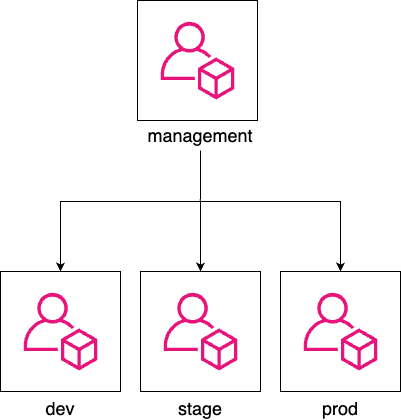

# Chapter 6: How to Work with Multiple Teams and Environments

- CI/CD will allow developers work together efficiently and safety,

  - but as your company grows, there are other type of problems:

    - From _outside_ world: more **users** (more traffic/data/laws/regulations)
    - From _inside_ your company: more **developers/teams/products**
      👉 It's harder to code/test/deploy without hitting lots of bugs/outages/bottlenecks.

- These problems are problems of _scale_,

  - (good problems to have, which indicates your business is becoming more successful).

- The most common approach to solve these problem of scale is _divide and conquer_:

  - **Break up your deployments**: into multiple separated, isolated **environments**.
  - **Break up your codebase**: into multiple **libraries**, **(micro)services**

## Breaking Up Your Deployments

- In this book, you deploy everything - servers, Kubernetes, cluster, serverless functions, ... - into a single AWS account 👈 Fine for learning & testing
- In real world, it's common to have multiple deployment _environments_, each environment has its own set of _isolated_ infrastructure.

### Why Deploy Across Multiple Environments

#### Isolating Tests

- Typically, you need a way to test changes to your software

  - _before_ you expose those changes (to users)
  - in a way that limits the _blast radius_ (that affects users, production environment).

- You do that by deploying more environments that closely resemble production.

- A common setup is having 3 environments:

  - **Production**: the environment that is exposed to _users_.
  - **Staging**: a scaled-down clone of production that is exposed to inside your _company_.

    👉 The releases are staged in **staging** so other teams - e.g. QA - can test them.

  - **Development**: another scaled-down clone of production that is exposed to _dev team_.

    👉 Dev teams test code changes in **development** during _development_ process (before those changes make it to staging).

> [!TIP]
> These trio environments have many other names:
>
> - **Production**: `prod`
> - **Staging**: `stage`, `QA`
> - **Development**: `dev`

#### Isolating Products and Teams

- Larger companies often have multiple products and teams,

  - which may have different requirements in term of uptime, deployment frequency, security, compliance...

- It's common for each team/product to have its own isolated set of environments, so:

  - each team can customize to their own needs
  - limit the blast radius of each team/product
  - allows teams to work in isolated from each other (which may be good or bad!)

- e.g.

  - Search team have their software deployed in `search-dev`, `search-stage`, `search-prod` environments.
  - Profile team have their software deployed in `profile-dev`, `profile-stage`, `profile-prod` environments.

> [!IMPORTANT]
> Key takeaway #1
> Breaking up your deployment into multiple environments allows you to isolate tests from production and teams from each other.

#### Reducing Latency

- Data needs to travel from users's device to your servers and back.

  - This is measured with a _TCP packet round trip_ (from your server and user device) - aka _network latency_.

- Although these TCP packages is traveling at nearly the speed of light,

  - when you build software used across the globe

    - the speed of light is still not fast enough
    - this network latency may become the biggest bottleneck of your software.

      | Operation             | How much? | Where?                                          | Time  | in      | (μs)        | Notes  |
      | --------------------- | --------- | ----------------------------------------------- | ----- | ------- | ----------- | ------ |
      | Read (Random)         |           | from CPU cache (L1)                             | 0.001 |         |             |        |
      | Read (Random)         |           | from DRAM - main memory                         | 0.1   |         |             |        |
      | Read (Sequentially)   | 1 MB      | from DRAM                                       |       | 3       |             |        |
      | Read (Random)         |           | from SSD - solid state disk                     |       | 16      |             |        |
      | Read (Sequentially)   | 1 MB      | from SSD                                        |       | 49      |             |        |
      | TCP packet round trip | 1.5 KB    | within same data-center                         |       | **500** |             | 0.5 ms |
      | Read (Random)         |           | from HDD - rotational disk                      |       |         | 2,000       |        |
      | Read (Sequentially)   | 1 MB      | from HDD                                        |       |         | 5,000       |        |
      | TCP packet round trip | 1.5 KB    | from California to New York<br/>(1 continent)   |       |         | **40,000**  | 40 ms  |
      | TCP packet round trip | 1.5 KB    | from California to Australia<br/>(2 continents) |       |         | **183,000** | 183 ms |

- If you have users around the world,

  - you may run your software on server (and data center) that _geographically_ close to those users,
    - to reduce the _latency_[^1].

- e.g.
  - By having the servers in the same continent with your user,
    - the latency for each TCP package is reduced more than 100 ms.
  - when including the fact that most web page, application sends:
    - thousands of KB in size (across many requests)
    - this network latency can quickly add up.

#### Complying With Local Laws and Regulations

Some countries, industries, customers requires your environments be set up in a specific ways, e.g:

- In EU: GDPR[^6]
- Store/process credit card: PCI DSS[^4].
- Store/process healthcare information: HIPAA[^3], HITRUST[^2]
- US government: FedRAMP[^5]

A common pattern is to set up a dedicated, small environment for complying with laws & regulations.

e.g.

- `prod-pci`: meets all the PCI DSS requirements, and is used solely to run payment processing software
- `prod`: run all other software

#### Increasing Resiliency

- With only 1 environments, you can still have some level of resilient by having multiple servers. But all these servers can have a single point of failure (the data center that the environment is in).
- By having multiple environments in different data center around the world (e.g. `prod-us`, `prod-eu`, `prod-asia`), you can have a higher level of resilient.

### How to Set Up Multiple Environments

#### Logical Environments

logical environment
: an environment defined solely in software (i.e., through naming and permissions), whereas the underlying hardware (servers, networks, data centers) is unchanged

e.g.

- In Kubernetes, you can create multiple logical environments with namespaces.

> [!TIP]
> In Kubernetes, if you don't specify a namespace, the namespace `default` will be used.
>
> - To create a namespace, use `kubectl create`
>
>   ```bash
>   kubectl create namespace <NAME>
>   ```
>
> - Specify the namespace to `kubectl`'s sub-command, e.g.
>
>   ```bash
>   # deploy an app into the development environment
>   kubectl apply --namespace dev
>   # or deploy an app into the staging environment
>   kubectl apply --namespace stg
>   ```

#### Separate Servers

You set up each environment in a separate server.

e.g.

- (Instead of a single Kubernetes cluster for all environments)

- You deploy one Kubernetes cluster per environment
  - Deploy Kubernetes cluster `dev` in `dev-server`s
  - Deploy Kubernetes cluster `stg` in `stg-server`s

> [!TIP]
> You can go a step further by deploying control plane and worker nodes in separate servers.

#### Separate Networks

You can put the servers in each environment in a separate, isolated network.

e.g.

- The servers in `dev-env` can only communicate with other servers in `dev-env`.
- The servers in `stg-env` can only communicate with other servers in `stg-env`.

#### Separate Accounts

If you deploy into the clouds, you can create multiple accounts, each account for an environment.

> [!NOTE]
> By default, cloud "accounts" are completely isolated from each other, including: servers, networks, permissions...

> [!TIP]
> The term "account" can be different for each cloud provider:
>
> - AWS: _account_
> - Azure: _subscription_
> - Google Cloud: _project_

#### Separate Data Centers In The Same Geographical Region

If you deploy into the clouds, you can deploy environments in different data centers that are all in the same geographical region.

e.g.

- For AWS, there are `use1-az1`, `use1-az2`, `use1-az3`[^7]

> [!TIP]
> For AWs, data centers that are all in the same geographical region are called _Availability Zones_ - AZs

#### Separate Data Centers In Different Geographical Regions

If you deploy into the clouds, you can deploy environments in different data centers that are in the different geographical regions.

e.g.

- For AWS, there are `us-east-1`, `us-west-1`, `eu-west-1`, `ap-southeast-1`, `af-south-1`[^8]

> [!TIP]
> For AWS, different geographical regions are call _regions_.

### How Should You Set Up Multiple Environments

Each approach to set up multiple environments has advantages and drawbacks.

When choosing your approach, consider these dimensions:

- What is the _isolated level_?

  ~ How isolated one environment is from another?

  - Could a bug in `dev-env` somehow affect `prod-env`.

- What is the _resiliency_?

  ~ How well the environment tolerate an outage? A server, network, or the entire data center goes down?

- Do you need to reduce latency to users? Comply with laws & regulations?

  ~ Only some approaches can do this.

- What is the _operational overhead_?
  ~ What is the cost to set up, maintain, pay for?

### Challenges with Multiple Environments

#### Increased Operational Overhead

When you have multiple environments, there're a lot of works to set up and maintain:

- More servers
- More data centers
- More people
- ...

Even when you're using the clouds - which offload much of this overhead (into cloud providers) - creating & managing multiple AWS accounts still has its own overhead:

- Authentication, authorization
- Networking
- Security tooling
- Audit logging
- ...

#### Increased Data Storage Complexity

If you have multiple environments in different geographical regions (around the world):

- The latency between the data centers and users may be reduced,

  - but the latency between parts of your software running in these data centers will be increased.

- You may be forced to rework your **software architecture** completely, especially **data storage**.

---

e.g. A web app that needed to lookup data in a database before sending a response:

- When the database and the web app is in the same data center:

  ~ The network latency for each package round-trip is 0.5ms.

- When the database and the web app is in different data centers (in different geographical regions):

  ~ The network latency for each package round-trip is 183ms (366x increase), which will quickly add up for multiple packets.

- When the database and the web app is in different data centers (in different geographical regions), but the database is in the same region as the web app:

  ~ In other words, you have one database per region, which adds a lot to your data storage complexity:

  - How to generate primary keys?
  - How to look up data?
    - Querying & joining multiple databases is more complicated.
  - How to handle data consistency & concurrency?
    - Uniqueness constraints, foreign key constraints
    - Locking, transaction
  - ...

  ***

  To solve these data storage problems, you can:

  - Running the databases in _active/standby_ mode[^9], which may boost resiliency, but doesn't help with the origin problems (latency or laws, regulations).
  - Running the databases in _active/active_ mode[^10], which also solves the origin problems (latency or laws, regulations), but now you need to solve more problems about data storages.

> [!IMPORTANT]
> Key takeaway #2
> Breaking up your deployment into multiple regions:
>
> - allows you to reduce latency, increase resiliency, and comply with local laws and regulations,
> - but usually at the cost of having to rework your entire architecture.

#### Increased Application Configuration Complexity

- When you have multiple environments, you have many unexpected costs in configuring your environments.

- Each environment needs many different configuration:

  | Type of settings           | The settings                                                      |
  | -------------------------- | ----------------------------------------------------------------- |
  | Performance settings       | CPU, memory, hard-drive, garbage collection...                    |
  | Security settings          | Database passwords, API keys, TLS certifications...               |
  | Networking settings        | IP address/domain name, port...                                   |
  | Service discovery settings | The networking settings to use for other services you reply on... |
  | Feature settings           | Feature toggles...                                                |

- Pushing configuration changes is just as risky as pushing code changes (pushing a new binary), and the longer a system has been around, the more configuration changes tend to become the dominant cause of outages.

  > [!TIP]
  > Configuration changes are one of the biggest causes of outages at Google[^11].
  >
  > | Cause                  | Percent of outages |
  > | ---------------------- | ------------------ |
  > | Binary push            | 37%                |
  > | Configuration push     | 31%                |
  > | User behavior change   | 9%                 |
  > | Processing pipeline    | 6%                 |
  > | Service provider chang | 5%                 |
  > | Performance decay      | 5%                 |
  > | Capacity management    | 5%                 |
  > | Hardware               | 2%                 |

  > [!IMPORTANT]
  > Key takeaway #3
  > Configuration changes are just as likely to cause outages as code changes.

---

##### How to configure your application

- There a 2 methods of configuring application:

  - At build time: configuration files checked into version control (along with the source code of the app).

    > [!NOTE]
    > When checked into version control, the configuration files can be:
    >
    > - In the same language as the code, e.g. Ruby...
    > - In a language-agnostic format, e.g. JSON, YAML, TOML, XML, Cue, Jsonnet, Dhall...

  - At run time: configuration data read from a data store (when the app is booting up or while it is running).

    > [!NOTE]
    > When stored in a data store, the configuration files can be stored:
    >
    > - In a general-purpose data store, e.g. MySQL, Postgres, Redis...
    > - In a data store specifically designed for configuration data, e.g. Consul, etcd, Zookeeper...

    > [!TIP]
    > The data store specifically designed for configuration data allows updating your app quickly when a configuration changed
    >
    > - Your app subscribes to change notifications.
    > - Your app is notified as soon as any configuration changes.

- In other words, there 2 types of configuration:

  - Build-time configuration.
  - Run-time configuration.

---

- You should use build-time configuration as much as possible:

  Every build-time configuration is checked into version control, get code reviewed, and go through your entire CI/CD pipeline.

- Only using run-time configuration when the configuration changes very frequently, e.g. service discovery, feature toggles.

### Example: Set Up Multiple Environments with AWS Accounts

> [!NOTE]
> IAM and environments
>
> - IAM has no notion of environments
>
>   Almost everything in an AWS account is managed via API calls, and by default, AWS APIs have no first-class notion of environments, so your changes can affect anything in the entire account.
>
> - IAM is powerful
>   - You can use various IAM features - such as tags, conditions, permission boundaries, and SCPs - to create your own notion of environments and enforce isolation between them, even in a single account.
>   - However, to be powerful, IAM is very complicated. Teams can mis-use IAM, which leads to disastrous results.

> [!NOTE]
> The recommend way to organize multiple AWS environments is using multiple AWS accounts[^12]:
>
> - You use _AWS Organizations_ to create and manage your AWS accounts,
>   - with one account at the root of the organization, called the _management account_,
>   - and all other accounts as _child accounts_ of the root.
>
> e.g.
>
> - An AWS organization with one management account (`management`), and 3 child accounts (e.g., `dev`, `stage`, `prod`)
>
>   

> [!TIP]
> Using multiple AWS accounts gives you isolation between environments _by default_, so you’re much less likely to get it wrong.

---

#### Create child accounts

In this example, you will

1. Treat the initial AWS account as the _management account_

   > [!CAUTION]
   > The management account should only be used to create & manage other AWS accounts.

2. Configure initial account as the management account of an AWS Organization.

3. Use AWS Organizations to create 3 other accounts as _child accounts_ (for `dev`, `stage`, `prod`).

---

To treat the initial AWS account as the management account, you need to undeploy everything deployed in earlier chapters:

- Run `tofu destroy` on any OpenTofu modules previously deployed.
- Use EC2 Console to manually undeploy anything deployed via Ansible, Bash...

---

- The code for this example (the OpenTofu `child-accounts` root module) will be in `tofu/live/child-accounts` folder:

  ```bash
  mkdir -p ch6/tofu/live/child-accounts
  cd ch6/tofu/live/child-accounts
  ```

  > [!TIP]
  > Under the hood, the root module will use the OpenTofu module `aws-organizations` in the sample code repo at `ch6/tofu/modules/aws-organizations` folder.

- The OpenTofu module `main.tf`

  ```t
  # examples/ch6/tofu/live/child-accounts/main.tf
  provider "aws" {
    region = "us-east-2"
  }

  module "child_accounts" {
    # (1)
    source = "github.com/brikis98/devops-book//ch6/tofu/modules/aws-organization"

    # (2) Set to false if you already enabled AWS Organizations in your account
    create_organization = true


    # (3) TODO: fill in your own account emails!
    dev_account_email   = "username+dev@email.com"
    stage_account_email = "username+stage@email.com"
    prod_account_email  = "username+prod@email.com"
  }
  ```

  - (1): Use the `aws-organization` module.
  - (2): Enable AWS Organizations before using it.
  - (3): Fill in root user's email address for `dev`, `stage`, `prod` accounts.

    > [!TIP]
    > If you're using Gmail, you can create multiple aliases for a a single email address by using plus sign (`+`).

- Proxy output variables from the `aws-organization` module

  ```t
  # examples/ch6/tofu/live/child-accounts/outputs.tf

  # (1)
  output "dev_account_id" {
    description = "The ID of the dev account"
    value       = module.child_accounts.dev_account_id
  }

  output "stage_account_id" {
    description = "The ID of the stage account"
    value       = module.child_accounts.stage_account_id
  }

  output "prod_account_id" {
    description = "The ID of the prod account"
    value       = module.child_accounts.prod_account_id
  }

  # (2)
  output "dev_role_arn" {
    description = "The ARN of the IAM role you can use to manage dev from mgmt"
    value       = module.child_accounts.dev_role_arn
  }

  output "stage_role_arn" {
    description = "The ARN of the IAM role you can use to manage stage from mgmt"
    value       = module.child_accounts.stage_role_arn
  }

  output "prod_role_arn" {
    description = "The ARN of the IAM role you can use to manage prod from mgmt"
    value       = module.child_accounts.prod_role_arn
  }
  ```

  - (1): The IDs of created accounts
  - (2): The IAM role's ARN used to manage child accounts from management account.

- Deploy `child-accounts` module

  ```bash
  tofu init
  tofu apply
  ```

#### Access your child accounts

To access child accounts, you need to assume the **IAM role** that has permission to access them (`OrganizationAccountAccessRole`).

To assume the IAM role `OrganizationAccountAccessRole`, you can use:

- AWS Web Console:

  - Click your username / Choose `Switch role`
  - Enter the information to switch role:
    - account ID
    - IAM Role
    - display name
    - display color
  - Click `Switch role`

- Terminal:

  One way to assume IAM role in the terminal is to configure an _AWS profile_ (in the _AWS config file_) for each child account.

  > [!TIP]
  > The _AWS config file_ is default at `~/.aws/config`

  e.g. To assume IAM role for `dev` child account:

  - Create an AWS profile named `dev-admin`

    ```toml
    [profile dev-admin]                                           # (1)
    role_arn=arn:aws:iam::<ID>:role/OrganizationAccountAccessRole # (2)
    credential_source=Environment                                 # (3)
    ```

    - (1): The AWS profile will be named `dev-admin`.
    - (2): The IAM role that this profile will assume.
    - (3): Use the environment variable as credential source.

  - Specify the profile when you use AWS CLI with `--profile` argument

    e.g. Use `aws sts get-caller-identity` command to get the identity of the `dev-admin` profile

    ```bash
    aws sts get-caller-identity --profile dev-admin
    ```

#### Deploy into your child accounts

Now you will re-deploy the `lambda-sample` module into `dev`, `stage`, `prod` accounts.

- Copy the `lambda-sample` module (and its dependency `test-endpoint` module) from chapter 5

  ```bash
  cd fundamentals-of-devops/examples
  mkdir -p ch6/tofu/live
  cp -r ch5/tofu/live/lambda-sample ch6/tofu/live
  mkdir -p ch6/tofu/modules
  cp -r ch5/tofu/modules/test-endpoint ch6/tofu/modules
  ```

- Update to copied module to use new path

  ```t
  # ch6/tofu/live/lambda-sample/backend.tf
      key = "ch6/tofu/live/lambda-sample"
  ```

- Add support for AWS profiles

  ```t
  # ch6/tofu/live/lambda-sample/variables.tf
  variable "aws_profile" {
    description = "If specified, the profile to use to authenticate to AWS."
    type        = string
    default     = null
  }
  ```

  ```t
  # ch6/tofu/live/lambda-sample/main.tf
  provider "aws" {
    region  = "us-east-2"
    profile = var.aws_profile
  }
  ```

  > [!NOTE]
  > Later, you will specify the AWS profile via `-var aws_profile=XXX` flag when running `tofu apply`.

- Dynamically show the environment name

  - Update the Lambda function to response with the environment name

    ```javascript
    // examples/ch6/tofu/live/lambda-sample/src/index.js
    exports.handler = (event, context, callback) => {
      callback(null, {
        statusCode: 200,
        body: `Hello from ${process.env.NODE_ENV}!`,
      });
    };
    ```

  - Dynamically set the `NODE_ENV` to the value of `terraform.workspace`

    ```t
    # examples/ch6/tofu/live/lambda-sample/main.tf
    module "function" {
      source = "github.com/brikis98/devops-book//ch3/tofu/modules/lambda"

      # ... (other params omitted) ...

      environment_variables = {
        NODE_ENV = terraform.workspace
      }
    }
    ```

    > [!NOTE]
    > What is OpenTofu workspace?
    >
    > ***
    >
    > - In OpenTofu, you can use _workspaces_ to manage
    >
    >   - **multiple deployments** of the same configuration.
    >
    > - Each workspace:
    >
    >   - has its own state file
    >   - represents a separate copy of all the infrastructure
    >   - has a unique name (returned by `terraform.workspace`)
    >
    > - If you don't specify a workspace explicitly, you end up using a workspace called `default`.

- (Optional) Authenticate to your management account

- Initialize the OpenTofu module

  ```bash
  cd examples/ch6/tofu/live/lambda-sample
  tofu init
  ```

- Create a new workspace for `dev` environment and deploy the environment to the `dev` account:

  - Create workspace

    ```bash
    tofu workspace new development
    ```

  - Deploy infrastructure and the lambda function

    ```bash
    tofu apply -var aws_profile=dev-admin
    ```

  - Verify that the lambda function works

    ```bash
    curl <DEV_URL>
    ```

- Do the same for `stage` and `prod` environments

  ```bash
  tofu workspace new stage
  tofu apply -var aws_profile=stage-admin
  curl <STAGE_URL>
  ```

  ```bash
  tofu workspace new production
  tofu apply -var aws_profile=prod-admin
  curl <PROD_URL>
  ```

- Congratulation, you have three environments, across three AWS accounts, with a separate copy of the serverless webapp in each one, and the OpenTofu code to manage it all.

#### Use different configurations for different environments

In this example, to have different configurations for different environments, you'll use JSON configuration files checked into version control.

- Create a folder called `config` for the configuration files

  ```bash
  mkdir -p src/config
  ```

- Create configs for the each environment:

  - Dev: `ch6/tofu/live/lambda-sample/src/config/development.json`

    ```json
    {
      "text": "dev config"
    }
    ```

  - Stage: `ch6/tofu/live/lambda-sample/src/config/stage.json`

    ```json
    {
      "text": "stage config"
    }
    ```

  - Production: `ch6/tofu/live/lambda-sample/src/config/production.json`

    ```json
    {
      "text": "production config"
    }
    ```

- Update the lambda function to load the config file (of the current environment) and return the `text` value in the response:

  ```javascript
  // examples/ch6/tofu/live/lambda-sample/src/index.js

  const config = require(`./config/${process.env.NODE_ENV}.json`); // (1)

  exports.handler = (event, context, callback) => {
    callback(null, { statusCode: 200, body: `Hello from ${config.text}!` }); // (2)
  };
  ```

  - (1): Load the config file (of the current environment).
  - (2): Response with the `text` value from the config file.

---

- Deploy the new configurations (of each environment) in each workspace (AWS account):

  - Switch to an OpenTofu workspace

    ```bash
    tofu workspace select development
    ```

  - Run the OpenTofu commands with the corresponding AWS profile

    ```bash
    tofu apply -var aws_profile=dev-admin
    ```

- Repeat for the other environments.

  > [!TIP]
  > To see all OpenTofu workspaces, use the `tofu workspace list` command.
  >
  > ```bash
  >  $ tofu workspace list
  >    default
  >    development
  >    staging
  >  * production
  > ```

#### Close your child accounts

> [!CAUTION]
> AWS doesn't charge you extra for the number of the child accounts, but it DOES charge you for the resources running in those accounts.
>
> - The more child accounts you have, the more chance you accidentally leave resources running.
> - Be safe and close any child accounts that you don't need.

- Undeploy the infrastructure in each workspace (corresponding to an AWS account):

  - For `dev`:

    ```bash
    tofu workspace select development
    tofu destroy -var aws_profile=dev-admin
    ```

  - For `stage`:

    ```bash
    tofu workspace select stage
    tofu destroy -var aws_profile=stage-admin
    ```

  - For `prod`

    ```bash
    tofu workspace select production
    tofu destroy -var aws_profile=prod-admin
    ```

- Run `tofu-destroy` on the `child-accounts` module to closing the child accounts

  ```bash
  cd ../child-accounts
  tofu destroy
  ```

  > [!TIP]
  > The destroy may fail if you create a new AWS with the OpenTofu module.
  >
  > - It's because an AWS Organization cannot be disabled until all of its child accounts are closed.
  > - Wait 90 days then re-run the `tofu destroy`.

> [!NOTE]
> When you run close an AWS account:
>
> - Initially, AWS will suspense that account for 90 days,
>
>   This gives you a chance to recover anything you may have forgotten in those accounts before they are closed forever.
>
> - After 90 days, AWS will automatically close those accounts.

### Get Your Hand Dirty: Manage Multiple AWS accounts

- The child accounts after created will not have a password:

  - Go through the root user password [reset flow] to "reset" the password.
  - Then enable [MFA] for the root user of child account.

- As a part of multi-account strategy,

  - in additional to _workload accounts_ (`dev`, `stage`, `prod`)
  - AWS recommends several _foundation accounts_, e.g. log account, backup account...

  Create your own aws-organizations module to set up all these foundational accounts.

- Configure the `child-accounts` module to store its state in an S3 backend (in the management account).

### Get Your Hand Dirty: Managing multiple environments with OpenTofu and AWS

- Using workspaces to manage multiple environments has some drawbacks, see [this blog post][how-to-manage-multiple-environments-with-terraform] to learn about

  - these drawbacks
  - alternative approaches for managing multiple environments, e.g. Terragrunt, Git branches.

- Update the CI/CD configuration to work with multiple AWS accounts

  > [!TIP]
  > You’ll need to
  >
  > - create OIDC providers and IAM roles in each AWS account
  > - have the CI/CD configuration authenticate to the right account depending on the change
  > - configure, e.g.
  >   - Run `tofu test` in the `development` account for changes on any branch
  >   - Run `plan`, `apply` in the `staging` account for any PR against `main`
  >   - Run `plan`, `apply` in the `production` account whenever you push a Git tag of the format `release-xxx`, e.g. `release-v3.1.0`.

## Breaking Up Your Codebase

### Why Break Up Your Codebase

#### Managing Complexity

#### Isolating Products And Teams

#### Handling Different Scaling Requirements

#### Using Different Programming Languages

### How to Break Up Your Codebase

#### Breaking A Codebase Into Multiple Libraries

> [!IMPORTANT]
> Key takeaway #4
> Breaking up your codebase into libraries allows developers to focus on one smaller part of the codebase at a time.

#### Breaking A Codebase Into Multiple Services

> [!IMPORTANT]
> Key takeaway #5
> Breaking up your codebase into services allows different teams to own, develop, and scale each part independently.

### Challenges with Breaking Up Your Codebase

#### Challenges With Backward Compatibility

#### Challenges With Global Changes

> [!IMPORTANT]
> Key takeaway #6
> The trade-off you make when you split up a codebase is that you are optimizing for being able to make changes much faster within each part of the codebase, but this comes at the cost of it taking much longer to make changes across the entire codebase.

#### Challenges With Where To Split The Code

#### Challenges With Testing And Integration

> [!IMPORTANT]
> Key takeaway #7
> Splitting up a codebase into multiple parts means you are choosing to do late integration instead of continuous integration between those parts, so only do it when those parts are truly independent.

#### Dependency Hell

#### Operational Overhead

#### Dependency Overhead

#### Debugging Overhead

#### Infrastructure Overhead

#### Performance Overhead

#### Distributed System Complexities

> [!IMPORTANT]
> Key takeaway #8
> Splitting up a codebase into libraries and services has a considerable cost: you should only do it when the benefits outweigh those costs, which typically only happens at a larger scale.

### Example: Deploy Microservices in Kubernetes

### Get Your Hands Dirty: Running Microservices

## Conclusion

- When your company grows, there will be scaling problems, which you can solve by:

  - breaking up your deployment into multiple environments
  - breaking up your codebase into multiple libraries & services

- Both approaches have pros and cons:

  |                             | Pros                                                                                       | Cons                                                                                                                                 |
  | --------------------------- | ------------------------------------------------------------------------------------------ | ------------------------------------------------------------------------------------------------------------------------------------ |
  | Breaking up your deployment | 1. _Isolate_:                                                                              |                                                                                                                                      |
  |                             | - tests from production                                                                    |                                                                                                                                      |
  |                             | - teams from each other                                                                    |                                                                                                                                      |
  |                             |                                                                                            |                                                                                                                                      |
  |                             | 2. If the environments are in different _regions_:                                         |                                                                                                                                      |
  |                             | - Reduce latency                                                                           | (at the cost of) having to rework your entire architecture                                                                           |
  |                             | - Increase resiliency                                                                      |                                                                                                                                      |
  |                             | - Comply with local laws/regulations                                                       |                                                                                                                                      |
  |                             |                                                                                            | 3. Configuration changes can cause outages (just as code changes)                                                                    |
  |                             |                                                                                            |                                                                                                                                      |
  | Breaking up your codebase   | 4. ... into libraries: Developers can _focus_ on a smaller part (of codebase) at a time    |                                                                                                                                      |
  |                             |                                                                                            |                                                                                                                                      |
  |                             | 5. ... into services: Different teams can _own_, developer & scale each part independently |                                                                                                                                      |
  |                             |                                                                                            |                                                                                                                                      |
  |                             | 6. You can make change much faster _within_ each part (library, service)                   | (at the cost of) it taking longer to make change _across_ the entire codebase                                                        |
  |                             |                                                                                            |                                                                                                                                      |
  |                             |                                                                                            | 7. You choose to do _late integration_ (instead of continuous integration), so it only works for those parts are truly _independent_ |
  |                             |                                                                                            |                                                                                                                                      |
  |                             |                                                                                            | 8. Has a considerable **cost**, so only do it when the benefits outweigh the cost, which only happens at a **larger scale**          |

[^1]: Latency is the amount of time it takes to send data between your servers and users' devices.
[^6]: GDPR (Global Data Protection Regulation)
[^3]: HIPAA (Health Insurance Portability and Accountability Act)
[^2]: HITRUST (Health Information Trust Alliance)
[^4]: PCI DSS (Payment Card Industry Data Security Standard);
[^5]: FedRAMP (Federal Risk and Authorization Management Program)
[^7]: <https://docs.aws.amazon.com/AWSEC2/latest/UserGuide/using-regions-availability-zones.html#available-availability-zones>
[^8]: <https://docs.aws.amazon.com/AWSEC2/latest/UserGuide/using-regions-availability-zones.html#concepts-regions>
[^9]: With _active/standby_ mode, you have:

    1. One _active_ database that serves live traffic.
    2. Other _standby_ databases in other data centers that doesn't serves live traffic.

    When the active database went down, another standby database would become the new active database, and serve live traffic.

[^10]: With _active/active_ mode, you have multiple databases that serve live traffic at the same time.
[^11]: TODO
[^12]: <https://docs.aws.amazon.com/whitepapers/latest/organizing-your-aws-environment/organizing-your-aws-environment.html>

[reset flow]: https://docs.aws.amazon.com/IAM/latest/UserGuide/reset-root-password.html
[MFA]: https://docs.aws.amazon.com/IAM/latest/UserGuide/enable-mfa-for-root.html
[how-to-manage-multiple-environments-with-terraform]: https://blog.gruntwork.io/how-to-manage-multiple-environments-with-terraform-32c7bc5d692
