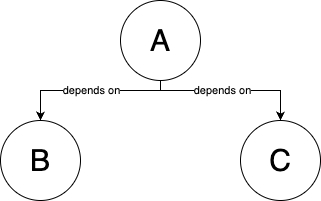
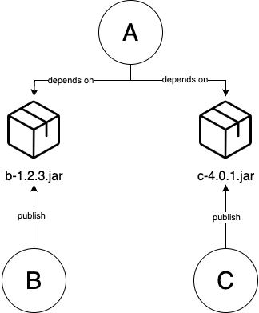
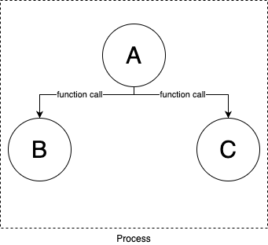
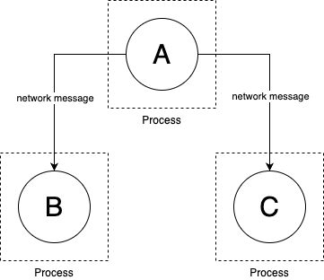

---
markmap:
  htmlParser:
    selector: h1,h2,h3,h4,h5,h6
---

# Chapter 6: How to Work with Multiple Teams and Environments

- CI/CD will allow developers work together efficiently and safety,

  - but as your company grows, there are other type of problems:

    - From _outside_ world: more **users** (more traffic/data/laws/regulations)
    - From _inside_ your company: more **developers/teams/products**
      👉 It's harder to code/test/deploy without hitting lots of bugs/outages/bottlenecks.

- These problems are problems of _scale_,

  - (good problems to have, which indicates your business is becoming more successful).

- The most common approach to solve these problem of scale is _divide and conquer_:

  - **Break up your deployments**: into multiple separated, isolated **environments**.
  - **Break up your codebase**: into multiple **libraries**, **(micro)services**

## Breaking Up Your Deployments

- In this book, you deploy everything - servers, Kubernetes, cluster, serverless functions, ... - into a single AWS account 👈 Fine for learning & testing
- In real world, it's common to have multiple deployment _environments_, each environment has its own set of _isolated_ infrastructure.

### Why Deploy Across Multiple Environments

#### Isolating Tests

- Typically, you need a way to test changes to your software

  - _before_ you expose those changes (to users)
  - in a way that limits the _blast radius_ (that affects users, production environment).

- You do that by deploying more environments that closely resemble production.

- A common setup is having 3 environments:

  - **Production**: the environment that is exposed to _users_.
  - **Staging**: a scaled-down clone of production that is exposed to inside your _company_.

    👉 The releases are staged in **staging** so other teams - e.g. QA - can test them.

  - **Development**: another scaled-down clone of production that is exposed to _dev team_.

    👉 Dev teams test code changes in **development** during _development_ process (before those changes make it to staging).

> [!TIP]
> These trio environments have many other names:
>
> - **Production**: `prod`
> - **Staging**: `stage`, `QA`
> - **Development**: `dev`

#### Isolating Products and Teams

- Larger companies often have multiple products and teams,

  - which may have different requirements in term of uptime, deployment frequency, security, compliance...

- It's common for each team/product to have its own isolated set of environments, so:

  - each team can customize to their own needs
  - limit the blast radius of each team/product
  - allows teams to work in isolated from each other (which may be good or bad!)

- e.g.

  - Search team have their software deployed in `search-dev`, `search-stage`, `search-prod` environments.
  - Profile team have their software deployed in `profile-dev`, `profile-stage`, `profile-prod` environments.

> [!IMPORTANT]
> Key takeaway #1
> Breaking up your deployment into multiple environments allows you to isolate tests from production and teams from each other.

#### Reducing Latency

- Data needs to travel from users's device to your servers and back.

  - This is measured with a _TCP packet round trip_ (from your server and user device) - aka _network latency_.

- Although these TCP packages is traveling at nearly the speed of light,

  - when you build software used across the globe

    - the speed of light is still not fast enough
    - this network latency may become the biggest bottleneck of your software.

      | Operation             | How much? | Where?                                          | Time  | in      | (μs)        | Notes  |
      | --------------------- | --------- | ----------------------------------------------- | ----- | ------- | ----------- | ------ |
      | Read (Random)         |           | from CPU cache (L1)                             | 0.001 |         |             |        |
      | Read (Random)         |           | from DRAM - main memory                         | 0.1   |         |             |        |
      | Compress with Snappy  | $1 KB$    |                                                 |       | 2       |             |        |
      | Read (Sequentially)   | $1 MB$    | from DRAM                                       |       | 3       |             |        |
      | Read (Random)         |           | from SSD - solid state disk                     |       | 16      |             |        |
      | Read (Sequentially)   | $1 MB$    | from SSD                                        |       | 49      |             |        |
      | TCP packet round trip | $1.5 KB$  | within same data-center                         |       | **500** |             | 0.5 ms |
      | Read (Random)         |           | from HDD - rotational disk                      |       |         | 2,000       |        |
      | Read (Sequentially)   | $1 MB$    | from HDD                                        |       |         | 5,000       |        |
      | TCP packet round trip | $1.5 KB$  | from California to New York<br/>(1 continent)   |       |         | **40,000**  | 40 ms  |
      | TCP packet round trip | $1.5 KB$  | from California to Australia<br/>(2 continents) |       |         | **183,000** | 183 ms |

- If you have users around the world,

  - you may run your software on server (and data center) that _geographically_ close to those users,
    - to reduce the _latency_[^1].

- e.g.
  - By having the servers in the same continent with your user,
    - the latency for each TCP package is reduced more than 100 ms.
  - when including the fact that most web page, application sends:
    - thousands of KB in size (across many requests)
    - this network latency can quickly add up.

#### Complying With Local Laws and Regulations

Some countries, industries, customers requires your environments be set up in a specific ways, e.g:

- In EU: GDPR[^6]
- Store/process credit card: PCI DSS[^4].
- Store/process healthcare information: HIPAA[^3], HITRUST[^2]
- US government: FedRAMP[^5]

A common pattern is to set up a dedicated, small environment for complying with laws & regulations.

e.g.

- `prod-pci`: meets all the PCI DSS requirements, and is used solely to run payment processing software
- `prod`: run all other software

#### Increasing Resiliency

- With only 1 environments, you can still have some level of resilient by having multiple servers. But all these servers can have a single point of failure (the data center that the environment is in).
- By having multiple environments in different data center around the world (e.g. `prod-us`, `prod-eu`, `prod-asia`), you can have a higher level of resilient.

### How to Set Up Multiple Environments

#### Logical Environments

logical environment
: an environment defined solely in software (i.e., through naming and permissions), whereas the underlying hardware (servers, networks, data centers) is unchanged

e.g.

- In Kubernetes, you can create multiple logical environments with namespaces.

> [!TIP]
> In Kubernetes, if you don't specify a namespace, the namespace `default` will be used.
>
> - To create a namespace, use `kubectl create`
>
>   ```bash
>   kubectl create namespace <NAME>
>   ```
>
> - Specify the namespace to `kubectl`'s sub-command, e.g.
>
>   ```bash
>   # deploy an app into the development environment
>   kubectl apply --namespace dev
>   # or deploy an app into the staging environment
>   kubectl apply --namespace stg
>   ```

#### Separate Servers

You set up each environment in a separate server.

e.g.

- (Instead of a single Kubernetes cluster for all environments)

- You deploy one Kubernetes cluster per environment
  - Deploy Kubernetes cluster `dev` in `dev-server`s
  - Deploy Kubernetes cluster `stg` in `stg-server`s

> [!TIP]
> You can go a step further by deploying control plane and worker nodes in separate servers.

#### Separate Networks

You can put the servers in each environment in a separate, isolated network.

e.g.

- The servers in `dev-env` can only communicate with other servers in `dev-env`.
- The servers in `stg-env` can only communicate with other servers in `stg-env`.

#### Separate Accounts

If you deploy into the clouds, you can create multiple accounts, each account for an environment.

> [!NOTE]
> By default, cloud "accounts" are completely isolated from each other, including: servers, networks, permissions...

> [!TIP]
> The term "account" can be different for each cloud provider:
>
> - AWS: _account_
> - Azure: _subscription_
> - Google Cloud: _project_

#### Separate Data Centers In The Same Geographical Region

If you deploy into the clouds, you can deploy environments in different data centers that are all in the same geographical region.

e.g.

- For AWS, there are `use1-az1`, `use1-az2`, `use1-az3`[^7]

> [!TIP]
> For AWs, data centers that are all in the same geographical region are called _Availability Zones_ - AZs

#### Separate Data Centers In Different Geographical Regions

If you deploy into the clouds, you can deploy environments in different data centers that are in the different geographical regions.

e.g.

- For AWS, there are `us-east-1`, `us-west-1`, `eu-west-1`, `ap-southeast-1`, `af-south-1`[^8]

> [!TIP]
> For AWS, different geographical regions are call _regions_.

### How Should You Set Up Multiple Environments

- Each approach to set up multiple environments has advantages and drawbacks.

- When choosing your approach, consider these dimensions:

  - What is the _isolated level_?

    ~ How isolated one environment is from another?

    - Could a bug in `dev-env` somehow affect `prod-env`.

  - What is the _resiliency_?

    ~ How well the environment tolerate an outage? A server, network, or the entire data center goes down?

  - Do you need to reduce latency to users? Comply with laws & regulations?

    ~ Only some approaches can do this.

  - What is the _operational overhead_?
    ~ What is the cost to set up, maintain, pay for?

### Challenges with Multiple Environments

#### Increased Operational Overhead

When you have multiple environments, there're a lot of works to set up and maintain:

- More servers
- More data centers
- More people
- ...

Even when you're using the clouds - which offload much of this overhead (into cloud providers) - creating & managing multiple AWS accounts still has its own overhead:

- Authentication, authorization
- Networking
- Security tooling
- Audit logging
- ...

#### Increased Data Storage Complexity

If you have multiple environments in different geographical regions (around the world):

- The latency between the data centers and users may be reduced,

  - but the latency between parts of your software running in these data centers will be increased.

- You may be forced to rework your **software architecture** completely, especially **data storage**.

---

e.g. A web app that needed to lookup data in a database before sending a response:

- When the database and the web app is in the same data center:

  ~ The network latency for each package round-trip is 0.5ms.

- When the database and the web app is in different data centers (in different geographical regions):

  ~ The network latency for each package round-trip is 183ms (366x increase), which will quickly add up for multiple packets.

- When the database and the web app is in different data centers (in different geographical regions), but the database is in the same region as the web app:

  ~ In other words, you have one database per region, which adds a lot to your data storage complexity:

  - How to generate primary keys?
  - How to look up data?
    - Querying & joining multiple databases is more complicated.
  - How to handle data consistency & concurrency?
    - Uniqueness constraints, foreign key constraints
    - Locking, transaction
  - ...

  ***

  To solve these data storage problems, you can:

  - Running the databases in _active/standby_ mode[^9], which may boost resiliency, but doesn't help with the origin problems (latency or laws, regulations).
  - Running the databases in _active/active_ mode[^10], which also solves the origin problems (latency or laws, regulations), but now you need to solve more problems about data storages.

> [!IMPORTANT]
> Key takeaway #2
> Breaking up your deployment into multiple regions:
>
> - allows you to reduce latency, increase resiliency, and comply with local laws and regulations,
> - but usually at the cost of having to rework your entire architecture.

#### Increased Application Configuration Complexity

- When you have multiple environments, you have many unexpected costs in configuring your environments.

- Each environment needs many different configuration:

  | Type of settings           | The settings                                                      |
  | -------------------------- | ----------------------------------------------------------------- |
  | Performance settings       | CPU, memory, hard-drive, garbage collection...                    |
  | Security settings          | Database passwords, API keys, TLS certifications...               |
  | Networking settings        | IP address/domain name, port...                                   |
  | Service discovery settings | The networking settings to use for other services you reply on... |
  | Feature settings           | Feature toggles...                                                |

- Pushing configuration changes is just as risky as pushing code changes (pushing a new binary), and the longer a system has been around, the more configuration changes tend to become the dominant cause of outages.

  > [!TIP]
  > Configuration changes are one of the biggest causes of outages at Google[^11].
  >
  > | Cause                  | Percent of outages |
  > | ---------------------- | ------------------ |
  > | Binary push            | 37%                |
  > | Configuration push     | 31%                |
  > | User behavior change   | 9%                 |
  > | Processing pipeline    | 6%                 |
  > | Service provider chang | 5%                 |
  > | Performance decay      | 5%                 |
  > | Capacity management    | 5%                 |
  > | Hardware               | 2%                 |

  > [!IMPORTANT]
  > Key takeaway #3
  > Configuration changes are just as likely to cause outages as code changes.

---

##### How to configure your application

- There a 2 methods of configuring application:

  - At build time: configuration files checked into version control (along with the source code of the app).

    > [!NOTE]
    > When checked into version control, the configuration files can be:
    >
    > - In the same language as the code, e.g. Ruby...
    > - In a language-agnostic format, e.g. JSON, YAML, TOML, XML, Cue, Jsonnet, Dhall...

  - At run time: configuration data read from a data store (when the app is booting up or while it is running).

    > [!NOTE]
    > When stored in a data store, the configuration files can be stored:
    >
    > - In a general-purpose data store, e.g. MySQL, Postgres, Redis...
    > - In a data store specifically designed for configuration data, e.g. Consul, etcd, Zookeeper...

    > [!TIP]
    > The data store specifically designed for configuration data allows updating your app quickly when a configuration changed
    >
    > - Your app subscribes to change notifications.
    > - Your app is notified as soon as any configuration changes.

- In other words, there 2 types of configuration:

  - Build-time configuration.
  - Run-time configuration.

---

- You should use build-time configuration as much as possible:

  Every build-time configuration is checked into version control, get code reviewed, and go through your entire CI/CD pipeline.

- Only using run-time configuration when the configuration changes very frequently, e.g. service discovery, feature toggles.

### Example: Set Up Multiple Environments with AWS Accounts

> [!NOTE]
> IAM and environments
>
> - IAM has no notion of environments
>
>   Almost everything in an AWS account is managed via API calls, and by default, AWS APIs have no first-class notion of environments, so your changes can affect anything in the entire account.
>
> - IAM is powerful
>   - You can use various IAM features - such as tags, conditions, permission boundaries, and SCPs - to create your own notion of environments and enforce isolation between them, even in a single account.
>   - However, to be powerful, IAM is very complicated. Teams can mis-use IAM, which leads to disastrous results.

> [!NOTE]
> The recommend way to organize multiple AWS environments is using multiple AWS accounts[^12]:
>
> - You use _AWS Organizations_ to create and manage your AWS accounts,
>   - with one account at the root of the organization, called the _management account_,
>   - and all other accounts as _child accounts_ of the root.
>
> e.g.
>
> - An AWS organization with one management account (`management`), and 3 child accounts (e.g., `dev`, `stage`, `prod`)
>
>   

> [!TIP]
> Using multiple AWS accounts gives you isolation between environments _by default_, so you’re much less likely to get it wrong.

---

#### Create child accounts

In this example, you will

1. Treat the initial AWS account as the _management account_

   > [!CAUTION]
   > The management account should only be used to create & manage other AWS accounts.

2. Configure initial account as the management account of an AWS Organization.

3. Use AWS Organizations to create 3 other accounts as _child accounts_ (for `dev`, `stage`, `prod`).

---

To treat the initial AWS account as the management account, you need to undeploy everything deployed in earlier chapters:

- Run `tofu destroy` on any OpenTofu modules previously deployed.
- Use EC2 Console to manually undeploy anything deployed via Ansible, Bash...

---

- The code for this example (the OpenTofu `child-accounts` root module) will be in `tofu/live/child-accounts` folder:

  ```bash
  mkdir -p ch6/tofu/live/child-accounts
  cd ch6/tofu/live/child-accounts
  ```

  > [!TIP]
  > Under the hood, the root module will use the OpenTofu module `aws-organizations` in the sample code repo at `ch6/tofu/modules/aws-organizations` folder.

- The OpenTofu module `main.tf`

  ```t
  # examples/ch6/tofu/live/child-accounts/main.tf
  provider "aws" {
    region = "us-east-2"
  }

  module "child_accounts" {
    # (1)
    source = "github.com/brikis98/devops-book//ch6/tofu/modules/aws-organization"

    # (2) Set to false if you already enabled AWS Organizations in your account
    create_organization = true


    # (3) TODO: fill in your own account emails!
    dev_account_email   = "username+dev@email.com"
    stage_account_email = "username+stage@email.com"
    prod_account_email  = "username+prod@email.com"
  }
  ```

  - (1): Use the `aws-organization` module.
  - (2): Enable AWS Organizations before using it.
  - (3): Fill in root user's email address for `dev`, `stage`, `prod` accounts.

    > [!TIP]
    > If you're using Gmail, you can create multiple aliases for a a single email address by using plus sign (`+`).

- Proxy output variables from the `aws-organization` module

  ```t
  # examples/ch6/tofu/live/child-accounts/outputs.tf

  # (1)
  output "dev_account_id" {
    description = "The ID of the dev account"
    value       = module.child_accounts.dev_account_id
  }

  output "stage_account_id" {
    description = "The ID of the stage account"
    value       = module.child_accounts.stage_account_id
  }

  output "prod_account_id" {
    description = "The ID of the prod account"
    value       = module.child_accounts.prod_account_id
  }

  # (2)
  output "dev_role_arn" {
    description = "The ARN of the IAM role you can use to manage dev from management account"
    value       = module.child_accounts.dev_role_arn
  }

  output "stage_role_arn" {
    description = "The ARN of the IAM role you can use to manage stage from management account"
    value       = module.child_accounts.stage_role_arn
  }

  output "prod_role_arn" {
    description = "The ARN of the IAM role you can use to manage prod from management account"
    value       = module.child_accounts.prod_role_arn
  }
  ```

  - (1): The IDs of created accounts
  - (2): The IAM role's ARN used to manage child accounts from management account.

- Deploy `child-accounts` module

  ```bash
  tofu init
  tofu apply
  ```

#### Access your child accounts

To access child accounts, you need to assume the **IAM role** that has permission to access them (`OrganizationAccountAccessRole`).

To assume the IAM role `OrganizationAccountAccessRole`, you can use:

- AWS Web Console:

  - Click your username / Choose `Switch role`
  - Enter the information to switch role:
    - account ID
    - IAM Role
    - display name
    - display color
  - Click `Switch role`

- Terminal:

  One way to assume IAM role in the terminal is to configure an _AWS profile_ (in the _AWS config file_) for each child account.

  > [!TIP]
  > The _AWS config file_ is default at `~/.aws/config`

  e.g. To assume IAM role for `dev` child account:

  - Create an AWS profile named `dev-admin`

    ```toml
    [profile dev-admin]                                           # (1)
    role_arn=arn:aws:iam::<ID>:role/OrganizationAccountAccessRole # (2)
    credential_source=Environment                                 # (3)
    ```

    - (1): The AWS profile will be named `dev-admin`.
    - (2): The IAM role that this profile will assume.
    - (3): Use the environment variable as credential source.

  - Specify the profile when you use AWS CLI with `--profile` argument

    e.g. Use `aws sts get-caller-identity` command to get the identity of the `dev-admin` profile

    ```bash
    aws sts get-caller-identity --profile dev-admin
    ```

#### Deploy into your child accounts

Now you will re-deploy the `lambda-sample` module into `dev`, `stage`, `prod` accounts.

- Copy the `lambda-sample` module (and its dependency `test-endpoint` module) from chapter 5

  ```bash
  cd fundamentals-of-devops/examples
  mkdir -p ch6/tofu/live
  cp -r ch5/tofu/live/lambda-sample ch6/tofu/live
  mkdir -p ch6/tofu/modules
  cp -r ch5/tofu/modules/test-endpoint ch6/tofu/modules
  ```

- Update to copied module to use new path

  ```t
  # ch6/tofu/live/lambda-sample/backend.tf
      key = "ch6/tofu/live/lambda-sample"
  ```

- Add support for AWS profiles

  ```t
  # ch6/tofu/live/lambda-sample/variables.tf
  variable "aws_profile" {
    description = "If specified, the profile to use to authenticate to AWS."
    type        = string
    default     = null
  }
  ```

  ```t
  # ch6/tofu/live/lambda-sample/main.tf
  provider "aws" {
    region  = "us-east-2"
    profile = var.aws_profile
  }
  ```

  > [!NOTE]
  > Later, you will specify the AWS profile via `-var aws_profile=XXX` flag when running `tofu apply`.

- Dynamically show the environment name

  - Update the Lambda function to response with the environment name

    ```javascript
    // examples/ch6/tofu/live/lambda-sample/src/index.js
    exports.handler = (event, context, callback) => {
      callback(null, {
        statusCode: 200,
        body: `Hello from ${process.env.NODE_ENV}!`,
      });
    };
    ```

  - Dynamically set the `NODE_ENV` to the value of `terraform.workspace`

    ```t
    # examples/ch6/tofu/live/lambda-sample/main.tf
    module "function" {
      source = "github.com/brikis98/devops-book//ch3/tofu/modules/lambda"

      # ... (other params omitted) ...

      environment_variables = {
        NODE_ENV = terraform.workspace
      }
    }
    ```

    > [!NOTE]
    > What is OpenTofu workspace?
    >
    > ***
    >
    > - In OpenTofu, you can use _workspaces_ to manage
    >
    >   - **multiple deployments** of the same configuration.
    >
    > - Each workspace:
    >
    >   - has its own state file
    >   - represents a separate copy of all the infrastructure
    >   - has a unique name (returned by `terraform.workspace`)
    >
    > - If you don't specify a workspace explicitly, you end up using a workspace called `default`.

- (Optional) Authenticate to your management account

- Initialize the OpenTofu module

  ```bash
  cd examples/ch6/tofu/live/lambda-sample
  tofu init
  ```

- Create a new workspace for `dev` environment and deploy the environment to the `dev` account:

  - Create workspace

    ```bash
    tofu workspace new development
    ```

  - Deploy infrastructure and the lambda function

    ```bash
    tofu apply -var aws_profile=dev-admin
    ```

  - Verify that the lambda function works

    ```bash
    curl <DEV_URL>
    ```

- Do the same for `stage` and `prod` environments

  ```bash
  tofu workspace new stage
  tofu apply -var aws_profile=stage-admin
  curl <STAGE_URL>
  ```

  ```bash
  tofu workspace new production
  tofu apply -var aws_profile=prod-admin
  curl <PROD_URL>
  ```

- Congratulation, you have three environments, across three AWS accounts, with a separate copy of the serverless webapp in each one, and the OpenTofu code to manage it all.

#### Use different configurations for different environments

In this example, to have different configurations for different environments, you'll use JSON configuration files checked into version control.

- Create a folder called `config` for the configuration files

  ```bash
  mkdir -p src/config
  ```

- Create configs for the each environment:

  - Dev: `ch6/tofu/live/lambda-sample/src/config/development.json`

    ```json
    {
      "text": "dev config"
    }
    ```

  - Stage: `ch6/tofu/live/lambda-sample/src/config/stage.json`

    ```json
    {
      "text": "stage config"
    }
    ```

  - Production: `ch6/tofu/live/lambda-sample/src/config/production.json`

    ```json
    {
      "text": "production config"
    }
    ```

- Update the lambda function to load the config file (of the current environment) and return the `text` value in the response:

  ```javascript
  // examples/ch6/tofu/live/lambda-sample/src/index.js

  const config = require(`./config/${process.env.NODE_ENV}.json`); // (1)

  exports.handler = (event, context, callback) => {
    callback(null, { statusCode: 200, body: `Hello from ${config.text}!` }); // (2)
  };
  ```

  - (1): Load the config file (of the current environment).
  - (2): Response with the `text` value from the config file.

---

- Deploy the new configurations (of each environment) in each workspace (AWS account):

  - Switch to an OpenTofu workspace

    ```bash
    tofu workspace select development
    ```

  - Run the OpenTofu commands with the corresponding AWS profile

    ```bash
    tofu apply -var aws_profile=dev-admin
    ```

- Repeat for the other environments.

  > [!TIP]
  > To see all OpenTofu workspaces, use the `tofu workspace list` command.
  >
  > ```bash
  >  $ tofu workspace list
  >    default
  >    development
  >    staging
  >  * production
  > ```

#### Close your child accounts

> [!CAUTION]
> AWS doesn't charge you extra for the number of the child accounts, but it DOES charge you for the resources running in those accounts.
>
> - The more child accounts you have, the more chance you accidentally leave resources running.
> - Be safe and close any child accounts that you don't need.

- Undeploy the infrastructure in each workspace (corresponding to an AWS account):

  - For `dev`:

    ```bash
    tofu workspace select development
    tofu destroy -var aws_profile=dev-admin
    ```

  - For `stage`:

    ```bash
    tofu workspace select stage
    tofu destroy -var aws_profile=stage-admin
    ```

  - For `prod`

    ```bash
    tofu workspace select production
    tofu destroy -var aws_profile=prod-admin
    ```

- Run `tofu-destroy` on the `child-accounts` module to closing the child accounts

  ```bash
  cd ../child-accounts
  tofu destroy
  ```

  > [!TIP]
  > The destroy may fail if you create a new AWS with the OpenTofu module.
  >
  > - It's because an AWS Organization cannot be disabled until all of its child accounts are closed.
  > - Wait 90 days then re-run the `tofu destroy`.

> [!NOTE]
> When you run close an AWS account:
>
> - Initially, AWS will suspense that account for 90 days,
>
>   This gives you a chance to recover anything you may have forgotten in those accounts before they are closed forever.
>
> - After 90 days, AWS will automatically close those accounts.

### Get Your Hand Dirty: Manage Multiple AWS accounts

- The child accounts after created will not have a password:

  - Go through the root user password [reset flow] to "reset" the password.
  - Then enable [MFA] for the root user of child account.

- As a part of multi-account strategy,

  - in additional to _workload accounts_ (`dev`, `stage`, `prod`)
  - AWS recommends several _foundation accounts_, e.g. log account, backup account...

  Create your own aws-organizations module to set up all these foundational accounts.

- Configure the `child-accounts` module to store its state in an S3 backend (in the management account).

### Get Your Hand Dirty: Managing multiple environments with OpenTofu and AWS

- Using workspaces to manage multiple environments has some drawbacks, see [this blog post][how-to-manage-multiple-environments-with-terraform] to learn about

  - these drawbacks
  - alternative approaches for managing multiple environments, e.g. Terragrunt, Git branches.

- Update the CI/CD configuration to work with multiple AWS accounts

  You’ll need to

  - create OIDC providers and IAM roles in each AWS account
  - have the CI/CD configuration authenticate to the right account depending on the change
  - configure, e.g.
    - Run `tofu test` in the `development` account for changes on any branch
    - Run `plan`, `apply` in the `staging` account for any PR against `main`
    - Run `plan`, `apply` in the `production` account whenever you push a Git tag of the format `release-xxx`, e.g. `release-v3.1.0`.

## Breaking Up Your Codebase

### Why Break Up Your Codebase

#### Managing Complexity

> Software development doesn’t happen in a chart, an IDE, or a design tool; it happens in your head.
>
> (Practices of an Agile Developer)

- Once a codebase gets big enough:

  - no one can understand all of it
  - if you need to deal with all of them at once:
    - your pace of development will slow to a crawl
    - the number of bugs will explode

- According to Code Completion:

  - Bug density in software projects of various sizes

    | Project size (lines of code) | Bug density (bugs per 1K lines of code) |
    | ---------------------------- | --------------------------------------- |
    | < 2K                         | 0 – 25                                  |
    | 2K – 6K                      | 0 – 40                                  |
    | 16K – 64K                    | 0.5 – 50                                |
    | 64K – 512K                   | 2 – 70                                  |
    | > 512K                       | 4 – 100                                 |

  - Larger software projects have more bugs and a higher bug density

- The author of Code Completion defines "managing complexity" as "the most important technical topic in software development."

---

- The basic principle to manage complexity is _divide and conquer_:

  - So you can focus on one small part at a time, while being able to _safely_ ignore the rest.

> [!TIP]
> One of the main goals of most software abstractions (object-oriented programming, functional programming, libraries, microservices...) is to break-up codebase into discrete pieces.
>
> Each piece
>
> - hide its implementation details (which are fairly complicated)
> - expose some sort of interface (which is much simpler)

#### Isolating Products And Teams

As your company grows, different teams will have different development practices:

- How to design systems & architecture
- How to test & review code
- How often to deploy
- How much tolerance for bugs & outages
- ...

If all teams work in a single, tightly-coupled codebase, a problem in any team/product can affect all the other teams/product.

e.g.

- You open a pull request, there is an failed automated test in some unrelated product. Should you be blocked from merging?
- You deploy new code that includes changes to 10 products, one of them has a bug. Should all 10 products be roll-backed?
- One team has a product in an industry where they can only deploy once per quarter. Should other teams also be slow?

By breaking up codebase, teams can

- work _independently_ from each other
  - teams are now interact via a well-defined interfaces, e.g. API of a library/web service
- have total ownership of their part of the product

> [!TIP]
> These well-defined interfaces allows everyone to
>
> - benefit from the _outputs_ of a team, e.g. the data return by they API
> - without being subject about the _inputs_ they need to make that possible

#### Handling Different Scaling Requirements

Some parts of your software have different scaling requirements than the other parts.

e.g.

- A part benefit from distributing workload across a large number of CPUs on many servers.
- Another part benefits from a large amount of memory on a single server

If everything is in one codebase and deployed together, handling these different scaling requirements can be difficult.

#### Using Different Programming Languages

Most companies start with a single programming language, but as you grow, you may end up using multiple programming languages:

- It may be a personal choice of a group of developers.
- The company may acquire another company that uses a different language.
- A different language is a better fit for different problems.

For every new language,

- you have a new app to deploy, configure, update...
- your codebase consists of multiple tools (for each languages)

### How to Break Up Your Codebase

#### Breaking A Codebase Into Multiple Libraries

- Most codebase are broken up into various abstractions - depending on the programming language - such as functions, interfaces, classes, modules...

- If the codebase get big enough, it can be broken up even further into _libraries_.

---

A library

- is a unit of code that can be _developed independently_ from other units

- has these properties:

  1. A library exposes a **well-defined API** to the outside world

     - A well defined API is an an interface with well-defined inputs/outputs.

     - The code from the outside world can interact with the library only via this well-defined API.

  1. A library implementation can be developed independently from the rest of the codebase

     - The implementation - the internal - of the library are hidden from the outside world
       - can be developed independently (from other units and the outside world)
       - as long as the library still fulfills its promises (the interface)

  1. You can only depend on _versioned artifact_ produced by a library, without directly depending on its source code

     The exact type of artifact depends on a programming language, e.g.

     - Java: a `.jar` file
     - Ruby: a Ruby Gem
     - JavaScript: an npm package

     As long as you use artifact dependencies, the underlying source code can live in anywhere:

     - In a single repo, or
     - In multiple repos (more common for library)

---

Example of a codebase before and after break up:

| Before break up                                            | Break up                                                                      | After break up                                              |
| ---------------------------------------------------------- | ----------------------------------------------------------------------------- | ----------------------------------------------------------- |
|  |                                                                               |     |
| A codebase with 3 parts: A, B, C                           | Turn B, C into libraries that publish artifacts , e.g. `a.jar`, `b.jar` files | Update A to depend on a specific version of these artifacts |
| Part A depends directly on source code of B and C          |                                                                               | Part A depends on artifacts published by libraries B and C  |

---

The advantage of breaking up codes base into libraries:

- Managing complexity
- Isolating teams/products
  - The team that develope a library can work independently (and publish versioned artifact)
  - The other teams that use that library
    - instead of being affects immediately by any code changes (from the library)
    - can explicitly choose to pull the new versioned artifact

> [!IMPORTANT]
> Key takeaway #4
> Breaking up your codebase into libraries allows developers to focus on one smaller part of the codebase at a time.

##### Best practices to break a codebase into multiple libraries

###### Sematic versioning

Semantic versioning (SemVer)
: What? A set of rules for how to assign version numbers to your code
: Why? Communicate (to users) if a new version of your library has _backward **incompatible** changes_[^13]

---

With SemVer:

- you use the version numbers of the format `MAJOR.MINOR.PATCH`, e.g. `1.2.3`

- you increment these 3 parts of the version number as follows:

  - Increment the `MAJOR` version when you make _incompatible_ API changes.

  - Increment the `MINOR` version when you add **functionality** in a backward _compatible_ manner.

  - Increment the `PATCH` version when you make backward _compatible_ **bug fixes**.

---

e.g. Your library is currently at version `1.2.3`

- If you've made a backward incompatible change to the API -> The next release would be `2.0.0`
- If you've add functionality that is backward compatible -> The next release would be `1.3.0`
- If you've made a backward compatible bug fix -> The next release would be `1.2.4`

> [!NOTE]
> With SemVer:
>
> - `1.0.0` is typically seen as the first `MAJOR` version (first backward compatible release)
> - `0.x.y` is typically used by new software to indicate incompatible change (breaking change) may be introduced anytime.

###### Automatic updates

Automatic updates
: What? A way to keep your dependencies up to date
: Why? When using a library, you can explicitly specify a version of library:
: - This give you the control of when to use a new version.
: - But it's also easy to forget to update to a new version and stuck with an old version - which may have bugs or security vulnerabilities - for months, years.
: - If you don't update for a while, updating to the latest version can be difficult, especially if there any many breaking changes (since last update).

---

This is another place where, if it hurst, you need to do it more often:

- You should set up an automatically process where

  - dependencies are updated to source code
  - the updates are rolled out to production (aka _software patching_ [^14])

- This applies to all sort of dependencies - software you depend on - including:

  - open source libraries
  - internal libraries
  - OS your software runs on
  - software from cloud providers (AWS, GCP, Azure...)

- You can setup the automation process

  - to run:

    - on a schedule, e.g. weekly
    - in response to new versions being released

  - using tools: [DependaBot], [Renovate], [Snyk], [Patcher]

    These tools will

    - detect dependencies in your code
    - open pull requests to update the code to new versions

    You only need to:

    - check that these pull requests pass your test suite
    - merge the pull requests
    - (let the code deploy automatically)

#### Breaking A Codebase Into Multiple Services

| Before                                                                 | After                                                         |
| ---------------------------------------------------------------------- | ------------------------------------------------------------- |
|               |        |
| Codebase are broken up into source code, library/artifact dependencies | Codebase are broken up into separate services                 |
|                                                                        |                                                               |
| All the parts of the codebase                                          | Each part of the codebase (a service):                        |
| - run in a single process                                              | - runs in a separate process (typically on a separate server) |
| - communicate via in-memory function calls                             | - communicates by sending messages over the network           |

---

A service has all properties of a library:

- It exposes a well-defined API to the outside world
- Its implementation can be developed independently of the rest of the codebase
- It can be deployed independently of the rest of the codebase

with an additional property:

- You can only talk to a service via messages over the network (via messages)

---

There are many approaches to build services:

| Approach to build services          | How                                                                                            | Example                                                                                                          |
| ----------------------------------- | ---------------------------------------------------------------------------------------------- | ---------------------------------------------------------------------------------------------------------------- |
| Service-oriented architecture (SOA) | Build large services that handle all the logic for an entire business/product within a company | API exposed by companies - aka _Web 2.0_ <br/>e.g. Twitter, Facebook, Google Map...                              |
| Microservices                       | Build smaller, more fine-grain services that handle one domain within a company                | - One service to handle user profiles<br/>- One service to handle search<br/>- One service to do fraud detection |
| Event-driven architecture           | Instead of interacting _synchronously_[^15], services interact _asynchronously_[^16]           |                                                                                                                  |

---

The advantages of breaking a codebase into services:

- **Isolating teams**

  Each service is usually owned by a different team.

- **Using multiple programming languages**

  - For each service, you can pick the programming language that are best fit for a certain problem/domain.
  - It's also easier to integrate code bases from acquisitions & other companies (without rewrite all the code).

- **Scaling services independently**

  e.g. You can:

  - Scale one service _horizontally_ (across multiple servers as CPU load goes up)
  - Scale another service _vertically_ (on a single server with large amount of RAM)

---

> [!IMPORTANT]
> Key takeaway #5
> Breaking up your codebase into services allows different teams to own, develop, and scale each part independently.

### Challenges with Breaking Up Your Codebase

> [!CAUTION]
> In recent years, it became trendy to break up a codebase, especially into microservices, almost to the extent where "monolith" became a dirty word.
>
> - At a certain scale, moving into services is inevitable.
> - But until you get to that scale, a monolith is a _good thing_

#### Challenges With Backward Compatibility

> [!NOTE]
> Libraries and services consist of 2 parts:
>
> - The public API.
> - The internal implementation detail.

When breaking up your codebase:

- the internal implementation detail can be changed much more quickly 👈 each team can have full control of it
- but the public API is much more difficult to be changed 👈 any breaking changes can cause a lot of troubles for the users

---

e.g. You need to change a function's name from `foo` to `bar`

| `B` is part of your codebase                                            | `B` is a library                                                | `B` is a service                                                                                                                                                               |
| ----------------------------------------------------------------------- | --------------------------------------------------------------- | ------------------------------------------------------------------------------------------------------------------------------------------------------------------------------ |
|                                                                         | 1. Discuss with your team if you really need a breaking change  | 1. Discuss with your team if you really need a breaking change                                                                                                                 |
| 1. In `B`, rename `foo` to `bar`                                        | 2. In `B`, rename `foo` to `bar`                                | 2. Add new version of your API and/or new endpoint that has `bar`                                                                                                              |
|                                                                         |                                                                 |    - Don't remove `foo` yet                                                                                                                                                    |
|                                                                         | 3. Create a new release of B:                                   | 3. Deploy the new version of your service that has both `foo` and `bar`                                                                                                        |
|                                                                         |    - Update the `MAJOR` version number                          | 4. Notify all users                                                                                                                                                            |
|                                                                         |    - Add release notes with migration instructions              |    - Update your docs to indicate there is a new `bar` endpoint and that `foo` is deprecated                                                                                   |
|                                                                         | 4. Other teams choose when to update the new version:           | 5. You wait for every team to switch from `foo` to `bar` in their code and to deploy a new version of their service.                                                           |
|                                                                         |    - It's a breaking change, they'll wait longer before update. |                                                                                                                                                                                |
|                                                                         |    - They decide to upgrade                                     |                                                                                                                                                                                |
| 2. Find all usages of `foo` (in the same codebase) and rename to `bar`. |    - They all usages of `foo` and rename to `bar`               |                                                                                                                                                                                |
|                                                                         |                                                                 |    - You might even monitor the access logs of `B` to see if the `foo` endpoint is still being used, identify the teams responsible, and bargain with them to switch to `bar`. |
|                                                                         |                                                                 |    - Depending on the company and competing priorities, this could take weeks or months.                                                                                       |
|                                                                         |                                                                 | 6. At some point, if usage of `foo` goes to zero, you can finally remove it from your code, and deploy a new version of your service.                                          |
|                                                                         |                                                                 |    - Sometimes, especially with public APIs, you might have to keep the old foo endpoint forever.                                                                              |
| 3. Done.                                                                | 5. Done                                                         | 7. Done                                                                                                                                                                        |

> [!TIP]
> You may spend a lot of time over your public API design.
>
> - But you'll never get it exactly right
> - You'll always have to evolve it overtime.
>
> Public API maintenance is always a cost of breaking up your codebase.

#### Challenges With Global Changes

When breaking up your codebase, any _global_ changes - changes that require updating multiple libraries/services - become considerably harder.

---

e.g.

- LinkedIn stared with a single monolithic application, written in Java, called Leo.

- Leo became bottleneck to scaling (more developers, more traffic).

- Leo is broken into libraries/services.

  - Each team was able to iterate on features within their libraries/services much faster.
  - But there are also global changes.

- Almost every single service relied on some security utilities in a library called `util-security.jar`.

- When a vulnerability in that library was found, rolling out new version to all services took an enormous effort:

  1. A few developers is assigned to lead the effort
  1. They dig through dozens of services (in different repos) to find all services that depends on `util-security.jar`
  1. They update each of those services to new version, which can:
     - be a simple version number bump.
     - require a number of changes throughout the service's code base to upgrade through many breaking changes.
  1. They open pull request, wait for code reviews (from many teams) and prodding each team.
  1. The code is merged; then they have to bargain with each team to deploy their service.
  1. Some of the deployments have bugs or cause outages, which requires: rolling back, fixing issues, re-deploying.

> [!IMPORTANT]
> Key takeaway #6
> The trade-off you make when you split up a codebase is that you are optimizing for being able to make changes much faster within each part of the codebase, but this comes at the cost of it taking much longer to make changes across the entire codebase.

#### Challenges With Where To Split The Code

If you split the codebase correctly:

- Changes done by each team are within their own part of the codebase, which
  - allows each team to go much faster.

If you split the codebase wrong,

- Most changes are global changes, which
  - makes you go much slower.

> [!CAUTION]
> When to break up a codebase?
>
> ---
>
> Don't split the codebase too early
>
> - It's easy to identify the "seam" in a codebase that has been around for a long time.
> - It's hard to predict/guess in a totally new codebase.

---

Some hints for where the codebase could be split:

- **Files that change together**

  e.g.

  - Every time you make a change of type `X`, you update a group of files `A`
  - Every time you make a change of type `Y`, you update a group of files `B`

  Then `A` and `B` are good candidates to be broken out into separate libraries/services.

- **Files that teams focus on**

  e.g.

  - 90% of the change by team `Z` are in a group of files `C`
  - 90% of the change by team `W` are in a group of files `D`

  Then `C` and `D` are good candidates to be broken out into separate libraries/services.

- **Parts that could be open sourced our outsourced**

  If you could envision a part of your codebase that would be:

  - a successful, standalone open source project
  - exposed as as successful, standalone APIs

  then that part is a good candidate to be broken into a library/service.

- **Performance bottlenecks**

  e.g.

  - If 90% of the time it takes to serve a request is spent in part `E` of your code,
    - and it's most limited by RAM
      then part E is a good candidate to be broken out in to a service (to be scaled vertically).

> [!CAUTION]
> Don't try to predict any of these hints! Especially for performance bottlenecks[^17].
>
> ---
>
> The only way to know where to split the code is:
>
> - Start with a monolith[^19]
> - Grow it as far as you can
> - Only when you can scale it any further, then break it up into smaller pieces

#### Challenges With Testing And Integration

> [!CAUTION]
> Breaking up a codebase into libraries/services is the opposite of continuous integration.

When you've break up your codebase, you choose to

- allow teams to work more independently from each other
- in the cost of doing late integration (instead of continuous integration)

So only break up those parts that are truly decoupled, independent from other parts.

> [!WARNING]
> If you split up the parts are tightly coupled, there would be many problems.
>
> Teams will try to
>
> - work independently, and not doing much testing and integration with other teams...
> - or integrate all the time and make a lot of global changes...

> [!IMPORTANT]
> Key takeaway #7
> Breaking up a codebase into multiple parts means you are choosing to do late integration instead of continuous integration between those parts, so only do it when those parts are truly independent.

#### Dependency Hell

If you break up your codebase into libraries, you may face dependency hell:

- **Too many dependencies**

  If you depends on dozens of libraries

  - each library depends of dozens more libraries
    - each library depends of dozens more libraries
      - ...

  Then only to download all your dependencies can take up a lot of time, disk space & bandwidth.

- **Long dependency chains**

  e.g.

  - Library `A` depends on `B`
    - `B` depends on `C`
      - ...
        - `X` depends on `Y`
          - `Y` depends on `Z`
  - If you need to make an important security patch to `Z`, how to roll it out to `A`?
    - Update `Z`, release new version for `Z`
      - Update `Y`, release new version for `Y`
        - ...
          - Update `B`, release new version for `B`
            - Update `A`, release new version for `A`

- **Diamond dependencies**

  e.g.

  - `A` depends on `B`, `C`
    - `B` depends on `D` (at `1.0.0`)
    - `C` depends on `D` (at `1.0.0`)
  - Then you upgrade `C`:
    - `B` still depends on `D` at `1.0.0`
    - `C` now depends on `D` at `2.0.0`

  You can't have 2 conflicts versions of `D` at onces, now you're stuck unless:

  - `B` upgrade `D` to `2.0.0`
  - or you can't upgrade `C`

#### Operational Overhead

- Each application need its own mechanism for software delivery: CI/CD pipeline, testing, deployment, monitoring, configuration...

- If you split up a monolith into services that

  - using the **same** programming language, each services needs its own CI/CD pipelines... for delivery. In other words, there will be many duplications, which means more operation overhead.
  - using **different** programming languages, each services needs its own CI/CD pipelines that are completely different, which means even more operational overhead.

#### Dependency Overhead

With $N$ services,

- you have $N$ services to deploy & manage.
- but there are also the interactions between those services, which grows at a rate of $N^2$.

---

e.g.

- Service `A` depends on service `B`

  - Add endpoint `foo` to `B` (`B` at version `v2`)
  - Update the code in `A` to make calls to `foo` endpoint (`A` at version `v2`)

- When to deploy `A` v2 and `B` v2?

  - If `A` v2 is deployed before `B` v2, `A` may try to call `foo` endpoint, which cause a failure (because `B` v1 doesn't have the `foo` endpoint yet)
  - `B` MUST be deployed before `A` 👈 This is called _deployment ordering_

- `B` itself may depend on services `C` and `D` and so on...

  - Now you need to have a _deployment graph_ to ensure the right services are deployed in the right order.

- If service `C` has a bug, you need to:

  - rollback `C`
  - rollback the services that depends on `C` and so on...
  - things become so much messy

---

> [!TIP]
> Deployment ordering can be avoided if
>
> - the services are written in a way that they can be deployed/rolled back in any order & at any time.
>
>   - one way to do that is use feature flags.
>
> e.g.
>
> - Service `A` depends on service `B`
>   - Add endpoint `foo` to `B` (`B` at version `v2`)
> - Update the code in `A` to make calls to `foo` endpoint (`A` at version `v2`)
>   - Wrap that code in an if-statement which is off by default 👈 The new functionality is wrapped in a feature flag.
> - Now `A` and `B` can be deployed in at any order & at any time
>   - When you're sure both the new versions of `A` and `B` are deployed, then you turn the feature toggle on.
>     - Everything should start working.
>   - If there is any issue with `A` or `B` (or any of their dependencies), you turn the feature toggle off, then roll back the services.

#### Debugging Overhead

- If you have dozens of services, and users report a bug:

  - You have to investigate to figure out which service is at fault.

- To track down a bug across dozens of services can be a nightmare:

  |                       | Monolith                                                                   | Services                                                                                          |
  | --------------------- | -------------------------------------------------------------------------- | ------------------------------------------------------------------------------------------------- |
  | Logs                  | In a single place/format                                                   | In different places/formats                                                                       |
  | How to reproduce bug? | Run a single app locally                                                   | Run dozens of services locally                                                                    |
  | How to debug?         | Hook a debugger (to a single process) and go through the code step-by-step | Use all sorts of tracing tools to identify dozens of processes (that processing a single request) |
  | How long to debug?    | A bug that take an hour to figure out                                      | The same bug could takes weeks to track down                                                      |

- Even if you you figure out the service at fault, there are still other problems:
  - Each team will immediately blame other teams, because no one want to take ownership the bug.
  - Your services are communicate over the network, there are a lot of new, complicated failure conditions that are tricky to debug.

#### Infrastructure Overhead

When you have multiple services:

- In additional to deploy the services themselves
- You need to deploy a lot of extra infrastructure to support the services.
  - The more services you have, the more infrastructure you need to support them.

e.g. To deploy 12 services, you may also need to deploy:

- an orchestration tool, e.g. Kubernetes
- a service mesh tool, e.g. Istio 👈 To help services communicate more securely
- an event bus, e.g. Kafka
- a distributed tracing tool, e.g. Jaeger 👈 To help with debugging & monitoring
  - (You also need to integrate a tracing library - e.g. OpenTracing - to all services)

#### Performance Overhead

When you breaking your codebase into services:

- the performance may be _improved_ 👈 you can [handle different scaling requirements](#handling-different-scaling-requirements) by horizontally or vertically scaling some parts of your software.
- or the performance may also be _worse_.

  This is due to:

  - **Networking overhead**

    | Operation             | How much? | Where?                                          | Time  | in    | $μs$      | Notes    |
    | --------------------- | --------- | ----------------------------------------------- | ----- | ----- | --------- | -------- |
    | Read (Random)         |           | from DRAM - main memory                         | $0.1$ |       |           |          |
    | TCP packet round trip | 1.5 KB    | within same data-center                         |       | $500$ |           | $0.5 ms$ |
    | TCP packet round trip | 1.5 KB    | from California to New York<br/>(1 continent)   |       |       | $40,000$  | $40 ms$  |
    | TCP packet round trip | 1.5 KB    | from California to Australia<br/>(2 continents) |       |       | $183,000$ | $183 ms$ |

    - For a monolith, different parts (of the codebase) run in a single process, and communicate via function calls (in the memory) 👈 A random read from main memory takes $0.1μs$
    - For services, different parts (of the codebase) run in multiple processes, and communicate over network 👈 A roundtrip for a single TCP package in the same data center takes $500μs$

    The mere act of moving a part of your code to a separate service makes it at least $5,000$ times slower to _communicate_.

  - **Serialization[^18] overhead**

    When communicating over the network, the messages need to be processed, which means:

    - packing, encoding (serialization)
    - unpacking, decoding (de-serialization)

    This includes:

    - the format of the messages, e.g. JSON, XML, Protobuf...
    - the format of the application layer, e.g. HTTP...
    - the format for encryption, e.g. TLS
    - the format for compression, e.g. Snappy
      👈 Just compressing 1 KB with Snappy is 20 times slower than random read from main memory.

> [!WARNING]
> When splitting a monolith into services, you often minimize this performance overhead by
>
> - rewriting a lot of code for:
>   - concurrency
>   - caching
>   - batching
>   - de-dupling
>
> But all of these things make your code a lot more complicated (compare to keeping everything in a monolith)

#### Distributed System Complexities

Splitting a monolith into services is a _MAJOR_ shift: your single app is becoming a _distributed system_.

Dealing with distributed system is hard:

- **New failure modes**

  - For a monolith, there are only several types of errors:

    - a **function** return
      - an expected error
      - an unexpected error
    - the whole **process** crash

  - For services that run in separate processes that communicate over the network, there are a lot of possible errors:

    The request may fail because

    - the **network**
      - is down
      - is misconfigured, and send it to the wrong place
    - the **service**
      - is down
      - takes too long to response
      - starts responding but crash halfway through
      - sends multiple responses
      - sends response in wrong format
    - ...

    You need to deal with all of these errors, which makes your code a lot more complicated.

- **I/O complexity**

  Sending a request over the network is a type of _I/O_ (_input/output_).

  - Most types of I/O are extremely slower than operations on the CPU or in memory (See [Reducing Latency](#reducing-latency) section)

  - Most programming languages use special code to make these I/O operations faster, e.g.

    - Use _synchronous I/O_ that blocks the thread until the I/O completes (aka use a _thread pool_)
    - Use _asynchronous I/O_ that is non-blocking so code
      - can keep executing while waiting for I/O,
      - will be notified when that I/O completes

| Approach to handle I/O | _synchronous I/O_                                                                         | _asynchronous I/O_                                    |
| ---------------------- | ----------------------------------------------------------------------------------------- | ----------------------------------------------------- |
| How?                   | _Blocks_ the thread until the I/O completes 👈 aka use a _thread pool_                    | The I/O is _non-blocking_:                            |
|                        |                                                                                           | - Code can keep executing (while waiting for I/O)     |
|                        |                                                                                           | - Code will be notified when the I/O completes        |
|                        |                                                                                           |                                                       |
| Pros                   | Code structure is the same                                                                | Avoid dealing with thread pool sizes                  |
|                        |                                                                                           |                                                       |
| Cons                   | The thread pools need to be carefully sized:                                              | Rewrite code to handle those notifications            |
|                        | - Too many threads: CPU spends all its time context switching between them 👈 _thrashing_ | - By using mechanisms: callbacks, promises, actors... |
|                        | - Too few threads: code spends all time waiting 👉 decrease throughput                    |                                                       |

- **Data storage complexity**

  When you have multiple services, each service typically manages its own, separate data store:

  - allow each team to store & manage data to best fits their needs, and to work independently.
  - with the cost of sacrificing the consistency of your data

> [!WARNING]
> If you try to have data consistent you will end up with services that are tightly coupled and not resilient to outages.
>
> In the distributed system world, you can have all both of data consistent and services that are highly decoupled.

> [!IMPORTANT]
> Key takeaway #8
> Splitting up a codebase into libraries and services has a considerable cost: you should only do it when the benefits outweigh those costs, which typically only happens at a larger scale.

### Example: Deploy Microservices in Kubernetes

In this example, you'll

1. Convert the simple Node.js `sample-app` into 2 apps:

- `backend`: represents a _backend_ microservice that

  - is responsible for _data management_ (for some domain within your company)

    - exposes the data via an **API** - e.g. JSON over HTTP - to other microservices (within your company and not directly to users)

- `frontend`: represents a _frontend_ microservice that

  - is responsible for _presentation_

    - gathering data from backends
    - showing that data to users in some **UI**, e.g. HTML rendered in web browser

2. Deploy these 2 apps into a Kubernetes cluster

---

#### Creating a backend sample app

- Copy the Node.js `sample-app` from chap 5

  ```bash
  cd examples
  cp -r ch5/sample-app ch6/sample-app-backend
  ```

- Copy the Kubernetes configuration for Deployment and Service from chap 3

  ```bash
  cp ch3/kubernetes/sample-app-deployment.yml ch6/sample-app-backend/
  cp ch3/kubernetes/sample-app-service.yml ch6/sample-app-backend/
  ```

- Update the `sample-app-backend` app

  - `app.js`

    Make the `sample-app` act like a backend:

    - by exposing a simple API that
      - response to HTTP requests with JSON

    ```javascript
    app.get("/", (req, res) => {
      res.json({ text: "backend microservice" });
    });
    ```

    > [!TIP]
    > Normally, a backend microservice would look up data in a database.

  - `package.json`

    ```json
    {
      "name": "sample-app-backend",
      "version": "0.0.1",
      "description": "Backend app for 'Fundamentals of DevOps and Software Delivery'"
    }
    ```

  - `sample-app_deployment.yml`

    ```yaml
    metadata:
      name: sample-app-backend-deployment #     (1)
    spec:
      replicas: 3
      template:
        metadata:
          labels:
            app: sample-app-backend-pods #      (2)
        spec:
          containers:
            - name: sample-app-backend #        (3)
              image: sample-app-backend:0.0.1 # (4)
              ports:
                - containerPort: 8080
              env:
                - name: NODE_ENV
                  value: production
      selector:
        matchLabels:
          app: sample-app-backend-pods #        (5)
    ```

  - `sample-app_service.yml`

    ```yaml
    metadata:
      name: sample-app-backend-service # (1)
    spec:
      type: ClusterIP #                  (2)
      selector:
        app: sample-app-backend-pods #   (3)
      ports:
        - protocol: TCP
          port: 80
          targetPort: 8080
    ```

    - (2): Switch the service type from `LoadBalancer` to `ClusterIP`

      > [!NOTE]
      > A service of type `ClusterIP` is only reachable from within the Kubernetes cluster.

#### Build and deploy the backend sample app

- Build the Docker image (See [Chap 4 - Example: Configure your Build Using NPM](./chap-04.md#example-configure-your-build-using-npm))

  ```bash
  npm run dockerize
  ```

- Deploy the Docker image into a Kubernetes cluster

  In this example, you'll use a local Kubernetes cluster, that is a part of Docker Desktop.

  - Update the config to use context from Docker Desktop

    ```bash
    kubectl config use-context docker-desktop
    ```

  - Deploy the Deployment and Service

    ```bash
    kubectl apply -f sample-app-deployment.yml
    kubectl apply -f sample-app-service.yml
    ```

  - Verify the Service is deployed

    ```bash
    kubectl get services
    ```

#### Creating a frontend sample app

- Copy the Node.js `sample-app` from chap 5

  ```bash
  cd examples
  cp -r ch5/sample-app ch6/sample-app-frontend
  ```

- Copy the Kubernetes configuration for Deployment and Service from chap 3

  ```bash
  cp ch3/kubernetes/sample-app-deployment.yml ch6/sample-app-frontend/
  cp ch3/kubernetes/sample-app-service.yml ch6/sample-app-frontend/
  ```

- Update the `sample-app-frontend` app

  - `app.js`

    Update the frontend to make an HTTP request to the backend and render the response using HTML

    ```javascript
    const backendHost = "sample-app-backend-service"; //             (1)

    app.get("/", async (req, res) => {
      const response = await fetch(`http://${backendHost}`); //      (2)
      const responseBody = await response.json(); //                 (3)
      res.send(`<p>Hello from <b>${responseBody.text}</b>!</p>`); // (4)
    });
    ```

    - (1): This is an example of service discovery in Kubernetes

      > [!NOTE]
      > In Kubernetes, when you create a Service named `foo`:
      >
      > - Kubernetes will creates a DNS entry for that Service `foo`.
      > - Then you can use `foo` as a hostname (for that Service)
      >   - When you make a request to that hostname, e.g. `http://foo`,
      >     - Kubernetes routes that request to the Service `foo`

    - (2): Use `fetch` function to make an HTTP request to the backend microservice.
    - (3): Read the body of the response, and parse it as JSON.
    - (4): Send back HTML which includes the `text` from the backend's JSON response.

      > [!WARNING]
      > If you insert _dynamic data_ into the template literal as in the example, you are opened to _injection attacks_.
      >
      > - If an attacker include malicious code in that dynamic data
      >   - you'd end up executing their malicious code.
      >
      > So remember to _sanitize_ all user input.

  - `package.json`

    ```json
    {
      "name": "sample-app-frontend",
      "version": "0.0.1",
      "description": "Frontend app for 'Fundamentals of DevOps and Software Delivery'"
    }
    ```

  - `sample-app_deployment.yml`

    ```yaml
    metadata:
      name: sample-app-frontend-deployment #       (1)
    spec:
      replicas: 3
      template:
        metadata:
          labels:
            app: sample-app-frontend-pods #        (2)
        spec:
          containers:
            - name: sample-app-frontend #          (3)
              image: sample-app-frontend:0.0.1 #   (4)
              ports:
                - containerPort: 8080
              env:
                - name: NODE_ENV
                  value: production
      selector:
        matchLabels:
          app: sample-app-frontend-pods #          (5)
    ```

  - `sample-app_service.yml`

    ```yml
    metadata:
      name: sample-app-frontend-loadbalancer # (1)
    spec:
      type: LoadBalancer #                     (2)
      selector:
        app: sample-app-frontend-pods #        (3)
    ```

    - (2): Keep the service type as `LoadBalancer` so the frontend service can be access from the outside world.

#### Build and deploy the frontend sample app

Repeat the steps in [Build and deploy the backend sample app](#build-and-deploy-the-backend-sample-app)

> [!TIP]
> When you're done testing, remember to run `kubectl delete` for each of the Deployment and Service objects to undeploy them from your local Kubernetes cluster.

### Get Your Hands Dirty: Running Microservices

- The frontend and backend both listen on port 8080.

  - This works fine when running the apps in Docker containers,
  - but if you wanted to test the apps without Docker (e.g., by running `npm start` directly), the ports will clash.

  Consider updating one of the apps to listen on a different port.

- After all these updates, the automated tests in `app.test.js` for both the frontend and backend are now failing.

  - Fix the test failures.
  - Also, look into _dependency injection_ and _test doubles_ (AKA _mocks_) to find ways to test the frontend without having to run the backend.

- Update the frontend app to handle errors:

  e.g. The HTTP request to the backend could fail for any number of reasons, and right now, if it does, the app will simply crash.

  - You should instead catch these errors and show users a reasonable error message.

- Deploy these microservices into a remote Kubernetes cluster: e.g., the EKS cluster you ran in AWS in Part 3.

## Conclusion

### When your company grows, there will be scaling problems, which you can solve by

- breaking up your deployment into multiple environments
- breaking up your codebase into multiple libraries & services

### Both approaches have pros and cons

|                             | Pros                                                                                       | Cons                                                                                                                                 |
| --------------------------- | ------------------------------------------------------------------------------------------ | ------------------------------------------------------------------------------------------------------------------------------------ |
| Breaking up your deployment | 1. _Isolate_:                                                                              |                                                                                                                                      |
|                             | - tests from production                                                                    |                                                                                                                                      |
|                             | - teams from each other                                                                    |                                                                                                                                      |
|                             |                                                                                            |                                                                                                                                      |
|                             | 2. If the environments are in different _regions_:                                         |                                                                                                                                      |
|                             | - Reduce latency                                                                           | (at the cost of) having to rework your entire architecture                                                                           |
|                             | - Increase resiliency                                                                      |                                                                                                                                      |
|                             | - Comply with local laws/regulations                                                       |                                                                                                                                      |
|                             |                                                                                            | 3. Configuration changes can cause outages (just as code changes)                                                                    |
|                             |                                                                                            |                                                                                                                                      |
| Breaking up your codebase   | 4. ... into libraries: Developers can _focus_ on a smaller part (of codebase) at a time    |                                                                                                                                      |
|                             |                                                                                            |                                                                                                                                      |
|                             | 5. ... into services: Different teams can _own_, developer & scale each part independently |                                                                                                                                      |
|                             |                                                                                            |                                                                                                                                      |
|                             | 6. You can make change much faster _within_ each part (library, service)                   | (at the cost of) it taking longer to make change _across_ the entire codebase                                                        |
|                             |                                                                                            |                                                                                                                                      |
|                             |                                                                                            | 7. You choose to do _late integration_ (instead of continuous integration), so it only works for those parts are truly _independent_ |
|                             |                                                                                            |                                                                                                                                      |
|                             |                                                                                            | 8. Has a considerable **cost**, so only do it when the benefits outweigh the cost, which only happens at a **larger scale**          |

[reset flow]: https://docs.aws.amazon.com/IAM/latest/UserGuide/reset-root-password.html
[MFA]: https://docs.aws.amazon.com/IAM/latest/UserGuide/enable-mfa-for-root.html
[how-to-manage-multiple-environments-with-terraform]: https://blog.gruntwork.io/how-to-manage-multiple-environments-with-terraform-32c7bc5d692
[DependaBot]: https://docs.github.com/en/code-security/getting-started/dependabot-quickstart-guide
[Renovate]: https://docs.renovatebot.com/
[Snyk]: https://snyk.io/
[Patcher]: https://www.gruntwork.io/products/patcher

[^1]: Latency is the amount of time it takes to send data between your servers and users' devices.
[^6]: GDPR (Global Data Protection Regulation)
[^3]: HIPAA (Health Insurance Portability and Accountability Act)
[^2]: HITRUST (Health Information Trust Alliance)
[^4]: PCI DSS (Payment Card Industry Data Security Standard);
[^5]: FedRAMP (Federal Risk and Authorization Management Program)
[^7]: <https://docs.aws.amazon.com/AWSEC2/latest/UserGuide/using-regions-availability-zones.html#available-availability-zones>
[^8]: <https://docs.aws.amazon.com/AWSEC2/latest/UserGuide/using-regions-availability-zones.html#concepts-regions>
[^9]: With _active/standby_ mode, you have:

    1. One _active_ database that serves live traffic.
    2. Other _standby_ databases in other data centers that doesn't serves live traffic.

    When the active database went down, another standby database would become the new active database, and serve live traffic.

[^10]: With _active/active_ mode, you have multiple databases that serve live traffic at the same time.
[^11]: TODO
[^12]: <https://docs.aws.amazon.com/whitepapers/latest/organizing-your-aws-environment/organizing-your-aws-environment.html>
[^13]:
    A backward incompatible change (of a library) is a change that would require the users to

    - update how they use the library in their code
    - in order to make use of this new version (of the library)

    e.g.

    - you remove something (that was in the API before)
    - you add something (that is now required)

[^14]: <https://en.wikipedia.org/wiki/Patch_(computing)>
[^15]: _**Sync**hronously_ means each service

    - messages each other
    - wait for the responses.

[^16]: _**Async**hronously_ means each service

    - listens for _events_ (messages) on an _event bus_
    - processes those events
    - creates new events by writing back to the event bus

[^17]: For performance bottlenecks, you can never really predict without running a profiler against real code and real data.
[^18]: Serialization is the process of

    - translating a data structure or object state into a format that can be
      - stored (e.g. files in secondary storage devices, data buffers in primary storage devices) or
      - transmitted (e.g. data streams over computer networks) and
      - reconstructed later (possibly in a different computer environment).

[^19]: <https://martinfowler.com/bliki/MonolithFirst.html>
