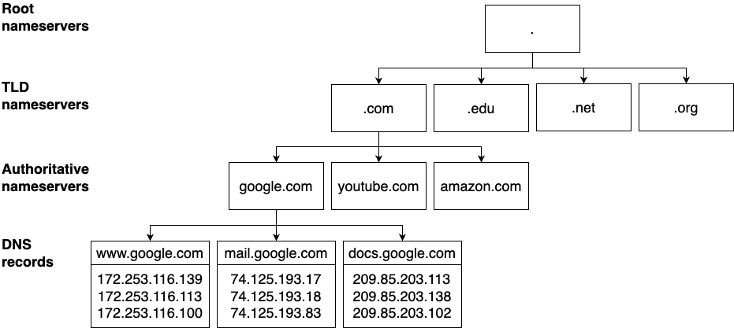
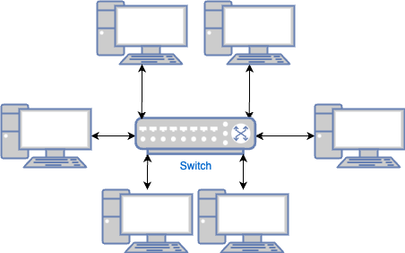
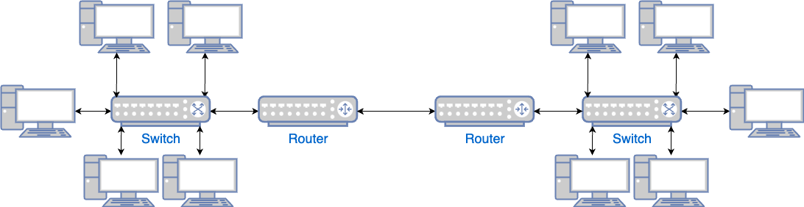
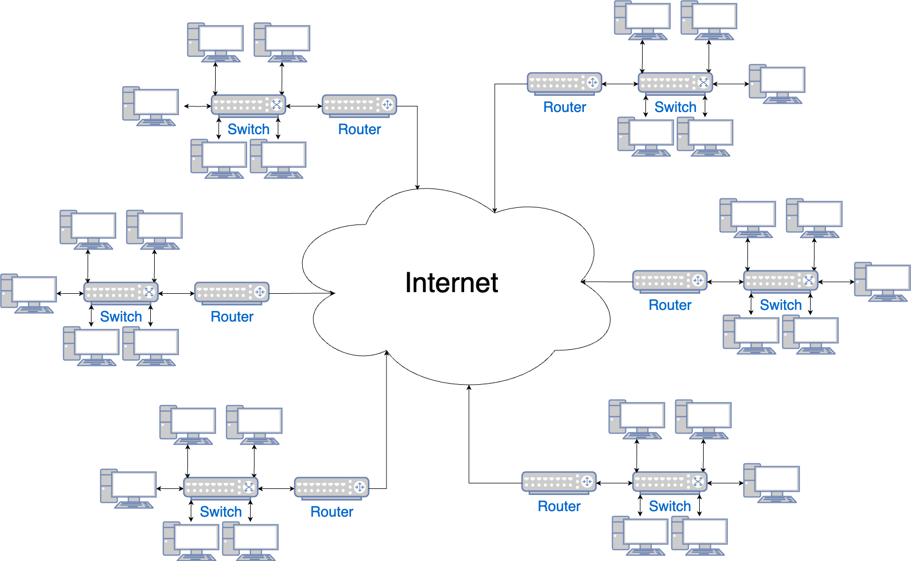

---
markmap:
  htmlParser:
    selector: h1,h2,h3,h4,h5,h6
---

# Chapter 7: How to Set Up Networking

Networking is what needed to:

- _connect_ 👉 services need to communicate over the network
- _secure_ 👉 environment need to be isolated from each other (so they can't talk to each other)

your applications.

This chapter will walkthrough the concepts and examples:

| Concept               | Description                                 | Example                                       |
| --------------------- | ------------------------------------------- | --------------------------------------------- |
| Public networking     | Expose your apps to the public internet via |                                               |
|                       | - public IPs                                | - Deploy servers with public IPs in AWS       |
|                       | - domain names                              | - Register a domain name for them in Route 53 |
| Private networking    | Run apps in private network to              | - Create a Virtual Private Cloud (VPC) in AWS |
|                       | - protect them from public internet access  | - Deploy servers into VPC                     |
| Network access        | Securely access private networks            | Connect to a server in a VPC in AWS using     |
|                       | - using SSH, RDP, VPN                       | - SSH and a bastion host                      |
| Service communication | Connect & secure communicate between apps   | Use Istio as a service mesh                   |
|                       | - in a (micro)services architecture         | - for microservices running in Kubernetes     |

## Public Networking

Almost everything you've deployed so far has been accessible directly over the public internet.

e.g.

- An EC2 instance with a public IP address like `3.22.99.215`
- A load balancer with a domain name like `sample-app-tofu-656918683.us-east-2.elb.amazonaws.com`

### Public IP Addresses

IP
: Internet Protocol
: a protocol (set of rules) for
: - routing
: - addressing
: ... data across networks

> [!TIP]
> There are 2 major versions of IP: _IPv4_ & _IPv6_.
>
> - IPv4: First major version, around since 1980s, is the dominant protocol of the internet.
> - IPv6: The successor version, introduced in 2006, is gradually graining adoption

---

IP Address (IPv4 address)
: 👕 unique identifier used to determine who is who on the Internet
: 👔 a numerical label such as `192.0.2.1` that is assigned to a device connected to a computer network that uses the Internet Protocol for communication
: IP addresses serve two main functions:
: - network interface identification 👈 Which host is it?
: - location addressing 👈 Where is the host?

An IPv4 addresses

- is fixed length of four octets (32 bits)[^1] 👈 There are $2^{32}$ IPv4 addresses.
- begins with a _network number_,
- followed by _local address_ (called the _"rest" field_).

> [!NOTE]
> Running out of IPv4 addresses is one of the reason
>
> - the world is moving to IPv6, which
>   - uses 128-bit addresses that are typically displayed as
>     - eight groups of four hexadecimal digits[^7], such as `2001:0db8:85a3:0000:0000:8a2e:0370:7334`.
>
> Though, IPv6 adoption is still under 50%, because millions of old networking devices still don't support IPv6.

---

Represent of an IPv4 address:

- |                         | IPv4                                            | Example                                   | Decimal value of the IPv4 address |
  | ----------------------- | ----------------------------------------------- | ----------------------------------------- | --------------------------------- |
  | In dot-octal notation   | `o.o.o.o` (4 octets)                            | $013_{8}.014_{8}.015_{8}.016_{8}$[^3]     | 👇[^5]                            |
  | In binary notation      | `xxxxxxxx xxxxxxxx xxxxxxxx xxxxxxxx` (32 bits) | $00001011 00001100 00001101 00001110_{2}$ | $185 339 150_{10}$                |
  | In dot-decimal notation | `Y.Y.Y.Y`                                       | $11_{10}.12_{10}.13_{10}.14_{10}$         | 👆[^4]                            |

> [!NOTE]
> If your computer is connected to the internet, to communicate with another computer (on public internet), you only need that computer's IP address.

---

> How to having your computer "connect to the internet"?
>
> - Your computer needs to have a _valid_ IP address (in your network):
>
>   In other words, your computer need to know:
>
>   - where it is 👈 Which network (of type A, B, C) or subnet[^6]?
>   - what its ID is 👈 Which host it is?

---

There are 2 main methods for allocating the IP addresses:

- **Classful networking address**: 👈 The network prefix has fixed-length (7, 14, 21 bits)

  There are 3 main classes of internet addresses:

  - In class a, the high order bit is zero, the next 7 bits are the network, and the last 24 bits are the local address;
  - In class b, the high order two bits are one-zero, the next 14 bits are the network and the last 16 bits are the local address;
  - In class c, the high order three bits are one-one-zero, the next 21 bits are the network and the last 8 bits are the local address.

- **Classless Inter-Domain Routing (CIDR)**: 👈 The network prefix has variable length

  > [!TIP]
  > CIDR grants finer control of the sizes of subnets allocated to organizations, hence slowing the exhaustion of IPv4 addresses from allocating larger subnets than needed.

---

Represent of an IP address:

- in bit array[^2] (in binary number)

  ```text
  x: indicates a bit.
  n: indicates a bit used for the network number (aka network ID).
  H: indicates a bit used for the local address (aka host ID).
  ```

  ```text
  0xxxxxxx xxxxxxxx xxxxxxxx xxxxxxxx (Class A)
  0nnnnnnn HHHHHHHH HHHHHHHH HHHHHHHH
   <-----> <------------------------>
   7 bits            24 bits
   Network add.      Local address
  ```

  ```text
  10xxxxxx xxxxxxxx xxxxxxxx xxxxxxxx (Class B)
  10nnnnnn nnnnnnnn HHHHHHHH HHHHHHHH
    <-------------> <--------------->
       14 bits           16 bits
    Network address   Local address
  ```

  ```text
  110xxxxx xxxxxxxx xxxxxxxx xxxxxxxx (Class C)
  110nnnnn nnnnnnnn nnnnnnnn HHHHHHHH
     <---------------------> <------>
             21 bits          8 bits
         Network address      Local address
  ```

- in decimal notation (in decimal number)

  |         | **In bit array** |                                 |                                 |     |      | **In decimal-dot notation** |                                |                               |
  | ------- | ---------------- | ------------------------------- | ------------------------------- | --- | ---- | --------------------------- | ------------------------------ | ----------------------------- |
  |         | Leading bits     | Network's<br/>bit field         | Leadings bits & network bits    |     |      | Address ranges of networks  | Address ranges of each network | Address ranges of whole class |
  |         |                  |                                 |                                 |     |      |                             |                                |                               |
  | Class A | `0`              | 7 bits<br/>($2^7$ networks)     | `0nnn nnnn`                     | 👉  | From | `0`                         | `0.0.0`                        | `0.0.0.0`                     |
  |         |                  |                                 |                                 |     | to   | `127`                       | `255.255.255`                  | `127.255.255.255`             |
  | Class B | `10`             | 14 bits<br/>($2^{14}$ networks) | `10nn nnnn nnnn nnnn`           | 👉  | From | `128.0`                     | `0.0`                          | `128.0.0.0`                   |
  |         |                  |                                 |                                 |     | to   | `191.255`                   | `255.255`                      | `191.255.255.255`             |
  | Class C | `110`            | 21 bits<br/>($2^{21}$ networks) | `110n nnnn nnnn nnnn nnnn nnnn` | 👉  | From | `192.0.0`                   | `0`                            | `192.0.0.0`                   |
  |         |                  |                                 |                                 |     | to   | `223.255.255`               | `255`                          | `223.255.255.255`             |

---

> [!TIP]
> There are a lot of names, don't be confused:
>
> - `Network address` is aka `network ID`, `routing prefix`
> - `Local address` is aka `rest field`, `host identifier`

For more information about IP Address, see:

- [IP "Classful" Addressing Network and Host Identification and Address Ranges | The TCP/IP Guide](http://www.tcpipguide.com/free/t_IPClassfulAddressingNetworkandHostIdentificationan-2.htm)

---

All the public IP addressed are owned by IANA, which assigns them in hierarchical manner:

- Top-level: IANA delegates blocks of IP addresses to [Internet registries](https://www.iana.org/numbers) (that cover regions of the worlds)

  - These Internet registries, in turn, delegate blocks of IP addresses to _network operators_[^8], such as
    - Internet Service Provider (ISPs)
    - cloud providers, e.g. AWS, Azure, GCP
    - enterprise companies...
  - Finally, these network operators assign IP addresses to specific devices.

    e.g.

    - You sign up for an Internet connection at home with an ISP, that ISP assigns you an IP address (from its block of IP addresses)
    - You deploy an EC2 instance in AWS, AWS assign that EC2 instance an IP address (from its block of IP addresses[^9] [^10])

> [!IMPORTANT]
> Key takeaway #1
> You get public IP addresses from network operators such as cloud providers and ISPs.

---

For more information, see:

- [What is the Internet Protocol (IP)? | CloudFlare Learning Center](https://www.cloudflare.com/learning/network-layer/internet-protocol/)
- [What is my IP address? | CloudFlare Learning Center](https://www.cloudflare.com/learning/dns/glossary/what-is-my-ip-address/)

For even more information, see:

- [Internet_Protocol | Wikipedia](https://en.wikipedia.org/wiki/Internet_Protocol)
- [IP address | Wikipedia](https://en.wikipedia.org/wiki/IP_address)

### Domain Name System (DNS)

> [!NOTE]
> Before DNS, TCP/IP has another name system - the simple _host table_ name system.

> [!TIP]
> An example host table on Linux - the file `/etc/hosts` - looks like this
>
> ```text
> # Loopback entries; do not change.
> # For historical reasons, localhost precedes localhost.localdomain:
> 127.0.0.1   localhost localhost.localdomain localhost4 localhost4.localdomain4
> ::1         localhost localhost.localdomain localhost6 localhost6.localdomain6
>
> # See hosts(5) for proper format and other examples:
> # 192.168.1.10 foo.mydomain.org foo
> # 192.168.1.13 bar.mydomain.org bar
> ```

name system
: technology that allow computers on a network to be given both
: - a conventional numeric address
: - a more “user-friendly” human-readable name

domain name
: 👕 a unique, easy-to-remember address used to access websites, such as `google.com` (instead of a IP address `142.251.10.100`)

Domain Name System (DNS)
: new, current name system of the Internet Protocol Suite (TCP/IP)

---

#### How DNS works

- DNS stores

  - the mapping from names to IP addresses
    - in a globally-distributed hierarchy of _nameservers_

- When you enter `www.google.com` into your web browser,

  - your computer doesn't talk directly to the nameservers

    - instead it send sends a request to a local _DNS resolver_[^11].

- The DNS resolver takes the domain name processes the parts in _reverse order_ by making a series of _queries_ to the hierarchy name servers

  

  1.  The DNS resolver's first query goes to the _root nameservers_[^12] [^13]:

      The root nameservers return

      - the IP addresses of the _top-level domain (TLD) nameservers_ for the TLD you requested (`.com`).

  1.  The DNS resolver's second query goes to the TLD nameservers[^14].

      The TLD nameservers return

      - the IP addresses of the _authoritative nameservers_ for the domain you requested (`google.com`).

  1.  Finally, the DNS resolver's third query goes to these authoritative nameservers[^15]

      The authoritative nameservers return

      - the _DNS records_ that contain the information that is associated with the domain name you requested (`www.google.com`)

> [!NOTE]
> It takes 3 queries to get some DNS records of a domain name. Isn't it too many round-trips?
>
> ---
>
> - DNS is pretty fast
> - There is a lot of caching that will reduce the number of look ups
>   e.g. browser, OS, DNS resolvers, ...

#### DNS records

DNS record
: contains the information that is associated a domain name

There are many types of DNS records, each stores different kinds of information, such as:

- _DNS `A` record_: stores the IPv4 address
- _DNS `AAAA` record_: stores the IPv6 address
- _DNS `CNAME` record_: "canonical name" record thats stores alias for domain name.
- _DNS `TXT` record_: stores arbitrary text

When your browser looks up `www.google.com`, it typically requests `A` or `AAAA` records.

> [!IMPORTANT]
> Key takeaway #2
> DNS allows you to access web services via memorable, human-friendly, consistent names.

#### DNS Registration

- The domain names are also owned and managed by IANA, who delegates the management to

  - accredited _registrars_,
    - who are allowed to "sell" domain names to end users
    - are often (but not always) the same companies that run authoritative name services.

- After you lease a domain name, you have the permission to

  - configure the DNS records for that domain
    - in its authoritative name servers.

- Only after that, users all over the world can access your servers via that domain name.

> [!NOTE]
> Technically, you never own a domain name, you can only pay an annual fee to _lease_ it.

### Example: Register and Configure a Domain Name in Amazon Route 53

In this example, you'll:

- Deploy a web app 👈 A simple HTTP server on several EC2 instances
- Set up a domain name (for it) 👈 Using Amazon Route 53 as the domain name registrar.

#### Register a domain name

Registering domain involves manual steps:

- Open Route 53 dashboard > Choose `Register a domain` > Click `Get started`
- In the next page:
  - In the `Search for domain` section > Use the search box to find an available domain
  - Click `Select` to add the domain to your cart.
  - Scroll to the bottom > Click `Proceed to checkout`.
- In the next page:
  - Fill out other details: How long? Registration auto-renew?
  - Click `Next`
- In the next page:
  - Fill out contact details[^16]
  - [Optional] Enable privacy protection
  - Click `Next`
- Review the order in the summary page, then click `Submit`
- Open your email to confirm that you own the email address.
- Check your domain in [registered domains page](https://console.aws.amazon.com/route53/domains/home#/)
- [For this example] Open the [hosted zones page](https://console.aws.amazon.com/route53/v2/hostedzones) and copy the hosted zone ID.

> [!TIP]
> You can monitor the your registration process on the [registration requests page][AWS Route 53 Registration Requests Page]

> [!NOTE]
> When you register a domain in Route 53, it automatically
>
> - configures its own servers as the authoritative nameservers for that domain.
> - creates Route 53 _hosted zone_ for the domain

> [!WARNING]
> Watch out for snakes: Registering domain names is not part of the AWS free tier!
>
> The [pricing][Route 53 pricing] varies based on the TLD:
>
> - Domain with `.com` TLD cost $14 per year (in September 2024)

#### Deploy EC2 instances

This example will

- use the `ec2-instances`[^17] OpenTofu module, which is available at the [sample code repo] at `ch7/tofu/modules/ec2-instances`
- to deploy 3 EC2 instances

---

- The OpenTofu root module `ec2-dns`

  - `main.tf`

    ```t
    # examples/ch7/tofu/live/ec2-dns/main.tf

    provider "aws" {
      region = "us-east-2"
    }

    module "instances" {
      source = "github.com/brikis98/devops-book//ch7/tofu/modules/ec2-instances"

      name          = "ec2-dns-example"
      num_instances = 3 #                                   (1)
      instance_type = "t2.micro"
      ami_id        = "ami-0900fe555666598a2" #             (2)
      http_port     = 80 #                                  (3)
      user_data     = file("${path.module}/user-data.sh") # (4)
    }
    ```

    - (1): Deploy 3 EC2 instances
    - (2): Use the Amazon Linux AMI
    - (3): Expose the port 80 for HTTP requests
    - (4): Run the `user-data.sh` script

  - Copy the user data script from chapter 2:

    ```bash
    cd examples
    copy ch2/bash/user-data.sh ch7/tofu/live/ec2-dns/
    ```

  > [!WARNING]
  > Watch out for snakes: a step backwards in terms of orchestration and security
  >
  > This example has all the problems in [Chapter 1 | Example Deploying An App Using AWS](./chap-01.md#example-deploying-an-app-using-aws)

  - Output the public IP addresses of the EC2 instances

    ```t
    output "instance_ips" {
      description = "The IPs of the EC2 instances"
      value       = module.instances.public_ips
    }
    ```

- Deploy the `ec2-dns` module

  ```bash
  tofu init
  tofu apply
  ```

- Verify the the app is deployed on these EC2 instance

  ```bash
  curl http:<EC2_INSTANCE_IP_ADDRESS>
  ```

#### Configure DNS records

In this example, you'll point your domain name at the EC2 instances (deployed in previous section)

- Add the configuration for a DNS A record to the `ec2-dns` module

  ```t
  #  examples/ch7/tofu/live/ec2-dns/main.tf

  provider "aws" {
  # ...
  }

  module "instances" {
  # ...
  }

  resource "aws_route53_record" "www" {
    # TODO: fill in your own hosted zone ID!
    zone_id = "Z0701806REYTQ0GZ0JCF" #                   (1)
    # TODO: fill in your own domain name!
    type    = "A" #                                      (2)
    name    = "www.fundamentals-of-devops-example.com" # (3)
    records = module.instances.public_ips #              (4)
    ttl     = 300 #                                      (5)
  }
  ```

  The DNS record

  - (1): ... created in this hosted zone
  - (2): ... of type A
  - (3): ... for the sub-domain `www.<YOUR_DOMAIN>`
  - (4): ... point to the IPv4 addresses (of the EC2 instances you deployed)
  - (5): ... with the _time to live (TTL)[^18]_ of 300 seconds.

  For more information, see [`aws_route53_record` OpenTofu resource's docs](https://registry.terraform.io/providers/hashicorp/aws/latest/docs/resources/route53_record)

- Add output variable for the domain name

  ```t
  # examples/ch7/tofu/live/ec2-dns/outputs.tf
  output "domain_name" {
    description = "The domain name for the EC2 instances"
    value       = aws_route53_record.www.name
  }
  ```

---

- Re-apply the `ec2-dns` module

  ```bash
  tofu apply
  ```

- Verify the domain name works

  ```bash
  curl http://www.<YOUR_DOMAIN>
  ```

### Get your hands dirty: Managing domain names

- Instead of several individual EC2 instances,

  - use one of the orchestration approaches from Part 3,
    - such as an ASG with an ALB
  - figure out how to configure DNS records for that approach.

- Figure out how to automatically redirect requests for your root domain name (sometimes called the _apex domain_ or _bare domain_) to your `www.` sub-domain:

  e.g. redirect `fundamentals-of-devops-example.com` to `www.fundametals-of-devsop.com.`

  This is a good security practice because of [how browsers handle cookies for root domains](https://security.stackexchange.com/a/231737/179892).

- DNSSEC (DNS Security Extensions) is a protocol you can use to protect your domain from forged or manipulated DNS data.
  - You may have noticed that in the Details section for your domain in your Route53 hosted zone page, it said that the `DNSSSEC status` was `not configured`.
  - Fix this issue by following the Route 53 DNSSEC documentation.

## Private Networking

private network
: a network set up by an organization solely for that organization’s use
: e.g.
: - a home network
: - an office network
: - an university network
: - a data center network
: is _locked down_ so only authorized individuals (from within that organization) can access it

### Private Network's Advantages

#### Defense in depth

defense-in-depth strategy
: establish **multiple layers** of security
: - providing _redundancy_ in case there is a vulnerability in one of the layers

---

You should _build your software_ in a similar manner with building a castle - using _defense-in-depth strategy_ - establish multiple defense layers, if one of them fails, the others are there to keep you safe.

e.g. The servers (EC2 instances) deploy so far:

- has one layer of security - the firewall (security group) that block access to all ports by default
- one mistakes and these servers might become vulnerable,
  e.g. Someone will misconfigure the firewall and leave a port open, which be scanned all the time by malicious actors.

> [!NOTE]
> Many incidents are not the result of a brilliant algorithmic code cracking, but of opportunists jumping on easy vulnerabilities due to someone making a mistake.

> [!WARNING]
> If one person making a mistake is all it takes to cause a security incident, then
>
> - the fault isn't with that person
> - but with the way you've set up your security posture.

---

By putting your servers in a private networks, you have at least 2 layers of protections:

- First, a malicious actor have to get into your private network.
- Second, the actor have to find a vulnerability in your server.

> [!TIP]
> A good private network can create many more layers of security.

> [!IMPORTANT]
> Key takeaway #3
> Use a defense-in-depth strategy to ensure you’re never one mistake away from a disaster.

#### Isolate workloads

Separate private networks is one of the way to setup _isolated_ environment.

e.g.

- Deploy different products, teams in separate private networks.
- Deploy data store servers and application servers in separate private networks.

If the workloads in separate private networks needs to communicate, you only allow traffic between specific IPs and ports.

> [!TIP]
> The other ways to setup isolated environments: different servers, different accounts, different data centers...

#### Better control and monitoring

Private networks give you **fine-grained control** over routing of:

- _north-south traffic_: traffic between your servers and the outside worlds
- _east-west traffic_: traffic between servers within your network.

This allows you to:

- add better security control
- setup monitoring

You should

- almost always have all servers in a private network
- only expose some highly-locked down servers, e.g. load balancers
  e.g. Capture _flow logs_ that show all traffic going through your private network

- manage traffic patterns

  e.g. Shift traffic around as part of deployment or experiment

> [!IMPORTANT]
> Key takeaway #4
> Deploy all your servers into private networks by default, exposing only a handful of locked-down servers directly to the public Internet.

### Physical Private Networks

> [!NOTE]
> Lossy compression
> Networking is a huge topic, what you’re seeing here is a highly simplified picture.

- How to connect computers together?

  | How many computers?             | How to connect?                                                         |                                              |
  | ------------------------------- | ----------------------------------------------------------------------- | -------------------------------------------- |
  | Two computers                   |      | Use a single _cable_                         |
  | N computers<br/>(aka a network) |   | Use a _switch_<br/>(instead of $N^2$ cables) |
  | Two networks                    |    | Use two _routers_                            |
  | N networks                      |  | Use the _internet_[^19]                      |

- Most of the networks of the internet is private network.

- There are 2 common type of private networks:

  - Private network in your house (aka home network)

    The ISP gives use a device that's both a router & a switch, which

    - allows devices in your home to talk to each other.

  - Private network in a data center:

    The technicians set up various switches & routers,

    - allows the servers in that the data center talk to each other.

#### Private networks's key characteristics

##### Only authorized devices may connect to the private network

e.g.

- For private network in your home:

  Connect to the ISP router with

  - an ethernet cable
  - or Wi-Fi (with in the range of the antenna & a password)

- For private network in a data center:

  Get into the data center; plug in a cable into the routers and switches.

##### The private network uses private IP address ranges

The IANA reserves 3 blocks of the IP address space for private internets:

| From          | To                | In CIDR notation | Note                                              |
| ------------- | ----------------- | ---------------- | ------------------------------------------------- |
| `10.0.0.0`    | `10.255.255.255`  | `10.0.0.0/8`     | Class A                                           |
| `172.16.0.0`  | `172.31.255.255`  | `172.16.0.0/12`  | Class B                                           |
| `192.168.0.0` | `192.168.255.255` | `192.168.0.0/16` | Class C<br/>Used in most private networks at home |

> [!TIP]
> With CIDR notation, the format of IPv4 address is `a.b.c.d/e`:
>
> - `a.b.c.d`: an IP address
> - `e`: a decimal number that represents how many bits of the IP address, when expressed in binary, stay the same[^20].

> [!NOTE]
> Every public IP address must be unique.
>
> These 3 blocks of private IP addresses
>
> - can be used over and over again
> - as they can only used for private networks.

##### The private network defines connectivity rules

- For a home network, you can define some _basic control_ over connectivity.

  e.g. Depending on your router, you can:

  - Block outbound access to specific websites
  - Block inbound requests from specific IP addresses
  - Block specific port number from being used.

- For a data center network,

  - you have _full control_ over connectivity:

    - e.g. For every device (in the network), you can specify:

      - What IP address it gets assigned
      - What ports it's allowed to use
      - Which other devices it can talk to
      - How traffic get routed to and from that device

    - using:
      - hardware
      - software: based on the configuration in switches, routers

---

- It's common to

  - partition the private network (in a data center) into _subnets_
  - assign specific rules to all devices in a subnet.

  e.g.

  - A subnet called a _DMZ_ (demilitarized zone):
    - allows access (to these servers) from the public Internet
    - run a small handful of servers (such as load balancers)
  - A private subnet:
    - is not accessible from the public Internet
    - run the rest of your servers

##### Most devices in a private network access the public Internet through a gateway

> [!NOTE]
> A device in a private network (with a private IP address) can also have a public IP address.
>
> e.g. You assign a public IP address to a server in your DMZ, that server have both
>
> - a private IP address: it uses to communicate with the devices in the DMZ
> - a public IP address: it used to communicate with the Internet

- Assigning a public IP to every device in a private network defeats the purpose of having a private network:

  - keeping those devices secure
  - avoiding running of of IPv4 addresses

- Therefore, most of the devices in a private network access the public Internet through a _gateway_[^21].

#### Common types of gateways

##### Load balancers

A load balancer allows requests that

- originate from the public Internet
- to be routed to servers in your private network
  - based on rules you define (in that load balancer)

---

e.g. If a user makes a request to the load balancer

- on port 80 for domain `foo.com`, forward it to a specific app on port 8080.

##### NAT gateway

A _Network Address Translation (NAT) gateway_ allows requests that

- originate in a private network
- to be routed out to the public Internet.

A common approach with NAT gateway is to do _port address translation (PAT)_.

---

e.g. A server wants to make an API call to `some-service.com`

- The server sends that request to the NAT Gateway, which:

  - "translating" (modifying) the request to make it look like it
    - originated from (the public IP of) the NAT gateway at a specific port number
  - then send the modified request to `some-service.com`

- When the response comes back from `some-service.com`,

  The NAT Gateway:

  - (knows which server to forward the response to)
  - translate the request to make it look like it
    - cam directly from `some-service.com`.

##### Outbound proxy

An _outbound proxy_ is like a specialized NAT gateway that only allows an apps to make outbound requests to an explicitly-defined list of trusted endpoints.

> [!NOTE]
> Networking is all about layers of defense
>
> - Most of those layers are about keeping attackers out
> - An outbound proxy is the opposite - it keeps the attackers in:
>   - The attackers won't be able to escape with your data.

##### ISP router

On your home network, the IPS router is typically configured as a NAT gateway.

- All devices send all requests to the public Internet via the ISP router, which
  - also use PAT to get you response
  - while keeping those devices hidden

### Virtual Private Networks

#### Virtual networks in the cloud

#### Virtual networks in orchestration tools

#### Example: Create a VPC in AWS

#### Get your hands dirty: Working with VPCs

## Accessing Private Networks

### Castle-and-Moat Model

#### Bastion Host

### Zero-Trust Model

#### Core principles of zero-trust architecture (ZTA)

##### Authenticate every user

##### Authenticate every device

##### Encrypt every connection

##### Define policies for authentication and authorization

##### Enforce least-privilege access controls

##### Continuously monitor and validate

#### Zero-trust should be integrated into every part of your architecture

##### User and device management

##### Infrastructure access

##### Service communication

> [!IMPORTANT]
> Key takeaway #5
> In the castle-and-moat model, you create a strong network perimeter to protect all the resources in your private network; in the zero-trust model, you create a strong perimeter around each individual resource.

### SSH

#### How to use SSH

#### Example: SSH bastion host in AWS

> [!WARNING]
> Watch out for snakes: EC2 key pairs are not recommended in production

#### Get your hands dirty: SSH

#### Advantages of SSH

- Widely available

- Secure

- No extra infrastructure

- Powerful dev tools

#### Disadvantages of SSH

- Managing keys can be difficult, especially at scale

- It’s primarily a dev tool

### RDP

#### How to use RDP

#### Advantages of RDP

- You get a fully-working Windows UI

- Works for all employees

#### Disadvantages of RDP

- Windows-only

- Not secure without extra infrastructure

- Not your own computer

### VPN

#### Use cases for VPNs

##### Connect remote employees to an office or data center network

##### Connect two data centers together

##### Hide Internet browsing behavior

#### How to use VPN

#### Advantages of VPN

- You get transparent network access from your own computer

- Works for all employees

- Works with all operating systems

- Secure

#### Disadvantages of VPN

- Extra infrastructure to run

- Certificate management can be difficult

- Performance overhead

## Service Communication in Private Networks

### Service Discovery

> [!IMPORTANT]
> Key takeaway #6
> As soon as you have more than one service, you will need to figure out a service discovery solution.

#### Service discovery tools

##### Generic tools

###### Configuration files

###### (Internal) load balancers

###### DNS

##### Dedicated service discovery tools

###### Library: Consul, Curator and ZooKeeper, Eureka

###### Local proxy: Consul, Synapse, Envoy; built-in mechanism of orchestration tools

#### Service discovery tool comparison

Tradeoffs:

- Manual error
- Update speed
- Scalability
- Transparency
- Latency
- CPU and memory usage
- Extra infrastructure

### Service Communication Protocol

#### Message encoding vs Network encoding

#### REST APIs: HTTP + JSON

#### Serialization libraries

#### RPC libraries

#### Key factor of service communication protocol

##### Programming language support

##### Client support

##### Schema and code generation

##### Ease of debugging

##### Performance

##### Ecosystem

### Service Mesh

#### Why use a service mesh

- Security
- Observability
- Resiliency
- Traffic management

> [!IMPORTANT]
> Key takeaway #7
> A service mesh can improve security, observability, resiliency, and traffic management in a microservices architecture, without having to update the application code of each service.

#### Three types of service meshes

##### Use with Kubernetes

##### From cloud providers

##### Use with any orchestration approach in any deployment environment

#### Example: Istio Service Mesh with Kubernetes Microservices

#### Get your hands dirty: Service meshes and Istio

## Conclusion

- Networking plays a key role in connectivity and security:

  - You get **public IP** addresses from network operators such as cloud providers and ISPs.

  - **DNS** allows you to access web services via memorable, human-friendly, consistent names.

  - Use a **defense-in-depth strategy** to ensure you’re never one mistake away from a disaster.

  - Deploy all your servers into **private networks** by default, exposing only a handful of locked-down servers directly to the public Internet.

  - In the **castle-and-moat model**, you create a strong network perimeter to protect all the resources in your private network; in the **zero-trust model**, you create a strong perimeter around each individual resource.

  - As soon as you have more than one service, you will need to figure out a **service discovery** solution.

  - A **service mesh** can improve security, observability, resiliency, and traffic management in a microservices architecture, without having to update the application code of each service.

- A full network architecture

[^1]: <https://datatracker.ietf.org/doc/html/rfc791#section-2.3>
[^2]: <https://en.wikipedia.org/wiki/Bit_array>
[^3]: If the IP address has a leading 0, the `ping` tool assumes the numbers is octal.
[^4]: For the dot-decimal notation:

    - Each decimal number can be treated as a 256-base number.
    - Or convert each decimal number to binary then combine all binary numbers together to make a single binary number, then convert to decimal.

[^5]: For the dot-octal notation, to get the decimal value of the IP address:

    - Convert each octal number to decimal then treat each one as a 256-base number, or
    - Convert each octal number to binary then combine all binary numbers together to make a single binary number, then convert to decimal.

[^6]: A network (of type A, B, C) can be split into multiple smaller networks (called _subnets_)
[^7]: A hexadecimal digit can be represent by 4 bits (called _nibble_)
[^8]: <https://github.com/seligman/cloud_sizes>
[^9]: <https://docs.aws.amazon.com/vpc/latest/userguide/aws-ip-ranges.html>
[^10]: <https://github.com/seligman/aws-ip-ranges>
[^11]: The DNS resolver is

    - the ISP (at your home)
    - the cloud provider (in the cloud)

[^12]: <https://www.iana.org/domains/root/servers>
[^13]: The _root nameservers_ run at **13 IP addresses** that are

    - managed by IANA
    - hard-coded into most DNS resolver.

[^14]: The TLD nameservers are also managed by IANA.
[^15]: The authoritative nameservers are operated

    - by yourself, or
    - variety of companies (Amazon Route 53, Azure DNS, GoDaddy, Namecheap, CloudFlare DNS...)

[Route 53 pricing]: https://aws.amazon.com/route53/pricing/

[^16]: IANA requires every domain to have contact details, which anyone can look up using `whois` command.

[AWS Route 53 Registration Requests Page]: https://console.aws.amazon.com/route53/domains/home#/ListRequests
[sample code repo]: https://github.com/brikis98/devops-book

[^17]: This module is similar to the OpenTofu code you wrote in Chapter 2 to deploy an EC2 instance, except the `ec2-instances` module can deploy multiple EC2 instances.
[^18]:
    DNS resolvers _should_ cache the DNS record for the amount specified with TTL.

    - Longer TTLs will reduce latency for users & load on your DNS servers, but any updates will take longer to take effect.

[^19]: The term "Internet" is derive from interconnected networks - a networks of networks
[^20]: The ranges of IPs is defined by all the other bits that can change.
[^21]: A gateway ... allows data to flow from one discrete network to another (<https://en.wikipedia.org/wiki/Gateway_(telecommunications)>).
