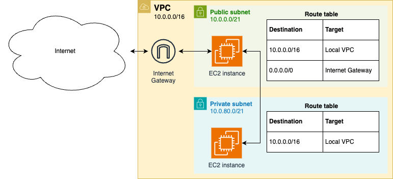
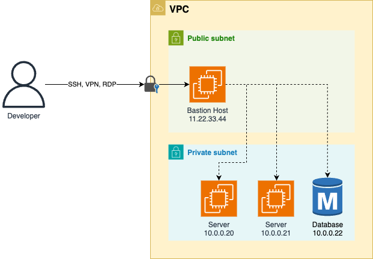
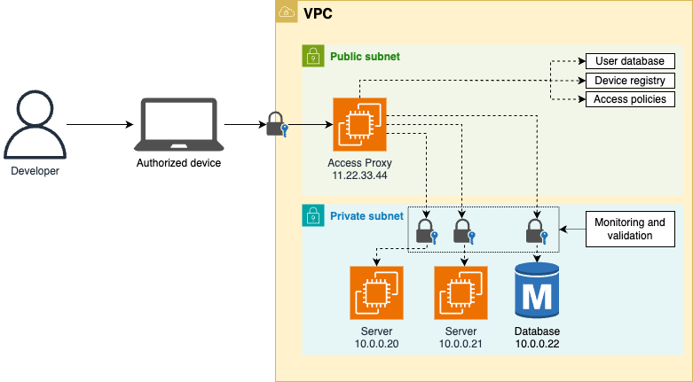
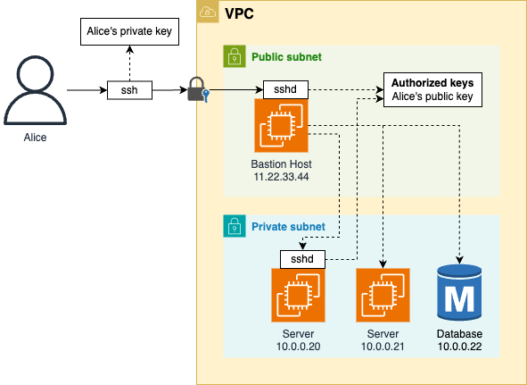

---
markmap:
  htmlParser:
    selector: h1,h2,h3,h4,h5,h6
---

# Chapter 7: How to Set Up Networking

Networking is what needed to:

- _connect_ 👉 services need to communicate over the network
- _secure_ 👉 environment need to be isolated from each other (so they can't talk to each other)

your applications.

This chapter will walkthrough the concepts and examples:

| Concept               | Description                                 | Example                                       |
| --------------------- | ------------------------------------------- | --------------------------------------------- |
| Public networking     | Expose your apps to the public internet via |                                               |
|                       | - public IPs                                | - Deploy servers with public IPs in AWS       |
|                       | - domain names                              | - Register a domain name for them in Route 53 |
| Private networking    | Run apps in private network to              | - Create a Virtual Private Cloud (VPC) in AWS |
|                       | - protect them from public internet access  | - Deploy servers into VPC                     |
| Network access        | Securely access private networks            | Connect to a server in a VPC in AWS using     |
|                       | - using SSH, RDP, VPN                       | - SSH and a bastion host                      |
| Service communication | Connect & secure communicate between apps   | Use Istio as a service mesh                   |
|                       | - in a (micro)services architecture         | - for microservices running in Kubernetes     |

## Public Networking

Almost everything you've deployed so far has been accessible directly over the public internet.

e.g.

- An EC2 instance with a public IP address like `3.22.99.215`
- A load balancer with a domain name like `sample-app-tofu-656918683.us-east-2.elb.amazonaws.com`

### Public IP Addresses

IP
: Internet Protocol
: a protocol (set of rules) for
: - routing
: - addressing
: ... data across networks

> [!TIP]
> There are 2 major versions of IP: _IPv4_ & _IPv6_.
>
> - IPv4: First major version, around since 1980s, is the dominant protocol of the internet.
> - IPv6: The successor version, introduced in 2006, is gradually graining adoption

---

IP Address (IPv4 address)
: 👕 unique identifier used to determine who is who on the Internet
: 👔 a numerical label such as `192.0.2.1` that is assigned to a device connected to a computer network that uses the Internet Protocol for communication
: IP addresses serve two main functions:
: - network interface identification 👈 Which host is it?
: - location addressing 👈 Where is the host?

An IPv4 addresses

- is fixed length of four octets (32 bits)[^1] 👈 There are $2^{32}$ IPv4 addresses.
- begins with a _network number_,
- followed by _local address_ (called the _"rest" field_).

> [!NOTE]
> Running out of IPv4 addresses is one of the reason
>
> - the world is moving to IPv6, which
>   - uses 128-bit addresses that are typically displayed as
>     - eight groups of four hexadecimal digits[^7], such as `2001:0db8:85a3:0000:0000:8a2e:0370:7334`.
>
> Though, IPv6 adoption is still under 50%, because millions of old networking devices still don't support IPv6.

---

Represent of an IPv4 address:

- |                         | IPv4                                            | Example                                   | Decimal value of the IPv4 address |
  | ----------------------- | ----------------------------------------------- | ----------------------------------------- | --------------------------------- |
  | In dot-octal notation   | `o.o.o.o` (4 octets)                            | $013_{8}.014_{8}.015_{8}.016_{8}$[^3]     | 👇[^5]                            |
  | In binary notation      | `xxxxxxxx xxxxxxxx xxxxxxxx xxxxxxxx` (32 bits) | $00001011 00001100 00001101 00001110_{2}$ | $185 339 150_{10}$                |
  | In dot-decimal notation | `Y.Y.Y.Y`                                       | $11_{10}.12_{10}.13_{10}.14_{10}$         | 👆[^4]                            |

> [!NOTE]
> If your computer is connected to the internet, to communicate with another computer (on public internet), you only need that computer's IP address.

---

> How to having your computer "connect to the internet"?
>
> - Your computer needs to have a _valid_ IP address (in your network):
>
>   In other words, your computer need to know:
>
>   - where it is 👈 Which network (of type A, B, C) or subnet[^6]?
>   - what its ID is 👈 Which host it is?

---

There are 2 main methods for allocating the IP addresses:

- **Classful networking address**: 👈 The network prefix has fixed-length (7, 14, 21 bits)

  There are 3 main classes of internet addresses:

  - In class a, the high order bit is zero, the next 7 bits are the network, and the last 24 bits are the local address;
  - In class b, the high order two bits are one-zero, the next 14 bits are the network and the last 16 bits are the local address;
  - In class c, the high order three bits are one-one-zero, the next 21 bits are the network and the last 8 bits are the local address.

- **Classless Inter-Domain Routing (CIDR)**: 👈 The network prefix has variable length

  > [!TIP]
  > CIDR grants finer control of the sizes of subnets allocated to organizations, hence slowing the exhaustion of IPv4 addresses from allocating larger subnets than needed.

---

Represent of an IP address:

- in bit array[^2] (in binary number)

  ```text
  x: indicates a bit.
  n: indicates a bit used for the network number (aka network ID).
  H: indicates a bit used for the local address (aka host ID).
  ```

  ```text
  0xxxxxxx xxxxxxxx xxxxxxxx xxxxxxxx (Class A)
  0nnnnnnn HHHHHHHH HHHHHHHH HHHHHHHH
   <-----> <------------------------>
   7 bits            24 bits
   Network add.      Local address
  ```

  ```text
  10xxxxxx xxxxxxxx xxxxxxxx xxxxxxxx (Class B)
  10nnnnnn nnnnnnnn HHHHHHHH HHHHHHHH
    <-------------> <--------------->
       14 bits           16 bits
    Network address   Local address
  ```

  ```text
  110xxxxx xxxxxxxx xxxxxxxx xxxxxxxx (Class C)
  110nnnnn nnnnnnnn nnnnnnnn HHHHHHHH
     <---------------------> <------>
             21 bits          8 bits
         Network address      Local address
  ```

- in decimal notation (in decimal number)

  |         | **In bit array** |                                 |                                 |     |      | **In decimal-dot notation** |                                |                               |
  | ------- | ---------------- | ------------------------------- | ------------------------------- | --- | ---- | --------------------------- | ------------------------------ | ----------------------------- |
  |         | Leading bits     | Network's<br/>bit field         | Leadings bits & network bits    |     |      | Address ranges of networks  | Address ranges of each network | Address ranges of whole class |
  |         |                  |                                 |                                 |     |      |                             |                                |                               |
  | Class A | `0`              | 7 bits<br/>($2^7$ networks)     | `0nnn nnnn`                     | 👉  | From | `0`                         | `0.0.0`                        | `0.0.0.0`                     |
  |         |                  |                                 |                                 |     | to   | `127`                       | `255.255.255`                  | `127.255.255.255`             |
  | Class B | `10`             | 14 bits<br/>($2^{14}$ networks) | `10nn nnnn nnnn nnnn`           | 👉  | From | `128.0`                     | `0.0`                          | `128.0.0.0`                   |
  |         |                  |                                 |                                 |     | to   | `191.255`                   | `255.255`                      | `191.255.255.255`             |
  | Class C | `110`            | 21 bits<br/>($2^{21}$ networks) | `110n nnnn nnnn nnnn nnnn nnnn` | 👉  | From | `192.0.0`                   | `0`                            | `192.0.0.0`                   |
  |         |                  |                                 |                                 |     | to   | `223.255.255`               | `255`                          | `223.255.255.255`             |

---

> [!TIP]
> There are a lot of names, don't be confused:
>
> - `Network address` is aka `network ID`, `routing prefix`
> - `Local address` is aka `rest field`, `host identifier`

For more information about IP Address, see:

- [IP "Classful" Addressing Network and Host Identification and Address Ranges | The TCP/IP Guide](http://www.tcpipguide.com/free/t_IPClassfulAddressingNetworkandHostIdentificationan-2.htm)

---

All the public IP addressed are owned by IANA, which assigns them in hierarchical manner:

- Top-level: IANA delegates blocks of IP addresses to [Internet registries](https://www.iana.org/numbers) (that cover regions of the worlds)

  - These Internet registries, in turn, delegate blocks of IP addresses to _network operators_[^8], such as
    - Internet Service Provider (ISPs)
    - cloud providers, e.g. AWS, Azure, GCP
    - enterprise companies...
  - Finally, these network operators assign IP addresses to specific devices.

    e.g.

    - You sign up for an Internet connection at home with an ISP, that ISP assigns you an IP address (from its block of IP addresses)
    - You deploy an EC2 instance in AWS, AWS assign that EC2 instance an IP address (from its block of IP addresses[^9] [^10])

> [!IMPORTANT]
> Key takeaway #1
> You get public IP addresses from network operators such as cloud providers and ISPs.

---

For more information, see:

- [What is the Internet Protocol (IP)? | CloudFlare Learning Center](https://www.cloudflare.com/learning/network-layer/internet-protocol/)
- [What is my IP address? | CloudFlare Learning Center](https://www.cloudflare.com/learning/dns/glossary/what-is-my-ip-address/)

For even more information, see:

- [Internet_Protocol | Wikipedia](https://en.wikipedia.org/wiki/Internet_Protocol)
- [IP address | Wikipedia](https://en.wikipedia.org/wiki/IP_address)

### Domain Name System (DNS)

> [!NOTE]
> Before DNS, TCP/IP has another name system - the simple _host table_ name system.

> [!TIP]
> An example host table on Linux - the file `/etc/hosts` - looks like this
>
> ```text
> # Loopback entries; do not change.
> # For historical reasons, localhost precedes localhost.localdomain:
> 127.0.0.1   localhost localhost.localdomain localhost4 localhost4.localdomain4
> ::1         localhost localhost.localdomain localhost6 localhost6.localdomain6
>
> # See hosts(5) for proper format and other examples:
> # 192.168.1.10 foo.mydomain.org foo
> # 192.168.1.13 bar.mydomain.org bar
> ```

name system
: technology that allow computers on a network to be given both
: - a conventional numeric address
: - a more “user-friendly” human-readable name

domain name
: 👕 a unique, easy-to-remember address used to access websites, such as `google.com` (instead of a IP address `142.251.10.100`)

Domain Name System (DNS)
: new, current name system of the Internet Protocol Suite (TCP/IP)

---

#### How DNS works

- DNS stores

  - the mapping from names to IP addresses
    - in a globally-distributed hierarchy of _nameservers_

- When you enter `www.google.com` into your web browser,

  - your computer doesn't talk directly to the nameservers

    - instead it send sends a request to a local _DNS resolver_[^11].

- The DNS resolver takes the domain name processes the parts in _reverse order_ by making a series of _queries_ to the hierarchy name servers

  

  1.  The DNS resolver's first query goes to the _root nameservers_[^12] [^13]:

      The root nameservers return

      - the IP addresses of the _top-level domain (TLD) nameservers_ for the TLD you requested (`.com`).

  1.  The DNS resolver's second query goes to the TLD nameservers[^14].

      The TLD nameservers return

      - the IP addresses of the _authoritative nameservers_ for the domain you requested (`google.com`).

  1.  Finally, the DNS resolver's third query goes to these authoritative nameservers[^15]

      The authoritative nameservers return

      - the _DNS records_ that contain the information that is associated with the domain name you requested (`www.google.com`)

> [!NOTE]
> It takes 3 queries to get some DNS records of a domain name. Isn't it too many round-trips?
>
> ---
>
> - DNS is pretty fast
> - There is a lot of caching that will reduce the number of look ups
>   e.g. browser, OS, DNS resolvers, ...

#### DNS records

DNS record
: contains the information that is associated a domain name

There are many types of DNS records, each stores different kinds of information, such as:

- _DNS `A` record_: stores the IPv4 address
- _DNS `AAAA` record_: stores the IPv6 address
- _DNS `CNAME` record_: "canonical name" record thats stores alias for domain name.
- _DNS `TXT` record_: stores arbitrary text

When your browser looks up `www.google.com`, it typically requests `A` or `AAAA` records.

> [!IMPORTANT]
> Key takeaway #2
> DNS allows you to access web services via memorable, human-friendly, consistent names.

#### DNS Registration

- The domain names are also owned and managed by IANA, who delegates the management to

  - accredited _registrars_,
    - who are allowed to "sell" domain names to end users
    - are often (but not always) the same companies that run authoritative name services.

- After you lease a domain name, you have the permission to

  - configure the DNS records for that domain
    - in its authoritative name servers.

- Only after that, users all over the world can access your servers via that domain name.

> [!NOTE]
> Technically, you never own a domain name, you can only pay an annual fee to _lease_ it.

### Example: Register and Configure a Domain Name in Amazon Route 53

In this example, you'll:

- Deploy a web app 👈 A simple HTTP server on several EC2 instances
- Set up a domain name (for it) 👈 Using Amazon Route 53 as the domain name registrar.

#### Register a domain name

Registering domain involves manual steps:

- Open Route 53 dashboard > Choose `Register a domain` > Click `Get started`
- In the next page:
  - In the `Search for domain` section > Use the search box to find an available domain
  - Click `Select` to add the domain to your cart.
  - Scroll to the bottom > Click `Proceed to checkout`.
- In the next page:
  - Fill out other details: How long? Registration auto-renew?
  - Click `Next`
- In the next page:
  - Fill out contact details[^16]
  - [Optional] Enable privacy protection
  - Click `Next`
- Review the order in the summary page, then click `Submit`
- Open your email to confirm that you own the email address.
- Check your domain in [registered domains page](https://console.aws.amazon.com/route53/domains/home#/)
- [For this example] Open the [hosted zones page](https://console.aws.amazon.com/route53/v2/hostedzones) and copy the hosted zone ID.

> [!TIP]
> You can monitor the your registration process on the [registration requests page][AWS Route 53 Registration Requests Page]

> [!NOTE]
> When you register a domain in Route 53, it automatically
>
> - configures its own servers as the authoritative nameservers for that domain.
> - creates Route 53 _hosted zone_ for the domain

> [!WARNING]
> Watch out for snakes: Registering domain names is not part of the AWS free tier!
>
> The [pricing][Route 53 pricing] varies based on the TLD:
>
> - Domain with `.com` TLD cost $14 per year (in September 2024)

#### Deploy EC2 instances

This example will

- use the `ec2-instances`[^17] OpenTofu module, which is available at the [sample code repo] at `ch7/tofu/modules/ec2-instances`
- to deploy 3 EC2 instances

---

- The OpenTofu root module `ec2-dns`

  - `main.tf`

    ```t
    # examples/ch7/tofu/live/ec2-dns/main.tf

    provider "aws" {
      region = "us-east-2"
    }

    module "instances" {
      source = "github.com/brikis98/devops-book//ch7/tofu/modules/ec2-instances"

      name          = "ec2-dns-example"
      num_instances = 3 #                                   (1)
      instance_type = "t2.micro"
      ami_id        = "ami-0900fe555666598a2" #             (2)
      http_port     = 80 #                                  (3)
      user_data     = file("${path.module}/user-data.sh") # (4)
    }
    ```

    - (1): Deploy 3 EC2 instances
    - (2): Use the Amazon Linux AMI
    - (3): Expose the port 80 for HTTP requests
    - (4): Run the `user-data.sh` script

  - Copy the user data script from chapter 2:

    ```bash
    cd examples
    copy ch2/bash/user-data.sh ch7/tofu/live/ec2-dns/
    ```

  > [!WARNING]
  > Watch out for snakes: a step backwards in terms of orchestration and security
  >
  > This example has all the problems in [Chapter 1 | Example Deploying An App Using AWS](./chap-01.md#example-deploying-an-app-using-aws)

  - Output the public IP addresses of the EC2 instances

    ```t
    output "instance_ips" {
      description = "The IPs of the EC2 instances"
      value       = module.instances.public_ips
    }
    ```

- Deploy the `ec2-dns` module

  ```bash
  tofu init
  tofu apply
  ```

- Verify the the app is deployed on these EC2 instance

  ```bash
  curl http:<EC2_INSTANCE_IP_ADDRESS>
  ```

#### Configure DNS records

In this example, you'll point your domain name at the EC2 instances (deployed in previous section)

- Add the configuration for a DNS A record to the `ec2-dns` module

  ```t
  #  examples/ch7/tofu/live/ec2-dns/main.tf

  provider "aws" {
  # ...
  }

  module "instances" {
  # ...
  }

  resource "aws_route53_record" "www" {
    # TODO: fill in your own hosted zone ID!
    zone_id = "Z0701806REYTQ0GZ0JCF" #                   (1)
    # TODO: fill in your own domain name!
    type    = "A" #                                      (2)
    name    = "www.fundamentals-of-devops-example.com" # (3)
    records = module.instances.public_ips #              (4)
    ttl     = 300 #                                      (5)
  }
  ```

  The DNS record

  - (1): ... created in this hosted zone
  - (2): ... of type A
  - (3): ... for the sub-domain `www.<YOUR_DOMAIN>`
  - (4): ... point to the IPv4 addresses (of the EC2 instances you deployed)
  - (5): ... with the _time to live (TTL)[^18]_ of 300 seconds.

  For more information, see [`aws_route53_record` OpenTofu resource's docs](https://registry.terraform.io/providers/hashicorp/aws/latest/docs/resources/route53_record)

- Add output variable for the domain name

  ```t
  # examples/ch7/tofu/live/ec2-dns/outputs.tf
  output "domain_name" {
    description = "The domain name for the EC2 instances"
    value       = aws_route53_record.www.name
  }
  ```

---

- Re-apply the `ec2-dns` module

  ```bash
  tofu apply
  ```

- Verify the domain name works

  ```bash
  curl http://www.<YOUR_DOMAIN>
  ```

### Get your hands dirty: Managing domain names

- Instead of several individual EC2 instances,

  - use one of the orchestration approaches from Part 3,
    - such as an ASG with an ALB
  - figure out how to configure DNS records for that approach.

- Figure out how to automatically redirect requests for your root domain name (sometimes called the _apex domain_ or _bare domain_) to your `www.` sub-domain:

  e.g. redirect `fundamentals-of-devops-example.com` to `www.fundametals-of-devsop.com.`

  This is a good security practice because of [how browsers handle cookies for root domains](https://security.stackexchange.com/a/231737/179892).

- DNSSEC (DNS Security Extensions) is a protocol you can use to protect your domain from forged or manipulated DNS data.
  - You may have noticed that in the Details section for your domain in your Route53 hosted zone page, it said that the `DNSSSEC status` was `not configured`.
  - Fix this issue by following the Route 53 DNSSEC documentation.

## Private Networking

private network
: a network set up by an organization solely for that organization’s use
: e.g.
: - a home network
: - an office network
: - an university network
: - a data center network
: is _locked down_ so only authorized individuals (from within that organization) can access it

### Private Network's Advantages

#### Defense in depth

defense-in-depth strategy
: establish **multiple layers** of security
: - providing _redundancy_ in case there is a vulnerability in one of the layers

---

You should _build your software_ in a similar manner with building a castle - using _defense-in-depth strategy_ - establish multiple defense layers, if one of them fails, the others are there to keep you safe.

e.g. The servers (EC2 instances) deploy so far:

- has one layer of security - the firewall (security group) that block access to all ports by default
- one mistakes and these servers might become vulnerable,
  e.g. Someone will misconfigure the firewall and leave a port open, which be scanned all the time by malicious actors.

> [!NOTE]
> Many incidents are not the result of a brilliant algorithmic code cracking, but of opportunists jumping on easy vulnerabilities due to someone making a mistake.

> [!WARNING]
> If one person making a mistake is all it takes to cause a security incident, then
>
> - the fault isn't with that person
> - but with the way you've set up your security posture.

---

By putting your servers in a private networks, you have at least 2 layers of protections:

- First, a malicious actor have to get into your private network.
- Second, the actor have to find a vulnerability in your server.

> [!TIP]
> A good private network can create many more layers of security.

> [!IMPORTANT]
> Key takeaway #3
> Use a defense-in-depth strategy to ensure you’re never one mistake away from a disaster.

#### Isolate workloads

Separate private networks is one of the way to setup _isolated_ environment.

e.g.

- Deploy different products, teams in separate private networks.
- Deploy data store servers and application servers in separate private networks.

If the workloads in separate private networks needs to communicate, you only allow traffic between specific IPs and ports.

> [!TIP]
> The other ways to setup isolated environments: different servers, different accounts, different data centers...

#### Better control and monitoring

Private networks give you **fine-grained control** over routing of:

- _north-south traffic_: traffic between your servers and the outside worlds
- _east-west traffic_: traffic between servers within your network.

This allows you to:

- add better security control
- setup monitoring

You should

- almost always have all servers in a private network
- only expose some highly-locked down servers, e.g. load balancers
  e.g. Capture _flow logs_ that show all traffic going through your private network

- manage traffic patterns

  e.g. Shift traffic around as part of deployment or experiment

> [!IMPORTANT]
> Key takeaway #4
> Deploy all your servers into private networks by default, exposing only a handful of locked-down servers directly to the public Internet.

### Physical Private Networks

> [!NOTE]
> Lossy compression
> Networking is a huge topic, what you’re seeing here is a highly simplified picture.

- How to connect computers together?

  <!-- markdownlint-disable no-inline-html -->

  | How many computers?             | How to connect?                                                         |                                              |
  | ------------------------------- | ----------------------------------------------------------------------- | -------------------------------------------- |
  | Two computers                   |      | Use a single _cable_                         |
  | N computers<br/>(aka a network) |   | Use a _switch_<br/>(instead of $N^2$ cables) |
  | Two networks                    |    | Use two _routers_                            |
  | N networks                      |  | Use the _internet_[^19]                      |

  <!-- markdownlint-enable no-inline-html -->

- Most of the networks of the internet is private network.

- There are 2 common type of private networks:

  - Private network in your house (aka home network)

    The ISP gives use a device that's both a router & a switch, which

    - allows devices in your home to talk to each other.

  - Private network in a data center:

    The technicians set up various switches & routers,

    - allows the servers in that the data center talk to each other.

#### Private networks's key characteristics

##### Only authorized devices may connect to the private network

e.g.

- For private network in your home:

  Connect to the ISP router with

  - an ethernet cable
  - or Wi-Fi (with in the range of the antenna & a password)

- For private network in a data center:

  Get into the data center; plug in a cable into the routers and switches.

##### The private network uses private IP address ranges

The IANA reserves 3 blocks of the IP address space for private internets:

| From          | To                | In CIDR notation | Note                                              |
| ------------- | ----------------- | ---------------- | ------------------------------------------------- |
| `10.0.0.0`    | `10.255.255.255`  | `10.0.0.0/8`     | Class A                                           |
| `172.16.0.0`  | `172.31.255.255`  | `172.16.0.0/12`  | Class B                                           |
| `192.168.0.0` | `192.168.255.255` | `192.168.0.0/16` | Class C<br/>Used in most private networks at home |

> [!TIP]
> With CIDR notation, the format of IPv4 address is `a.b.c.d/e`:
>
> - `a.b.c.d`: an IP address
> - `e`: a decimal number that represents how many bits of the IP address, when expressed in binary, stay the same[^20].

> [!NOTE]
> Every public IP address must be unique.
>
> These 3 blocks of private IP addresses
>
> - can be used over and over again
> - as they can only used for private networks.

##### The private network defines connectivity rules

- For a home network, you can define some _basic control_ over connectivity.

  e.g. Depending on your router, you can:

  - Block outbound access to specific websites
  - Block inbound requests from specific IP addresses
  - Block specific port number from being used.

- For a data center network,

  - you have _full control_ over connectivity:

    - e.g. For every device (in the network), you can specify:

      - What IP address it gets assigned
      - What ports it's allowed to use
      - Which other devices it can talk to
      - How traffic get routed to and from that device

    - using:
      - hardware
      - software: based on the configuration in switches, routers

---

- It's common to

  - partition the private network (in a data center) into _subnets_
  - assign specific rules to all devices in a subnet.

  e.g.

  - A subnet called a _DMZ_ (demilitarized zone):
    - allows access (to these servers) from the public Internet
    - run a small handful of servers (such as load balancers)
  - A private subnet:
    - is not accessible from the public Internet
    - run the rest of your servers

##### Most devices in a private network access the public Internet through a gateway

> [!NOTE]
> A device in a private network (with a private IP address) can also have a public IP address.
>
> e.g. You assign a public IP address to a server in your DMZ, that server have both
>
> - a private IP address: it uses to communicate with the devices in the DMZ
> - a public IP address: it used to communicate with the Internet

- Assigning a public IP to every device in a private network defeats the purpose of having a private network:

  - keeping those devices secure
  - avoiding running of of IPv4 addresses

- Therefore, most of the devices in a private network access the public Internet through a _gateway_[^21].

#### Common types of gateways

##### Load balancers

A load balancer allows requests that

- originate from the public Internet
- to be routed to servers in your private network
  - based on rules you define (in that load balancer)

---

e.g. If a user makes a request to the load balancer

- on port 80 for domain `foo.com`, forward it to a specific app on port 8080.

##### NAT gateway

A _Network Address Translation (NAT) gateway_ allows requests that

- originate in a private network
- to be routed out to the public Internet.

A common approach with NAT gateway is to do _port address translation (PAT)_.

---

e.g. A server wants to make an API call to `some-service.com`

- The server sends that request to the NAT Gateway, which:

  - "translating" (modifying) the request to make it look like it
    - originated from (the public IP of) the NAT gateway at a specific port number
  - then send the modified request to `some-service.com`

- When the response comes back from `some-service.com`,

  The NAT Gateway:

  - (knows which server to forward the response to)
  - translate the request to make it look like it
    - cam directly from `some-service.com`.

##### Outbound proxy

An _outbound proxy_ is like a specialized NAT gateway that only allows an apps to make outbound requests to an explicitly-defined list of trusted endpoints.

> [!NOTE]
> Networking is all about layers of defense
>
> - Most of those layers are about keeping attackers out
> - An outbound proxy is the opposite - it keeps the attackers in:
>   - The attackers won't be able to escape with your data.

##### ISP router

On your home network, the IPS router is typically configured as a NAT gateway.

- All devices send all requests to the public Internet via the ISP router, which
  - also use PAT to get you response
  - while keeping those devices hidden

### Virtual Private Networks (VPNs)

If you deploy into the cloud,

- all the physical networking: servers, cables, switches, routers...
  - are already taken care of by the cloud provider
    - largely in a way you can't see or control
- what you can control is a _virtual private network (VPN)_ - a network you configure entirely in software, which makes it a _software-defined networking_.

#### Virtual networks in the cloud

Each cloud provider offers slightly different networking features, but they typically have the following basic characteristics in common:

##### You can create a VPN

Most cloud providers allow you to create a VPN, although they may call it different:

- For AWS, GCP: VPN is call _virtual private cloud (VPC)_
- For Azure: VPN is call virtual network (_VNet_)

> [!NOTE]
> Most of the examples in this book use AWS, so VPN will be called VPC in the rest of book.

##### The VPC consists of subnets

Each VPC contains one or more subnets.

- Each subnet has an IP address range of the private internet as in [previous section](#the-private-network-uses-private-ip-address-ranges)
  e.g. `10.0.0.0/24`

##### The subnets assign IP addresses

The resources deploy in a subnet will get an IP address from that subnet's IP address range.

e.g. Three servers

- deployed in a subnet with the IP address range `10.0.0.0/24`
- might have 3 IPs:
  - `10.0.0.1`
  - `10.0.0.2`
  - `10.0.0.3`

##### You enable connectivity with route tables

Each subnet has a _route table_ that control how traffic is routed within that subnet.

- Each _route_ (in a route table) - corresponding to a row - typically defines

  - a _destination_
  - a _target_: where to route traffic (sent to that destination)

  ***

  | Route                         | _Destination_             | _Target_                           |
  | ----------------------------- | ------------------------- | ---------------------------------- |
  | What does it looks like?      | `10.0.0.0/16`             | VPC Foo                            |
  | What does it exactly mean?    | Final target              | Immediate target                   |
  | Compare with a transit flight | Paris (Final destination) | Taiwan's Airport (Transit airport) |

Each time the VPC needs to route a packet, it will go through the route table, and

- use the most specific route that matches that packet’s destination
  (then route traffic to that route's target)

---

e.g.

- A route table with 3 routes

  | Destination   | Target      |
  | ------------- | ----------- |
  | `10.0.0.0/16` | VPC Foo     |
  | `10.1.0.0/16` | VPC Bar     |
  | `0.0.0.0/0`   | NAT gateway |

  - Traffic with a destination matches with `10.0.0.0/16` will be routed to VPC Foo.
  - Traffic with a destination matches with `10.1.0.0/16` will be routed to VPC Bar.
  - All other traffic (destination matches with `0.0.0.0/10`) will be routed to the NAT Gateway (and go to the public Internet)

##### You block connectivity with firewalls

Each cloud provider provides different types of firewalls to block traffic:

- Some firewalls apply to **individual resources**, and typically _block all_ traffic by default.

  e.g. Each EC2 instance has a security group:

  - You need to explicitly open IP/ports in the security group.

- Other firewalls apply to **_entire_ subnets/VPCs**, and typically _allow all_ traffic by default.

  e.g. AWS network firewall that filter inbound, outbound traffic across an entire VPC.

##### You access the public Internet through gateways

e.g. Load balancers, NAT Gateways

---

> [!NOTE]
> To make it easier to get started, most cloud providers allow you to deploy resources without creating a VPC.
>
> e.g.
>
> - AWS gives you a Default VPC out-of-the-box, which is suitable launching public instances such as a blog or simple website[^22]

> [!WARNING]
> To have better security and full control of the network, you should design your own networking and create your own VPC.

#### Virtual networks in orchestration tools

Some orchestration tools

- include their _own_ virtual network

  e.g.

  - Kubernetes Networking
  - OpenShift Networking
  - Marathon Networking

- which is responsible for:

  - **IP address management**

    Assigning IP addresses to apps (running in the orchestration tool).

  - **Service communication**

    Allowing multiple apps (running in the orchestration tool) to communicate with each other.

  - **Ingress**

    Allowing apps (running in the orchestration tool) to receive requests from the outside world.

---

These orchestration tools need their own virtual network because:

- these orchestration tools are design to work in any data center or cloud

- to solve the core [orchestration problems](./chap-03.md#what-is-an-orchestration)
  - that involve networking, e.g. load balancing, service communication
  - in a portable way

---

> [!NOTE]
> When using an orchestration tool (which has its own virtual network), you have to integrate 2 sets of networking technologies:
>
> - From the orchestration tool
> - From the data center, cloud provider

To help you integrate with different cloud providers, these orchestration tools offer plugins to handle the integration.

e.g.

- Kubernetes supports:
  - Container Network Interface (CNI) plugins: to manage cluster networking
  - ingress controllers: to manage ingress

---

Comparing the behavior of networking plugins for Kubernetes in various clouds:

| Cloud |     | Typical CNI plugin      | IP address management      | Service communication |     | Typical ingress controller     | Ingress                           |
| ----- | --- | ----------------------- | -------------------------- | --------------------- | --- | ------------------------------ | --------------------------------- |
| AWS   |     | [Amazon VPC CNI plugin] | IPs from AWS VPC           | Use AWS VPC routing   |     | [AWS Load Balancer Controller] | Deploy AWS Elastic Load Balancers |
| GCP   |     | [Cilium GKE plugin]     | IPs from Cloud VPC subnets | Use Cloud VPC routing |     | [GKE ingress]                  | Deploy Cloud Load Balancers       |
| Azure |     | [Azure CNI plugin]      | IPs from VNet subnets      | Use VNet routing      |     | [Nginx ingress controller]     | Deploy Nginx                      |

#### Example: Create a VPC in AWS

In this example, you will:

- Create a custom VPC in AWS
- Deploy some EC2 instances into it

---

The `vpc` OpenTofu module

- from the [sample code repo] at `ch7/tofu/modules/vpc` folder

- can create a VPC as follow:

  

  with the configuration for:

  - IP address range, e.g. `10.0.0.0/16` with $2^{16} (65,536)$ IP addresses.
  - Public subnet (a DMZ)[^23]
  - Private subnet[^25]

---

Configure the root module to use the `vpc` and `ec2-instances` OpenTofu modules:

- The `vpc-ec2` root module will be in `samples/ch7/tofu/live/vpc-ec2`

  ```bash
  cd examples
  mkdir -p ch7/tofu/live/vpc-ec2
  cd ch7/tofu/live/vpc-ec2
  ```

- Configure `main.tf` to deploy a VPC and an EC2 instance in the public subnet (aka public instance)

  ```t
  # examples/ch7/tofu/live/vpc-ec2/main.tf
  provider "aws" {
    region = "us-east-2"
  }

  module "vpc" {
    source = "github.com/brikis98/devops-book//ch7/tofu/modules/vpc"

    name       = "example-vpc" # (1)
    cidr_block = "10.0.0.0/16" # (2)
  }
  ```

  ```t
  module "public_instance" {
    source = "github.com/brikis98/devops-book//ch7/tofu/modules/ec2-instances"

    name          = "public-instance" #                   (1)
    num_instances = 1 #                                   (2)
    instance_type = "t2.micro"
    ami_id        = "ami-0900fe555666598a2"
    http_port     = 80
    user_data     = file("${path.module}/user-data.sh") # (3)
    vpc_id        = module.vpc.vpc.id #                   (4)
    subnet_id     = module.vpc.public_subnet.id #         (5)
  }
  ```

  Configure the instance to run:

  - (4): ... in the VPC created by `vpc` module.
  - (5): ... in the public subnet of the created VPC.

- The user data script (at `examples/ch7/tofu/live/vpc-ec2/user-data.sh`)

  ```bash
  #!/usr/bin/env bash
  set -e

  curl -fsSL https://rpm.nodesource.com/setup_21.x | bash - yum install -y nodejs

  export MY_IP=$(hostname -I) #                           (1)

  tee app.js > /dev/null << "EOF"
  const http = require('http');

  const server = http.createServer((req, res) => {
    res.writeHead(200, { 'Content-Type': 'text/plain' });
    res.end(`Hello from ${process.env.MY_IP}!\n`); //     (2)
  });

  const port = 80;
  server.listen(port,() => {
    console.log(`Listening on port ${port}`);
  });
  EOF

  nohup node app.js &
  ```

  - (1): Look up the private IP address of the server
  - (2): Include (the private IP address of the server) in the HTTP response

- Configure `main.tf` to deploy an EC2 instance in the private subnet (aka private instance)

  ```t
  # examples/ch7/tofu/live/vpc-ec2/main.tf

  module "private_instance" {
    source = "github.com/brikis98/devops-book//ch7/tofu/modules/ec2-instances"

    name          = "private-instance" #                   (1)
    num_instances = 1
    instance_type = "t2.micro"
    ami_id        = "ami-0900fe555666598a2"
    http_port     = 80
    user_data     = file("${path.module}/user-data.sh")
    vpc_id        = module.vpc.vpc.id
    subnet_id     = module.vpc.private_subnet.id #         (2)
  }
  ```

- Output the public & private IP addresses of the EC2 instances

  ```t
  # examples/ch7/tofu/live/vpc-ec2/outputs.tf

  output "public_instance_public_ip" {
    description = "The public IP of the public instance"
    value       = module.public_instance.public_ips[0]
  }

  output "public_instance_private_ip" {
    description = "The private IP of the public instance"
    value       = module.public_instance.private_ips[0]
  }

  output "private_instance_public_ip" {
    description = "The public IP of the private instance"
    value       = module.private_instance.public_ips[0]
  }

  output "private_instance_private_ip" {
    description = "The private IP of the private instance"
    value       = module.private_instance.private_ips[0]
  }
  ```

---

- Deploy `vpc-ec2` module

  ```bash
  tofu init
  tofu apply
  ```

- Verify that the instance work:

  ```bash
  curl http://<public_instance_public_ip>
  ```

> [!NOTE]
> To be able to test the instance in the private, subnet, you're need to know how access private network.

#### Get your hands dirty: Working with VPCs

Update the VPC module to

- deploy a NAT gateway

  ... so that resources running in the private subnet can access the public Internet.

- deploy each type of subnet (public and private) across multiple availability zones

  ... so that your architecture is resilient to the failure of a single AZ.

> [!NOTE]
> Note: AWS offers a managed NAT gateway, which works very well and is easy to use, but is not part of the AWS free tier.

## Accessing Private Networks

### Castle-and-Moat Model

_Castle-and-moat model_ is the traditional approach for managing a access to private networks.

Castle-and-moat model is an analogy between:

- a castle

  - with extremely secure perimeter (moat, walls...): it's hard to get inside
  - but soft interior: once you're inside, you can freely move around

- a private network:

  - doesn't allow you to access anything from outside the network
  - but once you're "in" the network, you can access anything

#### Bastion Host

In a physical network, with castle-and-moat model, merely being connected to the network means you're in.

e.g. With many corporate office networks,

- if you're plugged into the network via a physical cable, you can access everything in that network: wiki pages, issue tracker...

However, how do you connect to it if you're outside the physical network:

- you're working from home
- your're infrastructure deployed in a VPC in the cloud

The common solution is to deploy a _bastion host_, a server that

- is designed to be visible outside the network (e.g. in the DMZ)
- has extra security hardening and monitoring, so it can better withstand attacks.

  > [!TIP]
  > In a fortress, a bastion is a structure that is designed to stick out of the wall, allowing for more reinforcement and extra armaments, so that it can better withstand attacks.

The bastion host acts as the _sole entrypoint_ to that network:

- There is only one bastion host, so you can put a lot of effort into making it as secure as possible.
- Authenticated users can
  - connect to the bastion host using secured protocol (SSH, RDP, VPN)
  - and have access to everything in the network.

e.g. A castle-and-moat networking model with a bastion host as the sole access point



- If you are able to connect to the bastion host (`11.22.33.44`), you can access everything in the private subnets of that VPC:
  - The private servers (`10.0.0.20`, `10.0.0.21`)
  - The database server (`10.0.0.22`)

#### Castle-and-moat model security concerns

The castle-and-moat model worked well-enough in the past, but in the modern work, it leads to security concerns.

In the past:

- Companies owns buildings with **physical** networks of routers, switchers, cables...
- To access that physical network, the malicious actor needs to
  - be in a **building** owned by the company
  - use a **computer** owned and configured by the company

> [!NOTE]
> In the past, your _location_ on the network mattered:
>
> - some locations could be trusted
> - while others could not

Today:

- Many of the networks are **virtual**, e.g. VPC
- More and more employees work _remotely_, and needs to be able to connect to company network from a variety of locations: homes, co-working spaces, coffee shops, airports...
- **Lots of devices** need to connect to the company networks: laptops, workstations, tablets, phones...

The ideal of secure perimeter and soft interior no longer makes sense.

- There's no clear "perimeter", or "interior"
- There's no location that can be implicitly trusted

### Zero-Trust Model

With _zero-trust architecture (ZTA)_, it's now "_never trust, always verify_".

- You never trust a user or device just because they have access to some location on the network.

#### Core principles of zero-trust architecture (ZTA)

##### Authenticate every user

Every connections requires the user to authenticate, using

- single sign-on (SSO)
- multi-factor authentication (MFA)

##### Authenticate every device

Every connections requires the user's device (laptop, phone, tablet) to authenticate.

You can use a lot more devices to connect, but each one still need to be

- approved,
- added to a device inventory,
- configured with adequate security controls.

##### Encrypt every connection

All network communicate must be over encrypted connection.

e.g. No more `http`

##### Define policies for authentication and authorization

Each piece of software (you run) can

- define **flexible policies** for:

  - **who** is allowed to access that software 👈 authentication
  - what level of trust & **permissions** they will have 👈 authorization

- base on a variety of data sources:

  - what location is the user connecting from? Home, office or unexpected continent?
  - time of the day they are connecting, e.g. Work hours, 3 a.m
  - how often they are connecting? First time today or 5000 times in latst 30 seconds

##### Enforce least-privilege access controls

With ZTA model, you follow the _principle of least privilege_, which means you get access

- only to the resources you absolutely need to do a specific task,
- and nothing else

e.g. If you get access to the internal wiki, you can only access to the wiki, not the issue tracker...

##### Continuously monitor and validate

With ZTA, you assumes that you're constantly _under attack_,

- so you need to continuously log & audit all traffic to identify suspicious behaviour.

---

The zero-trust model has been evolving for many years. Some of the major publications on it:

- [No More Chewy Centers: Introducing The Zero Trust Model Of Information Security] by John Kindervag

  The term "Zero Trust Model" came from this.

- [BeyondCorp: A New Approach to Enterprise Security] by Google

  This paper is arguably what popularized the zero-trust model, even though the paper doesn't ever use that term explicitly, but the principles are largely the same.

- [Zero Trust Architecture] by NIST

---

In the BeyondCorp paper, there are even more controversial principles:

- Google no longer requires employees working remotely to use VPN to access internal resources
- Those internal resources are accessible directly via the public Internet.

> [!TIP]
> By exposing internal resources to the public, Google forces itself to put more effort into securing them than merely relied on the network perimeter.

A simplified version of the architecture Google described in BeyondCorp:


- Internal resources are exposed to the public Internet via an _access proxy_, which

  - use user database, device registry, access policies
  - to authenticate, authorize, and encrypt every single connection.

  > [!NOTE]
  > This zero-trust architect might look like the moat-and-castle architecture: both reply on a single entrypoint to the network:
  >
  > - For moat-and-castle approach: it's the bastion host
  > - For zero-trust approach: it's the access proxy

- (In additional to the bastion host,) every single private resources is also protected:

  To access any private resources, you need to go through the authorization process with the access proxy.

> [!NOTE]
> Instead of a singe, strong perimeter around all resources in your network, the zero-trust approach
>
> - put a separate, strong perimeter around each individual resource.

#### Zero-trust should be integrated into every part of your architecture

##### User and device management

One of the first steps with using ZTA is to get better control over users & devices.

- For users, you want to ensure the authentication of all the software - email, version control system, bug tracker, cloud accounts... - is done through

  - a single identity provider (SSO) that requires MFA

  - using tools like: [JumpCloud], [Okta], [OneLogin], [Duo], [Microsoft Entra ID], and [Ping Identity].

- For devices, you want to manage the devices with a device registry:

  - to track, secure, authenticate these devices
  - using _Mobile Device Management (MDM)_ tools: [JumpCloud], [Rippling], [NinjaOne], [Microsoft Intune], and [Scalefusion].

##### Infrastructure access

For infrastructure, you need to

- grant access to:

  - servers, e.g. SSH, RDP
  - databases, e.g. MySQL client, PostGres client
  - containers, e.g. Docker container in Kubernetes
  - networks, e.g. VPC in AWS

- in a manner that works with zero-trust approach.

This is tricky because there're lots if technologies in terms of protocols, authentication, authorization, encryption...

Fortunately, there're tools like [Teleport], [Tailscale], [Boundary], and [StrongDM].

##### Service communication

With ZTA, you have to rework hove your (micro)services communicate with each other.

- Many microservices (e.g. the example microservices - with a frontend and a backend - you deployed in Kubernetes) are

  - designed with castle-and-moat model
    - (reply on network perimeter to protect those services)

- This will no longer works in ZTA world, instead you need to figure out how to secure the communication between your services.

---

Implement a true ZTA is a tremendous effort, and very few companies are able to fully do it.

It's a good goal for all companies to strive for, but it depends on the scale of your company:

- Smaller startups: Start with castle-and-moat approach
- Mid-sized companies: Adopt a handful of ZTA principles, e.g. SSO, securing microservices communication
- Large enterprises: Go for all ZTA principles

And remember to adapt the architecture to the needs & capabilities of your company.

> [!IMPORTANT]
> Key takeaway #5
> In the castle-and-moat model, you create a strong network perimeter to protect all the resources in your private network; in the zero-trust model, you create a strong perimeter around each individual resource.

### SSH

#### What is SSH

SSH (Secure Shell)
: a **protocol** that allows you to connect to a computer over the network to _execute commands_
: uses a _client-server_ architecture

e.g. Using SSH to connect to a bastion host

- The architecture

  

- The client: computer of a developer in your team (Alice)
- The server: the bastion host
- When Alice connects to the bastion host over SSH,
  - she gets a remote terminal, where she can:
    - run commands
    - access the private network
  - as she was using the bastion host directly

#### How to use SSH

- **Configure a client**, e.g. Alice's computer

  - Create a _key-pair_, which consists of a _public key_ and a _private key_[^26].
  - Store the private key on Alice's computer (in a secure manner and ensuring unauthorized users can never access it[^27]).

- **Configure server(s)**, e.g. The bastion host

  - Run SSH as a _daemon_[^28]

    This is typically done by running the `sshd` command, which is enabled by default on many servers.

  - Update the server's firewall to allow SSH connections, typically on port $22$.
  - Add public keys (of Alice) to the _authorized keys file_ of an OS user on the server.[^29]

    e.g.

    - For AWS EC2 instance - default OS user is `ec2-user` - you'll need to add Alice's public key to `/home/ec2-user/.ssh/authorized_keys`

- **Use SSH client to connect to the server**

  e.g. On Alice computer

  ```bash
  ssh -i <PRIVATE_KEY> <OS_USER>@<SERVER_PUBLIC_IP>
  ```

  ***

  After you connect to the server (e.g. the bastion host), you'll:

  - get a terminal where you can run commands as if you were sitting directly at that server.
  - get access to that server's network

    e.g. Now Alice can

    - run `curl` (in the terminal)
    - to access the server in the private subnet at `10.0.0.20`.

  ***

> [!TIP]
> With SSH, you can do many more cool things:
>
> ---
>
> - Transmit arbitrary data (aka _tunneling_)
>
> ---
>
> - Forward port (aka _port forwarding_)
>
>   e.g.
>
>   - Alice use SSH to forward
>
>     - (from) port 8080 on her local computer
>     - (via the bastion host)
>     - to port 8080 of the server at `10.0.0.20` (in the private subnet)
>
>   - Any request she made from her own computer to `localhost:8080` will be sent to `10.0.0.20:8080`.
>
> ---
>
> - Run a _SOCKS proxy_
>
>   e.g.
>
>   - Alice
>
>     - use SSH to run a SOCKS proxy
>
>       - on port `8080` on her local computer
>       - (via the bastion host)
>       - to the public Internet
>
>     - then, configure an app that supports SOCKS proxies (e.g. a web browser )
>
>       - send all traffic via `localhost:8080` (the SOCKS proxy)
>
>   - When Alice uses her web browser (e.g. Chrome),
>
>     - The traffic will be routed through the bastion host, as if she was browsing the web directly from the bastion host.
>
>   With a SOCKS proxy, you can
>
>   - hide your IP from online services
>   - change to virtual location (aka _location spoofing_)

#### Example: SSH bastion host in AWS

In [previous example](#example-create-a-vpc-in-aws), you deployed:

- a VPC
- 2 EC2 instances:
  - one in a public subnet 👈 you could access
  - one in a private subnet 👈 for now, you couldn't access

In this example, you will update that example, so both instances can be access (over SSH)

- by using an _EC2 key pair_[^30]

> [!WARNING]
> Watch out for snakes: EC2 key pairs are not recommended in production
>
> - In this example, you'll use the EC2 key-pair to experience with SSH.
> - However, AWS only supports associating a single EC2 key-pair with each C2 instance
>
>   👉 For a team, every members need to share a permanent, manually-managed private key, which is not a good security practice.
>
> - For production, the recommended way to connect to EC2 instance is:
>
>   - [EC2 Instance Connect]
>   - or [Session Manager]
>
>   Both uses automatically-managed, ephemeral key:
>
>   - generated for individual members on-demand
>   - expire after a short period of time

---

Let's get started:

- Create a key-pair:

  - Open the [EC2 key-pairs page](https://console.aws.amazon.com/ec2/home#KeyPairs:)

    - Make sure you select the same region as the one that you deploy the VPC
    - Click `Create key pair`

      - Enter the name for the key-pair
      - Leave all settings as defaults
      - Click `Create key pair`

    - Download the private key (of the key-pair)

      > [!NOTE]
      > AWS will store the created key-pair in its own database, but not the private key.
      >
      > - It will prompt you once to download the private key.

    - Save it in a secure location, e.g. `~/.aws/.ssh`

  - Add a passphrase to the private key, so only you can access it

    ```bash
    ssh-keygen -p -f <KEY_PAIR>.pem
    ```

  - Set the permission so the private key can be only by your OS user

    ```bash
    chmod 400 <KEY_PAIR>.pem
    ```

- Now, the only thing left is to add your public key to the authorized keys file of the root user on each of those EC2 instances.

  > [!TIP]
  > If you specify a key-pair when launching an EC2 instance, AWS will add the public key to the root users of its AMIs.

  - Update the `main.tf` in `vpc-ec2` root module to specify your key pair

    ```t
    module "public_instance" {
      source = "github.com/brikis98/devops-book//ch7/tofu/modules/ec2-instances"

      # ...

      key_name = "<YOUR_KEY_PAIR_NAME>"
    }

    module "private_instance" {
      source = "github.com/brikis98/devops-book//ch7/tofu/modules/ec2-instances"

      # ...

      key_name = "<YOUR_KEY_PAIR_NAME>"
    }
    ```

  > [!NOTE]
  > When you specify a `key_name`, the `ec2-instances` module will opens up port 22 (in the security group), so you can access that instance via SSH.

  - Apply the changes

    ```bash
    tofu apply
    ```

---

Now let's access the private instance:

- SSH into the public instance

  ```bash
  ssh -i <KEY_PAIR>.pem ec2-user@<PUBLIC_IP>
  ```

  - Confirm you know the key-pair's passphrase
  - Confirm you want to connect to the host `'<PUBLIC_IP>'`[^31]
    `ssh` will show use the key finder

    > [!TIP]
    > If you are diligent, you can manually verify that the host `<PUBLIC_IP>` is really the EC2 instance deployed by you:
    >
    > - Go to the [EC2 console]
    > - View the system log of the instance (you're connecting to)
    >   - Select the instance
    >   - In the nav op top, click `Actions` > `Monitor and troubleshoot` > `Get system log`
    > - Verify the `SSH Host Key Fingerprint` match with the `key fingerprint` show by `ssh` command (on your local computer).

    > [!TIP]
    > The fingerprint is generated from the public key.
    >
    > - You can show the fingerprint of a public key with `ssh-keygen -l`
    >
    >   ```bash
    >   ssh-keygen -l -f <PUBLIC_KEY>
    >   ```

- Now, you're in the public instance, with a prompt like this:

  ```bash
  Amazon Linux 2023
  https://aws.amazon.com/linux/amazon-linux-2023
  [ec2-user@ip-10-0-1-26 ~]$
  ```

  - Check the simple web app:

    ```bash
    curl localhost
    # Hello from 10.0.1.26
    ```

  - Access the private instance:

    ```bash
    curl <PRIVATE_IP>
    # Hello from <PRIVATE_IP>
    ```

> [!NOTE]
> In this example, the public instance acts as a bastion host.
>
> - You SSH into the bastion host, then access the private instance (from the point of view of the bastion).
>
> You can even go a step farther, and SSH into the private instance (via the bastion host), which can be done by:
>
> - Forwarding the SSH authentication to remote hosts (aka _agent forwarding_)
> - Connect to a target host by first making an ssh connection to the _jump host_

---

> [!TIP]
> To disconnect from the SSH session:
>
> - Send an `EOL` by press `Ctrl + D`, or
> - Use the shell build-in command `exit`

> [!TIP]
> You can use _SSH agent_ - a key manager for SSH - to store private key in memory, so you can authenticate without specifying a key or passphrase.

- Use `ssh-add` to add a key to SSH agent

  ```bash
  ssh-add <KEY_PAIR>.pem
  # Confirm the passphrase
  ```

- Verify that you can run SSH commands without specifying the key or passphrase

  ```bash
  ssh -A ec2-user@<PUBLIC_IP>
  ```

  - By using `-A` flag, you're forwarding the authentication from the SSH Agent to remote machines

    (Local computer -> bastion host (public instance) -> private instance)

---

- Since you've forwarded the SSH authentication from your local computer, you can SSH into the private instance (from the public instance)

  ```bash
  ssh ec2-user@<PRIVATE_IP>
  ```

- Verify that's you're in the private instance

  ```bash
  curl localhost
  # Hello from <PRIVATE_IP>
  ```

> [!TIP]
> To disconnect from the private instance, you need to hit Ctrl+D _twice_
>
> - The first time to disconnect from the private instance
> - The second time to disconnect from the public instance

#### Get your hands dirty: SSH

- Instead of EC2 key pairs, try using [EC2 instance connect] or [Session Manager]

  How do these options compare when connecting to the public instance? And the private instance?

- Try using the `-L` flag to set up port forwarding from your local computer to the private server at `<PRIVATE_IP>`:

  e.g.

  - run `ssh -L 8080:<PRIVATE_IP>:8080 ec2-user@<PUBLIC_IP>` and
  - then open <http://localhost:8080> in your browser.

- Try using the `-D` flag to set up a SOCKS proxy:

  e.g.

  - run `ssh -D 8080 ec2-user@<PUBLIC_IP>`,
  - configure your browser to use `localhost:8080` as a SOCKS proxy
  - then open `http://<PRIVATE_IP>:8080` in your browser.

> [!NOTE]
> When you've done testing, don't forget to run `tofu destroy` to clean everything up in your AWS account.

#### Advantages of SSH

- **Widely available**

  - Linux, MacOS support SSH natively
  - Windows: there are also many clients

- **Secure**

  - SSH is a mature & secure protocol
  - It has a massive community: vulnerabilities are rare and fixed quickly.

- **No extra infrastructure**

  Just run `sshd` (which you don't even need to install) on your server.

- **Powerful dev tools**

  In additional to providing a way to access servers in private networks, SSH is also a daily dev tools with many features: terminal, tunneling, proxying...

#### Disadvantages of SSH

- **Managing keys can be difficult, especially at scale**

  For SSH, it's difficult to:

  - Supports hundreds of servers/developers/keys
  - Key rotation and revocation
  - Have different levels of permissions & access

  > [!TIP]
  > There are many tools that solve this problem:
  >
  > - From cloud providers:
  >   - AWS: [EC2 instance connect], [Session Manager]
  >   - Google Cloud: [metadata-managed SSH connections]
  > - From cloud-agnostic 3rd-parties: [Teleport], [Boundary], [StrongDM]

- **It’s primarily a dev tool, not for everyone**

  SSH is not suitable for

  - everyone: Product Manager, Designer...
  - quickly access private network without the CLIs.

### RDP

#### What is RDP

RDP (Remote Desktop Protocol)
: a **protocol** that allows you to connect to a Windows computer over the network to _manage it_ with a user interface
: ~ SSH + UI (but only Windows)

#### How to use RDP

RDP also use client-server architecture (just like SSH):

- Configure the RDP server:

  - Enable RDP in Windows server settings.
  - In front of the servers, deploy:

    - a VPN
    - or a _Remote Desktop Gateway (RD Gateway)_

  - Update the server's firewall to allow RDP connects (port 3389) from previous devices.

  - Prepare the username & password of the Windows OS user account on the server:

    e.g.

    - For AWS: EC2 instance - using the default Windows AMI - has an Administrator user built in with a randomly-generated password that can be retrieved from the EC2 console.

    - For Azure: you specify the username& password when launching the Windows server

    - If you're using a identity provider (such as Active Directory, Microsoft 365), use that's identity provider's login.

- Configure the RDP client:

  - For Windows, the RDP client is pre-installed.
  - For Mac, Linux, you needs to install the RDP client.

- Use the RPD client to connect to the RPD server:

  - Specify the IP address of the RDP Gateway/VPN
  - Enter the username & password

#### Advantages of RDP

- You get a fully-working Windows UI

- Works for all employees

#### Disadvantages of RDP

- Windows-only

- Not secure without extra infrastructure

  RDP has many security vulnerabilities:

  - Exposing RDP port (`3389`) to public Internet is _not_ recommended.
  - You should run extra infrastructure (VPN or RD Gateway) in front of the RDP server .

- Not your own computer

  RDP gives you access to another computer, and whatever private network it can access.
  But sometimes you access the private network directly from your computer (which has your apps, data).

### VPN

#### What is VPN

VPN (Virtual Private Network)
: a way to _extend_ a private network across multiple other networks/devices

By using VPN:

- software (on any device) can communicate with the private network as if the device is "in" the network
- all traffic to the private network is encrypted (even if the traffic is over an untrusted medium, such as the public Internet)

#### Use cases for VPNs

##### Connect remote employees to an office or data center network

The VPC acts as **bastion host** that allow you:

- Connect to your company office network as if you were in the office
- Connect to a data center (on-prem or VPC in cloud account) as you were in the data center

VPN vendors of this use case: [Cisco], [Palo Alto Networks], [Juniper Networks], [Barracuda], [SonicWall], [Fortinet], [OpenVPN], [WireGuard], [Tailscale], [AWS Client VPN], and [Google Cloud VPN].

##### Connect two data centers together

A _site-to-site VPN_ can connect 2 data centers together.

e.g.

- 2 on-prem data centers connects together
- An on-prem data center connect to a VPC in the cloud

The VPC acts as a **proxy** between the data centers:

- Securely forwarding
  - certain traffic in one private network
  - to certain endpoints in another private network

This use case needs 2 type of VPN vendors:

- On the on-prem side: the same as office network, e.g. Cisco, Palo Alto, Juniper
- On the cloud side: site-to-site VPN services from cloud provider, e.g. [AWS Virtual Private Gateways], [Google Cloud VPN].

##### Hide Internet browsing behavior

You can use a VPN as a way to

- bypass geographical restrictions, or censorship
- keep your browsing history anonymous

The office network VPNs are overkill for this use case, it's more common to use consumer VPN services, e.g. NordVPN, ProtonVPN, ExpressVPN.

#### How to use VPN

##### To connect remote employees to an office

The VPN for this use case is typically use a client-server architecture

- **Configure the VPN server**

  - Deploy a VPN server (as the bastion host) and configure VPN software on it

  - Update the server's firewall to alow VPN connections:

    e.g.

    - VPNs based on IPSec will use ports `500`, `4500`, `50`, `51`...
    - VPNs based on TLS will use port `443`

  - Configure the VPN server with the ability to authenticate users

    e.g.

    - Traditional approach, used by old tool (e.g. OpenVPN):

      - use _certificates_ (based on public-key cryptography)
      - but allow _mutual authentication_[^32]

      This approach is hard to securely sign, distribute, revoke/manage certificates.

    - Modern approach, used by new tool (e.g. Tailscale), allow users to authenticate

      - using existing identity provider (e.g. Active Directory, Google, Okta)
      - including MFA

      under the hood, the certificate logic is handle transparently.

- **Configure the VPC client**

  - Install the VPN client:

    It's usually a desktop/mobile app (with UI).
    Some OSes even have VPN clients built-in.

  - Following the VPN client's instruction (in the UI) to authenticate.

  - Once configured/authenticated, the VPN will:

    - establish an encrypted tunnel to the VPN server
    - update the device's networking settings to

      - route _all_ network traffic through this tunnel (aka _full tunnel_ mode)

        > [!WARNING]
        > In _split tunnel_ mode, all traffic (whether it from your working software or Youtube/Netflix) will be routed through the VPN, which may
        >
        > - put a lot of load on VPN server
        > - cost a lot of bandwidth (and money)

        > [!NOTE]
        > Some VPN client supports _split tunnel_ mode, where only _certain_ traffic is routed to the VPN server
        > e.g.
        >
        > - Only some traffic for specific domain names and CIDR block that corresponding to your company internal software go though the VPN tunnel
        > - Everything else goes through public Internet.

##### To connect two data centers

The high level steps looks like this:

- Setup a site-to-site VPN device

  In an on-prem data center, it might be a physical appliance from Cisco, Palo Alto, Juniper...

  In the cloud, it's be a virtual configuration, e.g. Virtual Private Gateway in AWS.

- Configure routing

  Route certain CIDR blocks from one data center (through the VPN connection) to the other data center.

  e.g.

  - On-prem data center network uses CIDR block `172.16.0.0/12`.
  - Configure the route table in AWS VPC to route all traffic with destiantion match that CIDR block `172.16.0.0/12` to your Virtual Private Gateway.

- Configure connectivity and authentication

  For each data center, you'll need configure

  - IP address
  - Identifying information: Border Gateway Protocol (BGP) Autonomous System Number (ASNs)
  - a way to authenticate & encrypt the connection

- Create the VPN tunnel

#### Advantages of VPN

- You get _network transparent_[^33] access from your own computer

  With VPN, you can access a private network, from your own computer, as if you were directly a part of that network.

- Works for all employees

- Works with all operating systems

- Secure

  Most VPN tools are build around IPSec or TLS, both are mature and secure.

#### Disadvantages of VPN

- Extra infrastructure to run

  You have to deploy a VPN server, possibly multiple servers for high availability.

- Certificate management can be difficult

  Most VPN tools are build around certificates, which is difficult to manage.

- Performance overhead

  - Traffic a route through another server, which increase latency.
  - Too much traffic may degrade your network throughput.

## Service Communication in Private Networks

In [chapter 6](./chap-06.md#breaking-a-codebase-into-multiple-services), you saw that a common way to deal with problems of scale (more traffic, more employees), is to

- break codebase into multiple (micro)services that are
  - deployed independently, typically on separates servers.

These services communicate (with each other) by sending messages over the network.

In order to allow services communicate over the network, you have to make following technical decisions:

| The technical decision         | What does it mean?                                                               |
| ------------------------------ | -------------------------------------------------------------------------------- |
| Service discovery              | How (one service know what **endpoint**) to _reach_ another service?             |
| Service communication protocol | What is the **format** of the messages (that a service send to another service)? |
| Service mesh                   | How to handle **security**, resiliency, **observability**, traffic management?   |

### Service Discovery

Althought service discovery may looks easy

- to talk with service B, service A only needs service B's IP address

but when you have:

- multiple services
  - each with multiple replicas that
    - runs on multiple servers
- the number of replicas, servers change frequently as:
  - you deploy new versions
  - replicas crashed and replaced
  - you scale up/down
- ...

service discovery can be a challenging problem.

> [!IMPORTANT]
> Key takeaway #6
> As soon as you have more than one service, you will need to figure out a service discovery solution.

#### Service discovery tools

##### Generic tools

###### Configuration files

The simplest soluction is to hard-coded server IP address in configuration files.

e.g.

- Service A have a config file with hard-coded IP address of the servers where B is deployed.

> [!NOTE]
> This workds as long as the IP address used by B don't change too ofter, such as
>
> - an on-prem data center
> - in the cloud but you're using private _static_ IP address for B's virtual servers

###### (Internal) load balancers

You can:

- deploy an internal load balancers in front of all services.
- hard-code the endpoints of the load balancer (for each environment).

Then service discovery can be done by using:

- a **convention** for the path

  e.g.

  - Service A reaches service B at `/B` path of the load balancer.

###### DNS

> [!TIP]
> Service discovery is about translating a name (of the service) to a set of IP addresses.
>
> Isn't it the DNS?

You can

- use a _private DNS server_ (from the cloud provider)
- create a DNS record that points to the IP address for each service

Then service discovery can be done by using:

- a **convention** for the domain

  e.g.

  - Service A reach service B at the domain `B.internal`

##### Dedicated service discovery tools

###### Service discovery tools with service discovery library

Tool sucs as [Consul], [Curator] and [ZooKeeper], [Eureka] comes with 2 components:

- a _service registry_: a data store that

  - stores the endpoint data for services
  - performs health checks (to detech when endpoints are up & down)
  - allows services to subscribe to updates (and notify immediately when endpoints are updates)

- the _service discovery library_: a library you incorporate into your application code to:

  - add endpoints (to the service registry) when your services ares booting
  - fetch endpoint data (from the service registry)
  - subscribe to updates 👉 you can make service calls by looking up the latest service endpoint data in memory

###### Service discovery tools with local proxy

Tools such as

- [Consul], [etcd discovery], [Synapse], [Envoy]

- built-in mechanism of orchestration tools

  e.g.

  - Kubernetes and the platforms built on top of it (EKS, GKE, AKS...)
  - Nomad, Mesos

come with 2 components:

- a service registry (same as service discovery library)
- a local proxy: a proxy that run on the same servers as your apps, by:
  - deploying it as a _sidebar container_[^34] (~ in another container)
  - or running it as a _daemon_ (in the same container)

---

These local proxy:

- does the exactly same thing as the server discovery library: add endpoints, fetch endpoints, subscribe to updates.
- but
  - is completely transparent (to the application)
  - does not requires any changes to your application code.

---

To use a local proxy,

- you:

  - override network settings in each container/server to send all traffic throug this proxy
  - or use the proxy as a local DNS server

- the local proxy
  - uses its local service registry data
  - to route your app's requests to the proper endpoints
  - without the app be aware of the service discovery tool - local proxy

#### Service discovery tool comparison

The key trade-offs to consider when picking a service discovery tool:

| Trade-off            | What to consider?                                                                      | Notes                                                               |
| -------------------- | -------------------------------------------------------------------------------------- | ------------------------------------------------------------------- |
| Manual error         | Any solution that involves hard-coding data is error-prone.                            |                                                                     |
| Update speed         | - Hard-code IPs: slow                                                                  |                                                                     |
|                      | - DNS: low TTL -> faster with the cost of latency                                      |                                                                     |
|                      | - Dedicated service discovery tools: subscribe -> quickly                              |                                                                     |
| Scalability          | - Hard-code IPs: always hit scaling bottlenecks                                        |                                                                     |
|                      | - Load balancers: difficult to scale if you have lots of traffic                       |                                                                     |
| Transparency         | - Some tools require you to update your code app                                       | To incorporate service discovery logic                              |
|                      | - Other tools don't require you to update your code (called _transparent_)             | The code app still need to use some mechanis to make a service call |
| Latency              | - DNS: add an extra network hop (the DNS server)                                       | You can cache the DNS response, but that reduces update speed       |
|                      | - Service-side tools (load balancers): requires extra network hops -> increase latency |                                                                     |
|                      | - Client-side tools (library): endpoints are cache locally -> no extra network hops    |                                                                     |
|                      | - Local proxy: also has an extra hop, but it's locally                                 |                                                                     |
| CPU, memory usage    | - Local proxy: extra code run with every container/servers                             |                                                                     |
| Extra infrastructure | - Load balancer, service registry: requires deploying/managing extra infrastructure    |                                                                     |

---

|                                | [Configuration files] | [Load balancers] | [DNS]  | [Registry + Library] | [Registry + Local proxy] |
| ------------------------------ | --------------------- | ---------------- | ------ | -------------------- | ------------------------ |
| ⬇️ Manual error                | ❌                    | ⭐               | ⭐⭐⭐ | ⭐⭐⭐               | ⭐⭐⭐                   |
| Update speed                   | ❌                    | ⭐⭐⭐           | ⭐     | ⭐⭐⭐               | ⭐⭐⭐                   |
| Scalability                    | ❌                    | ⭐⭐             | ⭐⭐   | ⭐⭐⭐               | ⭐⭐⭐                   |
| Transparency to app            | ⭐                    | ⭐⭐             | ⭐⭐⭐ | ❌                   | ⭐⭐⭐                   |
| ⬇️ **Latency** overhead        | ⭐⭐⭐                | ❌               | ⭐     | ⭐⭐⭐               | ⭐⭐                     |
| ⬇️ **CPU, memory** overhead    | ⭐⭐⭐                | ⭐⭐⭐           | ⭐⭐⭐ | ⭐⭐⭐               | ❌                       |
| ⬇️ **Infrastructure** overhead | ⭐⭐⭐                | ⭐               | ⭐⭐   | ❌                   | ❌                       |

| Sign   | Meaning     |
| ------ | ----------- |
| ❌     | Poor        |
| ⭐     | Moderate    |
| ⭐⭐   | Strong      |
| ⭐⭐⭐ | Very Strong |

### Service Communication Protocol

#### Message encoding vs Network encoding

Breaking codebase into services 👈 Define/maintain APIs 👈 Protocol decisions for APIs

message encoding
: How will you serialize[^35] data?
: e.g. JSON, Protocol Buffers; HTML, XML

network encoding
: How will you send that data over the network?
: e.g. HTTP, HTTP/2

#### Common protocols for Service Communication

##### REST APIs: HTTP + JSON

REST
: **Re**presentation **S**tate **T**ransfer
: de factor standard for building web APIs

For REST:

- network encoding: HTTP
- message encoding: JSON (or HTML)

##### Serialization libraries

Serialization libraries supports:

- defining a schema
- compling stubs for various programming languages

e.g. [Protocol Buffers], [Cap’n Proto] [^36], [FlatBuffers] [^37], [Thrift], [Avro]

Serialization libraries:

- can use HTTP
- but for better performance: they will use HTTP/2

##### RPC libraries

RPCs libraries
: one level up from serialization libraries
: designed for _remote procedure call (RPC)_, where
: - a calling to a remote procedure, is
: - the same as a calling to a local procedure
: generate both client & server stubs
: HTTP/2 + Protocol Buffers

e.g. [gRPC], [Connect RPC], [drpc], [Twirp]

---

|                         | Examples          | Network encoding | Message encoding                              |
| ----------------------- | ----------------- | ---------------- | --------------------------------------------- |
| REST                    |                   | HTTP             | JSON                                          |
| Serialization libraries |                   | HTTP/2           | Protocol Buffers, Cap'n Proto, FlatBuffers... |
| RPC libraries           | gRPC, Connect RPC | HTTP/2           | Protocol Buffers                              |

#### Key factors of Service Communication Protocol

| Key factor                   | What to consider?                                                                          | Notes                                                                                                                                     |
| ---------------------------- | ------------------------------------------------------------------------------------------ | ----------------------------------------------------------------------------------------------------------------------------------------- |
| Programming language support | - Which programming languages are used at your company?                                    |                                                                                                                                           |
|                              | - Does they support the message encoding you need?                                         | - `JSON`: is supported by almost any programming languages<br/>- `Serizization protocols`: are supported in popular ones                  |
| Client support               | - Which clients do your APIs need to support?                                              | - Web browsers, mobiles, IoT...                                                                                                           |
|                              | - Which protocols do these clients support?                                                | - `HTTP + JSON`: every clients, native to web browsers<br/>- `Serizization protocols`: hit or miss, especially with web browsers          |
|                              |                                                                                            |                                                                                                                                           |
| Schema and code generation   | Does the message encoding supports:                                                        |                                                                                                                                           |
|                              | - defining a schema?                                                                       | - `HTTP + JSON`: doesn't support (but can use other tools, e.g. [OpenAPI])<br/>- `Serialization/RPC libraries`: strong                    |
|                              | - generate client stubs?                                                                   |                                                                                                                                           |
|                              | - generate documentation?                                                                  |                                                                                                                                           |
| Ease of debugging            | How hard is it to test an API (built with this tool) or to debug problems?                 | - `HTTP + JSON`: easy, any HTTP client can be used: <br/>   - web browser<br/>   - UI tools, e.g. Postman<br/>   - CLI tools, e.g. `curl` |
|                              |                                                                                            | - `Serialization/RPC libraries`: require special tooling                                                                                  |
| Performance                  | How efficient are the message/network encoding<br/>in terms of bandwidth/memory/CPU usage? | `HTTP + JSON` < `Serialization/RPC libraries`                                                                                             |
|                              |                                                                                            |                                                                                                                                           |
| Ecosystem                    | - Documentation? Updates?                                                                  | - `HTTP + JSON`: largest ecosystem                                                                                                        |
|                              | - Tools, plugin, related projects                                                          | - `Serialization/RPC libraries`: small                                                                                                    |
|                              | - Hire new developers                                                                      |                                                                                                                                           |
|                              | - Find answers on the Internet (StackOverflow)                                             |                                                                                                                                           |
|                              |                                                                                            |                                                                                                                                           |

> [!TIP]
> The generate rule is:
>
> - Use HTTP + JSON for most APIs
> - Only consider alternatives in special cases
>
>   e.g. At very large scales:
>
>   - hundreds of servies
>   - thousands of queries per second

### Service Mesh

#### What is a service mesh

service mesh
: a networking layer that help manage communication betweens micro(services)

#### Why use a service mesh

A service mesh provides a single, unified solution for many problems:

- **Security**

  In [Chapter 6 - Example: Deploy Microservices In Kubernetes](./chap-06.md#example-deploy-microservices-in-kubernetes),

  - as long as someone has network access (to your cluster)
  - they could talk to any service (in your cluster)
    (the services respond blindly to any request came in)

  You can have some level of protection by:

  - putting these microservices in a private network 👈 castle-and-moat model
  - hardening the security by enforcing **encryption, authentication, authorization** 👈 zero-trust model

- **Observability**

  With (micro)services architecture,

  - Debugging a failure/bug is [hard](chap-06.md#debugging-overhead):

    - A single request may result in dozens of API calls to dozens of services.
    - There are many new failure modes because of the network.

  - Observability tools: **tracing, metrics, logging**... become essensial.

- **Resiliency**

  The more services you have; the more bugs, issues, errors happens.

  - If you have to manually deal with every bugs, issues, errors, you'd never be able to sleep.

  To have a maintainable, resilient (micro)services, you need tools/techniques to:

  - avoid
  - recover

  errors automtatically.

  e.g. **retries, timoutes, circuit breakers, rate limiting**

- **Traffic management**

  (Micro)services is a distributed system.

  To manage a large distributed system, you need a lot of fine-grained control over network traffic.

  e.g.

  - **Load balancing between services**

    e.g. ⬇️ latency, ⬆️ throughput

  - **Canary deployment**

    e.g. Send traffic to a new replica (of an app as in [Chap 5 - Canary Deployment](./chap-05.md#canary-deployment))

  - **Traffic mirroring**

    e.g. Duplicate traffic to an extra endpoint for analysis/testing

---

Almost all of these are problems of scale:

- If you are a small team, with only some services and not much of load

  1️⃣ in other words, when you don't have the scaling problems, a service mesh

  - don't help you
  - but it may be an unnecessary overhead.

- If there are hundreds of services owned by dozens of teams, processing thousands of requets per seconds,

  - in other words, when you have scaling problems:

    2️⃣ you may try to solve these problems individually, one at a time, but it will

    - be a huge amount of work 👈 each problems needs its own tool, solution...
    - that have many frictions 👈 each change is a global changes to every single service...
    - take a very long time 👈 ... rolling global change across services is a [big challenge](./chap-06.md#challenges-with-global-changes)

    3️⃣ or you can use a service mesh - all-in-one solutions to the these scaling problems

    - in a transparent way
    - does not require making changes to application code

> [!IMPORTANT]
> Key takeaway #7
> A service mesh can improve a microservices architecture's
>
> - security, observability, resiliency, and traffic management
>
> without having to update the application code of each service.

#### When not to use a service mesh

A service mesh can feel like a magical way to dramatically upgrade the security and debuggability of your (micro)service architecture.

- But when things doesn't work, the service mesh itself can be difficult to debug.
- It introduces a lot of moving parts (encryption, authentication, authorization, routing, firewalls, tracing...)
  - that can be the source of new problems.
- The overhead of a service mesh can be huge: understanding, installing, configuring, managing...

#### Three types of service meshes

##### Use with Kubernetes

- [Linkerd]: This is the project that coined the term "service mesh"
- [Istio]: Most popular
- [Cilium] : Use the eBPF features of the Linux kernel
- [Traefik Mesh]: Base on API Gateway Traefik

##### Managed services from cloud providers

- [AWS App Mesh]
- [Google Cloud Service Mesh]

##### Use with any orchestration approach in any deployment environment

- [Consul service mesh]
- [Kuma]
- [Kong Mesh]

#### Example: Istio Service Mesh with Kubernetes Microservices

> [!TIP]
>  [Istio] is one of the most popular service mesh for Kubernetes:
>
> - created by Google, IBM, Lyft
> - open sourced in 2017

In this example, you will use Istio to manage the 2 microservices in [Chapter 6 - Example: Deploy Microservices In Kubernetes](./chap-06.md#example-deploy-microservices-in-kubernetes).

- Copy the previous example

  ```bash
  cd examples
  cp -r ch6/sample-app-frontend ch7/
  cp -r ch6/sample-app-backend ch7/
  ```

- Update Kubernetes config to use the same cluster as previous example

  ```bash
  kubectl config use-context docker-desktop
  ```

- Fowllow the [official guide](https://istio.io/latest/docs/setup/getting-started/#download) to install `Istioctl` - a CLI tool that help use install Istio into your Kubernetes cluster
- Use `istioctl` to install Istio with a minimal profile[^38]

  ```bash
  istioctl install --set profile=minimal -y
  ```

- Configure Istio to inject its sidecar into all Pod you deploy into the default namespace

  ```bash
  kubectl label namespace default istio-injection=enabled
  ```

  > [!NOTE]
  > That sidecar is what provides all service discovery features: security, observability, resiliency, traffic management
  >
  > - without you having to change your application code.

- Use the sample add-ons that come with the Istio installer, which include:

  - a dashboard ([Kiali])
  - a database for monitoring data ([Prometheus])
  - a UI for visualizing monitoring data ([Grafana])
  - a distributed tracing tool ([Jaeger])

  ```bash
  kubectl apply -f samples/addons
  kubectl rollout status deployment/kiali -n istio-system
  ```

  > [!NOTE]
  > Istio also supports other [integration](https://istio.io/latest/docs/ops/integrations/kiali/)

- Very everthing is installed correctly

  ```bash
  istioctl verify-install
  ```

---

- Deploy the frontend & backend as before

  ```bash
  cd ../sample-app-backend
  kubectl apply -f sample-app-deployment.yml
  kubectl apply -f sample-app-service.yml

  cd ../sample-app-frontend
  kubectl apply -f sample-app-deployment.yml
  kubectl apply -f sample-app-service.yml
  ```

- Make a request to the frontend

  ```bash
  curl localhost
  ```

---

- Check if Istio is doing anything by opening up the Kiali dashboard

  ```bash
  istioctl dashboard kiali
  ```

- Open `Traffic Graph` to see a visualization of the path your request take through your microservices
- Open `Workloads` / `Logs` to see
  - logs from your backend
  - as well as access logs from Istio components, e.g. Envoy Proxy

---

By default, to make it possible to install Istio without breaking everything, Istio intially allows unencrypted, unauthenticated, unauthorized requests to go through.

- Let's add authentication & authorization policy for Istio

  ```yaml
  # examples/ch7/istio/istio-auth.yml

  apiVersion: security.istio.io/v1beta1
  kind: PeerAuthentication #               (1)
  metadata:
    name: require-mtls
    namespace: default
  spec:
    mtls:
      mode: STRICT

  --- #                                    (2)
  apiVersion: security.istio.io/v1
  kind: AuthorizationPolicy #              (3)
  metadata:
    name: allow-nothing
    namespace: default
  spec: {}
  ```

  - (1): Create an _authentication policy_ that requires all service calls to use _mTLS_ (mutual TLS)

    - This will enforce that every connection is encrypted & authenticated
    - Istio will handle mTLS for you, completely transparently.

  - (2): Use `---` divider to put multiple Kubernetes configurations in a single YAML file.

  - (3): Create an _authorization policy_ that will block all service calls by default.
    - You will need to add addtional authorization to allow just the service communication that you know is valid.

- Hit `Ctrl+C` to shutdown Grafana ???

- Deploy these policies

  ```bash
  cd ../istio
  kubectl apply -f istio-auth.yml
  ```

- Let's try to access the frontend app again

  ```bash
  curl localhost
  # curl: (52) Empty reply from server
  ```

  - Since your request (to the the frontend) wasn't using mTLS, Istio rejected the connection immediately.

---

- Add an authentication policy to disable the mTLS requirement for the frontend

  ```yaml
  # examples/ch7/sample-app-frontend/kubernetes-config.yml

  apiVersion: apps/v1
  kind: Deployment
  # ...

  ---
  apiVersion: v1
  kind: Service
  # ...

  ---
  apiVersion: security.istio.io/v1beta1
  kind: PeerAuthentication
  metadata:
    name: allow-without-mtls
    namespace: default
  spec:
    selector:
      matchLabels:
        app: sample-app-frontend-pods # (1)
    mtls:
      mode: DISABLE #                   (2)
  ```

  - (1): Target the frontend Pods
  - (2): Disable the mTLS requirement

- Deploy the new policy

  ```bash
  cd ../sample-app-frontend
  kubectl apply -f kubernetes-configuration.yml
  ```

- Access the frontend again

  ```bash
  curl --write-out '\n%{http_code}\n' localhost
  # RBAC: access denied
  # 403
  ```

  - Use `--write-out` flag so `curl` prints the HTTP response after the response body.

  This time it's a `403 Forbidden` status with `access denied` in the response body.

  - The `allow-nothing` authorization policy is still blocking all requests.

  > [!TIP]
  > To fix this, you need to add authorization policies to the backend & frontend.
  >
  > - This requires that Istio has some way to identify the frontend & backend (authentiacation).

  > [!NOTE]
  > Istio uses Kubernetes _service accounts_ as identities:
  >
  > - It provides a TLS certificate to each application based on its service identity
  > - Then it uses mTLS to provide mutual authentication.
  >
  >   - Istio will have the frontend verify it is really taling to the backend.
  >   - Istio will have the backend verify the request is from the frontend.
  >
  >   All the TLS details will be handled by Istio, all you need to do is:
  >
  >   - assiciating the frontend & backend with their own K8s service accounts
  >   - adding an authorization to each one

---

- Configure the frontend with a service account and authorization policy

  ```yaml
  # examples/ch7/sample-app-frontend/kubernetes-config.yml

  apiVersion: apps/v1
  kind: Deployment
  spec:
    replicas: 3
    template:
      metadata:
        labels:
          app: sample-app-frontend-pods
      spec:
        serviceAccountName: sample-app-frontend-service-account # (1)
        containers:
          - name: sample-app-frontend
  # ... (other params omitted) ...

  ---
  apiVersion: v1
  kind: ServiceAccount
  metadata:
    name: sample-app-frontend-service-account #                   (2)

  ---
  apiVersion: security.istio.io/v1
  kind: AuthorizationPolicy #                                     (3)
  metadata:
    name: sample-app-frontend-allow-http
  spec:
    selector:
      matchLabels:
        app: sample-app-frontend-pods #                           (4)
    action: ALLOW #                                               (5)
    rules: #                                                      (6)
      - to:
          - operation:
              methods: ["GET"]
  ```

  - (1): Configure the frontend's Deployment with a service account (will be created in (2))
  - (2): Create a service account
  - (3): Add an authorization policy
  - (4): Target the frontend's Pods
  - (5): Allow requests that match the rules in (6)
  - (6): Allow the frontend to receive requests from all source, but only for HTTP GET requests.

- Apply the configuration

  ```bash
  kubectl apply -f kubernetes-config.yml
  ```

---

- Combine the backend's configuration then configure the backend with a service account & authorization policy

  ```yaml
  # examples/ch7/sample-app-backend/kubernetes-config.yml

  apiVersion: apps/v1
  kind: Deployment
  spec:
    replicas: 3
    template:
      metadata:
        labels:
          app: sample-app-backend-pods
      spec:
        serviceAccountName: sample-app-backend-service-account # (1)
        containers:
          - name: sample-app-backend
  # ... (other params omitted) ...

  ---
  apiVersion: v1
  kind: ServiceAccount
  metadata:
    name: sample-app-backend-service-account #                   (2)

  ---
  apiVersion: security.istio.io/v1 #                             (3)
  kind: AuthorizationPolicy
  metadata:
    name: sample-app-backend-allow-frontend
  spec:
    selector:
      matchLabels:
        app: sample-app-backend-pods #                           (4)
    action: ALLOW
    rules: #                                                     (5)
      - from:
          - source:
            principals:
              - "cluster.local/ns/default/sa/sample-app-frontend-service-account"
        to:
          - operation:
              methods: ["GET"]
  ```

  - (1): Configure the backend’s Deployment with a service account. The service account itself is created in (2).
  - (2): Create a service account (for the backend).
  - (3): Add an authorization policy (for the backend).
  - (4): Apply the authorization policy to the backend’s Pods.
  - (5): Define rules that allow HTTP GET requests to the backend from the service account of the frontend.

- Apply the configuration:

  ```bash
  cd ../sample-app-backend
  kubectl apply -f kubernetes-config.yml
  ```

---

- Test the frontend one more time

  ```bash
  curl --write-out '\n%{http_code}\n' localhost
  # <p>Hello from <b>backend microservice</b>!</p>
  # 200
  ```

  It's now a `200 OK` reponse, with the expected HTML reponse body.

  Your microservices are

  - running in a Kubernetes cluster
  - using service discovery
  - communicating securely via a service mesh

#### Get your hands dirty: Service meshes and Istio

- Try out some of Istio’s other [observability](https://istio.io/latest/docs/tasks/observability/) functionality.

  e.g. Using Grafana to view your metrics: `istioctl dashboard grafana`.

- Try out some of Istio’s [traffic management](https://istio.io/latest/docs/tasks/traffic-management/) functionality.

  e.g. request timeouts, circuit breaking, and traffic shifting.

- Consider if Istio’s [ambient mode](https://istio.io/latest/docs/ambient/overview/) is a better fit for your workloads than the default sidecar mode.

---

After you've finished testing, cleanup your Kubernetes cluster:

- Clean up the apps

  ```bash
  cd ../sample-app-frontend
  kubeclt delete -f kubernetes-config.yml
  cd ../sample-app-backend
  kubeclt delete -f kubernetes-config.yml
  ```

- Uninstall Istio:

  - Remove policies

    ```bash
    cd ../istio
    kubectl delete -f istio-auth.yml
    ```

  - Uninstall addons

    ```bash
    cd ../istio-<VERSION>
    kubectl delete -f samples/addons
    ```

  - Uninstall Istio itself

    ```bash
    istioctl uninstall -y --purge
    kubectl delete namespace istio-system
    kubectl label namespace default istio-injection-
    ```

## Conclusion

- Networking plays a key role in connectivity and security:

  - You get **public IP** addresses from network operators such as cloud providers and ISPs.

  - **DNS** allows you to access web services via memorable, human-friendly, consistent names.

  - Use a **defense-in-depth strategy** to ensure you’re never one mistake away from a disaster.

  - Deploy all your servers into **private networks** by default, exposing only a handful of locked-down servers directly to the public Internet.

  - In the **castle-and-moat model**, you create a strong network perimeter to protect all the resources in your private network; in the **zero-trust model**, you create a strong perimeter around each individual resource.

  - As soon as you have more than one service, you will need to figure out a **service discovery** solution.

  - A **service mesh** can improve security, observability, resiliency, and traffic management in a microservices architecture, without having to update the application code of each service.

- A full network architecture

---

[Amazon VPC CNI plugin]: https://docs.aws.amazon.com/eks/latest/userguide/managing-vpc-cni.html
[AWS Load Balancer Controller]: https://kubernetes-sigs.github.io/aws-load-balancer-controller/
[Cilium GKE plugin]: https://docs.cilium.io/en/latest/network/concepts/ipam/gke/
[GKE ingress]: https://cloud.google.com/kubernetes-engine/docs/concepts/ingress
[Azure CNI plugin]: https://github.com/Azure/azure-container-networking
[Nginx ingress controller]: https://learn.microsoft.com/en-us/azure/aks/app-routing?tabs=default%2Cdeploy-app-default
[No More Chewy Centers: Introducing The Zero Trust Model Of Information Security]: https://media.paloaltonetworks.com/documents/Forrester-No-More-Chewy-Centers.pdf
[BeyondCorp: A New Approach to Enterprise Security]: https://storage.googleapis.com/pub-tools-public-publication-data/pdf/43231.pdf
[Zero Trust Architecture]: https://www.nist.gov/publications/zero-trust-architecture
[JumpCloud]: https://jumpcloud.com/
[Okta]: https://www.okta.com/
[OneLogin]: https://www.onelogin.com/
[Duo]: https://duo.com/
[Microsoft Entra ID]: https://www.microsoft.com/en-ie/security/business/identity-access/microsoft-entra-id
[Ping Identity]: https://www.pingidentity.com/en.html
[Rippling]: https://www.rippling.com/
[NinjaOne]: https://www.ninjaone.com/
[Microsoft Intune]: https://learn.microsoft.com/en-us/mem/intune/fundamentals/what-is-intune
[Scalefusion]: https://scalefusion.com/
[Teleport]: https://goteleport.com/
[Tailscale]: https://tailscale.com
[Boundary]: https://www.boundaryproject.io/
[StrongDM]: https://www.strongdm.com/
[EC2 Instance Connect]: https://docs.aws.amazon.com/AWSEC2/latest/UserGuide/connect-linux-inst-eic.html
[Session Manager]: https://docs.aws.amazon.com/AWSEC2/latest/UserGuide/connect-with-systems-manager-session-manager.html
[EC2 console]: https://console.aws.amazon.com/ec2/home
[metadata-managed SSH connections]: https://cloud.google.com/compute/docs/instances/ssh
[Cisco]: https://www.cisco.com/c/en/us/products/security/vpn-endpoint-security-clients
[Palo Alto Networks]: https://www.paloaltonetworks.com/sase/globalprotect
[Juniper Networks]: https://www.juniper.net/
[Barracuda]: https://www.barracuda.com/products/network-protection/cloudgen-firewall/use-cases/remote-vpn-access
[SonicWall]: https://www.sonicwall.com/
[Fortinet]: https://www.fortinet.com/
[OpenVPN]: https://openvpn.net/
[WireGuard]: https://www.wireguard.com/
[AWS Client VPN]: https://aws.amazon.com/vpn/client-vpn/
[Google Cloud VPN]: https://cloud.google.com/network-connectivity/docs/vpn/concepts/overview
[AWS Virtual Private Gateways]: https://docs.aws.amazon.com/vpn/latest/s2svpn/how_it_works.html
[Consul]: https://www.consul.io/
[etcd discovery]: https://etcd.io/docs/v3.2/dev-guide/grpc_naming/
[Curator]: https://curator.apache.org/docs/about/
[ZooKeeper]: https://zookeeper.apache.org/
[Eureka]: https://github.com/Netflix/eureka
[Synapse]: https://airbnb.io/projects/synapse/
[Envoy]: https://www.envoyproxy.io/
[Configuration files]: #configuration-files
[Load balancers]: #load-balancers
[DNS]: #dns
[Registry + Library]: #service-discovery-tools-with-service-discovery-library
[Registry + Local proxy]: #service-discovery-tools-with-local-proxy
[Protocol Buffers]: https://protobuf.dev/
[Cap’n Proto]: https://capnproto.org/
[FlatBuffers]: https://flatbuffers.dev/
[Thrift]: https://thrift.apache.org/
[Avro]: https://avro.apache.org/
[gRPC]: https://grpc.io/
[Connect RPC]: https://connectrpc.com/
[drpc]: https://github.com/storj/drpc
[Twirp]: https://twitchtv.github.io/twirp/
[OpenAPI]: https://www.openapis.org/
[Linkerd]: https://linkerd.io/
[Istio]: https://istio.io/latest/about/service-mesh/
[Cilium]: https://cilium.io/
[Traefik Mesh]: https://traefik.io/traefik-mesh/
[AWS App Mesh]: https://aws.amazon.com/app-mesh/
[Google Cloud Service Mesh]: https://cloud.google.com/products/service-mesh
[Consul service mesh]: https://developer.hashicorp.com/consul/docs/connect
[Kuma]: https://kuma.io/
[Kong Mesh]: https://konghq.com/products/kong-mesh
[Kiali]: https://istio.io/latest/docs/ops/integrations/kiali/
[Prometheus]: https://prometheus.io/
[Grafana]: https://grafana.com/
[Jaeger]: https://www.jaegertracing.io/

[^1]: <https://datatracker.ietf.org/doc/html/rfc791#section-2.3>
[^2]: <https://en.wikipedia.org/wiki/Bit_array>
[^3]: If the IP address has a leading 0, the `ping` tool assumes the numbers is octal.
[^4]: For the dot-decimal notation:

    - Each decimal number can be treated as a 256-base number.
    - Or convert each decimal number to binary then combine all binary numbers together to make a single binary number, then convert to decimal.

[^5]: For the dot-octal notation, to get the decimal value of the IP address:

    - Convert each octal number to decimal then treat each one as a 256-base number, or
    - Convert each octal number to binary then combine all binary numbers together to make a single binary number, then convert to decimal.

[^6]: A network (of type A, B, C) can be split into multiple smaller networks (called _subnets_)
[^7]: A hexadecimal digit can be represent by 4 bits (called _nibble_)
[^8]: <https://github.com/seligman/cloud_sizes>
[^9]: <https://docs.aws.amazon.com/vpc/latest/userguide/aws-ip-ranges.html>
[^10]: <https://github.com/seligman/aws-ip-ranges>
[^11]: The DNS resolver is

    - the ISP (at your home)
    - the cloud provider (in the cloud)

[^12]: <https://www.iana.org/domains/root/servers>
[^13]: The _root nameservers_ run at **13 IP addresses** that are

    - managed by IANA
    - hard-coded into most DNS resolver.

[^14]: The TLD nameservers are also managed by IANA.
[^15]: The authoritative nameservers are operated

    - by yourself, or
    - variety of companies (Amazon Route 53, Azure DNS, GoDaddy, Namecheap, CloudFlare DNS...)

[Route 53 pricing]: https://aws.amazon.com/route53/pricing/

[^16]: IANA requires every domain to have contact details, which anyone can look up using `whois` command.

[AWS Route 53 Registration Requests Page]: https://console.aws.amazon.com/route53/domains/home#/ListRequests
[sample code repo]: https://github.com/brikis98/devops-book

[^17]: This module is similar to the OpenTofu code you wrote in Chapter 2 to deploy an EC2 instance, except the `ec2-instances` module can deploy multiple EC2 instances.
[^18]:
    DNS resolvers _should_ cache the DNS record for the amount specified with TTL.

    - Longer TTLs will reduce latency for users & load on your DNS servers, but any updates will take longer to take effect.

[^19]: The term "Internet" is derive from interconnected networks - a networks of networks
[^20]: The ranges of IPs is defined by all the other bits that can change.
[^21]: A gateway ... allows data to flow from one discrete network to another (<https://en.wikipedia.org/wiki/Gateway_(telecommunications)>).
[^22]: <https://docs.aws.amazon.com/vpc/latest/userguide/default-vpc.html>
[^23]: In AWS, to make a subnet public, you have to do 3 things:

    1. Create an _Internet Gateway_[^24]
    1. In the's subnet's route table, create a route to send traffic to the Internet Gateway

       - This is typically done via a catch-all route (`0.0.0.0/0`): any traffic that doesn't match a more specific destination will be routed (via the Internet Gateway) to the public Internet .

    1. Configure the VPC to assign public IP addresses to any EC2 instances deployed in it.

       (The public subnet will also assign a private IP address to each EC2 instance)

    The `vpc` module handles all of this for you.

[^24]: Internet Gateway is an AWS-specific component that allows communication between the public Internet and your VPC.
[^25]: In AWS, subnets are _private by default_, which means

    - servers in those subnets will be able to talk to other resources within the VPC,
    - but
      - nothing outside the VPC will be able to talk to those servers, and,
      - those servers also won’t be able to talk to anything outside the VPC (such as the public Internet) unless you add a NAT gateway (which this vpc module does not do)

    This will

    - makes it harder both for malicious actors
      - to get in to your servers in private subnets, and,
      - to get any data out (if they somehow do get in)
    - ensure you can’t accidentally (or maliciously) install software from the public Internet
      (if you’re using server templating and immutable infrastructure practices, this is a good thing, as it makes your servers more secure and easier to debug.)

[^26]: SSH uses public-key cryptography for authentication and encryption. You'll more about authentication an encryption in Chapter 8.
[^27]: Storing the private key in a secure manner is not an easy task.
[^28]: A daemon is a background process.
[^29]: The _authorized keys file_

    - Typically at `~/.ssh/authorized_keys`
    - Lists the public keys (DSA, ECDSA, Ed25519, RSA) that can be used for logging in as this user. (Source: `man ssh`)
    - Each line of the file contains one key (empty lines and lines starting with a ‘#’ are ignored as comments) (Source: `man sshd`)
      - Public keys consist of the following space-separated fields: `options, keytype, base64-encoded key, comment`.
      - The options field is optional.

[^30]: EC2 key-pair is an SSH key-pair that AWS can create for you and use with its EC2 instances
[^31]:
    The first time you SSH to any new server, your SSH client can't be sure that this is

    - really the server you want to login to
    - but not a fake server from a malicious actor

[^32]: With mutual authentication:

    - the client can verify the VPN server (is really who it says it is) using the server’s certificate,
    - the server can verify the user (is really who they say they are) using the client’s certificate.

[^33]: Network transparency, in its most general sense, refers to the ability of a protocol to transmit data over the network in a manner which is not observable (“transparent” as in invisible) to those using the applications that are using the protocol. <https://en.wikipedia.org/wiki/Network_transparency>
[^34]: A _sidecar container_ is a container that is always deployed in tandem with every one of your application containers.
[^35]: Serialization is the process of

    - translating a data structure or object state into a format that can be
      - stored (e.g. files in secondary storage devices, data buffers in primary storage devices) or
      - transmitted (e.g. data streams over computer networks) and
      - reconstructed later (possibly in a different computer environment).

[^36]: For Cap'n Proto, there is no encoding/decoding step.

    - The Cap’n Proto encoding is appropriate both as a data interchange format and an in-memory representation
    - Once your structure is built, you can simply write the bytes straight out to disk!

[^37]: FlatBuffers is an efficient cross platform serialization library. It was originally created at Google for game development and other performance-critical applications.
[^38]: For production usage, see [Istio install instructions](https://istio.io/latest/about/faq/#install-method-selection)
