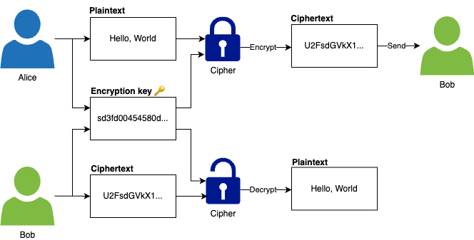
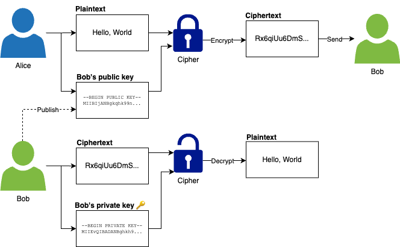
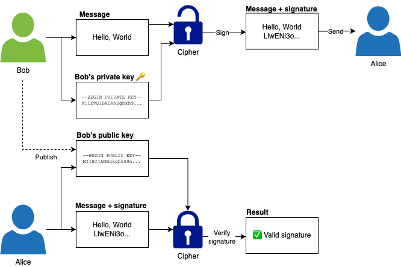

---
markmap:
  htmlParser:
    selector: h1,h2,h3,h4,h5,h6
---

# Chapter 8: How to Secure Communication, Storage, and Authentication

Data is one of the biggest asset of your company.

A secure networking is the first layer of defense for your company's data, (system & business secret).

But it's important to have more layers of defense for your data, via:

- **Secure communication**:

  Protect your data from unauthorized snooping, interference while it travels over the network, with:

  - Encryption-in-transit
  - Secure transport protocols: TLS, SSH, IPSec...

- **Secure storage**:

  Protect your data from unauthorized snooping, interference while it's in the storage, with:

  - Encryption-at-rest
  - Secrets management
  - Password storage
  - Key management

This chapter will walk you through a several hand-on examples about secure data:

- Encrypt data with AES, RSA
- Verify file integrity with SHA-256, HMAC, digital signatures
- Store secrets with AWS Secrets Manager
- Serve your apps over HTTPs, by setting up TLS certificates with Let's Encrypt

## Cryptography Primer

cryptography
: the study of how to protect data from adversaries (aka _bad actors_)

> [!WARNING]
> Don't confuse _cryptography_ with _crypto_, which these days typically refers to _cryptocurrency_.

- Cryptography aims to provide 3 key benefits - aka _CIA_:

  - **C**onfidentiality

    Data can be _seen_ only by **intended** parties.

  - **I**ntegrity

    Data can't be **unauthorized** _modified_.

  - **A**uthenticity

    Data are _communicated_ only between **intended** parties.

- Cryptography combines multiple disciplines: mathematics, computer science, information security, electrical engineering...

- If you're _not_ a professional, do _not_ invent your own cryptography.

  - > Anyone, from the most clueless amateur to the best cryptographer, can create an algorithm that he himself can’t break. It’s not even hard. What is hard is creating an algorithm that no one else can break, even after years of analysis.
    >
    > - Schneir's law

  - Cryptography isn't like other software:

    - For most softwares, you're dealing with
      - users with mildly engaged at best
      - minor bugs
    - For cryptography, you're dealing with
      - determined opponents who are doing everything to defeat you
      - any bug found by them can be completely catastrophic

  - After centuries of existence, the number of techniques, attacks, strategies, schemes, tricks in cryptography are exceeds what any one person - without extensive training - could conceive.

    e.g.

    - side-channel attacks, timing attacks, man-in-the-middle attacks, replay attacks, injection attacks, overflow attacks, padding attacks, bit-flipping attacks...
    - and [countless others](https://en.wikipedia.org/wiki/Category:Cryptographic_attacks)

    > [!TIP]
    > Some of these attacks are brilliant, some are hilarious, some are devious and many are entirely unexpected.

  - Just as all software, all cryptography has vulnerabilities, but only after years of extensive usage and attacks - those vulnerabilities are found and fixed.

> [!IMPORTANT] Key takeaway #1
>
> Don’t roll your own cryptography: always use mature, battle-tested, proven algorithms and implementations.

---

This section provides 2 foundational concepts of cryptography at a high level:

- Encryption
- Hashing

### Encryption

#### What is encryption

encryption
: the process of transforming data so that only authorized parties can understand it

The data

- in its original form (called _plaintext_)

  - with a secret _encryption key_

- is passed through an algorithm called a _cipher_

- so it can be _encrypted_

  - into a new form called the _ciphertext_.

  > [!TIP]
  > Without the encryption key, the ciphertext should be completely unreadable, indistinguishable from a random string.

  ```text
   Original data  -->  Encrypt                    --> Encrypted data
  (plaintext)         (with a cipher algorithm)      (ciphertext)
        +
   Encryption key
  ```

The only way to get back the original plaintext is to

- use the cipher with the encryption key to
- _decrypt_ the cipher back into the plain text

  ```text
   Original data  <--  Decrypt                    <-- Encrypted data
  (plaintext)         (with that cipher algorithm    (ciphertext)
                       and the encryption key)
  ```

---

Most modern cryptography systems

- Are built according to _Kerckhoffs’s principle_, which states that the system should remain secure even if everything about the system, except the encryption key, is public knowledge.

  > [!TIP]
  > Kerckhoffs’s principle is essentially the opposite of _security through obscurity_, where your system is only secure as long as adversaries don’t know how that system works under the hood, an approach that rarely works in the real world

- Should still not be _feasible_[^1][^2] for the adversary to turn the cipher text back into plaintext (without the encryption key)

  - even if the adversary knows every single detail of how that system works

#### Three types of encryptions

##### Symmetric-key encryption

###### What is symmetric-key encryption

Symmetric-key encryption
: uses a single encryption key, which must be kept a secret, for both encryption and decryption

e.g.

- Alice uses a symmetric-key cipher and an encryption key to encrypt plaintext for Bob, and Bob uses the same encryption key to decrypt the ciphertext

  

###### How symmetric-key encryption works

Under the hood, symmetric-key encryption algorithms use the encryption key to perform a number of _transformations_ on the plaintext, mostly consisting of _substitutions_ and _transpositions_.

- A _substitution_ is where you exchange one symbol for another:

  e.g. Swap one letter in the alphabet for another, such as shifting each letter by one, so A becomes B, B becomes C, and so on.

- A _transposition_ is where the order of symbols is rearranged:

  e.g. Anagrams, where you randomly rearrange the letters in a word, so that "hello" becomes "leohl"

Modern encryption algorithms also use substitution and transposition, but in much more complicated, non-uniform patterns that depend on the encryption key.

###### Symmetric-key encryption algorithms

There are many well-known symmetric-key encryption algorithms: DES, 3DES, RC2, RC4, RC5, RC6, Blowfish, Twofish, **AES**, Salsa20, and **ChaCha20**.

- Most of them are outdated and considered insecure.
- As of 2024, the symmetric-key encryption algorithms you should use are:

  - **AES (Advanced Encryption Standard)**:

    - Winner of a competition organized by NIST, official recommendation of the US government
    - Extremely fast[^3]
    - Consider the facto standard: widely supported, after 2 decades still considered highly secure

    > [!TIP]
    > You should use the version of AES that includes a _MAC[^4] (message authentication code)_ - the _AES-GSM_.

  - **ChaCha**:

    - Winner of a competition organized by eSTREAM
    - Extremely fast:
      - On CPUs with AES instruction sets, slower than AES
      - On general hardware, faster than AES
    - Newer cipher, highly secure (more than AES in theoretically against certain types of attacks), but not widely supported

    > [!TIP]
    > You should use also use the version of ChaCha that includes a MAC - the _ChaCha20-Poly1305_

  > [!TIP]
  > In August 2024, NIST released a final set of encryption tools designed to withstand the attack of a quantum computer.
  >
  > For more information, see:
  >
  > - [NIST Releases First 3 Finalized Post-Quantum Encryption Standards](https://www.nist.gov/news-events/news/2024/08/nist-releases-first-3-finalized-post-quantum-encryption-standards)
  > - [NIST’s first post-quantum standards | CloudFlare](https://blog.cloudflare.com/nists-first-post-quantum-standards/)

###### Advantages & disadvantages of symmetric-key encryption

- Advantages

  - Faster
  - More efficient

- Disadvantages

  - It's hard to distribute the encryption key in a secure manner

    - Before 1970s, the only solution was to share encryption keys via an _out-of-band channel_,

      e.g. Exchanging them in person

    - From 1970s, there is a new solution - asymmetric-key encryption - another type of encryption.

##### Asymmetric-key encryption

###### What is asymmetric-key encryption

asymmetric-key encryption
: aka _public-key encryption_
: uses a pair of related keys (called **key pair**), which include
: - a **public key** that can be shared with anyone and used to _encrypt_ data
: - a corresponding **private key**, which must be kept a secret, and can be used to _decrypt_ data

e.g.

- Alice uses an asymmetric-key cipher and Bob’s public key to encrypt plaintext for Bob, and Bob uses his private key to decrypt the ciphertext
- 

###### How asymmetric-key encryption works

The public/private key and the encryption/decryption are all based on **mathematical functions**.

All the high level:

- you can use these functions to create a linked public & private key,
- the data encrypted with the public key can only be decrypted with the corresponding private key
- it’s safe to share the public key[^5]

###### Asymmetric-key encryption algorithms

The two most common asymmetric-key algorithms you should use are:

- **RSA**[^6]

  - One of the first asymmetric-key algorithm.
  - Based on prime-number factorization, easy to understand.
  - Introduce in 1970:
    - Widely used
    - Has vulnerabilities in early versions

  > [!TIP]
  > You should you the RSA version with _Optimal Asymmetric Encryption Padding_ - the _RSA-OAEP_[^7]:

- **Elliptic Curve Cryptography (ECC)**[^10]

  - New asymmetric-key algorithm.
  - Based on math of elliptic curves.
  - More secure

  > [!TIP]
  > You should use _ECIES[^8] (Elliptic Curve Integrated Encryption Scheme)_

  > [!TIP]
  > For SSH, you should use _Edwards-curve Digital Signature Algorithm (EdDSA)_, which is also a type of Elliptic Curve Cryptography.

###### Advantages & disadvantages of asymmetric-key encryption

- Advantages

  You don't need to share an encryption key in advance[^9].

  > [!NOTE]
  > Asymmetric-key encryption makes it possible to have secure digital communications over the Internet, even with total strangers, where you have no pre-existing out-of-band channel to exchange encryption keys.

- Disadvantages

  - Slower
  - Limited in the size of messages you can encrypt

    > [!NOTE]
    > It’s rare to use asymmetric-key encryption by itself.

##### Hybrid encryption

###### What is hybrid encryption

Hybrid encryption
: combines both asymmetric and symmetric encryption:
: - using asymmetric-key encryption initially to exchange an encryption key
: - then symmetric-key encryption for all messages after that.

e.g. Alice wants to send a message to Bob

- First, she generates a random encryption key to use for this session, encrypts it using Bob’s public key and asymmetric-key encryption.
- Then, she sends this encrypted message to Bob.
- Finally, she uses symmetric-key encryption with the randomly-generated encryption key to encrypt all subsequent messages to Bob

###### Advantages of hybrid encryption

- **Performance**

  Most the encryption is done with symmetric-key encryption, which is fast, efficient (and has no limits on message sizes).

- **No reliance on out-of-band channels**

  Asymmetric-key encryption is used to exchange the encryption key that will be use for symmetric-key encryption.

- **Forward secrecy**

  Even in the disastrous scenario where a malicious actor is able to compromise Alice’s private key, they still won’t be able to read any of the data in any previous conversation.

  e.g. Alice wants to send multiple messages to Bob:

  - Each of those messages is encrypted with a different, randomly-generated encryption key, which Alice never stores.

> [!NOTE]
> ECIES, the recommended for asymmetric-key encryption in the previous section, is actually a hybrid encryption approach:
>
> It is a trusted standard for doing:
>
> - a secure key exchange using elliptic curve cryptography for asymmetric-key encryption,
> - followed by symmetric-key encryption using one of several configurable algorithms, e.g., AES-GCM.

#### Example: Encryption and decryption with OpenSSL

> [!WARNING] Watch out for snakes: Don’t use OpenSSL to encrypt data in production
>
> The OpenSSL binary is available on most systems,
>
> - so it’s convenient for learning and experimenting,
> - but don't use it to encrypt data for production, as
>   - the algorithms it supports are dated and incomplete (e.g., it doesn’t support AES-GCM)
>   - the defaults it exposes are insecure and error-prone.
>
> ---
>
> For production use cases, use
>
> - mature cryptography libraries built into programming languages
>
>   e.g.
>
>   - the [Go crypto library](https://pkg.go.dev/crypto)
>   - [Java Cryptography Architecture](https://docs.oracle.com/javase/8/docs/technotes/guides/security/crypto/CryptoSpec.html)
>
> - or CLI tools such as [GPG](https://gnupg.org/) or [age](https://github.com/FiloSottile/age).

---

- **Symmetric encryption**

  1. **Encrypt**: Encrypt the text "Hello, World" using AES with a 128-bit key and the CBC (Cipher Block Chaining) encryption mode

     ```bash
     echo "Hello, World" | openssl aes-128-cbc -base64 -pbkdf2
     # enter AES-128-CBC encryption password:
     # Verifying - enter AES-128-CBC encryption password:
     # U2FsdGVkX1+2EfpXt+6xFrLk+mt524auRPHhdyk7Cis= 👈 This is the ciphertext (from the plaintext "Hello, World")
     ```

     - `openssl` prompt you for the password twice:

       - Use the `-pbkdf2` flag to tell OpenSSL to use a _key derivation function_ called _PBKDF2_ to derive a 128-bit key from that password.

         > [!TIP]
         > For production, you should use a randomly-generated, 128-bit key instead of a password.

       - The output `U2Fsd` is the ciphertext.

  2. **Decrypt**: Decrypt using the same algorithm and key (password)

     ```bash
     echo "<CIPHERTEXT>" | openssl aes-128-cbc -d -base64 -pbkdf2
     # enter AES-128-CBC decryption password:
     # Hello, World
     ```

     - Use the `-d` flag to tel OpenSSL to decrypt

---

- **Asymmetric encryption**

  1. **Create a key pair**

     - Generate a RSA private key by using `openssl genrsa`

       ```bash
       openssl genrsa -out private-key.pem 2048
       ```

     - Generate the public key from the private key by using `openssl rsa -pubout`

       ```bash
       openssl rsa -pubout -in private-key.pem -out public-key.pem
       ```

  2. **Encrypt**: Use `openssl pkeyutl -encrypt` to encrypt the text "Hello, World" (with the public key)

     ```bash
     echo "Hello, World" | \
       openssl pkeyutl -encrypt -pubin -inkey public-key.pem | \
       openssl base64
     # IXHy488ItT...# 👈 CIPHERTEXT
     ```

     - By default, the output of `openssl pkeyutl -encrypt` is standard output.
     - Pipe the `stdout` to `openssl base64` to encode the binary data (a file) to base64.

  3. **Decrypt**: Use `openssl pkeyutl -decrypt` to decrypt the ciphertext back to the plaintext (with the private key)

     ```bash
     echo "<CIPHERTEXT>" | \
       openssl base64 -d | \
       openssl pkeyutl -decrypt -inkey private-key.pem
     # Hello, World
     ```

     - First, decode the ciphertext (base64) back to the binary format (a file).
     - Then, use `openssl pkeyutl -decrypt` to decrypt the ciphertext.

### Hashing

#### What is hashing

hashing
: the process of _map_ data (of arbitrary size) to **fixed-size values**

hash function
: a function that can
: - take data (e.g. string, file) as input, and
: - convert it to a fixed-size value (aka a _hash value_, a _digest_, a _hash_), in a deterministic manner, so that
: given the **same input**, you always get the **same output**.

e.g. The `SHA-256` hash function

- always produces a 256-bit output, whether you feed into it a file that is 1 bit long or 5 million bits long, and
- given the same file, you always get the same 256-bit output.

Hash functions are _one-way transformations_:

- it’s easy to feed in an input, and get an output,
- but given just the output,
  - there is no way to get back the original input.

> [!NOTE]
> This is a difference from encryption functions, which are _two-way transformations_, where
>
> - given an output (and an encryption key),
>   - you can always get back the original input.

#### Two types of hash functions

##### Non-cryptographic hash functions

Used in application that don't have rigorous security requirements.

e.g.

- Hash tables (in programming languages)
- Error-detecting codes
- Cyclic redundancy checks
- Bloom filters

##### Cryptographic hash functions

Have special properties that are desirable for cryptography, including:

- **Pre-image resistance**

  Given a hash value (the output), there’s no way to

  - figure out the **original string** (the input) that
    - was fed into the hash function to produce that output

- **Second pre-image resistance**

  Given a hash value (the output), there’s no way to

  - find **any inputs** (the original string or any other input) that
    - could be fed into the hash function to produce this output.

- **Collision resistance**

  There’s no way to

  - find any two strings (any two inputs) that
    - produce the **same hash value** (the same output).

#### Cryptographic hashing algorithms

The common cryptographic hashing algorithms out there are

- MD5
- SHA[^11] families: SHA-0, SHA-1, **SHA-2**, **SHA-3**
- **SHAKE**, and **cSHAKE**

---

Many of them are no longer considered secure, except:

- **SHA-2** and **SHA-3**

  SHA-2 family: including `SHA-256`, `SHA-512`
  SHA-3 family: including `SHA3-256`, `SHA3-512`

- **SHAKE**[^12] and **cSHAKE**[^13]

  Based on SHA-3, added the ability to produce an output of any length you specified (aka _extendable output functions_)

#### Use cases of cryptographic hash functions

##### Verifying the integrity of messages and files

When making a file available for download, it's common to share the hash of the file contents, too.

e.g.

- The binary release of Golang 1.23.1 for Linux x86-64 is available
  - as a file at [go1.23.1.linux-amd64.tar.gz](https://go.dev/dl/go1.23.1.linux-amd64.tar.gz)
  - with a SHA256 Checksum of `49bbb517cfa9eee677e1e7897f7cf9cfdbcf49e05f61984a2789136de359f9bd` ([Source](https://go.dev/dl/))

> [!TIP]
> When using to verify the integrity of a file, the hash value is aka _checksum_.

> [!TIP]
> There are projects that provides even more transparent for how your private key is used to sign a file.
>
> e.g. [Sigsum](https://www.sigsum.org/)

##### Message authentication codes (MAC)

A message authentication code (MAC)
: combines a hash with a secret key
: to create an _authentication tag_ for some data that
: allows you to verify
: - not only the integrity of the data (that no one modified it),
: - but also the authenticity (that the data truly came from an intended party)

e.g. For a cookie with username on your website

- If you store _just_ the username, a malicious actor could create a cookie pretending to any user.
- So you store:
  - the username
  - an authentication tag, which is computed from
    - the username
    - a secret key
- Every time you get a cookie, you
  - compute the authentication tag from
    - the username 👈 may be changed by malicious actor
    - your secret key 👈 only you have this
  - compare with the authentication in the cookie
  - if these 2 authentication tags match, you can be confident that the cookie is written you.

---

Common MAC algorithms:

- **HMAC (Hash-based MAC)**

  A standard based on various hash function, e.g. HMAC-SHA256

- **KMAC**

  Based on cSHAKE.

##### Authenticated encryption

> [!NOTE]
> If you only use symmetric-key encryption, unauthorized parties:
>
> - can't _see_ the data
> - but they might _modified_ that data

Instead of using symmetric-key encryption by itself, you almost always use it with a MAC, which are called _authenticated encryption_:

- The symmetric-encryption encryption:

  - The message is impossible to understand without the secret key 👈 confidentiality

- The MAC:

  - For every encrypted message, you:

    - calculate an authenticated tag, then include it (as plaintext) with the messages, aka _associated data (AD)_

  - When you receive a message, you:

    - calculate another authenticated tag from:

      - the message + the AD
      - your secret key (that only you have) 👈 authenticity

    - if the two authenticated tag match, you can be sure both:

      - the message
      - the AD

      could not have been tampered with 👈 integrity

> [!TIP]
> The two recommended symmetric-key encryption algorithms in [previous chapter](#symmetric-key-encryption-algorithms) - AES-GCM and ChaCha20-Poly1305 - are actually _authenticated encryption with associated data (AEAD)_[^14].

##### Digital signatures

digital signature
: combine a hash function with asymmetric-key encryption
: allow validating the integrity and authenticity

You

- take any message
- pass it along with your private key
- get an output called a signature
- then send that signature with the original message

Anyone can validate the signature using your public key and the message.

---

e.g. Bob signs a message with his private key, and sends the message and signature to Alice, who can validate the signature using Bob’s public key


##### Password storage

There a a set of cryptographic hashing algorithms used specifically for storing user passwords.

> [!WARNING]
> For user passwords, do not use encryption, instead using hashing (with the specialized password hashing functions).

---

| First ingredient - Hashing   | Second ingredient - Encryption | Third ingredient | Result                                                                                      | CIA   |
| ---------------------------- | ------------------------------ | ---------------- | ------------------------------------------------------------------------------------------- | ----- |
| Hashing                      |                                |                  | [Verifying the integrity of messages/files](#verifying-the-integrity-of-messages-and-files) | \_I\_ |
| Hashing                      |                                | Secret key       | [Message authentication codes (MAC)](#message-authentication-codes-mac)                     | \_IA  |
| Hashing (MAC)                | Symmetric-key encryption       | Secret key (MAC) | [Authenticated encryption](#authenticated-encryption)                                       | CIA   |
| Hashing                      | Asymmetric-key encryption      |                  | [Digital signatures](#digital-signatures)                                                   | \_IA  |
| Hashing (Special algorithms) |                                |                  | [Storing user passwords](#password-storage)                                                 | C\_\_ |

#### Example: File integrity, HMAC, and signatures with OpenSSL

- Using hash functions to check integrity of a file

  - Create a file

    ```bash
    echo "Hello, World" > file.txt
    ```

  - Calculate the hash using SHA-256

    ```bash
    openssl sha256 file.txt
    # SHA2-256(file.txt)= 8663bab6d124806b9727f89bb4ab9db4cbcc3862f6bbf22024dfa7212aa4ab7d
    ```

  - Make a change to the file

    ```bash
    sed -i 's/W/w/g' file.txt
    ```

  - Re-calculate the hash using SHA-256

    ```bash
    openssl sha256 file.txt
    # SHA2-256(file.txt)= 37980c33951de6b0e450c3701b219bfeee930544705f637cd1158b63827bb390
    ```

    👉 Changing a single character, but the hash is completely different.

---

- Using MAC to check integrity & authenticity of a file

  - Use the `password` string as the secret key for HMAC

    ```bash
    openssl sha256 -hmac password file.txt
    # HMAC-SHA2-256(file.txt)= 3b86a735fa627cb6b1164eadee576ef99c5d393d2d61b7b812a71a74b3c79423
    ```

  - Change the letter `H` to `h`

    ```bash
    sed -i 's/H/h/g' file.txt
    ```

  - Re-calculate the HMAC using the same secret key

    ```bash
    openssl sha256 -hmac password file.txt
    # HMAC-SHA2-256(file.txt)= 1b0f9f561e783df65afec385df2284d6f8419e600fb5e4a1e110db8c2b50e73d
    ```

  - Re-calculate the HMAC using a different secret key

    ```bash
    openssl sha256 -hmac password1 file.txt
    # HMAC-SHA2-256(file.txt)= 7624161764169c4e947f098c41454986d934f7b07782b8b1903b0d10b90e0d8a
    ```

    - If malicious actors don't have the your secret key, they can't get back the same HMAC as your.

---

- Digital signature

  - Reuse the key pair from previous example
  - Compute the signature for `file.txt` using your private key

    ```bash
    openssl sha256 -sign private-key.pem -out file.txt.sig file.txt
    ```

  - Validate the signature using your public key

    ```bash
    openssl sha256 -verify public-key.pem -signature file.txt.sig file.txt
    # Verified OK
    ```

  ***

  - Modify anything: the signature in `file.txt.sig`, the contents of `file.txt`, the private key, the public key and the signature verification will fail.

    ```bash
    sed -i 's/, / /g' file.txt
    ```

  - Re-validate the signature

    ```bash
    openssl sha256 -verify public-key.pem -signature file.txt.sig file.txt
    # Verification failure
    # ...bad signature...
    ```

## Secure Storage

### Secrets Management

#### Two rules when working with secrets

> [!IMPORTANT] Key takeaway #2
>
> Do not store secrets as plaintext.

---

#### Three types of secrets

- Personal secrets
- Infrastructure secrets
- Customer secrets

#### How to avoid storing secrets

- Single-sign on (SSO)
- Third-party services
- Don't store the data at all

> [!IMPORTANT] Key takeaway #3
>
> Avoid storing secrets whenever possible by using SSO, 3rd party services, or just not storing the data at all.

#### Working with secrets

##### Working work personal secrets

- _Password manager_:

  - Standalone: 1Password, Bitwarden
  - OS built-in
  - Web-browser built-in

- What make a password strong?

  - Unique
  - Long
  - Hard-to-guess

- How to come-up with a _strong password_? What is Diceware?

> [!IMPORTANT] Key takeaway #4
>
> Protect personal secrets, such as passwords and credit card numbers, by storing them in a password manager.

- What make a good password manager?

  - Security practices
  - Reputation
  - Unique, randomly-generated passwords
  - Secure account access
  - Secure sharing with families and teams
  - Platform support

##### Working work infrastructure secrets

- Two kinds of secret store for infrastructure secrets:

  - Key management systems (KMS)
  - General-purpose secret store

- How to use a secret store for infrastructure secrets?

> [!IMPORTANT] Key takeaway #5
>
> Protect infrastructure secrets, such as database passwords and TLS certificates, by using a KMS and/or a general-purpose secret store.

- Why general-purpose secret store is becoming more popular?

  The benefits of centralization secret store?

  - Audit logging
  - Revoking & rotating secrets
  - On-demand & ephemeral secrets

##### Working work customer secrets

- How to store customer secrets (password)?

  - Store the hash of the password
  - Use specialized password hash functions
  - Use salt and pepper

> [!IMPORTANT] Key takeaway #6
>
> Never store user passwords (encrypted or otherwise). Instead, use a password hash function to compute a hash of each password with a salt and pepper, and store those hash values.

### Encryption at Rest

- Why stored data is a tempting target for attackers?

  - Many copies of the data
  - Long time frames, little monitoring

- Three level of encryption-at-rest

  - Full-disk encryption

  - Data store encryption

  - Application-level encryption

> [!IMPORTANT] Key takeaway #7
>
> You can encrypt data at rest using full-disk encryption, data store encryption, and application-level encryption.

## Secure Communication

### Encryption-in-transit

### Common protocols for encryption-in-transit

- TLS
- SSH
- IPSec

### Transport Layer Security (TLS)

#### How TLS work

- Handshake
  - Negotiation
  - Authentication
  - Key exchange
- Exchange messages

---

- Chain of trust

  - Root certificate authorities (CAs)

- How to get a TLS certificate (for a website) from a CA?

- How the TLS certificate (for your website) is used?

> [!IMPORTANT] Key takeaway #8
>
> You can encrypt data in transit using TLS. You get a TLS certificate from a certificate authority.

---

- Public key infrastructure (PKI)
  - Web PKI
  - Private PKI

### Example: HTTPS with Let's Encrypt and AWS Secrets Manager

- Get a TLS certificate from LetsEncrypt

- Store the TLS certificate in AWS Secrets Manager

- Deploy EC2 instances that use the TLS certificate

### Get your hands dirty: Securing communications and storage

### End-to-End Encryption

#### What is End-to-End Encryption

> [!IMPORTANT] Key takeaway #9
>
> Use end-to-end encryption to protect data so that no one other than the intended recipients can see it—not even the software provider.

---

#### Working with End-to-End Encryption

##### What encryption key do you use for E2E encryption?

##### What data needs to be E2E encrypted and what doesn’t?

##### How do you establish trust with E2E-encrypted software?

- The software vendor could be lying
- The software vendor could have back-doors
- The software could have bugs

## Conclusion

- Key takeaways for secure data:

  | You ...                       | ... type of data                                  | Example                            | Note                                                                                             |
  | ----------------------------- | ------------------------------------------------- | ---------------------------------- | ------------------------------------------------------------------------------------------------ |
  | Don't roll your own           | cryptography                                      |                                    | always use mature, battle-tested, proven algorithms & implementations.                           |
  |                               |                                                   |                                    |                                                                                                  |
  | Avoid storing                 | secrets                                           |                                    | by using SSO, 3rd-party services, or not storing it at all                                       |
  | If you can't avoid storing    | secrets                                           |                                    | do not store them as plaintext                                                                   |
  | Protect                       | - personal secrets                                | password, credit card              | by using a password manager                                                                      |
  | Protect                       | - infrastructure secrets                          | TLS certificate, database password | by using a KMS and/or a general-purpose secret store                                             |
  | Never store                   | - passwords                                       | (encrypted or unencrypted)         | instead use a hash function (with a salt & pepper), and store the hash values                    |
  |                               |                                                   |                                    |                                                                                                  |
  | Encrypt                       | data-at-rest                                      |                                    | using:<br/>- full-disk encryption<br/>- data store encryption<br/>- application-level encryption |
  | Encrypt                       | data-in-transit                                   |                                    | using TLS (that you get from a certificate authority - CA)                                       |
  | Use end-to-end encryption for | data that only the intended recipients can see it | Signal messages                    | Not even you, NSA, or FBI can see it.                                                            |

- A cheat sheet of how to handle common cryptographic use cases

  | Use case                                                               | Solution                                     | Example recommended tools                   |
  | ---------------------------------------------------------------------- | -------------------------------------------- | ------------------------------------------- |
  | Store personal secrets (e.g., passwords)                               | Use a password manager                       | [1Password], [Bitwarden]                    |
  | Store infrastructure secrets (e.g., TLS certificate)                   | Use a secret store or KMS                    | [OpenBao], [AWS Secrets Manager], [AWS KMS] |
  | Store customer passwords                                               | Store the hash of (password + salt + pepper) | [Argon2id], [scrypt], [bcrypt]              |
  |                                                                        |                                              |                                             |
  | Encrypt data at rest                                                   | Use authenticated encryption                 | [AES-GCM], [ChaCha20-Poly1305]              |
  | Encrypt data in transit over the public Internet                       | Use TLS with a certificate from a public CA  | [Let's Encrypt], [AWS Certificate Manager]  |
  | Encrypt data in transit in a private network                           | Use TLS with a certificate from a private CA | [Istio], [Linkerd], [OpenBao], [step-ca]    |
  |                                                                        |                                              |                                             |
  | Validate data integrity (e.g., no one tampered with a file)            | Use a cryptographic hash function            | [SHA-2], [SHA-3]                            |
  | Validate data integrity and authenticity (e.g., no one faked a cookie) | Use a MAC                                    | [HMAC], [KMAC]                              |

[1Password]: https://1password.com/
[Bitwarden]: https://bitwarden.com/
[OpenBao]: https://openbao.org/
[AWS Secrets Manager]: https://aws.amazon.com/secrets-manager/
[AWS KMS]: https://aws.amazon.com/kms/
[Argon2id]: https://en.wikipedia.org/wiki/Argon2
[scrypt]: https://en.wikipedia.org/wiki/Scrypt
[bcrypt]: https://en.wikipedia.org/wiki/Bcrypt
[AES-GCM]: https://en.wikipedia.org/wiki/Galois/Counter_Mode
[ChaCha20-Poly1305]: https://en.wikipedia.org/wiki/ChaCha20-Poly1305
[Let's Encrypt]: https://letsencrypt.org/
[AWS Certificate Manager]: https://aws.amazon.com/certificate-manager/
[Istio]: https://istio.io/latest/about/service-mesh/
[Linkerd]: https://linkerd.io/
[step-ca]: https://smallstep.com/docs/step-ca//fundamentals-of-devops
[SHA-2]: https://en.wikipedia.org/wiki/SHA-2
[SHA-3]: https://en.wikipedia.org/wiki/SHA-3
[HMAC]: https://en.wikipedia.org/wiki/HMAC
[KMAC]: https://www.nist.gov/publications/sha-3-derived-functions-cshake-kmac-tuplehash-and-parallelhash

[^1]:
    The vast majority of ciphers aim for computational security, where the resources and time it would take to break the cipher are so high, that it isn’t _feasible_ in the real world.

    - To put that into perspective, a cryptographic system is considered _strong_ if the only way to break it is through _brute force_ algorithms, where you have to try every possible encryption key.

    - If the key is N bits long, then to try every key, you’d have to try $2^N$ possibilities, which grows at an astonishing rate, so by the time you get to a $128$-bit key, it would take the world’s fastest supercomputer far longer than the age of the universe to try all $2^{128}$ possibilities.

      As of 2024, the world’s fastest distributed computer is the Frontier system at Oak Ridge National Laboratory, which was able to perform $1.2 exaFLOPS$, or about $1.2$ x $10^{18}$ floating point operations per second.

      - That’s a remarkable accomplishment, but even if you generously assume that you could try one key per floating point operation, this system would need to run for roughly $9$ trillion years to perform $2^{128}$ floating point operations, which is $650$ times longer than the age of the universe ($13.8$ billion years).

[^2]:
    You could only say "not be _possible_" about the small number of ciphers that offer _perfect secrecy_ (AKA _information-theoretic security_), where they are secure even against adversaries with unlimited resources and time.

    e.g. For example, with the _one-time pad cipher_, you convert plaintext to ciphertext by applying the exclusive or (XOR) operator to each bit of the plaintext with a bit from the encryption key, where the encryption key is a randomly-generated set of data that is at least as long as the plaintext, that you use once, and then never again (hence the "one-time" in the name).

[^3]: Some CPUs even have built-in AES instruction sets to make it even faster
[^4]: Not the MAC as in MAC address (medium access control address)
[^5]: As there’s no way to derive the corresponding private key from a public key (other than brute force, which is not feasible with the large numbers used in asymmetric-key encryption).
[^6]: The name RCA is based on the surnames (Rivest, Shamir, Adleman) of its creators
[^7]: RSA-OAEP is a part of Public-Key Cryptography Standards (PKCS) #2 - the second family of standards - the latest of which is v2.2 from October 2012.
[^8]: ECIES is actually a hybrid approach that combines asymmetric-key and symmetric-key encryption, as discussed next.
[^9]: Each user shares their public keys, and all other users can use those to encrypt data.
[^10]: <https://blog.cloudflare.com/a-relatively-easy-to-understand-primer-on-elliptic-curve-cryptography/>
[^11]: The Secure Hash Algorithm (SHA) family is a set of cryptographic hash functions created by the NSA
[^12]: SHAKE (Secure Hash Algorithm and KECCAK)
[^13]: cSHAKE (customizable SHAKE)
[^14]: <https://en.wikipedia.org/wiki/Authenticated_encryption#Authenticated_encryption_with_associated_data>
