---
markmap:
  initialExpandLevel: 6
  colorFreezeLevel: 5
  htmlParser:
    selector: h1,h2,h3,h4,h5,h6
---

# Chapter 8: How to Secure Communication, Storage, and Authentication

Data is one of the biggest asset of your company.

A secure networking is the first layer of defense for your company's data, (system & business secret).

But it's important to have more layers of defense for your data, via:

- **Secure communication**:

  Protect your data from unauthorized snooping, interference while it travels over the network, with:

  - Encryption-in-transit
  - Secure transport protocols: TLS, SSH, IPSec...

- **Secure storage**:

  Protect your data from unauthorized snooping, interference while it's in the storage, with:

  - Encryption-at-rest
  - Secrets management
  - Password storage
  - Key management

This chapter will walk you through a several hand-on examples about secure data:

- Encrypt data with AES, RSA
- Verify file integrity with SHA-256, HMAC, digital signatures
- Store secrets with AWS Secrets Manager
- Serve your apps over HTTPs, by setting up TLS certificates with Let's Encrypt

## Cryptography Primer

cryptography
: the study of how to protect data from adversaries (aka _bad actors_)

> [!WARNING]
> Don't confuse _cryptography_ with _crypto_, which these days typically refers to _cryptocurrency_.

- Cryptography aims to provide 3 key benefits - aka _CIA_:

  - Confidentiality

    Data can be _seen_ only by **intended** parties.

  - Integrity

    Data can't be **unauthorized** _modified_.

  - Authenticity

    Data are _communicated_ only between **intended** parties.

- Cryptography combines multiple disciplines: mathematics, computer science, information security, electrical engineering...

- If you're _not_ a professional, do _not_ invent your own cryptography.

  - > Anyone, from the most clueless amateur to the best cryptographer, can create an algorithm that he himself can’t break. It’s not even hard. What is hard is creating an algorithm that no one else can break, even after years of analysis.
    >
    > - Schneir's law

  - Cryptography isn't like other software:

    - For most softwares, you're dealing with
      - users with mildly engaged at best
      - minor bugs
    - For cryptography, you're dealing with
      - determined opponents who are doing everything to defeat you
      - any bug found by them can be completely catastrophic

  - After centuries of existence, the number of techniques, attacks, strategies, schemes, tricks in cryptography are exceeds what any one person - without extensive training - could conceive.

    e.g.

    - side-channel attacks, timing attacks, man-in-the-middle attacks, replay attacks, injection attacks, overflow attacks, padding attacks, bit-flipping attacks...
    - and [countless others](https://en.wikipedia.org/wiki/Category:Cryptographic_attacks)

    > [!TIP]
    > Some of these attacks are brilliant, some are hilarious, some are devious and many are entirely unexpected.

  - Just as all software, all cryptography has vulnerabilities, but only after years of extensive usage and attacks - those vulnerabilities are found and fixed.

> [!IMPORTANT] Key takeaway #1
>
> Don’t roll your own cryptography: always use mature, battle-tested, proven algorithms and implementations.

---

This section provides 2 foundational concepts of cryptography at a high level:

- Encryption
- Hashing

### Encryption

#### What is encryption

encryption
: the process of transforming data so that only authorized parties can understand it

The data

- in its original form (called _plaintext_)

  - with a secret _encryption key_

- is passed through an algorithm called a _cipher_

- so it can be _encrypted_

  - into a new form called the _ciphertext_.

  > [!TIP]
  > Without the encryption key, the ciphertext should be completely unreadable, indistinguishable from a random string.

  ```text
   Original data  -->  Encrypt                    --> Encrypted data
  (plaintext)         (with a cipher algorithm)      (ciphertext)
        +
   Encryption key
  ```

The only way to get back the original plaintext is to

- use the cipher with the encryption key to
- _decrypt_ the cipher back into the plain text

  ```text
   Original data  <--  Decrypt                    <-- Encrypted data
  (plaintext)         (with that cipher algorithm    (ciphertext)
                       and the encryption key)
  ```

---

Most modern cryptography systems

- Are built according to _Kerckhoffs’s principle_, which states that the system should remain secure even if everything about the system, except the encryption key, is public knowledge.

  > [!TIP]
  > Kerckhoffs’s principle is essentially the opposite of _security through obscurity_, where your system is only secure as long as adversaries don’t know how that system works under the hood, an approach that rarely works in the real world

- Should still not be _feasible_[^1][^2] for the adversary to turn the cipher text back into plaintext (without the encryption key)

  - even if the adversary knows every single detail of how that system works

#### Three types of encryptions

##### Symmetric-key encryption

###### What is symmetric-key encryption

Symmetric-key encryption
: uses a single encryption key, which must be kept a secret, for both encryption and decryption

e.g.

- Alice uses a symmetric-key cipher and an encryption key to encrypt plaintext for Bob, and Bob uses the same encryption key to decrypt the ciphertext

  

###### How symmetric-key encryption works

Under the hood, symmetric-key encryption algorithms use the encryption key to perform a number of _transformations_ on the plaintext, mostly consisting of _substitutions_ and _transpositions_.

- A _substitution_ is where you exchange one symbol for another:

  e.g. Swap one letter in the alphabet for another, such as shifting each letter by one, so A becomes B, B becomes C, and so on.

- A _transposition_ is where the order of symbols is rearranged:

  e.g. Anagrams, where you randomly rearrange the letters in a word, so that "hello" becomes "leohl"

Modern encryption algorithms also use substitution and transposition, but in much more complicated, non-uniform patterns that depend on the encryption key.

###### Symmetric-key encryption algorithms

There are many well-known symmetric-key encryption algorithms: DES, 3DES, RC2, RC4, RC5, RC6, Blowfish, Twofish, **AES**, Salsa20, and **ChaCha20**.

- Most of them are outdated and considered insecure.
- As of 2024, the symmetric-key encryption algorithms you should use are:

  - **AES (Advanced Encryption Standard)**:

    - Winner of a competition organized by NIST, official recommendation of the US government
    - Extremely fast[^3]
    - Consider the facto standard: widely supported, after 2 decades still considered highly secure

    > [!TIP]
    > You should use the version of AES that includes a _MAC[^4] (message authentication code)_ - the _AES-GSM_.

  - **ChaCha**:

    - Winner of a competition organized by eSTREAM
    - Extremely fast:
      - On CPUs with AES instruction sets, slower than AES
      - On general hardware, faster than AES
    - Newer cipher, highly secure (more than AES in theoretically against certain types of attacks), but not widely supported

    > [!TIP]
    > You should use also use the version of ChaCha that includes a MAC - the _ChaCha20-Poly1305_

  > [!TIP]
  > In August 2024, NIST released a final set of encryption tools designed to withstand the attack of a quantum computer.
  >
  > For more information, see:
  >
  > - [NIST Releases First 3 Finalized Post-Quantum Encryption Standards](https://www.nist.gov/news-events/news/2024/08/nist-releases-first-3-finalized-post-quantum-encryption-standards)
  > - [NIST’s first post-quantum standards | CloudFlare](https://blog.cloudflare.com/nists-first-post-quantum-standards/)

###### Advantages & disadvantages of symmetric-key encryption

- Advantages

  - Faster
  - More efficient

- Disadvantages

  - It's hard to distribute the encryption key in a secure manner

    - Before 1970s, the only solution was to share encryption keys via an _out-of-band channel_,

      e.g. Exchanging them in person

    - From 1970s, there is a new solution - asymmetric-key encryption - another type of encryption.

##### Asymmetric-key encryption

###### What is asymmetric-key encryption

asymmetric-key encryption
: aka _public-key encryption_
: uses a pair of related keys (called **key pair**), which include
: - a **public key** that can be shared with anyone and used to _encrypt_ data
: - a corresponding **private key**, which must be kept a secret, and can be used to _decrypt_ data

e.g.

- Alice uses an asymmetric-key cipher and Bob’s public key to encrypt plaintext for Bob, and Bob uses his private key to decrypt the ciphertext
- 

###### How asymmetric-key encryption works

The public/private key and the encryption/decryption are all based on **mathematical functions**.

All the high level:

- you can use these functions to create a linked public & private key,
- the data encrypted with the public key can only be decrypted with the corresponding private key
- it’s safe to share the public key[^5]

###### Asymmetric-key encryption algorithms

The two most common asymmetric-key algorithms you should use are:

- **RSA**[^6]

  - One of the first asymmetric-key algorithm.
  - Based on prime-number factorization, easy to understand.
  - Introduce in 1970:
    - Widely used
    - Has vulnerabilities in early versions

  > [!TIP]
  > You should you the RSA version with _Optimal Asymmetric Encryption Padding_ - the _RSA-OAEP_[^7]:

- **Elliptic Curve Cryptography (ECC)**[^10]

  - New asymmetric-key algorithm.
  - Based on math of elliptic curves.
  - More secure

  > [!TIP]
  > You should use _ECIES[^8] (Elliptic Curve Integrated Encryption Scheme)_

  > [!TIP]
  > For SSH, you should use _Edwards-curve Digital Signature Algorithm (EdDSA)_, which is also a type of Elliptic Curve Cryptography.

###### Advantages & disadvantages of asymmetric-key encryption

- Advantages

  You don't need to share an encryption key in advance[^9].

  > [!NOTE]
  > Asymmetric-key encryption makes it possible to have secure digital communications over the Internet, even with total strangers, where you have no pre-existing out-of-band channel to exchange encryption keys.

- Disadvantages

  - Slower
  - Limited in the size of messages you can encrypt

    > [!NOTE]
    > It’s rare to use asymmetric-key encryption by itself.

##### Hybrid encryption

###### What is hybrid encryption

Hybrid encryption
: combines both asymmetric and symmetric encryption:
: - using asymmetric-key encryption initially to exchange an encryption key
: - then symmetric-key encryption for all messages after that.

e.g. Alice wants to send a message to Bob

- First, she generates a random encryption key to use for this session, encrypts it using Bob’s public key and asymmetric-key encryption.
- Then, she sends this encrypted message to Bob.
- Finally, she uses symmetric-key encryption with the randomly-generated encryption key to encrypt all subsequent messages to Bob

###### Advantages of hybrid encryption

- **Performance**

  Most the encryption is done with symmetric-key encryption, which is fast, efficient (and has no limits on message sizes).

- **No reliance on out-of-band channels**

  Asymmetric-key encryption is used to exchange the encryption key that will be use for symmetric-key encryption.

- **Forward secrecy**

  Even in the disastrous scenario where a malicious actor is able to compromise Alice’s private key, they still won’t be able to read any of the data in any previous conversation.

  e.g. Alice wants to send multiple messages to Bob:

  - Each of those messages is encrypted with a different, randomly-generated encryption key, which Alice never stores.

> [!NOTE]
> ECIES, the recommended for asymmetric-key encryption in the previous section, is actually a hybrid encryption approach:
>
> It is a trusted standard for doing:
>
> - a secure key exchange using elliptic curve cryptography for asymmetric-key encryption,
> - followed by symmetric-key encryption using one of several configurable algorithms, e.g., AES-GCM.

#### Example: Encryption and decryption with OpenSSL

> [!WARNING] Watch out for snakes: Don’t use OpenSSL to encrypt data in production
>
> The OpenSSL binary is available on most systems,
>
> - so it’s convenient for learning and experimenting,
> - but don't use it to encrypt data for production, as
>   - the algorithms it supports are dated and incomplete (e.g., it doesn’t support AES-GCM)
>   - the defaults it exposes are insecure and error-prone.
>
> ---
>
> For production use cases, use
>
> - mature cryptography libraries built into programming languages
>
>   e.g.
>
>   - the [Go crypto library](https://pkg.go.dev/crypto)
>   - [Java Cryptography Architecture](https://docs.oracle.com/javase/8/docs/technotes/guides/security/crypto/CryptoSpec.html)
>
> - or CLI tools such as [GPG](https://gnupg.org/) or [age](https://github.com/FiloSottile/age).

---

- **Symmetric encryption**

  1. **Encrypt**: Encrypt the text "Hello, World" using AES with a 128-bit key and the CBC (Cipher Block Chaining) encryption mode

     ```bash
     echo "Hello, World" | openssl aes-128-cbc -base64 -pbkdf2
     # enter AES-128-CBC encryption password:
     # Verifying - enter AES-128-CBC encryption password:
     # U2FsdGVkX1+2EfpXt+6xFrLk+mt524auRPHhdyk7Cis= 👈 This is the ciphertext (from the plaintext "Hello, World")
     ```

     - `openssl` prompt you for the password twice:

       - Use the `-pbkdf2` flag to tell OpenSSL to use a _key derivation function_ called _PBKDF2_ to derive a 128-bit key from that password.

         > [!TIP]
         > For production, you should use a randomly-generated, 128-bit key instead of a password.

       - The output `U2Fsd` is the ciphertext.

  2. **Decrypt**: Decrypt using the same algorithm and key (password)

     ```bash
     echo "<CIPHERTEXT>" | openssl aes-128-cbc -d -base64 -pbkdf2
     # enter AES-128-CBC decryption password:
     # Hello, World
     ```

     - Use the `-d` flag to tel OpenSSL to decrypt

---

- **Asymmetric encryption**

  1. **Create a key pair**

     - Generate a RSA private key by using `openssl genrsa`

       ```bash
       openssl genrsa -out private-key.pem 2048
       ```

     - Generate the public key from the private key by using `openssl rsa -pubout`

       ```bash
       openssl rsa -pubout -in private-key.pem -out public-key.pem
       ```

  2. **Encrypt**: Use `openssl pkeyutl -encrypt` to encrypt the text "Hello, World" (with the public key)

     ```bash
     echo "Hello, World" | \
       openssl pkeyutl -encrypt -pubin -inkey public-key.pem | \
       openssl base64
     # IXHy488ItT...# 👈 CIPHERTEXT
     ```

     - By default, the output of `openssl pkeyutl -encrypt` is standard output.
     - Pipe the `stdout` to `openssl base64` to encode the binary data (a file) to base64.

  3. **Decrypt**: Use `openssl pkeyutl -decrypt` to decrypt the ciphertext back to the plaintext (with the private key)

     ```bash
     echo "<CIPHERTEXT>" | \
       openssl base64 -d | \
       openssl pkeyutl -decrypt -inkey private-key.pem
     # Hello, World
     ```

     - First, decode the ciphertext (base64) back to the binary format (a file).
     - Then, use `openssl pkeyutl -decrypt` to decrypt the ciphertext.

### Hashing

#### What is hashing

hashing
: the process of _map_ data (of arbitrary size) to **fixed-size values**

hash function
: a function that can
: - take data (e.g. string, file) as input, and
: - convert it to a fixed-size value (aka a _hash value_, a _digest_, a _hash_), in a deterministic manner, so that
: given the **same input**, you always get the **same output**.

e.g. The `SHA-256` hash function

- always produces a 256-bit output, whether you feed into it a file that is 1 bit long or 5 million bits long, and
- given the same file, you always get the same 256-bit output.

Hash functions are _one-way transformations_:

- it’s easy to feed in an input, and get an output,
- but given just the output,
  - there is no way to get back the original input.

> [!NOTE]
> This is a difference from encryption functions, which are _two-way transformations_, where
>
> - given an output (and an encryption key),
>   - you can always get back the original input.

#### Two types of hash functions

##### Non-cryptographic hash functions

Used in application that don't have rigorous security requirements.

e.g.

- Hash tables (in programming languages)
- Error-detecting codes
- Cyclic redundancy checks
- Bloom filters

##### Cryptographic hash functions

Have special properties that are desirable for cryptography, including:

- **Pre-image resistance**

  Given a hash value (the output), there’s no way to

  - figure out the **original string** (the input) that
    - was fed into the hash function to produce that output

- **Second pre-image resistance**

  Given a hash value (the output), there’s no way to

  - find **any inputs** (the original string or any other input) that
    - could be fed into the hash function to produce this output.

- **Collision resistance**

  There’s no way to

  - find any two strings (any two inputs) that
    - produce the **same hash value** (the same output).

#### Cryptographic hashing algorithms

The common cryptographic hashing algorithms out there are

- MD5
- SHA[^11] families: SHA-0, SHA-1, **SHA-2**, **SHA-3**
- **SHAKE**, and **cSHAKE**

---

Many of them are no longer considered secure, except:

- **SHA-2** and **SHA-3**

  SHA-2 family: including `SHA-256`, `SHA-512`
  SHA-3 family: including `SHA3-256`, `SHA3-512`

- **SHAKE**[^12] and **cSHAKE**[^13]

  Based on SHA-3, added the ability to produce an output of any length you specified (aka _extendable output functions_)

#### Use cases of cryptographic hash functions

##### Verifying the integrity of messages and files

When making a file available for download, it's common to share the hash of the file contents, too.

e.g.

- The binary release of Golang 1.23.1 for Linux x86-64 is available
  - as a file at [go1.23.1.linux-amd64.tar.gz](https://go.dev/dl/go1.23.1.linux-amd64.tar.gz)
  - with a SHA256 Checksum of `49bbb517cfa9eee677e1e7897f7cf9cfdbcf49e05f61984a2789136de359f9bd` ([Source](https://go.dev/dl/))

> [!TIP]
> When using to verify the integrity of a file, the hash value is aka _checksum_.

> [!TIP]
> There are projects that provides even more transparent for how your private key is used to sign a file.
>
> e.g. [Sigsum](https://www.sigsum.org/)

##### Message authentication codes (MAC)

A message authentication code (MAC)
: combines a hash with a secret key
: to create an _authentication tag_ for some data that
: allows you to verify
: - not only the integrity of the data (that no one modified it),
: - but also the authenticity (that the data truly came from an intended party)

e.g. For a cookie with username on your website

- If you store _just_ the username, a malicious actor could create a cookie pretending to any user.
- So you store:
  - the username
  - an authentication tag, which is computed from
    - the username
    - a secret key
- Every time you get a cookie, you
  - compute the authentication tag from
    - the username 👈 may be changed by malicious actor
    - your secret key 👈 only you have this
  - compare with the authentication in the cookie
  - if these 2 authentication tags match, you can be confident that the cookie is written you.

---

Common MAC algorithms:

- **HMAC (Hash-based MAC)**

  A standard based on various hash function, e.g. HMAC-SHA256

- **KMAC**

  Based on cSHAKE.

##### Authenticated encryption

> [!NOTE]
> If you only use symmetric-key encryption, unauthorized parties:
>
> - can't _see_ the data
> - but they might _modified_ that data

Instead of using symmetric-key encryption by itself, you almost always use it with a MAC, which are called _authenticated encryption_:

- The symmetric-encryption encryption:

  - The message is impossible to understand without the secret key 👈 confidentiality

- The MAC:

  - For every encrypted message, you:

    - calculate an authenticated tag, then include it (as plaintext) with the messages, aka _associated data (AD)_

  - When you receive a message, you:

    - calculate another authenticated tag from:

      - the message + the AD
      - your secret key (that only you have) 👈 authenticity

    - if the two authenticated tag match, you can be sure both:

      - the message
      - the AD

      could not have been tampered with 👈 integrity

> [!TIP]
> The two recommended symmetric-key encryption algorithms in [previous chapter](#symmetric-key-encryption-algorithms) - AES-GCM and ChaCha20-Poly1305 - are actually _authenticated encryption with associated data (AEAD)_[^14].

##### Digital signatures

digital signature
: combine a hash function with asymmetric-key encryption
: allow validating the integrity and authenticity

You

- take any message
- pass it along with your private key
- get an output called a signature
- then send that signature with the original message

Anyone can validate the signature using your public key and the message.

---

e.g. Bob signs a message with his private key, and sends the message and signature to Alice, who can validate the signature using Bob’s public key


##### Password storage

There a a set of cryptographic hashing algorithms used specifically for storing user passwords.

> [!WARNING]
> For user passwords, do not use encryption, instead using hashing (with the specialized password hashing functions).

---

| Encryption                | Hashing                      | Other            | Result                                                                                      | CIA   |
| ------------------------- | ---------------------------- | ---------------- | ------------------------------------------------------------------------------------------- | ----- |
|                           | Hashing                      |                  | [Verifying the integrity of messages/files](#verifying-the-integrity-of-messages-and-files) | \_I\_ |
|                           | Hashing                      | Secret key       | [Message authentication codes (MAC)](#message-authentication-codes-mac)                     | \_IA  |
| Symmetric-key encryption  | Hashing (MAC)                | Secret key (MAC) | [Authenticated encryption](#authenticated-encryption)                                       | CIA   |
| Asymmetric-key encryption | Hashing                      |                  | [Digital signatures](#digital-signatures)                                                   | \_IA  |
|                           | Hashing (Special algorithms) |                  | [Storing user passwords](#password-storage)                                                 | C\_\_ |

#### Example: File integrity, HMAC, and signatures with OpenSSL

- Using hash functions to check integrity of a file

  - Create a file

    ```bash
    echo "Hello, World" > file.txt
    ```

  - Calculate the hash using SHA-256

    ```bash
    openssl sha256 file.txt
    # SHA2-256(file.txt)= 8663bab6d124806b9727f89bb4ab9db4cbcc3862f6bbf22024dfa7212aa4ab7d
    ```

  - Make a change to the file

    ```bash
    sed -i 's/W/w/g' file.txt
    ```

  - Re-calculate the hash using SHA-256

    ```bash
    openssl sha256 file.txt
    # SHA2-256(file.txt)= 37980c33951de6b0e450c3701b219bfeee930544705f637cd1158b63827bb390
    ```

    👉 Changing a single character, but the hash is completely different.

---

- Using MAC to check integrity & authenticity of a file

  - Use the `password` string as the secret key for HMAC

    ```bash
    openssl sha256 -hmac password file.txt
    # HMAC-SHA2-256(file.txt)= 3b86a735fa627cb6b1164eadee576ef99c5d393d2d61b7b812a71a74b3c79423
    ```

  - Change the letter `H` to `h`

    ```bash
    sed -i 's/H/h/g' file.txt
    ```

  - Re-calculate the HMAC using the same secret key

    ```bash
    openssl sha256 -hmac password file.txt
    # HMAC-SHA2-256(file.txt)= 1b0f9f561e783df65afec385df2284d6f8419e600fb5e4a1e110db8c2b50e73d
    ```

  - Re-calculate the HMAC using a different secret key

    ```bash
    openssl sha256 -hmac password1 file.txt
    # HMAC-SHA2-256(file.txt)= 7624161764169c4e947f098c41454986d934f7b07782b8b1903b0d10b90e0d8a
    ```

    - If malicious actors don't have the your secret key, they can't get back the same HMAC as your.

---

- Digital signature

  - Reuse the key pair from previous example
  - Compute the signature for `file.txt` using your private key

    ```bash
    openssl sha256 -sign private-key.pem -out file.txt.sig file.txt
    ```

  - Validate the signature using your public key

    ```bash
    openssl sha256 -verify public-key.pem -signature file.txt.sig file.txt
    # Verified OK
    ```

  ***

  - Modify anything: the signature in `file.txt.sig`, the contents of `file.txt`, the private key, the public key and the signature verification will fail.

    ```bash
    sed -i 's/, / /g' file.txt
    ```

  - Re-validate the signature

    ```bash
    openssl sha256 -verify public-key.pem -signature file.txt.sig file.txt
    # Verification failure
    # ...bad signature...
    ```

## Secure Storage

By using encryption, you can:

- store your data in a secure way 👈 aka _encryption at rest_ (This is one of the topic of this section)
- communicate over the network in a secure way 👈 aka _encryption in transit_ (This is the topic of later section)

But to store your data in a secure way (by using encryption)

- you need to store the secret key (a prerequisite of encryption) in a secure way

Isn't it a chicken-and-egg dilemma?

### Secrets Management

Your software will need to handles a lot of secrets (not just the one use for encryption), it's your responsibility to keep all those secrets secure.

To keep the secrets secures you need to know about _secrets management_.

#### Two rules when working with secrets

1. The first rule of secrets management is:
   | "Do not store secrets as plaintext"

2. The second rule of secrets management is:
   | "DO NOT STORE SECRETS AS PLAINTEXT"

---

Do _not_

- store secrets _as plaintext_

  - in your code, in your version control
  - in a `.txt` file
  - in Google Docs

- or send secrets _as plaintext_

  - via email
  - via chat

> [!WARNING]
> If you store your secrets as plaintext, it may be accessed by:
>
> - **Everyone** with access to the plaintext
>
>   - e.g.
>
>     - Someone that can access to your PC
>     - Someone that can access to your VCS
>     - Someone that can access to your Google Docs, email, chat accounts
>
> - Every software runs on your computer
> - Every vulnerability in any software on your computer

> [!TIP] What happens if a secret (as plaintext) is committed to VSC?
>
> - The secrets may end up in thousands of computers:
>
>   | Computers used ...         | Example                                                       |
>   | -------------------------- | ------------------------------------------------------------- |
>   | by developers on your team | Alice's PC, Bob's PC                                          |
>   | by the VCS itself          | GitHub, GitLab, BitBucket                                     |
>   | for CI                     | GitHub Actions, Jenkins, CircleCI                             |
>   | for deployment             | HashiCorp Cloud Platform, AWS CloudFormation, Env0, Spacelift |
>   | to host your software      | AWS, Azure, GCP                                               |
>   | to backup your data        | iCloud, CrashPlan, S3, BackHub                                |
>   | ...                        |                                                               |
>
> - If the repo is public, it might even be indexed by the search engines, e.g. Google, Bing

> [!IMPORTANT] Key takeaway #2
>
> Do not store secrets as plaintext.
>
> - (Instead, use a proper _secret management tool_)

---

#### Three types of secrets

| Type of secret                  | What is it?                                                       | Example                                                                                                           |
| ------------------------------- | ----------------------------------------------------------------- | ----------------------------------------------------------------------------------------------------------------- |

```mermaid
mindmap
id(Secret)
  id)🤓 Personal secrets(
    ::icon(fa fa-user)
    Username/password of websites
    SSH keys
    Credit card numbers
  id)🖧 Infrastructure secrets(
    ::icon(fa fa-server)
    Database passwords
    API keys
    TLS certificates
  id)🧑‍🤝‍🧑 Customer secrets(
    ::icon(fa fa-users)
    Username/password of customers
    Personally Identifiable Info - PII
    Personal Health Information - PHI
```

| 1. 🤓 **Personal secrets**      | - Belong to a single person<br/>- Or shared by multiple people    | - Username/password of websites<br/>- SSH keys<br/>- Credit card numbers                                          |
| 2. 🖧 **Infrastructure secrets** | Need to exposed to the **servers** that<br/>- _run your software_ | - Database passwords<br/>- API keys<br/>- TLS certificates                                                        |
| 3. 🧑‍🤝‍🧑 **Customer secrets**      | Belong to the **customers** that<br/>- _use your software_        | - Username/password of customers<br/>- Personally Identifiable Info - PII<br/>- Personal Health Information - PHI |



#### How to avoid storing secrets

##### Single-sign on (SSO)

With _single-sign on (SSO)_, you

- allow users to login to your app
  - via an existing _identity provider (IdP)_
- by using a standard such as SAML, OAuth, OpenID, LDAP, Kerberos

e.g. To login to your app, users can use:

- Their works accounts 👈 IdP is Google Workspace, or Active Directory
- Their social media accounts 👈 IdP is Facebook, Twitter, or GitHub
- Their email accounts[^15] 👈 IdP are any email providers

##### Third-party services

Instead of store the secrets yourself, you could offload this work to reputable third-party services:

- For credit card numbers: use [Stripe], [PayPal], [Square], [Chargebee], [Recurly]
- For passwords: use an authentication services such as: [Auth0], [Okta], [Amazon Cognito], [Google Firebase Authentication], [Supabase Authentication], [Stytch], or [Supertokens]

##### Don't store the secrets at all

If it isn't absolutely necessary for your business to store some data - e.g. PII, PHI - then don't.

> [!IMPORTANT] Key takeaway #3
>
> Avoid storing secrets whenever possible by using SSO, 3rd party services, or just not storing the data at all.

#### Working with secrets

If you can't avoid storing the secrets, make sure to use the right tools for the job.

##### Working work personal secrets

###### Password manager

To store [personal secrets](#three-types-of-secrets), you should use a _password manager_[^16]:

- Standalone: [1Password], [Bitwarden], [NordPass], [Dashlane], [Enpass], [KeePassXC]
- OS built-in: [macOS Keychain], [macOS Password], [Windows Credential Manager]
- Web-browser built-in: [Google]/Edge[^17]/[Firefox] Password Manager.

> [!NOTE]
> These "password manager" are primarily designed to help you manage passwords,
>
> - but many of them also support other types of personal secrets: API tokens, credit card numbers...

###### How a password manager works

- A password manager requires you to memorizes a single password - aka _master password_ - to login.
- After you login, you can
  - store new secrets
  - access secrets that you stored previously

> [!TIP]
> Under the hood, a password manager use
>
> - symmetric-key encryption
> - with your master password acts as the encryption key

> [!WARNING]
> The master password is the only layer of defense for all of your personal secrets, you should pick a _strong password_.

###### What make a password strong?

- **Unique**

  If you use the same password for multiple websites,

  - then if one of those websites is compromised and your password leaks - aka _data breach_ - which happens [all the time](https://haveibeenpwned.com/),
    - a malicious actor can use that password to access all other accounts as well.

  > [!TIP]
  >
  > A unique password can't help to prevent the compromise of a website,
  >
  > - but it can minimize the blast radius of a data breach.

- **Long**

  The longer the password, the harder it is to break.

  > [!NOTE]
  > Using special characters (number, symbols, lowercase, uppercase) helps too, but the length is the most important factor

  > [!TIP]
  > A 8-character password needs a few hours to break.
  >
  > - But a 15-character password would take several centuries to break.

- **Hard-to-guess**

  A hacker won't try to brute force your password, which takes too much effort but not much returns.

  In most case, the malicious actor

  - get access to the the hashed password - from a hacked system[^19] or a data breach
  - then use a _rainbow table_[^18] - precomputed table for caching the outputs of a cryptographic hash function - to recover the plain text password.

  By using a hard-to-guess password[^20], you minimize the chance that your hashed password appear in those rain table.

> [!TIP]
> How to know if your password is strong?
>
> - <https://nordpass.com/secure-password/>
> - <https://www.uic.edu/apps/strong-password/>

###### How to come up with a strong password?

One of the best strategy to come up with a strong password (a unique, long, hard-to-guess password) is to use [Diceware], where you:

- Take a list of thousands of easy-to-remember English words that are each 4-6 characters.
- Roll the dice a bunch of times to pick 4-6 such words at random.
- Glue them together to create a password that is unique, long, and hard-to-guess but easy to memorize.

  
  [Password Strength](https://xkcd.com/936/) by Randall Munroe of XKCD

> [!TIP]
> The passwords generated with Diceware is a type of [passphrase](https://en.wikipedia.org/wiki/Passphrase)

> [!TIP]
> To generate Diceware passphrase, you can:
>
> - Follow the instruction on [Diceware]
> - Use a web-based generator, e.g. [Diceware Password Generator](https://diceware.dmuth.org/), [Bitwarden Password Generator](https://bitwarden.com/password-generator/)
> - Use a CLI: <https://github.com/ulif/diceware>
> - Use the built-in password generator of most password managers.

---

> [!IMPORTANT] Key takeaway #4
>
> Protect personal secrets, such as passwords and credit card numbers, by storing them in a password manager.

###### What make a good password manager?

- **Security practices**

  - It's security practices need to be 100% transparent

    e.g.

    - [1Password security practices](https://support.1password.com/1password-security/)
    - [Bitwarden security FAQ](https://bitwarden.com/help/security-faqs/)

    > [!TIP]
    > Review these practice against what you're learning in this book.

  - It should use end-to-end encryption.

    Your password should be encrypted _before_ it leaves your device.

    > [!WARNING]
    > With end-to-end encryption, if you forget the master password of your password manager, you will lose all stored passwords.

- **Reputation**

  Do your best to vet the reputation of a vendor password manager before you use it:

  - Online reviews
  - Online communities, e.g. reddit
  - Security audits, certification

    e.g.

    - [Security Audits of 1Password](https://support.1password.com/security-assessments/)
    - [Bitwarden Compliance, Audits, and Certifications](https://bitwarden.com/help/is-bitwarden-audited/)

  - Previous incidents

    e.g. [LastPass incidents](https://www.theverge.com/2024/5/1/24146205/lastpass-independent-company-security-breaches)

- **Unique, randomly-generated passwords**

  The password manager should have a _password generator_ built-in which can generate a different, random, strong password for every website you use.

- **Secure account access**

  The password manager should supports other MFA, and convenient login methods, e.g. TouchID, FaceID, PassKeys...

- **Secure sharing with families and teams**

  Although these are "personal" secrets, in some case you will need to share them to your families, colleagues.

  The password manager should support family or team plans, with:

  - Have tools for inviting new users, removing users, recovering user accounts, sharing.
  - Have flows for onboarding, off-boarding, revoking access, rotate secrets.

- **Platform support**

  The password manager should supports all platforms you use:
  e.g.

  - Desktop: Mac, Windows, Linux
  - Mobile: iOS, Android
  - Web
  - CLI

> [!NOTE]
> The password managers are designed to store personal secrets that
>
> - aren't change much often 👈 aka _long-term credential_
> - are accessed by a human being

##### Working work infrastructure secrets

For [infrastructure secrets](#three-types-of-secrets) that are accessed by

- by your software, by automated software 👈 aka _machine users_
- and also by sys-admins, DevOps Engineer... 👈 _human users_

The secret store solution for infrastructure code needs to support authentication for:

- machine-users, which can use:
  - manually-managed [machine-user credentials](/chap-05.md#machine-user-credentials)
  - [automatically-provisioned credentials](/chap-05.md#automatically-provisioned-credentials)
- human-users, which can use:
  - password
  - single-sign on

###### Two kinds of secret store for infrastructure secrets

- **Key management systems (KMS)**

  In cryptography, a _key management systems (KMS)_ is a secret store designed

  - specifically for _encryption keys_.
  - to work as a "service"[^21] to ensure the underlying encryption key never leaves the secret store.

  You can have a KMS by using

  - a _hardware security module (HSM)_[^22], e.g. [Thales], [Utimaco], [Entrust], [Yubico]
  - a managed-service (which uses HSM under the hood), e.g. [AWS KMS], [Azure Key Vault], [Google Cloud Key Management], and [Akeyless]

  A KMS use optimized for _security_, not speed.

  > [!TIP]
  > The common approach to encrypt large amount of data is using _envelope encryption_
  >
  > - You generate an encryption key (call _data key_) that is used to encrypt/decrypt the data.
  >
  >   This data key will be encrypted and stored with the data. 👈 The data and the data key is store together (hence the name _envelope encryption_).
  >
  > - You use the KMS to manage a _root key_ that is to encrypt/decrypt the data key.

  > [!WARNING]
  > KMS may also stand for [Key Management Service](https://en.wikipedia.org/wiki/Key_Management_Service), a Microsoft technology

- **General-purpose secret store**

  A _general-purpose secret store_ is a data store designed to

  - securely store different kinds of secrets, such as:

    - encryption keys 👈 can act as a KMS
    - database password, TLS certificate...

  - perform various cryptographic tasks, such as:

    - encryption
    - hashing
    - signing...

  There are 3 kind of vendors for general-purpose secret store:

  - **standalone** secret stores

    e.g. [HashiCorp Vault], [OpenBao], [Doppler], [Infisical], [Keywhiz]

  - secret stores **from cloud providers**

    e.g. [AWS Secrets Manager], [AWS Systems Manager Parameter Store], [Google Cloud Secret Manager]

  - secret stores **built into orchestration tools**

    e.g. [Kubernetes Secrets]

---


###### How to use a secret store for infrastructure secrets?

For example, an app in a Kubernetes cluster that needs access to a secret such as a database password.

---

A typical workflow of using a KMS to manage the database password:

1. When you are writing the code, you do the following:

   1. Authenticate to AWS on the command-line as an IAM user.
   1. Use the AWS CLI to make an API call to AWS KMS to have it encrypt the database password and get back ciphertext.
   1. Put the ciphertext directly into your application code and commit it to Git.

1. When the app is booting up, it does the following:

   1. Authenticate to AWS using an IAM role.
   1. Use the AWS SDK to make an API call to AWS KMS to have it decrypt the ciphertext and get back the database password.

> [!WARNING]
> When using a KMS to manage infrastructure secrets, you will have of ciphertext all over your codebase and infrastructure.

---

A typical workflow of using a generic-purpose secret store to manage the database password:

1. When you are writing the code, you do the following:

   1. Authenticate to AWS in a web browser as an IAM user.

   1. Use the AWS CLI to store the database password in AWS Secrets Manager.

1. When the app is booting up, it does the following:

   1. Authenticate to AWS using an IAM role.

   1. Use the AWS SDK to make an API call to AWS Secrets Manager to get the database password.

> [!NOTE]
> When using a general-purpose secret store, the secrets are centralized, in a single place (the secret store).

---

> [!IMPORTANT] Key takeaway #5
>
> Protect infrastructure secrets, such as database passwords and TLS certificates, by using a KMS and/or a general-purpose secret store.

###### Why centralized secret store is becoming more popular?

- **Audit logging**

  Every time a secret is accessed, a centralized secret store can record that in a log, along with who is accessing that secret.

- **Revoking & rotating secrets**

  With a centralized secret store, you can

  - easily _revoke_ a secret 👈 when you know it was compromised
  - _rotate_ a secret on a regular basic
    - revoke the current one 👈 you can't know whether the current secret was compromised, but you do this regularly to reduce the window of time of the secret
    - start using a new one

- **On-demand & ephemeral secrets**

  You can go a step father by not having long-term secrets at all.

  A secret is

  - generated when someone needs to use it 👈 aka _on-demand_
  - automatically expired after a short period of time 👈 aka _ephemeral secret_

##### Working work customer secrets

###### Two type of customer secrets

- Customer password 👈 Requires special techniques

  > [!Tip]
  > Customer passwords need to be handle specially because:
  >
  > 1. They are the most common attack vector.
  > 2. You don't need to store the original customer password at all.

- Everything else: financial data, health data...

###### How to store customer password

- **Store the hash of the password**

  You

  - don't need to store the original password
  - only need to store the hash of the password (after passing it through a cryptographic hash function).

  ***

  If you use a _standard_ hash function (e.g. SHA-2), the malicious attacker can:

  - try all the possible strings 👈 aka _brute force attack_
  - reduce the possibilities by only trying from:
    - commonly-used words
    - previously-leaked passwords 👈 aka _dictionary attack_
  - pre-compute all the hashes 👈 aka _rainbow table attack_

- **Use _specialized_ password hash functions**

  - Instead of a standard hash functions, you mush use specialized _password hash functions_, such as:

    - [**Argon2**](https://en.wikipedia.org/wiki/Argon2) (2015 - Recommend):

      - Winner of the Password Hashing Competition in 2015
      - Prefer Argon2id variant

    - [**scrypt**](https://en.wikipedia.org/wiki/Scrypt) (2009): Password-based key derivation function
    - [**bcrypt**](https://en.wikipedia.org/wiki/Bcrypt) (1999): Blowfish-based password-hashing function
    - [**PBKDF2**](https://en.wikipedia.org/wiki/PBKDF2) (2017): Password-Based Key Derivation Function 2

      - Recommended by NIST and has FIPS-140 validated implementations

  - These password hash functions are designed for security, so they takes a lot of compute resources (CPU, RAM)

    e.g.

    - Agron2 is ~ 1000 slower compare to SHA-256

  For more information, see

  - [Password Hashing Algorithms | OWASP's Password Storage Cheat Sheet](https://cheatsheetseries.owasp.org/cheatsheets/Password_Storage_Cheat_Sheet.html#password-hashing-algorithms)

- **Use salt & pepper**

  salt
  : a unique, random string that you generate for each user
  : (is not a secret) that stored in plaintext next to the user’s other data in your user database.

  pepper
  : a shared string that is the same for all your users
  : a secret that stored in an encrypted form separately from your user database
  : e.g.
  : - Stored in a secret store with your other infrastructure secrets

  ***

  When using salt & pepper,

  - the hash you store in your user database

    - is actually a hash of the combination of:
      - user's password
      - unique salt (of that password)
      - shared pepper (for all passwords)

  - you defeat the dictionary & rainbow table attack.

  > [!TIP]
  > When using salts, evens users with identical passwords end up with different hashes.

> [!IMPORTANT] Key takeaway #6
>
> Never store user passwords (encrypted or otherwise).
>
> Instead,
>
> - use a password hash function to
>
>   - compute a hash of each password with a salt and pepper,
>
> - and store those hash values.

When working with passwords, try to stay up to date with the latest best practice, by checking guides such as [OWASP's Password Storage Cheat Sheet](https://cheatsheetseries.owasp.org/cheatsheets/Password_Storage_Cheat_Sheet.html)
See:

### Encryption at Rest

#### Why stored data is a tempting target for attackers?

- **Many copies of the data**

  In additional to the original database, the data is also in:

  - database replicas, caches, app server's hard drives
  - backups, snapshots, archives
  - distributed file systems, event logs, queues
  - data warehouses, machine learning pipelines
  - in some cases, developers even copy customer data onto their own computers

  A single vulnerability in any of those copy can lead so serious data breach.

- **Long time frames, little monitoring**

  Those copies of the data can sit around for years (or forever[^23]), often to the extent where no one at the company even knows the data is there.

  With those forgotten data, attackers can do whatever they want, for how long they want, with little risk of being noticed[^24].

#### Three levels of encryption-at-rest

Encryption-at-rest is the final layer of protection data when the attackers gets access to a copy of your data.

##### Full-disk encryption

_full-disk encryption (FDE)_
: all the data is encrypted before written to disk
: - with an encryption key that is derived from your login password.

---

The disk encryption can be handled by:

- software

  - built into OS

    e.g.

    - [macOS FileVault]
    - [Windows BitLocker]
    - [Ubuntu Full Disk Encryption]

  - from 3rd-party, e.g. BestCrypt, TrueCrypt

- hardware 👈 aka _Hardware-FDE_
- cloud-provider (using the encryption keys from that cloud's provider KMS)

  e.g.

  - [AWS EBS volumes can be encrypted with keys stored in AWS KMS]
  - [Google Cloud Compute Volumes can be encrypted with keys stored in Cloud KMS]

---

Full-disk encryption is a type of _transparent data encryption (TDE)_: data is automatically encrypted or decrypted as it is loaded or saved.

- It protects against attackers who manage to steal a physical hard drive.

> [!WARNING]
> Full-disk encryption doesn't protect against attackers who gets access to a live (authenticated) OS.

##### Data store encryption

- Some data store also supports TDE, which encrypt

  - the entire data store

    or parts of the data store, e.g. one column in a database table

  - using an encryption key you provide when the data store is booting up

  e.g.

  - [MySQL Enterprise Transparent Data Encryption (TDE)]
  - PostgreSQL via [pg_tde plugin]

- Cloud providers also support encryption for their managed data stores, using the encryption key from that cloud provider's KMS.

  e.g.

  - [AWS RDS encryption uses encryption keys from AWS KMS] 👈 SQL data store
  - [Azure SQL Database encryption uses encryption keys from Azure Key Vault] 👈 SQL data store
  - [DynamoDB encryption with encryption keys from AWS KMS] 👈 NoSQL data store
  - [AWS S3 encryption with encryption keys from AWS KMS] 👈 distributed file system

---

Data store encryption provides a higher level of protection than full-disk encryption:

- It's the data store (not the OS) that is doing the encryption
- You get protection against attackers
  - who manage to steal a physical hard drive.
  - who gets access to a live (authenticated) OS.

> [!WARNING]
> Data store encryption doesn't protect against attackers who is able to authenticate to the data store software.
>
> e.g. If the attackers can access the data store, they can run SQL queries.

##### Application-level encryption

You could implement encryption in your application code, so your app encrypt the data, in-memory, before storing in in a data store or on disk.

e.g. When a user adds some new data, you

- fetch an encryption key for a secret store
- use AES-GCM with the encryption key to encrypt the data in memory
- store the ciphertext in a database or on disk

---

###### Advantages of application-level encryption

- **Highest level of protection**

  Even if the attackers can:

  - Get access the live OS on your server
  - Compromise your data store and run SQL queries

  without the encryption key (from your secret store), they still couldn't the data.

- **Granular control over the encryption**

  You can you different encryption keys for different type of data

  e.g. For different users, customers, tables...

- **Allow you to securely store data even in untrusted systems**

  e.g. System doesn't support FDE.

###### Dis-advantages of application-level encryption

- **Application code needs to be changed**

  (TDE options are completely transparent)

- **Difficult to query the data**

  (The data you store is now opaque to your data stores)

  e.g. Queries that look up data in specific columns or full-text search are very difficult to do if the data is stored as unreadable ciphertext.

---

> [!IMPORTANT] Key takeaway #7
>
> You can encrypt data at rest using full-disk encryption, data store encryption, and application-level encryption.

> [!TIP]
> Start with:
>
> - full-disk encryption 👈 for all your company servers & computers
> - data-store encryption 👈 for all your data store
>
> Only use application level-encryption when:
>
> - You need the highest level of security
> - No other types of encryption are supported

## Secure Communication

### Encryption-in-transit

### Common protocols for encryption-in-transit

- TLS
- SSH
- IPSec

### Transport Layer Security (TLS)

#### How TLS work

- Handshake
  - Negotiation
  - Authentication
  - Key exchange
- Exchange messages

---

- Chain of trust

  - Root certificate authorities (CAs)

- How to get a TLS certificate (for a website) from a CA?

- How the TLS certificate (for your website) is used?

> [!IMPORTANT] Key takeaway #8
>
> You can encrypt data in transit using TLS. You get a TLS certificate from a certificate authority.

---

- Public key infrastructure (PKI)
  - Web PKI
  - Private PKI

### Example: HTTPS with Let's Encrypt and AWS Secrets Manager

- Get a TLS certificate from LetsEncrypt

- Store the TLS certificate in AWS Secrets Manager

- Deploy EC2 instances that use the TLS certificate

### Get your hands dirty: Securing communications and storage

### End-to-End Encryption

#### What is End-to-End Encryption

> [!IMPORTANT] Key takeaway #9
>
> Use end-to-end encryption to protect data so that no one other than the intended recipients can see it—not even the software provider.

---

#### Working with End-to-End Encryption

##### What encryption key do you use for E2E encryption?

##### What data needs to be E2E encrypted and what doesn’t?

##### How do you establish trust with E2E-encrypted software?

- The software vendor could be lying
- The software vendor could have back-doors
- The software could have bugs

## Conclusion

- Key takeaways for secure data:

  | You ...                       | ... type of data                                  | Example                            | Note                                                                                             |
  | ----------------------------- | ------------------------------------------------- | ---------------------------------- | ------------------------------------------------------------------------------------------------ |
  | Don't roll your own           | cryptography                                      |                                    | always use mature, battle-tested, proven algorithms & implementations.                           |
  |                               |                                                   |                                    |                                                                                                  |
  | Avoid storing                 | secrets                                           |                                    | by using SSO, 3rd-party services, or not storing it at all                                       |
  | If you can't avoid storing    | secrets                                           |                                    | do not store them as plaintext                                                                   |
  | Protect                       | - personal secrets                                | password, credit card              | by using a password manager                                                                      |
  | Protect                       | - infrastructure secrets                          | TLS certificate, database password | by using a KMS and/or a general-purpose secret store                                             |
  | Never store                   | - passwords                                       | (encrypted or unencrypted)         | instead use a hash function (with a salt & pepper), and store the hash values                    |
  |                               |                                                   |                                    |                                                                                                  |
  | Encrypt                       | data-at-rest                                      |                                    | using:<br/>- full-disk encryption<br/>- data store encryption<br/>- application-level encryption |
  | Encrypt                       | data-in-transit                                   |                                    | using TLS (that you get from a certificate authority - CA)                                       |
  | Use end-to-end encryption for | data that only the intended recipients can see it | Signal messages                    | Not even you, NSA, or FBI can see it.                                                            |

- A cheat sheet of how to handle common cryptographic use cases

  | Use case                                                               | Solution                                     | Example recommended tools                   |
  | ---------------------------------------------------------------------- | -------------------------------------------- | ------------------------------------------- |
  | Store personal secrets (e.g., passwords)                               | Use a password manager                       | [1Password], [Bitwarden]                    |
  | Store infrastructure secrets (e.g., TLS certificate)                   | Use a secret store or KMS                    | [OpenBao], [AWS Secrets Manager], [AWS KMS] |
  | Store customer passwords                                               | Store the hash of (password + salt + pepper) | [Argon2id], [scrypt], [bcrypt]              |
  |                                                                        |                                              |                                             |
  | Encrypt data at rest                                                   | Use authenticated encryption                 | [AES-GCM], [ChaCha20-Poly1305]              |
  | Encrypt data in transit over the public Internet                       | Use TLS with a certificate from a public CA  | [Let's Encrypt], [AWS Certificate Manager]  |
  | Encrypt data in transit in a private network                           | Use TLS with a certificate from a private CA | [Istio], [Linkerd], [OpenBao], [step-ca]    |
  |                                                                        |                                              |                                             |
  | Validate data integrity (e.g., no one tampered with a file)            | Use a cryptographic hash function            | [SHA-2], [SHA-3]                            |
  | Validate data integrity and authenticity (e.g., no one faked a cookie) | Use a MAC                                    | [HMAC], [KMAC]                              |

[1Password]: https://1password.com/
[Bitwarden]: https://bitwarden.com/
[OpenBao]: https://openbao.org/
[AWS Secrets Manager]: https://aws.amazon.com/secrets-manager/
[AWS KMS]: https://aws.amazon.com/kms/
[Argon2id]: https://en.wikipedia.org/wiki/Argon2
[scrypt]: https://en.wikipedia.org/wiki/Scrypt
[bcrypt]: https://en.wikipedia.org/wiki/Bcrypt
[AES-GCM]: https://en.wikipedia.org/wiki/Galois/Counter_Mode
[ChaCha20-Poly1305]: https://en.wikipedia.org/wiki/ChaCha20-Poly1305
[Let's Encrypt]: https://letsencrypt.org/
[AWS Certificate Manager]: https://aws.amazon.com/certificate-manager/
[Istio]: https://istio.io/latest/about/service-mesh/
[Linkerd]: https://linkerd.io/
[step-ca]: https://smallstep.com/docs/step-ca//fundamentals-of-devops
[SHA-2]: https://en.wikipedia.org/wiki/SHA-2
[SHA-3]: https://en.wikipedia.org/wiki/SHA-3
[HMAC]: https://en.wikipedia.org/wiki/HMAC
[KMAC]: https://www.nist.gov/publications/sha-3-derived-functions-cshake-kmac-tuplehash-and-parallelhash
[Stripe]: https://stripe.com/
[PayPal]: https://www.paypal.com/
[Square]: https://squareup.com/
[Chargebee]: https://www.chargebee.com/
[Recurly]: https://recurly.com/
[Auth0]: https://auth0.com/
[Okta]: https://www.okta.com/
[Amazon Cognito]: https://aws.amazon.com/cognito/
[Google Firebase Authentication]: https://firebase.google.com/docs/auth
[Supabase Authentication]: https://supabase.com/auth
[Stytch]: https://stytch.com/
[Supertokens]: https://supertokens.com/
[NordPass]: https://nordpass.com/
[Dashlane]: https://www.dashlane.com/
[Enpass]: https://www.enpass.io/
[KeePassXC]: https://keepassxc.org/
[macOS Keychain]: https://en.wikipedia.org/wiki/Keychain_(software)
[macOS Password]: https://en.wikipedia.org/wiki/Passwords_(Apple)
[Windows Credential Manager]: https://support.microsoft.com/en-us/windows/accessing-credential-manager-1b5c916a-6a16-889f-8581-fc16e8165ac0
[Google]: https://passwords.google.com/
[Firefox]: https://support.mozilla.org/en-US/kb/password-manager-remember-delete-edit-logins
[Diceware]: https://theworld.com/~reinhold/diceware.html
[Thales]: https://cpl.thalesgroup.com/encryption/hardware-security-modules
[Utimaco]: https://utimaco.com/products/categories/hsms-general-purpose-use-cases
[Entrust]: https://www.entrust.com/products/hsm
[Yubico]: https://www.yubico.com/products/hardware-security-module/
[Azure Key Vault]: https://azure.microsoft.com/en-us/products/key-vault
[Google Cloud Key Management]: https://cloud.google.com/security/products/security-key-management?hl=en
[Akeyless]: https://www.akeyless.io/encryption-kms/
[Doppler]: https://www.doppler.com/
[Infisical]: https://infisical.com/
[Keywhiz]: https://infisical.com/
[HashiCorp Vault]: https://www.vaultproject.io/
[AWS Systems Manager Parameter Store]: https://docs.aws.amazon.com/systems-manager/latest/userguide/systems-manager-parameter-store.html
[Google Cloud Secret Manager]: https://cloud.google.com/security/products/secret-manager?hl=en
[Kubernetes Secrets]: https://cloud.google.com/security/products/secret-manager?hl=en
[macOS FileVault]: https://support.apple.com/en-ie/guide/mac-help/mh11785/mac
[Windows BitLocker]: https://learn.microsoft.com/en-us/windows/security/operating-system-security/data-protection/bitlocker/
[Ubuntu Full Disk Encryption]: https://ubuntu.com/core/docs/full-disk-encryption
[AWS EBS volumes can be encrypted with keys stored in AWS KMS]: https://docs.aws.amazon.com/ebs/latest/userguide/ebs-encryption.html
[Google Cloud Compute Volumes can be encrypted with keys stored in Cloud KMS]: https://cloud.google.com/compute/docs/disks/disk-encryption
[MySQL Enterprise Transparent Data Encryption (TDE)]: https://www.mysql.com/products/enterprise/tde.html
[pg_tde plugin]: https://github.com/Percona-Lab/pg_tde
[AWS RDS encryption uses encryption keys from AWS KMS]: https://docs.aws.amazon.com/AmazonRDS/latest/UserGuide/Overview.Encryption.html
[Azure SQL Database encryption uses encryption keys from Azure Key Vault]: https://learn.microsoft.com/en-us/azure/azure-sql/database/transparent-data-encryption-tde-overview?view=azuresql&tabs=azure-portal
[DynamoDB encryption with encryption keys from AWS KMS]: https://docs.aws.amazon.com/amazondynamodb/latest/developerguide/EncryptionAtRest.html
[AWS S3 encryption with encryption keys from AWS KMS]: https://docs.aws.amazon.com/AmazonS3/latest/userguide/UsingEncryption.html

[^1]:
    The vast majority of ciphers aim for computational security, where the resources and time it would take to break the cipher are so high, that it isn’t _feasible_ in the real world.

    - To put that into perspective, a cryptographic system is considered _strong_ if the only way to break it is through _brute force_ algorithms, where you have to try every possible encryption key.

    - If the key is N bits long, then to try every key, you’d have to try $2^N$ possibilities, which grows at an astonishing rate, so by the time you get to a $128$-bit key, it would take the world’s fastest supercomputer far longer than the age of the universe to try all $2^{128}$ possibilities.

      As of 2024, the world’s fastest distributed computer is the Frontier system at Oak Ridge National Laboratory, which was able to perform $1.2 exaFLOPS$, or about $1.2$ x $10^{18}$ floating point operations per second.

      - That’s a remarkable accomplishment, but even if you generously assume that you could try one key per floating point operation, this system would need to run for roughly $9$ trillion years to perform $2^{128}$ floating point operations, which is $650$ times longer than the age of the universe ($13.8$ billion years).

[^2]:
    You could only say "not be _possible_" about the small number of ciphers that offer _perfect secrecy_ (AKA _information-theoretic security_), where they are secure even against adversaries with unlimited resources and time.

    e.g. For example, with the _one-time pad cipher_, you convert plaintext to ciphertext by applying the exclusive or (XOR) operator to each bit of the plaintext with a bit from the encryption key, where the encryption key is a randomly-generated set of data that is at least as long as the plaintext, that you use once, and then never again (hence the "one-time" in the name).

[^3]: Some CPUs even have built-in AES instruction sets to make it even faster
[^4]: Not the MAC as in MAC address (medium access control address)
[^5]: As there’s no way to derive the corresponding private key from a public key (other than brute force, which is not feasible with the large numbers used in asymmetric-key encryption).
[^6]: The name RCA is based on the surnames (Rivest, Shamir, Adleman) of its creators
[^7]: RSA-OAEP is a part of Public-Key Cryptography Standards (PKCS) #2 - the second family of standards - the latest of which is v2.2 from October 2012.
[^8]: ECIES is actually a hybrid approach that combines asymmetric-key and symmetric-key encryption, as discussed next.
[^9]: Each user shares their public keys, and all other users can use those to encrypt data.
[^10]: <https://blog.cloudflare.com/a-relatively-easy-to-understand-primer-on-elliptic-curve-cryptography/>
[^11]: The Secure Hash Algorithm (SHA) family is a set of cryptographic hash functions created by the NSA
[^12]: SHAKE (Secure Hash Algorithm and KECCAK)
[^13]: cSHAKE (customizable SHAKE)
[^14]: <https://en.wikipedia.org/wiki/Authenticated_encryption#Authenticated_encryption_with_associated_data>
[^15]:
    Each time a user wants to login, you email the them a temporary, one-time sign-in link (called _magic link_)

    - they can open that magic link and login to your account.

[^16]: Password manager is a piece of software specifically designed to provide secure storage and access for personal secrets.
[^17]: Password Manager is part of Wallet feature <https://answers.microsoft.com/en-us/microsoftedge/forum/all/how-to-manage-saved-passwords-in-microsoft-edge/e80f5472-5e37-4053-a857-5ec1e5f4fa94>
[^18]: <https://en.wikipedia.org/wiki/Rainbow_table>
[^19]: <https://en.wikipedia.org/wiki/Passwd#Shadow_file>
[^20]: <https://en.wikipedia.org/wiki/Wikipedia:10,000_most_common_passwords>
[^21]: For a KSM:

    - You send them data
    - They
      - perform the encryption and hashing on the KMS server
      - send you back the result

[^22]: A HSM is a physical devices that include a number of hardware and software features to safeguard your secrets and prevent tampering.
[^23]: Data is rarely, if ever, deleted.
[^24]: Especially as compared to live, active systems, which are usually more closely monitored.
