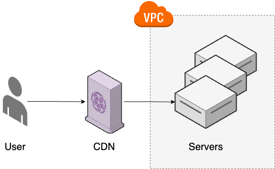
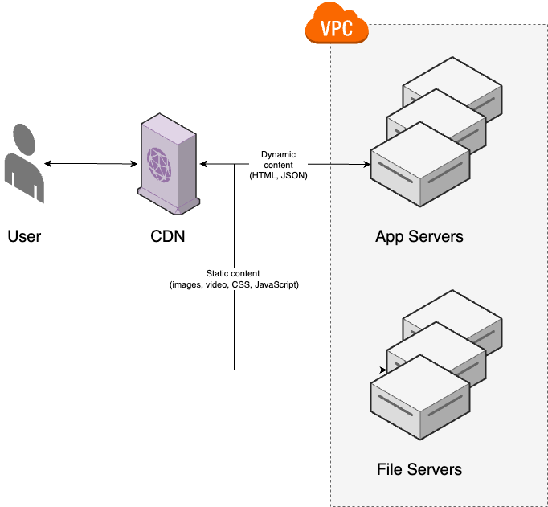

# Chapter 9: How to Store Data: SQL, NoSQL, Queues, Warehouses, and File Stores

- Almost all software needs to store data.

- For most companies, **data** is one of the _most valuable, longest-lived assets_.

- There are **many types** of data and many **different ways to store** them:

  | Type of data / data store                                                               | How to store?                                                                                                                         |
  | --------------------------------------------------------------------------------------- | ------------------------------------------------------------------------------------------------------------------------------------- |
  | [_Local_ storage](#local-storage-hard-drives)                                           | If your application needs to store data locally, you write it to a hard drive.                                                        |
  | [_Primary data_ store](#primary-data-store-relational-databases)                        | The general-purpose workhorse and the source of truth for most companies is the **relational database**.                              |
  | [**Caching**](#caching-key-value-stores-and-cdns)                                       | If you need to speed up data retrieval, you can cache responses in **key-value stores** and **content distribution networks (CDNs)**. |
  | [**File storage**](#file-storage-file-servers-and-object-stores)                        | To store and serve files, you turn to **file servers** & **object stores**.                                                           |
  | [**Semi-structured data and search**](#semi-structured-data-and-search-document-stores) | If you need to store non-uniform data or to search and filter that data, you turn to a **document store**.                            |
  | [**Analytics**](#analytics-columnar-databases)                                          | To extract insights from your data, you turn to **columnar databases**.                                                               |
  | [_Asynchronous_ processing](#asynchronous-processing-queues-and-streams)                | To process data and events in the background, and to decouple your systems, you turn to **queues** and **streams**.                   |

- To meet [_scalability_ & _availability_](#scalability-and-availability) requirements, you use **partitioning** & **_replication_**.

- To ensure your data isn't lost in a [_disaster_](#backup-and-recovery) scenario, you use **snapshots**, **continuous backups**, and **_replication_**.

---

This chapter will walk you through various hands-on examples:

- [deploying a PostgreSQL database, automating schema migrations](#example-postgresql-lambda-and-schema-migrations)
- [serving files from S3, and using CloudFront as a CDN](#example-serving-files-with-s3-and-cloudfront)
- [configuring backups and replication](#example-backups-and-read-replicas-with-postgresql)

## Local Storage: Hard Drives

### The challenges of storing data using custom file format

- **Querying the data**

  It's hard to extract insights from data.

- **Evolving the data format**

  It's hard to evolve the data format without incompatible issues with older files.

- **Handling concurrent access to the data**

  It's impossible to reading/writing the data from different computers.

> [!WARNING]
> Storing data using custom file format directly on local storages is usually a bad idea if the software requirements need to be changed.

### Stateful and stateless software

_stateful_ software
: Software that reads & writes persistent data to the _local_ **hard drive**.
: - Use custom format for data, stored them as files in local hard drive.

_stateless_ software
: Software that does not rely on persistent data on the local hard drive.
: Persistent data is stored in a _dedicated_ **data store**.
: - The only _stateful_ system in your software architecture.
: Easier to deploy, update, scale, and maintain.

> [!NOTE]
> Both type of software can still write _ephemeral data_[^1] - e.g. log files - to local hard drives.

> [!IMPORTANT] Key takeaway #1
> Keep your applications stateless. Store all your data in dedicated data stores.

### Types of hard drives

| **Storage Type**                                             | Where?                                           | **Description**                                                                            | **Examples**                                                                                                                | Protocols / Technologies                                                                              | **Pros**                                                                                             | **Cons**                                                                                   |
| ------------------------------------------------------------ | ------------------------------------------------ | ------------------------------------------------------------------------------------------ | --------------------------------------------------------------------------------------------------------------------------- | ----------------------------------------------------------------------------------------------------- | ---------------------------------------------------------------------------------------------------- | ------------------------------------------------------------------------------------------ |
| **_Physical_ Hard Drives**                                   | On-premises                                      | Hard drives physically attached to **on-prem servers**.                                    | _Magnetic_, _SSD_..                                                                                                         | - _SATA_, _NVMe_...<br/>- _RAID_                                                                      | Direct control, fast access                                                                          | Requires on-prem infrastructure                                                            |
| **_Network-attached_ Hard Drives**                           | Cloud                                            | Hard drives attached to **cloud VMs** over the network.                                    | [Amazon EBS] [^3]<br/>[Google Persistent Disk]<br/>[Azure Disk Storage]                                                     |                                                                                                       | Detachable, re-attachable[^4] for VMs (for stateful apps)                                            | Higher latency compared to local drives                                                    |
| **_Shared_ Hard Drives**                                     | Cloud, on-premises                               | Single drive shared among **multiple servers** for shared access.                          | [Amazon EFS] [^2]<br/>[Google Cloud Filestore]<br/>[Azure Files]                                                            | _Network File System (NFS)_<br/>_Common Internet File System (CIFS)_<br/>_Server Message Block (SMB)_ | Shared access[^5] for multiple servers                                                               | Higher latency compared to local drives                                                    |
| **Volumes in<br/>_Container_ Orchestration**[^8]             | Cloud, on-premises                               | _Persistent volumes_[^6] for data storage in **container** environments.                   | Amazon EBS (AWS EKS)<br/>Google Persistent Disk (GKE)<br/>Azure Disk Storage (AKS)</br></br>Local disk, e.g. Docker Desktop |                                                                                                       | Data persists[^6] even when containers are redeployed                                                |                                                                                            |
| \_\_\_\_\_\_\_\_\_\_\_\_\_\_\_\_\_\_\_\_\_\_\_\_\_\_\_\_\_\_ | \_\_\_\_\_\_\_\_\_\_\_\_\_\_\_\_\_\_\_\_\_\_\_\_ | \_\_\_\_\_\_\_\_\_\_\_\_\_\_\_\_\_\_\_\_\_\_\_\_\_\_\_\_\_\_\_\_\_\_\_\_\_\_\_\_\_\_\_\_\_ | \_\_\_\_\_\_\_\_\_\_\_\_\_\_\_\_\_\_\_\_\_\_\_\_\_\_\_\_\_\_\_\_\_\_                                                        | \_\_\_\_\_\_\_\_\_\_\_\_\_\_\_\_\_\_\_\_\_\_\_\_\_\_\_\_\_\_\_\_\_\_\_\_\_\_\_\_\_\_                  | \_\_\_\_\_\_\_\_\_\_\_\_\_\_\_\_\_\_\_\_\_\_\_\_\_\_\_\_\_\_\_\_\_\_\_\_\_\_\_\_\_\_\_\_\_\_\_\_\_\_ | \_\_\_\_\_\_\_\_\_\_\_\_\_\_\_\_\_\_\_\_\_\_\_\_\_\_\_\_\_\_\_\_\_\_\_\_\_\_\_\_\_\_\_\_\_ |

> [!TIP]
> Whether you're using a physical hard drives, or any other types of storages, all look and behave exactly like a local, physically-attached hard drive:
>
> - To your software, it looks like any local file system that you can read from and write to.

> [!WARNING] Don't run data stores in containers
>
> - You’re _one config mistake from losing_ your company’s data - the most valuable asset.
>
>   Containers are designed to be easy to distribute, scale, and throw away (hence the default of ephemeral disks), which
>
>   - is great fit for stateless apps and local development
>   - but is not a good fit for data stores in production
>
> - Using persistent volume for data store is _not easy_:
>
>   - Persistent volume
>     - needs to support varies widely amongst orchestration tools
>     - is generally less mature than other orchestration features
>   - Integration with tooling can be trickier (if that tooling wasn’t designed for containers)
>   - Support from database vendors may be trickier (not all of them support containerized deployments).

## Primary Data Store: Relational Databases

relational database
: The most _dominant_ data storage solution for decades:
: Flexible
: - Handle a remarkably wide range of use cases[^11]
: - Remarkable scalability & availability
: Reliable
: - Ensure data integrity & consistency
: - Store data efficiently (temporally & spatially)
: - Strong security model
: The most _mature_[^9] data storage technology available
: - Massive ecosystem of tools, vendors, expert developers

> [!NOTE]
> Most companies use relational databases as their _primary data stores_ — the _source of truth_ for their data.

---

Just as cryptography:

- always use mature, battle-tested, proven off-the-shelf solutions.

- Don't roll out your own data store, except if you have:
  - use cases that all existing data stores can't handle, which only happens at massive scale, e.g. Google, Facebook, Twitter
  - at least a decade[^10] to spare

> [!IMPORTANT] Key takeaway #2
> Don’t roll your own data stores: always use mature, battle-tested, proven off-the-shelf solutions.

### Writing & Reading Data

A relational database

- stores data in _tables_, where
  - each item is stored in a _row_,

---

table
: represents a collection of related items

row
: represents an item

---

> [!NOTE]
> Each row in a table has the same _columns_

---

e.g. A website for a bank store data about the customers

- in a `customers` table, where

- each row represents one customer as a tuple of `id`, `name`, `date_of_birth`, and `balance`

  | **id** | **name**       | **date_of_birth** | **balance** |
  | ------ | -------------- | ----------------- | ----------- |
  | 1      | Brian Kim      | 1948-09-23        | 1500        |
  | 2      | Karen Johnson  | 1989-11-18        | 4853        |
  | 3      | Wade Feinstein | 1965-02-29        | 2150        |

---

To interact with a relational database, you use a language called _Structured Query Language (SQL)_.

- To _write_ data in to a table, you use the `INSERT INTO` statement

  ```sql
  INSERT INTO <table> ( <columns> )
  VALUES              ( <values>  );
  ```

  e.g.

  - ```sql
    INSERT INTO customers (name, date_of_birth, balance)
                   VALUES ('Brian Kim', '1948-09-23', 1500);

    INSERT INTO customers (name, date_of_birth, balance)
                   VALUES ('Karen Johnson', '1989-11-18', 4853);

    INSERT INTO customers (name, date_of_birth, balance)
                   VALUES ('Wade Feinstein', '1965-02-25', 2150);
    ```

  - (This example assume the schema is already exists)

  > [!NOTE]
  > Relational databases require you to define a _schema_ to describe the structure of each table before you can write any data to that table (as in [Schemas and Constraints](#schemas-and-constraints)).

- To _read_ all data from a table, you use `SELECT` statement to form an SQL _query_.

  ```sql
  SELECT <columns> FROM <table>;
  ```

  > [!NOTE]
  > Use the wildcard `*` for all columns

  e.g.

  - ```sql
    SELECT * FROM customers;
    ```

    ```plaintext
     id |      name      | date_of_birth | balance
    ----+----------------+---------------+---------
      1 | Brian Kim      | 1948-09-23    |    1500
      2 | Karen Johnson  | 1989-11-18    |    4853
      3 | Wade Feinstein | 1965-02-25    |    2150
    ```

- To read and keep only some of the data (aka _filtering query_), you use `SELECT` statement with a `WHERE` clause:

  ```sql
  SELECT <columns> FROM <table> WHERE <conditions>;
  ```

  e.g.

  - ```sql
    SELECT * FROM customers WHERE date_of_birth > '1950-12-31';
    ```

    ```plaintext
     id |      name      | date_of_birth | balance
    ----+----------------+---------------+---------
      2 | Karen Johnson  | 1989-11-18    |    4853
      3 | Wade Feinstein | 1965-02-25    |    2150
    ```

> [!TIP]
> Relational databases allow query data in countless ways:
>
> - `WHERE` to filter data
> - `ORDER BY` to sort data
> - `GROUP BY` to group data
> - `JOIN` to query data from multiple tables
> - `COUNT`, `SUM`, `AVG`, and a variety of other aggregate functions to perform calculations on your data,
> - _indices_ to make queries faster,
> - and much more.

---

> [!WARNING] Watch out for snakes: SQL has many dialects
> SQL:
>
> - In theory, is a language standardized by ANSI and ISO that is the same across all relational databases.
> - In practice, is a slightly different dialect of SQL for each every relational database .

> [!NOTE]
> This books focuses on SQL concepts that apply to all relational databases, but technically, the examples use the PostgreSQL dialect.

### ACID Transactions

transaction
: a set of _coherent operations_ that should be performed as a **unit**

In relational databases, transactions must meet the following four properties:

- | Property    | Description                                                                                                           | Note                                                                                                   |
  | ----------- | --------------------------------------------------------------------------------------------------------------------- | ------------------------------------------------------------------------------------------------------ |
  | Atomicity   | _Either_ **all** the operations in the transaction happen, or **none** of them do.                                    | Partial successes or partial failures are not allowed.                                                 |
  | Consistency | The operations always leave the data in a state that is **valid**                                                     | Valid state is a state that according to all the rules and constraints you’ve defined in the database. |
  | Isolation   | Even though many transactions may be happening _concurrently_, the database should end up in the exact **same** state | As if the transactions had happened sequentially (in any orders).                                      |
  | Durability  | Once a transaction has _completed_, it is recorded to **persistent** storage (typically, to a hard drive)             | It isn’t lost, even in the case of a system failure.                                                   |

- These 4 properties form the acronym _ACID_, which is one of the defining property of a relational database.

e.g.

- Deduct $100 from every customer (transaction across single statement)

  ```sql
  UPDATE customers
  SET balance = balance - 100;
  ```

  For a relational database, this statement will be execute to all customers in a single ACID transaction:

  - either the transaction will complete successfully, and all customers will end up with $100 less,
  - or no customers will be affected at all.

  > [!TIP]
  > For a data store that doesn't support ACID transactions:
  >
  > - It would be possible for those data stores to crash part way through this transaction
  > - The data end up with some customers with $100 less and some unaffected (No atomicity)

- Transfer $100 from customer 1 to customer 2 (transaction across multiple statements)

  ```sql
  START TRANSACTION;
    UPDATE customers
    SET balance = balance - 100
    WHERE id = 1;

    UPDATE customers
    SET balance = balance + 100
    WHERE id = 2;
  COMMIT;
  ```

  For a relational database, all the statements between `START TRANSACTION` and `COMMIT` will execute as a single ACID transaction, ensuring that:

  - one account has the balance decreased by $100, and the other increased by $100
  - or neither account will be affected at all.

  > [!TIP]
  > For a data store that doesn't support ACID transactions, the data could end up in an in-between state that is inconsistent:
  >
  > e.g.
  >
  > - The first statement completes, subtracting $100.
  > - Then the data store crashes before the second statement runs, and as a result, the $100 simply vanishes into thin air (No atomicity)

### Schemas and Constraints

> [!NOTE]
> Relational databases require you to define a _schema_ for each table before you can read and write data to that table.

#### Defining a schema

To define a schema, you use `CREATE TABLE` statement

```sql
CREATE TABLE <table> (
   <column_name>   <column_type>,
   <...>
);
```

e.g.

- Create a table called `customers` with columns called `id`, `name`, `date_of_birth`, and `balance`

  ```sql
  CREATE TABLE customers (
    id            SERIAL PRIMARY KEY,
    name          VARCHAR(128),
    date_of_birth DATE,
    balance       INT
  );
  ```

#### Schema's integrity constraints

The schema includes a number of _integrity constraints_ to enforce business rules:

- **Domain constraints**:

  _Domain constraints_ limit what _kind of data_ you can store in the table.

  e.g.

  - Each column has a _type_, such as `INT`, `VARCHAR`, and `DATE`, so the database will prevent you from inserting data of the wrong type

  - The `id` column specifies `SERIAL`, which is a _pseudo type_ (an _alias_) that gives you a convenient way to capture three domain constraints:
    - first, it sets the type of the id column to `INT`
    - second, it adds a `NOT NULL` constraint[^12], so the database will not allow you to insert a row which is missing a value for this column
    - third, it sets the _default value_ for this column to an _automatically-incrementing sequence_[^13].

- **Key constraints**

  A _primary key_ is a column or set of columns that can be used to _uniquely_ identify each row in a table

  e.g.

  - The `id` column specifies `PRIMARY KEY`, which means this column is the primary key for the table, so the database will ensure that every row has a different value for this column.

- **Foreign key constraints**

  A _foreign key constraint_ is where a column in one table can contain values that are _references_ to a column in **another table**.

  e.g. Bank customers could have more than one account, each with their own balance,

  - Instead of having a single `balance` column in the `customers` table
  - You could create a second table called `accounts`, where each row represents one account

    ```sql
    CREATE TABLE accounts (
        account_id      SERIAL PRIMARY KEY,          (1)
        account_type    VARCHAR(20),                 (2)
        balance         INT,                         (3)
        customer_id     INT REFERENCES customers(id) (4)
    );
    ```

    The `accounts` table has 4 columns:

    - 1: A unique ID for each **account** (the primary key).
    - 2: The `account_type`: e.g., checking or savings.
    - 3: The `balance` for the account.
    - 4: The ID of the **customer** that owns this account.

      > [!NOTE]
      > The `REFERENCES` keyword labels this column as a **foreign key** into the `id` column of the `customers` table.
      >
      > - This will prevent you from accidentally inserting a row into the `accounts` table that has an _invalid_ customer ID (i.e., one that isn’t in the `customers` table).

  > [!TIP]
  > Foreign key constraint
  >
  > - is one of the defining characteristics of relational databases, as they
  >
  >   - allow you to define and enforce **relationships between tables**.
  >
  >   👉 This is what the "_relational_" in "_relational_ database" refers to.
  >
  > - is critical in maintaining the _referential integrity_ of your data
  >
  >   👉 another major reason to use a relational database as your primary source of truth.

> [!IMPORTANT] Key takeaway #3
> Use relational databases as your primary data store (the source of truth), as
>
> - they are
>
>   - reliable
>   - secure
>   - mature
>
> - they support
>
>   - schemas
>   - integrity constraints
>   - foreign key relationships
>   - joins
>   - ACID transactions
>   - and a flexible query language (SQL).

#### Schema modifications and migrations

To modify the schema for existing tables, you can use `ALTER TABLE`

> [!WARNING]
> You should be careful when modifying a schema, or you will run into backward compatibility issues.

---

When use have a lot of modification to the schema, you can:

1. Manage the schemas manually

   - Connecting directly to the database
   - Executing `CREATE TABLE`, `ALTER TABLE` by hand

2. Manage the schemas as code using a _schema migration tool_, such as [Flyway], [Liquibase], [Atlas], [Bytebase], [Alembic], [migrate], [Squitch], [ActiveRecord], [Sequel], [Knex.js], [GORM].

---

When using a schema migration tool:

- You define

  - your initial schemas
  - all the modifications as code, in an ordered series of _migration files_ that you check into version control.

    e.g.

    - Flyway uses standard SQL in `.sql` files

      ```plaintext
      v1_create_customers.sql
      v2_create_accounts.sql
      v3_update_customers.sql
      ```

    - Knex.js uses a JavaScript DSL in `.js` files

      ```plaintext
      20240825_create_customers.js
      20240827_create_accounts.js
      20240905_update_customers.js
      ```

- You apply these migration files using the schema migration tool, which keeps track of

  - which of your migration files have already been applied, and
  - which haven’t

  so no matter

  - what state your database is in, or
  - how many times you run the migration tool,

  you can be confident your database will end up with the desired schema.

---

As you make changes to your app, new versions of the app code will rely on new versions of your database schema.

To ensure these versions are automatically deployed to each environment, you will need to integrate the schema migration tool into your CI/CD pipeline

The schema migration tools can be run:

1. As part of app's boot code

   Advantages:

   - This will works in any environments:

     - shared environments, e.g. `dev`, `stage`, `prod`
     - or any developer's local environment

   - The migration are constantly being tested.

   Disadvantages:

   - The migrations sometimes take a long time, which cause the app boot slowly, which might be a big problem:

     - some orchestration tools may redeploy the app before the migration can finish.

     - for serverless apps because of the cold starts.

2. As a separate strep in deployment pipeline, just before you deploy the app

### Example: PostgreSQL, Lambda, and Schema Migrations

In this example, you'll

- Deploy PostgreSQL in AWS using RDS[^14].
- Define the schema for this database as code using [Knex.js]
- Deploy a Lambda function and API Gateway to run a Node.js serverless web app that
  - uses Knex.js to connect to the PostgreSQL database over TLS
  - run queries
  - return the results as JSON

#### Create an OpenTofu root module for PostgreSQL, Lambda, API Gateway

Use the `rds-postgres` OpenTofu module to deploy PostgreSQL on RDS:

- Create the folder

  ```bash
  cd examples
  mkdir -p ch9/tofu/live/lambda-rds
  cd ch9/tofu/live/lambda-rds
  ```

- The root module `main.tf` for deploying Postgres on RDS

  ```t
  # examples/ch9/tofu/live/lambda-rds/main.tf
  provider "aws" {
    region = "us-east-2"
  }

  module "rds_postgres" {
    source = "github.com/brikis98/devops-book//ch9/tofu/modules/rds-postgres"

    name              = "bank" #         (1)
    instance_class    = "db.t4g.micro" # (2)
    allocated_storage = 20 #             (3)
    username          = var.username #   (4)
    password          = var.password #   (5)
  }
  ```

  - 1: Set the name of the RDS instance, and the logical database within it, to `bank`
  - 2: Use a `db.t4g.micro` RDS instance (2 CPUs and 1GB of memory, is part of the AWS free tier)
  - 3: Allocate 20 GB of disk space for the DB instance.
  - 4: Set the username for the master database user to `var.username` (an input variable).
  - 5: Set the password for the master database user to `var.password` (an input variable).

- Add input variables for the username/password of the database

  ```t
  # examples/ch9/tofu/live/lambda-rds/variables.tf
  variable "username" {
    description = "Username for master DB user."
    type        = string
  }

  variable "password" {
    description = "Password for master DB user."
    type        = string
    sensitive   = true
  }
  ```

---

Use `lambda` and `api-gateway` modules to deploy a Lambda function and an API Gateway

- The `main.tf` for deploying a Lambda Function and API Gateway:

  ```t
  # examples/ch9/tofu/live/lambda-rds/main.tf
  module "app" {
    source = "github.com/brikis98/devops-book//ch3/tofu/modules/lambda"

    name        = "lambda-rds-app"
    src_dir     = "${path.module}/src" #         (1)
    handler     = "app.handler"
    runtime     = "nodejs20.x"
    memory_size = 128
    timeout     = 5

    environment_variables = { #                  (2)
      NODE_ENV    = "production"
      DB_NAME     = module.rds_postgres.db_name
      DB_HOST     = module.rds_postgres.hostname
      DB_PORT     = module.rds_postgres.port
      DB_USERNAME = var.username
      DB_PASSWORD = var.password
    }
  }

  module "app_gateway" {
    source = "github.com/brikis98/devops-book//ch3/tofu/modules/api-gateway"

    name               = "lambda-rds-app" #      (3)
    function_arn       = module.app.function_arn
    api_gateway_routes = ["GET /"]
  }
  ```

  - 1: The source code for the function will be in the `src` folder. You’ll see what this code looks like shortly.
  - 2: Use environment variables to pass the Lambda function all the details about the database, including the database name, hostname, port, username, and password.
  - 3: Create an API Gateway so you can trigger the Lambda function using HTTP requests.

- Add output variables for API Gateway's endpoint, and database's name, host, port

  ```t
  output "app_endpoint" {
    description = "API Gateway endpoint for the app"
    value       = module.app_gateway.api_endpoint
  }

  output "db_name" {
    description = "The name of the database"
    value       = module.rds_postgres.db_name
  }

  output "db_host" {
    description = "The hostname of the database"
    value       = module.rds_postgres.hostname
  }

  output "db_port" {
    description = "The port of the database"
    value       = module.rds_postgres.port
  }
  ```

#### Create schema migrations with Knex.js

- Create a folder for the schema migrations

  ```bash
  mkdir -p src
  cd src
  ```

  The schema migrations is a Node package (Knex.js uses JavaScript).

- Create a `package.json`

  ```json
  {
    "name": "lambda-rds-example",
    "version": "0.0.1",
    "description": "Example app 'Fundamentals of DevOps and Software Delivery'",
    "author": "Yevgeniy Brikman",
    "license": "MIT"
  }
  ```

- Install dependencies

  ```bash
  npm install knex --save #   (1)
  npm install knex --global # (2)
  npm install pg --save #     (3)
  ```

  - (1): Install Knex.js as a dependency, so it's available to Lambda function.
  - (2): Install Knex.js as a CLI tool.
  - (3): Install `node-postgres` library that Knex.js use to talk to PostgreSQL.

---

- When Knex.js apply schema migrations, it will connect to PostgreSQL over the network.

- The connection to PostgreSQL database on RDS is encrypted using TLS.

  - Because the PostgreSQL database is internal, AWS use its root CA certificate to sign the TLS certificate.

- To validate the database's TLS certificate, you need to:

  - Download the root CA certificate[^15] that is used to sign the database TLS certificate

    ```bash
    curl https://truststore.pki.rds.amazonaws.com/us-east-1/us-east-1-bundle.pem -o src/rds-us-east-2-ca-cert.pem
    ```

  - Configure your app to trust the root CA certificate

    ```javascript
    // examples/ch9/tofu/live/lambda-rds/src/knexfile.js
    const fs = require("fs").promises;

    module.exports = {
      // (1)
      client: "postgresql",

      connection: async () => {
        // (2)
        const rdsCaCert = await fs.readFile("rds-us-east-2-ca-cert.pem");

        // (3)
        return {
          database: process.env.DB_NAME,
          host: process.env.DB_HOST,
          port: process.env.DB_PORT,
          user: process.env.DB_USERNAME || process.env.TF_VAR_username,
          password: process.env.DB_PASSWORD || process.env.TF_VAR_password,
          ssl: { rejectUnauthorized: true, ca: rdsCaCert.toString() },
        };
      },
    };
    ```

    - (1): Use the PostgreSQL library (`node-postgres`) to talk to the database.
    - (2): Read the root CA certificate from AWS.
    - (3): This JSON object configures the connection to

      - use the database name, host, port, username, and password from the environment variables you passed to the Lambda function in the OpenTofu code,
      - validate the TLS certificate using the CA cert you read in (2).

      > [!TIP]
      > You're using the same environment variables to pass the username and password to both the OpenTofu module and to Knex.js.

---

- Create your first schema migration

  ```bash
  knex migrate:make create_customers_tables
  ```

  This will create

  - a `migrations` folder, and within it,
    - a file called `<TIMESTAMP>_create_customers_table.js`, where `TIMESTAMP` is a timestamp representing when you ran the `knex migrate:make` command.

- Define the schema migration for the `customers` table

  ```javascript
  // <TIMESTAMP>_create_customers_table.js

  // (1)
  exports.up = async (knex) => {
    // (2)
    await knex.schema.createTable("customers", (table) => {
      table.increments("id").primary();
      table.string("name", 128);
      table.date("date_of_birth");
      table.integer("balance");
    });

    // (3)
    return knex("customers").insert([
      { name: "Brian Kim", date_of_birth: "1948-09-23", balance: 1500 },
      { name: "Karen Johnson", date_of_birth: "1989-11-18", balance: 4853 },
      { name: "Wade Feinstein", date_of_birth: "1965-02-25", balance: 2150 },
    ]);
  };

  // (4)
  exports.down = async (knex) => {
    return knex.schema.dropTable("customers");
  };
  ```

With Knex.js, you define your schemas, and any updates to them, in sequential `.js` files as follows:

- (1): Within each `.js` file, the `up` function is where you define how to update the database schema.

- (2): This code creates the `customers` table with the exact same schema you first saw in [Defining a schema](#defining-a-schema), except

  - instead of using raw SQL (`CREATE TABLE`), you use a JavaScript API (`createTable()`).

- (3): This code populates the database with some initial data, adding the exact same three customers to the `customers` table that you initially saw in [Writing and Reading](#writing--reading-data), again

  - using a fluent JavaScript API instead of raw SQL.

- (4): Within each `.js` file, the `down` function is where you define how to _undo_ the schema changes in the `up` file.

  - This gives you a way to roll back changes in case of bugs, outages, or as part of testing.

  - The code here deletes the `customer` table that was created in the `up` function.

#### Create the Lambda function that query PostgreSQL

The Lambda function will

- uses Knex.js to connect to the PostgreSQL database over TLS
- run queries
- return the results as JSON

---

- Create `app.js` - the entrypoint of the Lambda function

  ```javascript
  const knex = require("knex");
  const knexConfig = require("./knexfile.js"); //   (1)
  const knexClient = knex(knexConfig); //           (2)

  exports.handler = async (event, context) => {
    const result = await knexClient("customers") // (3)
      .select()
      .where("date_of_birth", ">", "1950-12-31");

    // (4)
    return {
      statusCode: 200,
      headers: { "Content-Type": "application/json" },
      body: JSON.stringify({ result }),
    };
  };
  ```

  > [!TIP]
  > Knex.js can also be used to query the database

  - (1): Load the database connection configuration from _knexfile.js_.
  - (2): Create a Knex.js client, using the configuration from (1) to connect it to the PostgreSQL database.
  - (3): Use the Knex.js client to perform the exact database query you saw in [Writing and Reading data](#writing--reading-data), which fetches all customers born after 1950.
  - (4): Return the results of the query as JSON.

#### Deploy the example

- Set environment variables for username/password

  ```bash
  export TF_VAR_username=<username> # FILL IN
  export TF_VAR_password=<password> # FILL IN
  ```

  > [!TIP]
  > Save these credentials in a password manager, such as 1Password

- Initialize and apply the OpenTofu module

  ```bash
  cd ..
  tofu init
  tofu apply
  ```

- When apply completes (which can take 5-10 minutes for RDS to be deployed), you should see the output variables:

  ```bash
  app_endpoint = "https://765syuwsz2.execute-api.us-east-2.amazonaws.com"
  db_name = "bank"
  db_port = 5432
  db_host = "bank.c8xxxxxx7qwb.us-east-2.rds.amazonaws.com"
  ```

---

After the PostgreSQL database is deployed, you use the Knex CLI to apply schema migrations.

- Expose the database name, host, port to the Knex CLI (using environment variables)

  ```bash
  export DB_NAME=bank
  export DB_PORT=5432
  export DB_HOST=<db_host> # value of db_host output variable
  ```

- Apply the schema migrations

  ```bash
  cd src
  knex migrate:latest
  ```

  ```bash
  Batch 1 run: 1 migrations
  ```

  If the migrations apply successfully, your database should be ready to use.

- Verify that the app is working

  ```bash
  curl https://<app_endpoint>
  ```

  ```plaintext
  {
    "result":[
      {"id":2,"name":"Karen Johnson","date_of_birth":"1989-11-18","balance":4853},
      {"id":3,"name":"Wade Feinstein","date_of_birth":"1965-02-25","balance":2150}
    ]
  }
  ```

### Get your hands dirty: Working with relational databases

- In order to allow the Lambda function to access the PostgreSQL database, the `rds-postgres` module makes the database accessible over the public Internet, from any IP, which is not a good security posture.

  Update the code to

  - deploy the database and the Lambda function into the private subnets of a custom VPC, e.g. the one from [Chap 7](chap-07.md#example-create-a-vpc-in-aws)
  - lock down the database so it’s only accessible from either a security group attached to the Lambda function or via [RDS Proxy].

- The Lambda function is using the master user for the database, which means it has permissions to do anything.

  Update the code to follow the principle of least privilege

  - creating a more limited database user that only has the permissions the function needs, e.g., read access to one table
  - passing the credentials of this new database user to the Lambda function.

- Any secrets you pass into OpenTofu resources, such as the database master user password, are stored in OpenTofu state.

  To ensure these secrets are stored securely,

  - Make sure to enable encryption for your OpenTofu state backend, as in [Chap 5 - Example: Use S3 as a remote backend for OpenTofu state](chap-05.md#example-use-s3-as-a-remote-backend-for-opentofu-state).

  - Alternatively, use a different approach to manage the password so it doesn’t end up in OpenTofu state at all, such as

    - [having RDS manage it in AWS Secrets Manager] or
    - [using IAM for database authentication].

## Caching: Key-Value Stores and CDNs

### Cache

#### What is cache

cache
: a component that stores data so that future requests for that data can be served faster[^16]

To achieve low latency, the cache is stored

- in the **memory** (instead of on on disk)
- in a format that optimized
  - for **rapid retrieval**, e.g. hash table
  - rather than flexible query mechanics, e.g. relational tables

#### Uses cases for cache

- **Slow queries**

  If queries to your data stores take a long time, you can cache the results for faster lookups.

- **Slow aggregates**

  Sometimes, individual queries are fast, but you have to issue many queries, and aggregating all of them takes a long time.

- **High load**

  If you have a lot of load on your primary data store, queries may become slow due to contention for limited resources (CPU, memory, etc).

  Using a cache to offload many of the requests can reduce load on the primary data store, and make

  - those requests faster
  - all other requests faster, too

#### An simple version of cache

You can have a cache by using an in-memory hash table directly in your application code:

e.g.

- A cache in JavaScript

  ```javascript
  const cache = {}; // (1)

  function query(key) {
    // (2)
    if (cache[key]) {
      return cache[key];
    }

    const result = expensiveQuery(key); // (3)
    cache[key] = result;
    return result;
  }
  ```

  This is an example of _cache-aside strategy_[^17]:

  - (1): The cache is a _hashtable_ (aka _map_ or _object_) that the app stores in memory.
  - (2): When you want to perform a query, the first thing you do is
    - check if the data you want is already **in the cache**.
      - If so, you return it immediately (without having to wait on an expensive query).
  - (3): If the data isn’t in the cache, you

    - perform the expensive query

      e.g. send a query to the primary data store

    - store the result in the cache (so future lookups are fast)
    - then return that result.

---

This cache - with _cache-aside strategy_ - is a "simplified" cache because:

| Aspect                       | The problem                                                                                                    | Note                                                                                       |                                |
| ---------------------------- | -------------------------------------------------------------------------------------------------------------- | ------------------------------------------------------------------------------------------ | ------------------------------ |
| 1. Memory usage              | The cache will grow indefinitely, which may cause your app to run out of memory.                               | You need a _caching mechanism_ to evict data when the cache size is exceeded its limit     | Can be solved with better code |
| 2. Concurrency               | The code doesn't handle multiple concurrent queries that all update the cache.                                 | You may have to use _synchronization_ primitives, e.g., locking                            | Can be solved with better code |
| 3. Cold starts               | Every single time you redeploy the app, it will start with an empty cache, which may cause performance issues. | You need a way to store the cache to disk so it's _persistent_                             |                                |
| 4. _Cache invalidation_[^18] | The code only handles read operations, but not write operations, so future queries may return stale data.      | You need some way to _update_ (when you write data) or _invalidate_ that data in the cache |                                |

> [!NOTE]
> For more complicated cases, the typical way to handle caching is by deploying a _centralized data store_ that is dedicated to caching, e.g. key-value stores, CDNs.
>
> With _centralized data store_:
>
> - You avoid cold starts
> - You have only a single to update when do cache invalidation
>
>   e.g.
>
>   - You might do _write-through caching_, where whenever you write to your primary data store, you also update the cache.

### Key-Value Stores

#### What is key-value store

key-value store
: data store that is optimized for extremely fast lookup by a key
: ~ a distributed hash table
: acts as a cache between your app servers & primary data store


#### How key-value store works

Requests with the corresponding keys that:

- are in the cache (aka a _cache hit_) will
  - be returned extremely fast (without having to talk to the primary data store)
- aren't in the cache (aka a _cache miss_) will
  - go to the primary store
  - be added to the cache (for future cache hits)

The API for most key-value stores primarily consists of just 2 type of functions:

- a function to insert a key-value pair
- a function to lookup a value by key

e.g.

- With Redis, they're `SET` and `GET`

  ```bash
  $ SET key value
  OK
  $ GET key
  value
  ```

Key-value stores do not require you to define a schema ahead of time, so you can store any kind of value you want.

> [!CAUTION]
> Key-value store is sometimes referred to as _schema-less_, but this is a misnomer (as you see in [Schema & constraints of document stores](#schemas-and-constraints-document-store)).

Typically, the values are either

- simple _scalars_, e.g., strings, integers...
- or _blobs_ that contain arbitrary data that is opaque to the key-value store.

> [!WARNING]
> Since key-value store is only aware of keys and very basic types of values, the functionality is typically limited compared to relational database.

> [!IMPORTANT] Key takeaway #4
> Use key-value stores to cache data, speeding up queries and reducing load on your primary data store.

#### Which key-value store solutions are in the market

You can:

- self-host key value stores with Some of the major players in the key-value store space include [Redis] / [Valkey] [^19], [Memcached], [Riak KV]

- or use a managed service [Redis Cloud], [Amazon ElastiCache], [Amazon DynamoDB] [^20], [Google Cloud Memorystore], [Azure Cache for Redis], and [Upstash].

---

After you have a key-value store deployed, many libraries can automatically use them for cache-aside and write-through caching without you having to implement those strategies manually.

e.g.

- WordPress has plugins that automatically integrate with [Redis][wordpress-redis] and [Memcached][wordpress-memcached]
- Apollo GraphQL supports caching in [Redis and Memcached][Apollo GraphQL caching]
- [Redis Smart Cache plugin] can give you automatic caching for any database you access from Java code via the Java Database Connectivity (JDBC) API.

### CDNs

#### What is CDN

content delivery network (CDN)
: a group of servers - called _Points of Presence (PoPs)_ - that are distributed all over the world
: - cache data from your _origin servers_, i.e. your app servers
: - serve that data to your users from a PoP that is as close to that user as possible.
: acts as a cache between your users & your app servers



#### How CDN works

When a user makes a request, it first goes to the CDN server that is closest to that user, and

- if the content is already cached, the user gets a response immediately.
- If the content isn’t already cached, the CDN forwards the request to your origin servers:
  - fetches the content
  - caches it (to make future requests fast)
  - then returns a response

#### Why use CDN

- **Reduce latency**

  CDN servers are distributed all over the world

  e.g.

  - Akamai has more than 4,000 PoPs in over 130 countries

  which:

  - allows you to serve content from locations that are physically _closer to your users_, which can significantly reduce latency (See [common latency numbers](chap-06.md#reducing-latency))
  - without your company having to invest the time and resources to deploy and maintain app servers all over the world.

- **Reduce load**

  Once the CDN has cached a response for a given key, it no longer needs to

  - send a request to the underlying app server for that key
  - at least, not until the data in the cache has expired or been invalidated.

  If you have a good _cache hit ratio_[^21], this can significantly reduce the load on the underlying app servers.

- **Improve security**

  Many CDNs these days can provide additional layers of security, such as

  - a _web application firewall (WAF)_, which can inspect and filter HTTP traffic to prevent certain types of attacks, e.g. SQL injection, cross-site scripting, cross-site forgery
  - _Distributed Denial-of-Service (DDoS) protection_, which shields you from malicious attempts to overwhelm your servers with artificial traffic generated from servers around the world.

- **Other benefits**

  As CDNs become more advanced, they offer more and more features that let you take advantage of their massively distributed network of PoPs:

  - _edge-computing_, where the CDN allows you to run small bits of code on the PoPs, as close to your users (as close to the "edge") as possible
  - _compression_, where the CDN automatically uses algorithms such as Gzip or Brotli to reduce the size of your static content and thereby, reduce bandwidth usage
  - _localization_, where knowing which local PoP was used allows you to choose the language in which to serve content.

> [!IMPORTANT] Key takeaway #5
> Use CDNs to cache static content, reducing latency for your users and reducing load on your servers.

#### When to use CDN

You can use CDN to cache many types of contents from your app server:

- _dynamic content_: content that is different for each user and request
- _static content_: content that
  - (a) is the same for all of your users, and
  - (b) doesn’t change often.

But CDNs provides most value when be used to cache **static content** (static files):

- images, videos, binaries
- HTML, CSS, JavaScript

e.g.

- News publications can usually offload a huge portion of their traffic to CDNs, as once an article is published:
  - every user sees the same content, and
  - that content isn’t updated too often.

#### Which CDN to use

Some of the major players in the CDN space include

- [CloudFlare], [Akamai], [Fastly], [Imperva]
- [Amazon CloudFront], [Google Cloud CDN], [Azure CDN]

## File Storage: File Servers and Object Stores

### Why you shouldn't store static files in a database

You can store static files (as a _blob_) in a database, which

- may has some benefits:

  - all data is kept in a single system where you already have security controls, data backups, monitoring...

- but also has many disadvantages:

  - **Slower database**

    Storing files in a database bloats the size of the database, which:

    - makes the database itself slower
    - makes the scalability & availability of the database worse (the database itself is already a bottleneck)

  - **Slower & more expensive replicas & backups**

    The bigger the database the slower & more expensive to make replicas and backups.

  - **Increased latency**

    Serving files from your database to a web browser requires you to

    - proxy each file through an app server, which
      - significantly increases latency
      - compared to serving a file directly, e.g. via the `sendfile` syscall

  - **CPU, memory, and bandwidth overhead**

    Proxying files in a database through an app server

    - increases bandwidth, CPU, and memory usage,
    - both on the app server and the database (which makes the database even more of a bottleneck).

> [!NOTE]
> Instead of storing static files in a database, you typically store and serve them from dedicated file servers

### File Servers

#### What is a file server

file server
: a server that is designed to _store & serve_ **static files** (aka _static content_), such as images, videos, binaries, JavaScript, CSS

#### Why use file servers

By using dedicated file servers,

- all static content are handle by file servers.

This allows your app servers to focus entirely on

- serving _dynamic content_ (content that is different for each user & request)

#### How to use file servers

Files servers are usually used together with CDNs and your app server.



Users requests first go to a CDN, which

- if it is already cached, returns a response immediately
- if not, the CDN uses
  - file servers as origin servers for static content
  - app servers as origin servers for dynamic content

#### Which file servers to use

Almost any web server software can be configured to serve files.

e.g. [Apache], [Nginx], [HAProxy] [Varnish], [Lighttpd], [Caddy], [Microsoft IIS].

#### The challenges when working with file servers

Serving files is straightforward; the hard part is handling

- **Storage**

  You need to provide sufficient hard drive capacity to store the files.

- **Metadata**

  In additional to the files, you need to store metadata related to the files, e.g. names[^22], owner, upload date...

  You could store the metadata

  - on the file system next to the files themselves, or
  - in a separate data store (e.g., a relational database), which makes it easier to query the metadata 👈 more common approach

- **Security**

  You need to

  - control who can can create files, read files, update files, and delete files.
  - encrypt data [at rest](chap-08.md#encryption-at-rest) and [in transit](chap-08.md#secure-communication-and-encryption-in-transit).

- **Scalability & availability**

  You could host all the files on a single server, but a single server is a single point of failure (as you know from [Why use an orchestration | Chapter 3](chap-03.md#why-use-an-orchestration))

  To support a lot of traffic, and to be resilient to outages, you typically need to figure out how to host files across multiple servers.

> [!NOTE]
> Instead of using **file servers** and solving all these problems yourself, which requires
>
> - many custom toolings
> - a lot of servers, hard drives...
>
> You can offload these work to a 3rd-party **object store**.

### Object Stores

#### What is Object Store

object store
: aka _blob store_
: a system designed to
: - store _opaque objects_ (blobs)
: - often in the form of files with associated metadata.
: ~ file server as a service (from cloud providers)

#### Which Object Store to use

The major players in this space are

- [Amazon S3] [^23], [Google Cloud Storage], [Azure Blob Storage]
- [CloudFlare R2], [Wasabi], [Backblaze].

#### Why use Object Store

1. Object stores provide out-of-the-box solutions to the [challenges with file servers](#the-challenges-when-working-with-file-servers):

   - **Storage**

     Object stores provide nearly unlimited disk space, usually for dirt-cheap prices.

     e.g.

     - Amazon S3 is around two cents per gigabyte per month, with a generous free tier.

   - **Metadata**

     Most object stores allow you to associate metadata with each file you upload.

     e.g.

     - S3 allows you to configure both
       - system-defined metadata (e.g., standard HTTP headers such as entity tag
       - content type, as you’ll see later in this blog post)
       - user-defined metadata (arbitrary key-value pairs).

   - **Security**

     Most object stores offer fine-grained access controls and encryption.

     e.g.

     - S3 provides
       - IAM for access control,
       - TLS for encryption in transit
       - AES (using a KMS) for encryption at rest.

   - **Scalability & availability**

     Object stores typically provide scalability and availability at a level few companies can hope to achieve.

     e.g.

     - S3 Standard provides
       - unlimited scalability
       - 99.99% availability
       - 99.999999999% durability[^24].

2. Many object stores also provide many other useful features:

- **replication** across data centers in different regions
- **search & analytics** across all the files you store in the object store

  e.g.

  - [Amazon Athena] allows allows you to use SQL to query CSV, JSON, ORC, Avro, or Parquet files stored in S3

- integration with compute to help **automate workflows**

  e.g.

  - you can have S3 automatically trigger a Lambda function each time you upload a file

- automatic archival or deletion of older files (to save money)

These features is why even companies who otherwise keep everything on-prem often turn to the cloud and object stores for file storage.

> [!IMPORTANT] Key takeaway #6
> Use file servers and object stores to serve static content, allowing your app servers to focus on serving dynamic content.

### Example: Serving Files With S3 and CloudFront

#### Create an S3 bucket configured for website hosting

> [!NOTE]
> The `s3-website` OpenTofu module
>
> - in [sample code repo] at `ch9/tofu/modules/s3-website` folder
> - will:
>
>   - creates an S3 bucket
>   - makes its contents publicly accessible
>   - configures it as a website, which means it can support
>     - redirects
>     - error pages
>     - accessing logging, and so on.

In this example, you will use the `s3-website` OpenTofu module to create an S3 bucket configured for website hosting

- Create an folder for the root module

  ```bash
  cd examples
  mkdir -p ch9/tofu/live/static-website
  cd ch9/tofu/live/static-website
  ```

- The `main.tf` root module

  ```t
  # examples/ch9/tofu/live/static-website/main.tf

  provider "aws" {
    region = "us-east-2"
  }

  module "s3_bucket" {
    source = "github.com/brikis98/devops-book//ch9/tofu/modules/s3-website"

    # TODO: fill in your own bucket name!
    name           = "fundamentals-of-devops-static-website" # (1)
    index_document = "index.html" #                            (2)
  }
  ```

  - (1): The name to use for the S3 bucket.

    > [!NOTE]
    > S3 bucket names must be globally unique, so you’ll have to fill in your own bucket name here.

  - (2): The suffix to use for directory requests.

    - If you set this to `index.html`, a request for the directory `/foo` will return the contents of `/foo/index.html`.
    -

- Proxy the `s3_website_endpoint` from `s3_bucket` to root module

  ```t
  # examples/ch9/tofu/live/static-website/outputs.tf
  output "s3_website_endpoint" {
    description = "The endpoint for the website hosted in the S3 bucket"
    value       = module.s3_bucket.website_endpoint
  }
  ```

#### Upload static content to the S3 bucket

1. Create a simple HTML page

   - Create the `content` folder within the `static-website` folder:

     ```bash
     mkdir -p content
     ```

   - Create 3 files in `content` folder

     - `index.html`

       ```html
       <!-- examples/ch9/tofu/live/static-website/content/index.html -->
       <html lang="en">
         <head>
           <title>Fundamentals of DevOps and Software Delivery</title>
           <link rel="stylesheet" href="styles.css" />
         </head>
         <body>
           <h1>Hello, World!</h1>
           <p>
             This is a static website hosted on S3, with CloudFront as a CDN.
           </p>
           
         </body>
       </html>
       ```

     - `style.css`

       ```css
       /* examples/ch9/tofu/live/static-website/content/style.css */
       html {
         max-width: 70ch;
         margin: 3em auto;
       }

       h1,
       p {
         color: #1d1d1d;
         font-family: sans-serif;
       }
       ```

     - `cover.png` (`examples/ch9/tofu/live/static-website/content/cover.png`)

       Copy any `png` image to the content folder, and name it `cover.png`.

---

2. Update that HTML page to your S3 bucket (using OpenTofu `aws_s3_object` resource)

   - Update the `main.tf` to use `aws_s3_object` resource

     ```t
     provider "aws" {
       # ...
     }

     module "s3_bucket" {
       # ...
     }

     resource "aws_s3_object" "content" {
       for_each = { #                                   (1)
         "index.html" = "text/html"
         "styles.css" = "text/css"
         "cover.png"  = "image/png"
       }

       bucket        = module.s3_bucket.bucket_name #   (2)
       key           = each.key #                       (3)
       source        = "content/${each.key}" #          (4)
       etag          = filemd5("content/${each.key}") # (5)
       content_type  = each.value #                     (6)
       cache_control = "public, max-age=300" #          (7)
     }
     ```

     - (1): Have the `aws_s3_object` resource loop over a map where

       - the key is a file to upload from the _content_ folder
       - the value is the content type for that file.

     - (2): Upload the files to the S3 bucket you created earlier.
     - (3): For each file, use the key in the map as its path within the S3 bucket.
     - (4): Read the contents of each file from the `content` folder.
     - (5): Set the _entity tag (ETag)_[^25] to the MD5 hash of each file’s contents.

       - This is also used by OpenTofu to know when the file has changed, so it uploads a new version when you run `apply`.

     - (6): Set the _content type_[^26] for each file to the value in the map.
     - (7): Set the _cache control_[^27] value for each file to:

       - The `public` directive[^28]
       - The `max-age=300` directive[^29]

> [!WARNING] Watch out for snakes: Don’t upload files to S3 using OpenTofu in production
>
> Using the `aws_s3_object` resource to upload files to an S3 bucket is convenient for simple examples and learning, but don't use it for production use-cases:
>
> - If you have a large number of files, you may end up with performance and throttling issues with the `aws_s3_object` resource.
> - You typically want to put static content through an _asset pipeline_ which provides functionality such as minification, fingerprinting, and compression, none of which you can do with OpenTofu.

> [!NOTE]
> In production, to upload files to S3, you should use either
>
> - an _asset pipeline_ built into your web framework, or
>
>   e.g. [Ruby on Rails Asset Pipeline] with the [asset_sync Gem]
>
> - a library designed to efficiently sync images with S3
>
>   e.g. [s3_website].

#### Deploy S3 bucket and static content to S3 bucket

- Initialize and apply OpenTofu root module

  ```bash
  tofu init
  tofu apply
  ```

- Verify that your website (hosted on S3) is up and running

  Use a web browser to open `http://<s3_website_endpoint>`

  > [!NOTE]
  > Websites hosted on AWS S3 only support HTTP.
  >
  > To add HTTPS, you need to use AWS CloudFront.

#### Deploy CloudFront as a CDN in front of the S3 bucket

> [!NOTE]
> The OpenTofu module `cloudfront-s3-website`
>
> - in [sample code repo] at `ch9/tofu/modules/cloudfront-s3-website` folder
> - will
>   - create a globally-distributed CloudFront _distribution_
>   - configure your static website in S3 as an **origin**
>   - set up a **domain name** & **TLS** certificate
>   - plugs in some basic **caching** settings

In this example, you will use the OpenTofu module `cloudfront-s3-website` to deploy CloudFront as a CDN in front of the S3 bucket:

- Update `main.tf` to use `cloudfront-s3-website` module

  ```t
  provider "aws" {
    # ...
  }

  module "s3_bucket" {
    # ...
  }

  resource "aws_s3_object" "content" {
    # ...
  }

  module "cloudfront" {
    source = "github.com/brikis98/devops-book//ch9/tofu/modules/cloudfront-s3-website"

    bucket_name             = module.s3_bucket.bucket_name #      (1)
    bucket_website_endpoint = module.s3_bucket.website_endpoint # (2)

    min_ttl     = 0 #                                             (3)
    max_ttl     = 300
    default_ttl = 0

    default_root_object = "index.html" #                          (4)
  }
  ```

  - (1): Pass in the S3 bucket name, which is mostly used as the unique ID within the CloudFront distribution.
  - (2): Pass in the S3 bucket website endpoint.

    - CloudFront will use this as the origin, sending requests to it for any content that isn’t already cached.

  - (3): Configure the _time-to-live (TTL)_ settings for the cache, which specifies the minimum, maximum, and default amount of time, in seconds, that objects are allowed to

    - remain in the CloudFront cache
    - before CloudFront
      - sends a new request to the origin server
      - to check if the object has been updated.

    The preceding code configures CloudFront to

    - rely on the response headers (e.g., the cache control header) for caching instructions,
    - but never caching content for more than 5 minutes.

    This is a convenient setting for testing, as it ensures you don’t have to wait more than 5 minutes to see the latest version of your content.

  - (4): Configure CloudFront to
    - return the contents of `index.html`
    - whenever someone makes a request to the **root** of your CloudFront distribution’s domain name.

- Add CloudFront distribution domain name as an output variable

  ```t
  # examples/ch9/tofu/live/static-website/outputs.tf
  output "cloudfront_domain_name" {
    description = "The domain name of the CloudFront distribution"
    value       = module.cloudfront.domain_name
  }
  ```

---

- Re-apply OpenTofu module

  ```bash
  tofu apply
  ```

  > [!TIP]
  > CloudFront distribution can take 2-10 minutes to deploy.

- Verify you can access the website via HTTPS at `https://<cloudfront_domain_name>`

### Get your hands dirty: S3 and CloudFront

- Update the code to configure CloudFront to use a [custom domain name and TLS certificate].

  You could

  - use `static.<YOUR-DOMAIN>` as the domain name, where `<YOUR-DOMAIN>` is the domain name you registered in Route 53 in [Chapter 7](chap-07.md#example-register-and-configure-a-domain-name-in-amazon-route-53)
  - use [AWS Certificate Manager (ACM)](chap-08.md#public-key-infrastructure-pki) to provision a free, automatically-renewing certificate for this domain

- The `s3-website` module makes the S3 bucket publicly accessible.

  However, as you have a CDN in front of the S3 bucket, you can update the code to [only allow the contents of the S3 bucket to be accessed via CloudFront].

## Semi-Structured Data and Search: Document Stores

### What is Semi-Structured Data

When you need to dealing with:

- _user-generated data_ with unpredictable structure, that you can't pre-define schema
- search across those user-generated data, including _full-text search_, _fuzzy search_, _faceted search_...

  > [!NOTE]
  > Those data that
  >
  > - does not obey the tabular structure of data models associated with relational databases or other forms of data tables,
  > - but nonetheless contains tags or other markers to separate semantic elements and enforce hierarchies of records and fields within the data.
  >
  > is known as _semi-structured data_

you

- can't use relational database, which only works well when the data

  - has clear, consistent, predictable structure
  - can be stored in tables with well-defined schemas

- need to use a _document store_

### What is Document Store

document store
: similar to a key-value store, except that values are
: - richer data structures called _documents_
: - understood, process by the document store

---

### Which Document Store to use

There are 2 type of document stores:

- General-purpose document store: [MongoDB], [CouchDB], [Couchbase], [Google Firestore].
- Search-optimized[^30] document store:
  - [Elasticsearch] / [OpenSearch] [^31], [Amazon OpenSearch]
  - [Algolia], [Apache Solr], [Apache Lucene].

### Working with Document Store

#### Reading and Writing Data (Document Store)

To understand how to read and writing data to a document store, let's use MongoDB as an example:

- MongoDB allows you to store **JSON documents** in _collections_.

  > [!TIP]
  > It's similar to how a relational database allows you to store **rows** in _tables_.

- MongoDB does _NOT_ require you to

  - define a schema for your documents.

  > [!TIP]
  > With MongoDB, you can store JSON data in any format you want.

---

- To read and write data, you use the _MongoDB Query Language (MQL)_, which is similar to JavaScript.

  e.g.

  - To write a JSON document into the `bank` collection, you can use the `insertOne` function:

    ```js
    db.bank.insertOne({
      name: "Brian Kim",
      date_of_birth: new Date("1948-09-23"),
      balance: 1500,
    });
    ```

  - To write two JSON documents into the `bank` collection, you use the `insertMany` function:

    ```js
    db.bank.insertMany([
      {
        name: "Karen Johnson",
        date_of_birth: new Date("1989-11-18"),
        balance: 4853,
      },

      {
        name: "Wade Feinstein",
        date_of_birth: new Date("1965-02-25"),
        balance: 2150,
      },
    ]);
    ```

  - To read all data back from the `bank` collection, you can use the `find` function (without any arguments)

    ```js
    db.bank.find();
    ```

    ```js
    [
      {
        _id: ObjectId("66e02de6107a0497244ec05e"),
        name: "Brian Kim",
        date_of_birth: ISODate("1948-09-23T00:00:00.000Z"),
        balance: 1500,
      },
      {
        _id: ObjectId("66e02de6107a0497244ec05f"),
        name: "Karen Johnson",
        date_of_birth: ISODate("1989-11-18T00:00:00.000Z"),
        balance: 4853,
      },
      {
        _id: ObjectId("66e02de6107a0497244ec060"),
        name: "Wade Feinstein",
        date_of_birth: ISODate("1965-02-25T00:00:00.000Z"),
        balance: 2150,
      },
    ];
    ```

    > [!NOTE]
    > You get back the exact documents you inserted, except for one new field: `_id`.
    >
    > The `_id` field - added to every document by MongoDB - is used as
    >
    > - a unique identifier
    > - a key for lookups (similar to a key-value store).

  - To look up a document by ID, you also use `find` function:

    ```js
    db.bank.find({ _id: ObjectId("66e02de6107a0497244ec05e") });
    ```

    ```js
    {
      _id: ObjectId('66e02de6107a0497244ec05e'),
      name: 'Brian Kim',
      date_of_birth: ISODate('1948-09-23T00:00:00.000Z'),
      balance: 1500
    }
    ```

  > [!NOTE]
  > For both of key-value store and document store, you get the "value" by looking up a "key".
  >
  > The key different between key-value stores and document stores is:
  >
  > - Key-value stores treat values as _opaque_
  > - Document stores treat values as _transparent_ values, which is fully understood and processed.
  >
  > |         | Key-value store                          | Document store              |
  > | ------- | ---------------------------------------- | --------------------------- |
  > | "key"   | key set by you                           | "key" set by document store |
  > | "value" | _opaque value_ (simple scalars or blobs) | _transparent value_         |

  ***

- Compare to a key-value store, with MongoDB, you can look up values with richer query functionality:

  e.g.

  - To look up customers born after 1950, you also use `find` function

    ```js
    db.bank.find({ date_of_birth: { $gt: new Date("1950-12-31") } });
    ```

    ```js
    [
      {
        _id: ObjectId("66e02de6107a0497244ec05f"),
        name: "Karen Johnson",
        date_of_birth: ISODate("1989-11-18T00:00:00.000Z"),
        balance: 4853,
      },
      {
        _id: ObjectId("66e02de6107a0497244ec060"),
        name: "Wade Feinstein",
        date_of_birth: ISODate("1965-02-25T00:00:00.000Z"),
        balance: 2150,
      },
    ];
    ```

  - To deduct $100 from all customers, you use `updateMany` function

    ```js
    db.bank.updateMany(
      {}, //                          (1)
      { $inc: { balance: -100 } }, // (2)
    );
    ```

    - (1): The first argument is a **filter** to narrow down which documents to update.

      - In this case, it's an empty object, which doesn't have any filter effect.

    - (2): The second argument is the **update operation** to perform.

      - In this case, the update operation uses the `$inc` operator to
        - increment all balances by -100,
        - thereby deducting $100 from all customers.

> [!WARNING]
> Document stores
>
> - offers richer querying and update functionality (compare to a key-value store)
> - but has 2 major limitations, that is (for most document stores)
>
>   1. Do not support working with multiple collections, which means
>
>      - there is no support for joins[^32].
>
>   2. Don’t support ACID transactions.

#### ACID Transactions (Document Store)

Most document stores don’t support ACID transactions[^33].

- You might get atomicity for updates on a single document.

  e.g.

  - When you update one document with `updateOne` function

- But you rarely get atomicity for updates to multiple documents.

  e.g.

  - If MongoDB crashes in the middle of the updateMany operation, the code might deduct $100 from some customers but not others.

> [!WARNING]
> Again, be aware that most document stores don't support ACID transactions.

#### Schemas and Constraints (Document Store)

Most document stores do _NOT require_ you to

- define a schema or constraints up front.

---

This is sometimes referred to as _schemaless_[^36], but that's a bit of a misnomer.

There is _always_ a schema.

- The more accurate term is _schema-on-read_[^35], in which

  - the structure of the data (the schema) is _implicit_ 👈 (implicit schema)
  - the data only interpret the schema when the data is read 👈 schema-on-read

- In contrast to _schema-on-write_ - the traditional approach of relational databases, where
  - the schema is _explicit_ 👈 (explicit schema)
  - the database ensures all data conforms to it when the data is written 👈 (schema-on-write)

> [!TIP] Database's schema is similar to type checking of programming language
>
> - Schema-on-write ~ compile-time type checking
> - Schema-on-read ~ dynamic (run-time) type checking

e.g.

- To parse data from the `bank` collection in the previous section, you might use the following Java code:

  ```java
  public class Customer {
      private String name;
      private int balance;
      private Date dateOfBirth;
  }
  ```

  This Java class defines the schema and constraint of the data:

  - Which field should be in the data?
  - Which data type of each field?

  In other words, it's the schema-on-read:

  - Either the data matches the `Customer` data structure
  - Or you will get an error.

---

With schema-on-read, the data store don't need to ensure the data to any structure while writing, so

- you can insert & store any data in the data store.

e.g.

- You can insert a document with a subtle "error" into the `bank` collection

  ```js
  db.bank.insertOne({
    name: "Jon Smith",
    birth_date: new Date("1991-04-04"), // (1)
    balance: 500,
  });
  ```

  - MongoDB will let you insert this data without any complaints.
  - But when you try to parse this data with the `Customer` class, you may get an error.

> [!WARNING]
> With document stores, you can insert any data without any constraints (as of [relational databases](#schemas-integrity-constraints)), so you may end up with a lot of errors:
>
> e.g.
>
> - Without domain constraints, you might have:
>   - typos in field names
>   - null/empty values for required fields
>   - incorrect types of fields...
> - Without foreign key constraints, yo might:
>   - reference non-existent documents in other collections.

> [!TIP]
> Those errors with document stores can be prevented if you use a relational database.

> [!NOTE]
> Only use document stores (schema-on-read) when
>
> - you need to dealing with semi-structured, non-uniform data, e.g.
>
>   - user-generated documents
>   - event-tracking data
>   - log messages
>   - in case - for some reason - not all the items in the collections have the same structure.
>
> - the schema changes often[^34], or
> - you can sacrifice some part of writing performance.

---

> [!IMPORTANT] Key takeaway #7
> Use document stores
>
> - for semi-structured and non-uniform data, where you can’t define a schema ahead of time,
> - or for search, when you need full-text search, faceted search, etc.

## Analytics: Columnar Databases

### Columnar Database Basics

### Analytics Use Cases

> [!IMPORTANT] Key takeaway #8
> Use columnar databases for time-series data, big data, fast data, data warehouses, and anywhere else you need to quickly perform aggregate operations on columns.

## Asynchronous Processing: Queues and Streams

### Message Queues

> [!IMPORTANT] Key takeaway #9
> Use message queues to run tasks in the background, with guarantees that tasks are completed and executed in a specific order.

### Event Streams

> [!IMPORTANT] Key takeaway #10
> Use event streams to build highly-scalable, decoupled, event-driven architectures.

## Scalability and Availability

### Relational Databases

> [!IMPORTANT] Key takeaway #11
> Use replication and partitioning to make relational databases more scalable and highly available.

### NoSQL and NewSQL Databases

> [!IMPORTANT] Key takeaway #12
> Use NoSQL and NewSQL databases when your scalability and availability requirements exceed what you can do with a relational database—but only if you can invest in the time and expertise of deploying and maintaining a distributed data store.

### Distributed Systems

## Backup and Recovery

### Backup Strategies

### Backup Best Practices

> [!IMPORTANT] Key takeaway #13
> Ensure your data stores are securely backed up to protect against data loss and data corruption, protect your backups, test your backup strategy regularly, and follow the 3-2-1 rule.

### Example: Backups and Read Replicas with PostgreSQL

## Conclusion

- Keep your applications stateless. Store all your data in dedicated data stores.

- Don’t roll your own data stores: always use mature, battle-tested, proven off-the-shelf solutions.

---

- Use relational databases as your primary data store (the source of truth), as they

  - are secure, reliable, mature
  - support schemas, integrity constraints, foreign key relationships, joins, ACID transactions, and a flexible query language (SQL).

  When it comes to data storage, boring is good, and you should [choose boring technologies].

- Only use other data stores if you have use cases that a relational database can’t handle:

  | Other data stores                | Use cases                                                     | ... benefit                                                           |
  | -------------------------------- | ------------------------------------------------------------- | --------------------------------------------------------------------- |
  | **Key-value stores**             | Cache data                                                    | - Speeding up queries                                                 |
  |                                  |                                                               | - Reducing load on your **primary data store**.                       |
  | **CDNs**                         | Cache static content                                          | - Reducing latency for your **users**                                 |
  |                                  |                                                               | - Reducing load on your **servers**.                                  |
  | **File servers & object stores** | Serve static content                                          | Allowing your app **servers** to focus on serving dynamic content.    |
  | **Document stores**              | For semi-structured & non-uniform data                        | Where you can’t define a schema ahead of time                         |
  |                                  | For search                                                    | When you need full-text search, faceted search...                     |
  | **Columnar databases**           | For time-series data, big data, fast data, data warehouses... | To quickly perform aggregate operations on columns.                   |
  | **Message queues**               | Run tasks in the background                                   | Guarantees that tasks are completed and executed in a specific order. |
  | **Event streams**                |                                                               | Build highly-scalable, decoupled, event-driven architectures.         |

---

- Use replication and partitioning to make relational databases more scalable and highly available.

- Use NoSQL and NewSQL databases when your scalability and availability requirements exceed what you can do with a relational database—but only if you can invest in the time and expertise of deploying and maintaining a distributed data store.

---

- Ensure your data stores are securely backed up to protect against data loss and data corruption, protect your backups, test your backup strategy regularly, and follow the 3-2-1 rule.

---

[choose boring technologies]: https://boringtechnology.club/
[Amazon EBS]: https://aws.amazon.com/ebs
[Google Persistent Disk]: https://cloud.google.com/persistent-disk?hl=en
[Azure Disk Storage]: https://azure.microsoft.com/en-us/products/storage/disks
[Amazon EFS]: https://aws.amazon.com/efs
[Google Cloud Filestore]: https://cloud.google.com/filestore?hl=en
[Azure Files]: https://learn.microsoft.com/en-us/azure/storage/files/storage-files-introduction
[Flyway]: https://www.red-gate.com/products/flyway/community/
[Liquibase]: https://www.liquibase.com/
[Atlas]: https://atlasgo.io/
[Bytebase]: https://www.bytebase.com/
[Alembic]: https://alembic.sqlalchemy.org/en/latest/
[migrate]: https://github.com/golang-migrate/migrate
[Squitch]: https://sqitch.org/
[ActiveRecord]: https://guides.rubyonrails.org/active_record_basics.html
[Sequel]: https://sequel.jeremyevans.net/
[Knex.js]: https://knexjs.org/
[GORM]: https://gorm.io/
[RDS Proxy]: https://aws.amazon.com/rds/proxy/
[having RDS manage it in AWS Secrets Manager]: https://docs.aws.amazon.com/AmazonRDS/latest/UserGuide/rds-secrets-manager.html
[using IAM for database authentication]: https://docs.aws.amazon.com/AmazonRDS/latest/UserGuide/UsingWithRDS.IAMDBAuth.html
[Redis]: https://redis.io/
[Valkey]: https://valkey.io/
[Memcached]: https://memcached.org/
[Amazon DynamoDB]: https://aws.amazon.com/dynamodb/
[Riak KV]: https://riak.com/products/riak-kv/
[Redis Cloud]: https://redis.io/cloud/
[Amazon ElastiCache]: https://aws.amazon.com/elasticache/
[Google Cloud Memorystore]: https://cloud.google.com/memorystore
[Azure Cache for Redis]: https://azure.microsoft.com/en-us/products/cache
[Upstash]: https://upstash.com/
[wordpress-redis]: https://wordpress.org/plugins/redis-cache/
[wordpress-memcached]: https://wordpress.org/plugins/object-cache-4-everyone/
[Apollo GraphQL caching]: https://www.apollographql.com/docs/apollo-server/performance/cache-backends
[Redis Smart Cache plugin]: https://redis.io/blog/redis-smart-cache
[CloudFlare]: https://www.cloudflare.com/
[Akamai]: https://www.akamai.com/
[Fastly]: https://www.fastly.com/
[Imperva]: https://www.imperva.com/
[Amazon CloudFront]: https://aws.amazon.com/cloudfront/
[Google Cloud CDN]: https://cloud.google.com/cdn
[Azure CDN]: https://azure.microsoft.com/en-us/products/cdn
[Apache]: https://httpd.apache.org/
[Nginx]: https://nginx.org/en/
[HAProxy]: https://www.haproxy.org/
[Varnish]: https://varnish-cache.org/
[Lighttpd]: https://www.lighttpd.net/
[Caddy]: https://caddyserver.com/
[Microsoft IIS]: https://www.iis.net/
[Amazon S3]: https://aws.amazon.com/s3/
[Google Cloud Storage]: https://cloud.google.com/storage?hl
[Azure Blob Storage]: https://azure.microsoft.com/en-us/products/storage/blobs
[CloudFlare R2]: https://www.cloudflare.com/developer-platform/r2/
[Wasabi]: https://wasabi.com/
[Backblaze]: https://www.backblaze.com/
[Amazon Athena]: https://aws.amazon.com/athena/
[Ruby on Rails Asset Pipeline]: https://guides.rubyonrails.org/asset_pipeline.html
[asset_sync Gem]: https://github.com/AssetSync/asset_sync
[s3_website]: https://github.com/laurilehmijoki/s3_website
[custom domain name and TLS certificate]: https://docs.aws.amazon.com/AmazonCloudFront/latest/DeveloperGuide/cnames-and-https-procedures.html
[only allow the contents of the S3 bucket to be accessed via CloudFront]: https://docs.aws.amazon.com/AmazonCloudFront/latest/DeveloperGuide/private-content-restricting-access-to-s3.html
[MongoDB]: https://www.mongodb.com/
[CouchDB]: https://couchdb.apache.org/
[Couchbase]: https://www.couchbase.com/
[Google Firestore]: https://firebase.google.com/docs/firestore
[Elasticsearch]: https://www.elastic.co/elasticsearch
[OpenSearch]: https://opensearch.org/
[Amazon OpenSearch]: https://aws.amazon.com/opensearch-service/
[Algolia]: https://www.algolia.com/
[Apache Solr]: https://solr.apache.org/
[Apache Lucene]: https://lucene.apache.org/

[^1]: Ephemeral data is data that is OK to lose if that server is replaced.
[^2]: Elastic File System
[^3]: Elastic Block System
[^4]: When using network-attached drives, you can use software (e.g., OpenTofu, Pulumi) to detach and reattach them when replacing VMs (e.g., as part of a deployment)
[^5]: e.g. With file serving, it can be advantageous to share a single network-attached hard drive amongst multiple servers, so they can all read from and write to the same disk.
[^6]:
    By default, the file system of a container is considered _ephemeral_, and any data you write to it will be lost when that container is redeployed or replaced.

    - If you need to persist data to disk, you need to configure your orchestration tool to create a _persistent volume_ and mount it at a specific path within the container.
    - The software within that container can then write to that path just like it’s a normal local hard drive, and the data in that persistent volume will be retained even if the container is redeployed or replaced.

[^8]: Under the hood, the orchestration tool may handle the persistent volume differently in different deployment environments.
[^9]: Relational databases

    - have been in development for 25-50 years

      - [Oracle](https://www.oracle.com/ie/database/) (1979)
      - [MS SQL Server](https://www.microsoft.com/en-us/sql-server/sql-server-downloads) (1989)
      - [MySQL](https://www.mysql.com/) (1995)
      - [PostgreSQL](https://www.mysql.com/) (1996, though it evolved from a codebase developed in the 1970s)
      - [SQLite](https://www.sqlite.org/) (2000)

    - are still in active development today.

[^10]: [Good software takes _at least_ a decade to develop](https://www.joelonsoftware.com/2001/07/21/good-software-takes-ten-years-get-used-to-it/)
[^11]:
    Relational databases are flexible enough to handle a remarkably wide variety of use cases, from being

    - _embedded_ directly within your application,

      e.g. SQLite can run in-process or even in a browser

    - all the way up to clusters of **thousands of servers** that store **petabytes** of data.

[^12]: <https://www.postgresql.org/docs/current/ddl-constraints.html#DDL-CONSTRAINTS-NOT-NULL>
[^13]: The _automatically-incrementing sequence_ will generate a monotonically increasing ID that is guaranteed to be unique (even in the face of concurrent inserts) for each new row.
[^14]: Amazon’s _Relational Database Service (RDS)_ is a fully-managed service that provides a secure, reliable, and scalable way to run several different types of relational databases, including PostgreSQL, MySQL, MS SQL Server, and Oracle Database
[^15]: <https://docs.aws.amazon.com/AmazonRDS/latest/UserGuide/UsingWithRDS.SSL.html#UsingWithRDS.SSL.CertificatesDownload>
[^16]: <https://en.wikipedia.org/wiki/Cache_(computing)>
[^17]: With _cache-aside strategy_, you update the cache when data is requested, which makes future queries considerably faster.
[^18]: Cache invalidation is one of the "two hard things in Computer Science".

    Cache invalidation is one of those problems that’s much harder than it seems.

    e.g.

    - If you have 20 replicas of your app, all with code similar to the example cache, then every time the data in your primary data store is updated, you need to find a way to

      - (a) detect the change has happened
      - (b) invalidate or update 20 caches.

[^19]: Valkey is a fork of Redis that was created after Redis switched from an open source license to dual-licensing.
[^20]: You can you DynamoDB as a replacement for Redis.
[^21]: _Cache hit ratio_ is the percentage of requests that are a cache hit
[^22]: The name metadata may be different from the file name.
[^23]: You used _Simple Storage Service (S3)_ in [Chapter 5](chap-05.md#example-use-s3-as-a-remote-backend-for-opentofu-state) to store OpenTofu state files.
[^24]: <https://cloud.google.com/blog/products/storage-data-transfer/understanding-cloud-storage-11-9s-durability-target>

[sample code repo]: https://github.com/brikis98/devops-book

[^25]: The _Etag_ is sent as an HTTP response header to web browsers so they know if a file has changed, and they need to download the latest version, or if the file is unchanged, and they can use a locally-cached copy.
[^26]:
    The _content type_ is sent as an HTTP response header to web browsers so they know how to display the contents of the file

    e.g. Browsers know to render

    - `text/html` as HTML,
    - `image/png` as a PNG image...

[^27]: _Cache control_ is sent as an HTTP response header, which:

    - is used by browsers and shared caches (e.g., CDNs)
    - to figure out how to cache the response.

[^28]: The _`public` directive_ tells shared caches that this is a public resource that they can safely cache.
[^29]: The _`max-age=300` directive_ tells shared caches and web browsers that they can cache this content for up to 300 seconds (5 minutes).
[^30]: These _**search-optimized** document store_

    - build search indices on top of the documents,
    - to support full-text search, fuzzy search, faceted search...

[^31]: [OpenSearch] is a fork of [Elasticsearch] that was created after Elasticsearch switched from an open source license to dual-licensing.
[^32]: There are some exceptions, such as MongoDB, which has support for joins via the lookup operator, although it’s more limited than the types of joins you get with relational databases.
[^33]:
    Again, there are some exceptions, such as MongoDB, which has support for distributed transactions, though again, it’s more limited than what you get with relational databases.

    Moreover, transactions are not the default, but something you have to remember to use, which is quite error-prone.

[^34]: With schema-on-read, when the schema's changed, all you have to do is

    - update your application code to be able to handle both the new data format and the old one, and
    - your migration is done.

    Or, to be more accurate, your migration has just started, and it will happen incrementally as new data gets written.

[^35]: https://www.slideshare.net/slideshow/schemaonread-vs-schemaonwrite/30346951
[^36]: https://martinfowler.com/articles/schemaless/
